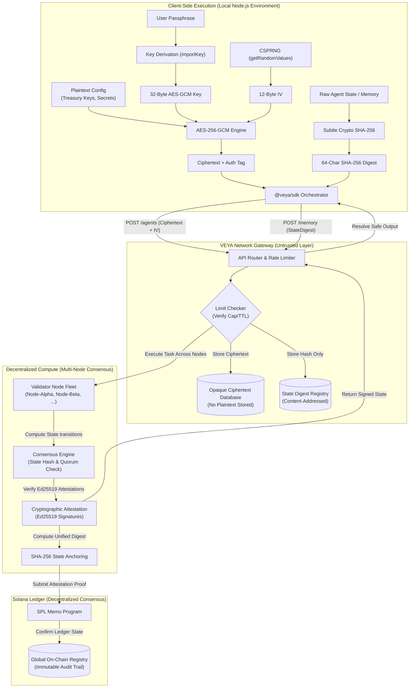

<div align="center">
  

  # VEYA TypeScript SDK

  **The official client for building cryptographically shielded, privacy-preserving AI agents on Solana.**

  [](https://opensource.org/licenses/MIT)
  [](https://www.npmjs.com/package/@veya/sdk)
  [](https://nodejs.org)
  [](https://www.typescriptlang.org/)

  **[Official Website](https://veyanet.tech)** • **[X (Twitter)](https://x.com/withveya)** • **[Documentation Index](./docs/README.md)** • **[Security Policy](./SECURITY.md)**

</div>

---

## 💡 Information: What is VEYA?

The **VEYA Protocol** is a decentralized, cryptographically shielded execution layer designed to run autonomous, high-integrity AI agent fleets. Traditional LLM-driven agent systems present severe security vulnerabilities: because agents must access sensitive execution contexts—such as API integration keys, proprietary system prompts, treasury credentials, and multi-hop routing paths—running them in standard host environments exposes this data in plaintext to infrastructure operators. VEYA solves this vulnerability by establishing client-side cryptographic boundaries, ensuring that sensitive execution states remain fully opaque and mathematically protected from the hosting infrastructure.

By decoupling agent orchestration from plaintext data storage, VEYA allows developers to compile and deploy agents whose configurations are shielded via client-side authenticated encryption (AES-256-GCM) and whose operational memories are verifiably tracked via local cryptographic digests (SHA-256) committed directly to the Solana blockchain. This guarantees that neither hosting servers, malicious relayers, nor compromise of the database layer can expose or alter the agent's underlying operational logic or memory timeline.

### The VEYA SDK

The `@veya/sdk` is the official, type-safe developer interface designed to initialize, authenticate, and manage agent workloads under VEYA's client-side privacy boundaries. The SDK operates as a client-side gatekeeper, executing cryptographic key derivation, local data sealing, and zero-knowledge memory validation before any transaction payloads or log states are dispatched to the VEYA API.

By integrating the `@veya/sdk` into your agentic runtime, you enable the following core capabilities:
*   **Cryptographically Shielded Deployments**: The SDK utilizes the native Web Crypto API to derive AES-256-GCM keys locally from user passphrases. It encrypts private agent parameters (such as treasury API keys and tool-calling configurations) prior to API transmission. The API backend stores only the opaque ciphertext and initialization vectors, preventing database administrators or compromised servers from inspecting the agent’s execution secrets.
*   **Local Zero-Knowledge Memory Hashing**: Rather than sending raw prompt histories or memory contexts to a remote database, the SDK hashes all sensitive agent state variables locally using SHA-256. The API stores only the resulting 64-character hexadecimal digests. Upon retrieval, the SDK re-hashes the returned plaintext memory and verifies it against the server-provided digest, establishing a client-side zero-knowledge proof of data integrity that prevents server-side memory manipulation.
*   **Decentralized Consensus-Based Compute**: Orchestrate verifiable tasks across a fleet of independent, cryptographically attested validator nodes. The SDK manages consensus validation, verifies cryptographic signatures, and anchors the final consensus state directly onto the Solana blockchain.
*   **Decentralized Attestation Anchoring**: The SDK integrates directly with the Solana blockchain to construct and broadcast tamper-evident attestation proofs. Every critical execution state, transaction outcome, and memory transition is mapped to a 32-byte cryptographic hash, which is anchored on-chain using SPL Memos. This provides public, verifiable, and immutable proof of execution timelines without exposing the underlying data payloads.

---

## 📖 Table of Contents

1. [Architectural Design Philosophy](#-architectural-design-philosophy)
2. [High-Level SDK Data Flow](#-high-level-sdk-data-flow)
3. [Installation & Requirements](#-installation--requirements)
4. [Client Configuration & Authentication](#-client-configuration--authentication)
5. [Core Modules Overview](#-core-modules-overview)
    * [Environments & Agents](#1-environments--agents-management)
    * [Zero-Knowledge Memory](#2-zero-knowledge-memory)
    * [Decentralized Consensus Compute](#3-decentralized-consensus-compute)
    * [Proofs & Solana Anchoring](#4-proofs--solana-anchoring)
6. [Comprehensive Quickstart Script](#-comprehensive-quickstart-script)
7. [Advanced Cryptography Implementation](#-advanced-cryptography-implementation)
8. [Error Handling & Reliability](#-error-handling--reliability)
9. [Documentation Directory Index](#-documentation-directory-index)
10. [Frequently Asked Questions (FAQ)](#-frequently-asked-questions-faq)
11. [Contributing & Security](#-contributing--security)
12. [License](#-license)

---

## 🛡️ Architectural Design Philosophy

The design of the `@veya/sdk` is governed by the paradigm of **Client-Side Inversion of Control (IoC)**. In standard service-oriented architectures, security is treated as a server-side boundary, where raw payloads are transmitted over TLS and processed in plaintext on the host. VEYA inverts this model: the host API is treated as an untrusted environment. The SDK acts as a local cryptographic engine that executes all security boundaries, sanitization, and encryption operations within the user's local process boundary *before* serialization and network dispatch.

This core philosophy is implemented through three primary architectural pillars:

### 1. Cryptographic Configuration Sharding & Authenticated Encryption
When deploying an agent instance, its parameters are bifurcated into public routing metadata (`permissionConfig`) and private operational variables (`encryptedConfig`). The SDK derives a symmetric 256-bit key from a user-supplied passphrase using a secure key-derivation process. Using the native Web Crypto API, the SDK encrypts the private config using **AES-256-GCM** with a cryptographically secure, non-repeating 12-byte Initialization Vector (IV). The API backend receives only the opaque ciphertext, the IV, and the 16-byte authentication tag. This ensures that even in the event of a full server database compromise, the agent's private execution parameters (e.g., private keys, database credentials) remain mathematically unrecoverable.

### 2. Double-Ended Tamper-Evident State Verification
Rather than relying on database locks or server-side logs to guarantee the integrity of agent memory, the SDK establishes a client-side verification loop. When storing agent memory states (e.g., prompt history, context tables), the SDK computes a local **SHA-256** cryptographic checksum. The VEYA API acts purely as a content-addressed storage ledger, storing the 64-character hexadecimal digest. When the agent retrieves a memory block, the SDK re-computes the SHA-256 digest of the received payload locally and asserts its strict equality with the anchored hash. Any mid-flight manipulation, server compromise, or database tampering immediately triggers a client-side integrity validation exception, halting execution before corrupted state data can affect the agent runtime.

### 3. Multi-Node Decentralized Consensus Verification
For high-integrity, decentralized workloads, VEYA routes execution payloads to a distributed validator fleet. Each node independently executes the task, cryptographically signs the output state transition (Ed25519 signature), and returns it to the SDK. The SDK asserts consensus over the returned states, verifying that the required threshold of validators has reached agreement. This removes single points of failure and eliminates trust in a single centralized host runner or enclave operator.

---

## ⚡ High-Level SDK Data Flow

The following diagram illustrates how the `@veya/sdk` manages cryptographic boundaries during a standard agent deployment and decentralized compute consensus execution lifecycle:



---

## 📦 Installation & Environmental Requirements

### Runtime Compatibility & Prerequisites
The `@veya/sdk` is engineered to leverage modern, high-performance web APIs directly without heavy polyfills. Ensure your execution environments align with the following specifications:

*   **Node.js Runtime**: Version **18.0.0** or higher. The SDK relies on native implementations of the global `fetch` API and `globalThis.crypto` (Web Crypto API).
*   **Browser Compatibility**: Compatible with modern, secure-context browser runtimes (`https://`). Requires standard implementations of the [Web Cryptography API](https://developer.mozilla.org/en-US/docs/Web/API/Web_Crypto_API) and HTTP `fetch`.
*   **TypeScript Compilations**: TypeScript **v4.8** or higher is required. Your `tsconfig.json` should target at least `ES2022` or `ESNext`, and include `DOM` and `ESNext` in the compiler library option to ensure proper type resolution for native Web Cryptography types:
    ```json
    {
      "compilerOptions": {
        "target": "ES2022",
        "lib": ["DOM", "DOM.Iterable", "ESNext"],
        "moduleResolution": "node",
        "strict": true
      }
    }
    ```

### Package Installation
Install the SDK into your project using NPM:

```bash
npm install @veya/sdk
```

---

## 🔑 Client Configuration & Authentication

The SDK supports zero-configuration initialization by reading directly from `process.env`. It supports both long-lived **API Keys** (for backend daemons) and short-lived **Wallet JWTs** (for browser extensions and dApps).

### Constructor Options & Env Var Gating
The `Veya` client instantiation resolves configurations in a strict cascading order: constructor options first, followed by process environment variables fallback:

*   **API Key Fallback**: If `apiKey` is omitted from the constructor options, the client attempts to load it from `process.env.VEYA_API_KEY`.
*   **API URL Fallback**: If `apiUrl` is omitted, the client attempts to load it from `process.env.VEYA_API_URL`, defaulting to `https://api.veyanet.tech` in production environments.

```typescript
import { Veya } from "@veya/sdk";

// Zero-Config Initialization (falls back to process.env.VEYA_API_KEY)
const veya = new Veya();

// Explicit Configuration Initialization
const veyaCustom = new Veya({
  apiUrl: "https://custom-gateway.veyanet.tech",
  apiKey: "vya_sec_9988776655...",
});
```

### Cryptographic Wallet JWT Authentication (Ed25519 Nonce Challenge)
For frontend clients and decentralized applications, the SDK implements a secure, three-step challenge-response authentication handshake. This process obtains a cryptographically signed JSON Web Token (JWT) without exposing private keys to the network:

1.  **Nonce Acquisition**: The SDK requests a unique, cryptographically random 32-byte challenge nonce from the VEYA authentication gateway (`GET /api/v1/auth/nonce`). This nonce acts as a replay-protection threshold.
2.  **Ed25519 Signing**: The client application presents this raw challenge nonce to the Solana wallet signer interface. The wallet signs the UTF-8 encoded challenge payload using its private key.
3.  **Token Exchange**: The SDK transmits the resulting base58-encoded signature, the public key, and the nonce back to the gateway (`POST /api/v1/auth/wallet`). The gateway validates the signature using Ed25519 curve verification. Upon successful verification, it returns a cryptographically signed JWT scoped to the public key.

```typescript
import { Veya } from "@veya/sdk";

const veya = new Veya({ apiUrl: "https://api.veyanet.tech" });

// The SDK handles nonce retrieval, payload signing delegation, and JWT exchange
const session = await veya.authWithWallet({
  wallet: walletAdapter.publicKey.toBase58(),
  signMessage: async (messageBytes: Uint8Array) => {
    return await walletAdapter.signMessage(messageBytes);
  },
});

console.log(`JWT Exchange complete. Token expiry: ${session.expiresIn} seconds.`);
```

---

## 🧩 Core Modules Overview

The `@veya/sdk` is architected into logically isolated modules reflecting VEYA's cryptographic and execution hierarchies. Each module provides strict typings and deterministic error boundaries.

### 1. Environments & Agents Management
Environments operate as secure, multi-tenant sandboxes governed by declarative policy files. Agents are spawned inside specific environments, and their resource consumption is strictly capped by the parent environment's spending policies (e.g., daily Solana transaction quotas).

*   **Environment Spawning**: Creates isolated workspaces where all execution histories, agent scopes, and transaction logs are logically partitioned.
*   **Client-Side Agent Sealing**: Sensitive parameters (such as API integration keys) are encrypted via client-side AES-256-GCM. The SDK generates a unique IV, computes the GCM authentication tag, and uploads the ciphertext to the API roster registry.

```typescript
// Create an isolated workspace with a 24-hour spending limit of 1.0 SOL
const env = await veya.environments.create({
  name: "Institutional Treasury Operations",
  type: "treasury",
  spendingLimits: { finance: { maxSolPerPeriod: 1.0, periodHours: 24 } }
});

// Encrypt private agent routing data locally using Web Crypto GCM
const { encryptedConfig, configIv } = await encryptAgentConfig(
  { targetVault: "solana-vault-alpha", privateKeySeed: "seed_9988..." },
  process.env.AGENT_PASSPHRASE!
);

// Deploy the agent roster record with the encrypted payload
const agent = await veya.agents.deploy(env.id, {
  type: "finance",
  permissionConfig: { allowedTools: ["treasury.transfer", "spl.mint"] },
  encryptedConfig,
  configIv,
});
```

### 2. Zero-Knowledge Memory Registry
Agent memory and prompt contexts are treated as high-risk vectors. Rather than writing plaintext execution logs to a remote database, the SDK establishes a client-side zero-knowledge data boundary.

*   **Local Content Hashing**: Memory strings are parsed and hashed locally using native `webcrypto.subtle.digest` (SHA-256).
*   **Content-Addressable Storage**: Only the 64-character hexadecimal digest is submitted to the VEYA registry. Plaintext data never exits the local process memory line during storage.
*   **State Integrity Auditing**: When retrieving context, the SDK automatically computes the hash of the returned payload and checks it against the registry's stored digest, providing a mathematical guarantee against database tampering.

```typescript
const promptHistory = "System Prompt: Only authorize transactions signed by the governance multisig.";

// Raw text NEVER leaves your process during storage verification
const memory = await veya.memory.storeContent(env.id, "system-prompts", promptHistory, {
  agentId: agent.id
});

console.log(`Local SHA-256 Digest: ${memory.contentHash}`);
// Output: 5a6b7c8d9e0f1a2b... (only this hash is stored on-server)
```

### 3. Decentralized Consensus Compute
Veya enables running execution workloads across a decentralized, consensus-based multi-node fleet, offering verifiable, distributed compute for AI agents.

*   **Consensus Orchestration**: The SDK communicates with the Veya API to request execution from a configurable validator pool (`nodesCount` ranging from 1 to 10).
*   **Cryptographic Attestation**: Node runners execute the workload, compute deterministic state changes, sign them cryptographically using Ed25519, and submit their attestations.
*   **Solana Anchor Commitments**: The verified consensus result is anchored on the Solana devnet blockchain via SPL Memo transactions, guaranteeing an immutable record of the state transition.

```typescript
const executionResult = await veya.compute.run(env.id, {
  agentId: agent.id,
  eventType: "decentralized.task",
  payload: { task: "calculate_pi" },
  nodesCount: 3,           // Number of consensus nodes
  commitResult: true,      // Anchor state to Solana
  spendLamports: 1000      // Validated against parent environment cap
});

console.log("Consensus Reached:", executionResult.consensus.consensusReached);
console.log("Validator Nodes Attestations:", executionResult.consensus.nodes);
// Output:
// [
//   { nodeId: "Node-Alpha", publicKey: "pub1", signature: "sig1", status: "SUCCESS" },
//   { nodeId: "Node-Beta", publicKey: "pub2", signature: "sig2", status: "SUCCESS" }
// ]
```

### 4. Decentralized Attestation Anchoring
To guarantee that execution states cannot be altered retroactively (even by VEYA platform operators), the SDK integrates with a decentralized consensus anchoring layer.

*   **On-Chain Verification Commitments**: When `commitResult` is flagged as `true`, the VEYA relayer signs and broadcasts a Solana transaction containing the execution's unique cryptographic hash (SHA-256 digest) inside an SPL Memo program instruction.
*   **Immutable History Verification**: Anyone can fetch the transaction proof from the Solana blockchain, extract the SPL Memo, and verifiably confirm that the execution hash matches the expected state commitment.

```typescript
// Query the public ledger to verify transaction hash matching and block slots
const verification = await veya.proofs.verifyTransaction(executionResult.attestationTx!);

console.log(`Signature Verified on Solana: ${verification.valid}`);
console.log(`Finalized Block Slot: ${verification.slot}`);
console.log(`Solana Explorer Link: ${verification.explorerUrl}`);
```

---

## 🚀 Comprehensive Quickstart Script

Below is a complete, runnable script that combines all the core modules into a single 30-second execution flow.

```typescript
import "dotenv/config";
import { Veya, encryptAgentConfig, isVeyaError } from "@veya/sdk";

async function runQuickstart() {
  console.log("🚀 Initializing VEYA SDK...");
  const veya = new Veya();

  try {
    // 1. Connectivity Check
    const health = await veya.health();
    console.log(`✅ Connected. API Status: ${health.status}`);

    // 2. Create Environment
    const env = await veya.environments.create({
      name: "Demo Environment",
      type: "treasury",
      spendingLimits: { finance: { maxSolPerPeriod: 0.1, periodHours: 24 } }
    });
    console.log(`✅ Environment Created: ${env.id}`);

    // 3. Encrypt & Deploy Agent
    const { encryptedConfig, configIv } = await encryptAgentConfig(
      { secret: "hidden-key" },
      process.env.AGENT_PASSPHRASE || "default-32-char-passphrase-here!"
    );
    const agent = await veya.agents.deploy(env.id, {
      type: "finance",
      permissionConfig: { allowedTools: ["query"] },
      encryptedConfig,
      configIv,
    });
    console.log(`✅ Agent Deployed: ${agent.id}`);

    // 4. Decentralized Compute Run with Solana Anchoring
    const result = await veya.compute.run(env.id, {
      agentId: agent.id,
      eventType: "demo.compute",
      payload: { task: "verify_audit_log" },
      nodesCount: 3,
      commitResult: true,
      spendLamports: 1000
    });

    console.log(`✅ Decentralized Compute Completed! Consensus Reached: ${result.consensus.consensusReached}`);
    console.log(`🔗 Solana Attestation Proof: https://explorer.solana.com/tx/${result.attestationTx}?cluster=devnet`);

  } catch (error) {
    if (isVeyaError(error)) {
      console.error(`❌ API Error [${error.status}]: ${error.message}`);
    } else {
      console.error(`❌ Unexpected Error:`, error);
    }
  }
}

runQuickstart();
```

---

## 🔒 Advanced Cryptography Implementation

The `@veya/sdk` abstracts complex cryptographic operations to guarantee client-side zero-knowledge boundaries. The following details outline the exact cryptographic primitives, derivation processes, and memory cleanup models implemented within the SDK:

### 1. Key Derivation & Stretching via PBKDF2
To protect agent configurations against dictionary attacks and precomputation tables, raw passphrases are not used directly as encryption keys. Instead, the SDK executes a strict key stretching protocol using the Web Cryptography API:
*   **Salt Generation**: A cryptographically secure random 16-byte salt is generated via `crypto.getRandomValues()`.
*   **Iteration Stretches**: The SDK applies the Password-Based Key Derivation Function 2 (PBKDF2) algorithm. The raw passphrase and salt are processed over **100,000 iterations** using a HMAC-SHA-256 pseudorandom function.
*   **Target Key Length**: This derives a secure, high-entropy 256-bit (32-byte) symmetric key suitable for AES execution.

### 2. Authenticated Symmetric Encryption via AES-256-GCM
Symmetric configuration encryption is executed natively using the Galois/Counter Mode (GCM) variant of the Advanced Encryption Standard (AES):
*   **Initialization Vector (IV)**: A unique, non-repeating 12-byte IV is generated using a secure cryptographically strong pseudorandom number generator (CSPRNG) for every encryption request. Under no circumstances is an IV reused for the same derived key.
*   **Authenticated Integrity**: AES-GCM provides authenticated encryption. It processes the agent's private config payload and generates a 16-byte Galois Message Authentication Code (GMAC) tag. This tag is appended to the ciphertext. During decryption, the Web Crypto engine asserts this tag to verify that the ciphertext was not modified or corrupted in-transit (preventing bit-flipping and padding oracle attacks).

### 3. Content-Addressed Zero-Knowledge Hashing via SHA-256
The memory registry maintains proof of agent timeline states through a content-addressed storage (CAS) model:
*   **Digest Computation**: The SDK takes raw memory states, encodes them as UTF-8 arrays, and computes a 32-byte hash digest using `crypto.subtle.digest("SHA-256", buffer)`.
*   **Hexadecimal Serialization**: The digest buffer is mapped to a lowercase 64-character hexadecimal string. This value serves as the content identifier (CID).
*   **Process Memory Sanitization**: The raw plaintext memory buffer is immediately released for garbage collection. The SDK never caches plaintext memory blocks globally, reducing the risk of process memory dump analysis vulnerabilities.

---

## ⚠️ Error Handling & Reliability

The `@veya/sdk` normalizes all network failures, HTTP status codes, and Veya API exceptions into a structured, typed `VeyaError` instance. This class extends the native JavaScript `Error` class, appending machine-readable codes and HTTP contexts for granular exception handling.

### Error Verification & Machine-Readable Codes
The SDK exports the `isVeyaError` type-guard utility and the `VeyaErrorCodes` enum to facilitate precise recovery policies in production workflows:

```typescript
import { isVeyaError, VeyaErrorCodes } from "@veya/sdk";

try {
  await veya.compute.run(env.id, {
    agentId: agent.id,
    eventType: "treasury.transfer",
    payload: { amount: 50000000 },
    nodesCount: 3,
    spendLamports: 100_000_000 // Attempting to spend 0.1 SOL
  });
} catch (err) {
  if (isVeyaError(err)) {
    // 1. Recover from Budget Limits Exceeded
    if (err.code === VeyaErrorCodes.LIMIT_EXCEEDED || err.status === 402) {
      console.error(`[${err.code}]: The requested execution violates the environment's rolling spending policy.`);
      // Implement fallback logic: route to lower-cost tool or notify operator
    }
    
    // 2. Handle Authentication Expiry
    if (err.code === VeyaErrorCodes.UNAUTHORIZED || err.status === 401) {
      console.error("Session token expired. Triggering Ed25519 nonce challenge refresh...");
      await refreshWalletSession();
    }
    
    // 3. Handle Transient Network/Solana Congestion
    if (err.status === 408 || err.status === 503) {
      console.warn("Solana RPC congestion or API timeout. Executing exponential backoff retry...");
    }
  } else {
    console.error("Unknown systemic exception:", err);
  }
}
```

### Auto-Abort Controller, Timeout, & Request Retries
*   **Request Timeouts**: The SDK wraps all API network operations in an `AbortController` interface. The client constructor accepts an optional `timeoutMs` option (defaults to `30000` ms) to abort connections and prevent resource leaks.
*   **Exponential Backoff Retry Strategy**: The SDK incorporates a resilient request relayer. If the API returns a transient HTTP code (e.g., `429 Too Many Requests`, `503 Service Unavailable`, or connection timeouts), the SDK automatically schedules retries using an exponential backoff algorithm with randomized jitter to prevent thundering herd problems.

---

## 📚 Documentation Directory Index

This README serves as the entry point. For detailed, method-by-method breakdowns and advanced integration patterns, please refer to our comprehensive documentation directory:

| Section | Guide | Description |
|---|---|---|
| **Getting Started** | [Quickstart Guide](./docs/quickstart.md) | Detailed tutorial covering installation, auth, and anchoring. |
| **Configuration** | [Configuration & Auth](./docs/configuration.md) | Env vars, timeout handling, and client instantiation options. |
| **Authentication** | [Auth Flows](./docs/authentication.md) | JWT vs API Key resolution logic and multi-tenant scoping. |
| **Core Systems** | [Environments & Agents](./docs/environments-and-agents.md) | Lifecycle management, roster updates, and budget config. |
| **Core Systems** | [Executions](./docs/executions.md) | Standard logging and observability event trails. |
| **Privacy Systems** | [Zero-Knowledge Memory](./docs/memory.md) | Content hashing boundaries and data integrity verification. |
| **Privacy Systems** | [Decentralized Compute](./docs/decentralized-compute.md) | Consensus-based multi-node execution and Solana anchoring. |
| **Blockchain** | [Proofs & Anchoring](./docs/proofs-and-anchoring.md) | Verifying SPL Memo transactions natively. |
| **Blockchain** | [Solana Identity](./docs/solana.md) | Manual PDA derivation, unsigned attestations, and cluster info. |
| **Developer Tools**| [API Keys Management](./docs/api-keys.md) | Programmatic key generation and revocation lifecycles. |
| **Reference** | [Error Handling](./docs/error-handling.md) | Exhaustive list of `VeyaErrorCodes` and retry strategies. |
| **Reference** | [Types Reference](./docs/types-reference.md) | Full TypeScript interface and enum map. |
| **Reference** | [API Route Map](./docs/api-map.md) | HTTP controller mapping for all SDK methods. |
| **Architecture** | [Security Architecture](./docs/ARCHITECTURE.md) | Deep dive into the SDK's design philosophies and test specs. |

---

## ❓ Frequently Asked Questions (FAQ)

### 1. Does the VEYA SDK store or manage my Solana private keys?
**No.** The SDK operates under a zero-trust model. It handles client-side key derivation, payload encryption, and memory hashing within your process space, but it **never** requests, holds, or has access to your Solana private keys. All transactions are either:
*   **Relayed**: Broadcast by the VEYA network relayer enclaves (where gas is covered by the platform).
*   **Unsigned Output**: Returned as serialized, unsigned transaction buffers (`Transaction` or `VersionedTransaction`) via the SDK's transaction construction methods, which you then sign and broadcast using your own external wallet adapter (e.g., Phantom or local keypairs).

### 2. Can VEYA decrypt my agent configuration if I lose my passphrase?
**No.** Decryption is mathematically impossible without the master passphrase. Because VEYA enforces strict client-side encryption using AES-256-GCM, the VEYA databases only store the opaque ciphertext, the Initialization Vector (IV), and the authentication tag. VEYA operators have no access to your passphrase, salt, or derived keys. If the passphrase is lost, the configuration is permanently unrecoverable.

### 3. Is the SDK fully isomorphic across browser and Node.js runtimes?
**Yes.** The SDK uses standard, unified JavaScript interfaces. In Node.js environments, it utilizes the native `globalThis.crypto` object (Node.js 18+). In browser environments, it interfaces with the browser's native `window.crypto.subtle` API. No third-party polyfills or native bindings are required, making it suitable for server-side daemons, edge functions, and browser extensions.

### 4. How are spending limits enforced at the gateway?
When initiating an execution event, the API gateway queries the parent environment's policy rules. The spending limit checker computes the sum of all transaction amounts logged for the environment over the rolling time window (e.g., 24 hours). If the execution value exceeds the remaining allowance, the gateway rejects the request with an HTTP `402 Payment Required` (`LIMIT_EXCEEDED` code) before dispatching the payload to validators or broadcasting to Solana.

### 5. How does VEYA guarantee consensus validity?
The VEYA consensus engine ensures that each participating validator node independently runs the execution task and signs the state transition. The SDK or client verifies these cryptographic signatures. If a validator node attempts to tamper with the state transition or returns a mismatching result, its signature will fail quorum matching, and the execution state will not be committed to the Solana ledger.

---

## 🤝 Contributing & Security Guidelines

### Contribution Standards
We welcome contributions to the VEYA SDK. To maintain security integrity, all Pull Requests are subject to rigorous code audits.
*   **Zero-Knowledge Boundary Enforcement**: Any changes that attempt to transmit plaintext parameters, bypass client-side hashing, or log decrypted configuration structures will be rejected immediately.
*   **Cryptographic Reviews**: Modifications to key derivation, GCM parameters, or random number generation must be approved by the core security team.

### Vulnerability Disclosure Policy
If you discover a security vulnerability (such as a memory leak exposing GCM key material, padding issues, or JWT validation bypasses), **do not file a public GitHub issue**. 
Please submit your findings confidentially to **security@veyanet.tech**. We commit to investigating all reports and acknowledging receipt within 48 hours. See our [Security Policy](./SECURITY.md) for full details on our bug bounty parameters.

---

## 📄 License

This repository is licensed under the MIT License. See the [LICENSE](./LICENSE) file for the full legal text.
