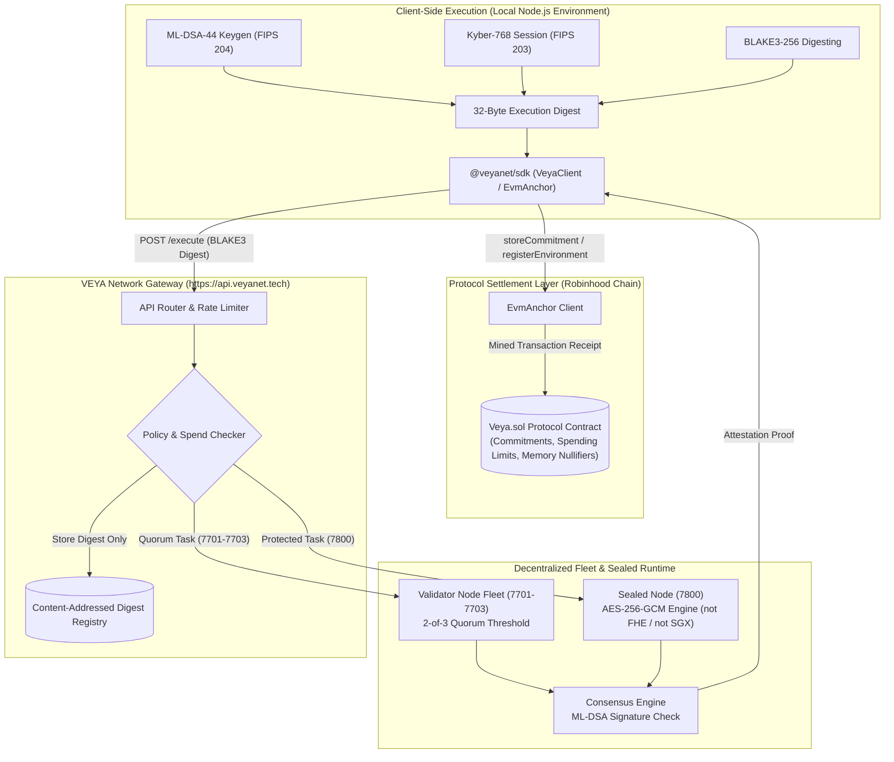

<div align="center">
  

  # VEYA TypeScript SDK

  **The official client for post-quantum agent identity, 2-of-3 consensus, sealed execution, and protocol settlement on Robinhood Chain.**

  [](https://opensource.org/licenses/MIT)
  [](https://www.npmjs.com/package/@veyanet/sdk)
  [](https://nodejs.org)
  [](https://www.typescriptlang.org/)
  [](https://explorer.testnet.chain.robinhood.com/address/0x81E770bA8343232b6f200209bf9a2c1430C2dEa1)

  **[Official Website](https://veyanet.tech)** • **[X (Twitter)](https://x.com/withveya)** • **[Documentation Index](./docs/README.md)** • **[Network Specifications](./docs/NETWORK_PIN.md)** • **[Security Policy](./SECURITY.md)**

  **$VEYA Token CA:** [`0x81E770bA8343232b6f200209bf9a2c1430C2dEa1`](https://explorer.testnet.chain.robinhood.com/address/0x81E770bA8343232b6f200209bf9a2c1430C2dEa1)

</div>

---

## 💡 Information: What is VEYA?

The **VEYA Protocol** is a decentralized, cryptographically shielded execution layer engineered for post-quantum resilient autonomous agent fleets on **Robinhood Chain**. Traditional LLM agent frameworks suffer from severe structural vulnerabilities: because agents require private execution contexts—such as API integration credentials, proprietary system prompts, treasury authority, and policy rules—running them in standard host runtimes exposes sensitive state in plaintext to host operators, database administrators, and network intermediaries.

VEYA solves this security gap by establishing client-side cryptographic boundaries and post-quantum attestation primitives. Sensitive agent workloads are protected through local post-quantum key generation (**ML-DSA-44**), quantum-resistant session negotiation (**Kyber-768**), high-throughput cryptographic digests (**BLAKE3-256**), sealed execution with **AES-256-GCM** (software sealed-node — not Intel SGX / AWS Nitro / live FHE), and **2-of-3 multi-node consensus**. Settlement today is Robinhood Chain **testnet 46630**. Mainnet is Phase 3.

### The VEYA SDK

The `@veyanet/sdk` is the canonical, type-safe developer interface designed to initialize, authenticate, and manage bounded agent workloads under VEYA's cryptographic boundaries. The SDK operates as an in-process gatekeeper, executing key derivation, state hashing, BLAKE3 memory integrity checks, and signature verification before any transaction payload or commitment digest is dispatched to the VEYA API or anchored on-chain.

By integrating `@veyanet/sdk` into your agentic runtime, you enable the following core capabilities:
*   **Post-Quantum Identity & Transport**: Generate FIPS 204 ML-DSA-44 keypairs locally and establish FIPS 203 Kyber-768 session keys for quantum-resistant data exchange.
*   **High-Speed BLAKE3-256 Digesting**: Compute deterministic 32-byte cryptographic commitments for execution payloads, agent memories, and pubkey fingerprints.
*   **Decentralized 2-of-3 Consensus**: Orchestrate tasks across independent, cryptographically attested validator nodes to verify execution outputs before committing state transitions.
*   **Sealed Execution (AES-256-GCM)**: Execute confidential tasks against a sealed-node using authenticated encryption and BLAKE3 ciphertext commitments with fail-closed isolation. This is not hardware TEE attestation and not FHE.
*   **On-Chain Attestation & Policy Settlement**: Submit tamper-evident execution commitments, spending limits (in wei), memory nullifiers, and tool permissions to the protocol contract via `EvmAnchor`.

---

## 📖 Table of Contents

1. [Architectural Design Philosophy](#-architectural-design-philosophy)
2. [High-Level SDK Data Flow](#-high-level-sdk-data-flow)
3. [Installation & Requirements](#-installation--requirements)
4. [Client Configuration & Initialization](#-client-configuration--initialization)
5. [Core Modules Overview](#-core-modules-overview)
    * [Post-Quantum Identity & Hashing](#1-post-quantum-identity--hashing)
    * [Decentralized 2-of-3 Consensus](#2-decentralized-2-of-3-consensus)
    * [Sealed Execution (AES-256-GCM)](#3-sealed-execution-aes-256-gcm)
    * [On-Chain Attestation & EVM Anchoring](#4-on-chain-attestation--evm-anchoring)
6. [Comprehensive Quickstart Script](#-comprehensive-quickstart-script)
7. [Advanced Cryptography Implementation](#-advanced-cryptography-implementation)
8. [Error Handling & Reliability](#-error-handling--reliability)
9. [Operator Diagnostics & CLI Tools](#-operator-diagnostics--cli-tools)
10. [Documentation Directory Index](#-documentation-directory-index)
11. [Frequently Asked Questions (FAQ)](#-frequently-asked-questions-faq)
12. [Contributing & Security Guidelines](#-contributing--security-guidelines)
13. [License](#-license)

---

## 🛡️ Architectural Design Philosophy

The design of `@veyanet/sdk` is governed by the paradigm of **Client-Side Inversion of Control (IoC)**. In standard service architectures, security is treated as a server-side responsibility where raw payloads are transmitted over TLS and processed in plaintext on the host. VEYA inverts this model: external host environments and network gateways are treated as untrusted layers. The SDK functions as a local cryptographic engine that executes all sanitization, key derivation, state hashing, and post-quantum signing operations within the user's local process boundary *before* network serialization and dispatch.

This core philosophy is implemented through three primary architectural pillars:

### 1. Post-Quantum Identity & Lattice-Based Signatures
Every agent and validator within the VEYA ecosystem maintains an **ML-DSA-44** (Module-Lattice-Based Digital Signature Algorithm, FIPS 204) identity. The SDK generates 1,312-byte public keys and computes 32-byte BLAKE3 public key fingerprints locally. Execution attestations sign 32-byte BLAKE3 digests rather than raw JSON payloads, providing quantum resilience against harvest-now-decrypt-later attacks.

### 2. Double-Ended Tamper-Evident State Verification
Rather than relying on remote database logs to guarantee state integrity, the SDK establishes a strict client-side verification loop. When storing memory states or context tables, the SDK computes a local **BLAKE3-256** cryptographic checksum. The VEYA API acts as a content-addressed storage ledger, storing only 64-character hexadecimal digests. Upon state retrieval, the SDK re-computes the digest of the returned payload locally and asserts its strict equality against the anchored hash, halting execution instantly if mid-flight manipulation occurs.

### 3. Multi-Node Quorum & Fail-Closed Isolation
For high-integrity execution, VEYA routes workloads to a distributed 3-node validator fleet requiring a **2-of-3 quorum**. Each node independently executes the task, cryptographically signs the output hash using its ML-DSA identity, and returns the attestation to the SDK. If the sealed node or validator fleet is unavailable, the SDK fails closed, preventing unverified or unencrypted state execution.

---

## ⚡ High-Level SDK Data Flow

The following diagram illustrates how `@veyanet/sdk` manages cryptographic boundaries, validator quorum, sealed execution, and on-chain protocol settlement:



---

## 📦 Installation & Environmental Requirements

### Runtime Compatibility & Prerequisites
The `@veyanet/sdk` is engineered to leverage modern Web Cryptography and native JavaScript interfaces directly without requiring heavy native compilation bindings:

*   **Node.js Runtime**: Version **20.0.0** or higher (`engines.node >= 20`). Built for ESM and CommonJS modules via `tsup`.
*   **TypeScript**: Version **5.0** or higher targeting `ES2022` or `ESNext`.
*   **Web Cryptography API**: Native support via `globalThis.crypto`.

### Package Installation
Install `@veyanet/sdk` into your project using npm:

```bash
npm install @veyanet/sdk
```

Subpath `@veyanet/sdk/pq` is also available if you only require post-quantum primitives (BLAKE3, ML-DSA-44, Kyber-768) without loading the full client surface:

```typescript
import { VeyaClient, EvmAnchor } from "@veyanet/sdk";
import * as pq from "@veyanet/sdk/pq";
```

---

## 🔑 Client Configuration & Initialization

The `VeyaClient` class provides zero-configuration initialization with sensible production defaults, while supporting constructor overrides and process environment variable fallbacks.

### Configuration Resolution Cascade
Configuration parameters resolve in strict precedence order: constructor options first, process environment variables second, and default network constants third:

```typescript
import { VeyaClient } from "@veyanet/sdk";

// 1. Zero-Config Instantiation (Uses production network defaults)
const client = new VeyaClient();

// 2. Custom Instantiation with Payer Private Key & Custom Node Fleet
const clientWithFleet = new VeyaClient({
  payerPrivateKey: process.env.VEYA_DEPLOYER_PRIVATE_KEY!,
  validatorNodes: [
    "http://127.0.0.1:7701",
    "http://127.0.0.1:7702",
    "http://127.0.0.1:7703",
  ],
  sealedNodeUrl: "http://127.0.0.1:7800",
});
```

### Environment Variables Reference

| Variable Name | Description | Default / Fallback |
|---------------|-------------|--------------------|
| `ROBINHOOD_RPC_URL` | Network JSON-RPC Endpoint | Public testnet RPC |
| `ROBINHOOD_CHAIN_ID` | Network Chain ID | `46630` |
| `ROBINHOOD_EXPLORER_URL` | Block Explorer Base URL | Public testnet explorer |
| `VEYA_DEPLOYER_PRIVATE_KEY` | Payer Private Key (`0x` hex string) | `undefined` (Read-only client) |
| `VEYA_VALIDATOR_NODES` | Comma-separated validator URLs | `http://127.0.0.1:7701,7702,7703` |
| `VEYA_SEALED_NODE_URL` | Sealed Node Service URL | `http://127.0.0.1:7800` |

---

## 🧩 Core Modules Overview

The `@veyanet/sdk` is architected into focused, logically isolated modules reflecting VEYA's cryptographic and execution hierarchies. Each module provides strict typing and deterministic error boundaries.

### 1. Post-Quantum Identity & Hashing
Generate post-quantum keypairs, create Kyber-768 session keys, and compute BLAKE3-256 digests.

```typescript
import { VeyaClient, pq } from "@veyanet/sdk";

const client = new VeyaClient();

// Generate an ML-DSA-44 Keypair (FIPS 204)
const { publicKey, privateKey } = await client.pqKeygen();

// Compute 32-byte BLAKE3 Pubkey Fingerprint
const pubkeyHash = await pq.publicKeyHashBlake3(publicKey);
console.log("BLAKE3 Pubkey Fingerprint:", pubkeyHash);

// Sign & Verify a 32-byte Digest
const digest = await pq.hashBlake3Bytes("payload content");
const signature = await pq.signPQ(digest, privateKey);
const isValid = await pq.verifyPQ(signature, digest, publicKey);
console.log("ML-DSA-44 Signature Valid:", isValid);
```

### 2. Decentralized 2-of-3 Consensus
Distribute execution tasks across validator nodes and verify that a 2-of-3 quorum reaches cryptographic hash agreement.

```typescript
import { VeyaClient } from "@veyanet/sdk";

const client = new VeyaClient();

const result = await client.runConsensus("task-8819", {
  action: "evaluate_policy",
  parameters: { threshold: 500 },
});

console.log("Agreed Hash:", result.agreed_blake3_hash);
console.log("Consensus Reached:", result.consensus_reached); // true if >= 2 nodes agree
```

### 3. Sealed Execution (AES-256-GCM)
Execute encrypted workloads against a sealed node using AES-256-GCM authenticated encryption and BLAKE3 ciphertext commitments. This is software sealed execution — not Intel SGX, not AWS Nitro, and not live FHE.

```typescript
import { randomBytes } from "node:crypto";
import { VeyaClient } from "@veyanet/sdk";

const client = new VeyaClient();

const sealedResult = await client.protectedExecute({
  environmentId: "env-uuid-16bytes",
  agentId: "agent-uuid-16bytes",
  eventType: "secure_compute",
  payload: { confidentialData: "confidential_value" },
  sessionEntropy: randomBytes(32),
});

console.log("Output BLAKE3 Hash:", sealedResult.output_blake3_hash);
console.log("Sealed Ciphertext Commitment:", sealedResult.sealed.blake3_commitment);
```

### 4. On-Chain Attestation & EVM Anchoring
Submit commitments, register environments, set spending limits (in wei), and flag memory nullifiers directly on the protocol contract using `EvmAnchor`.

```typescript
import { VeyaClient } from "@veyanet/sdk";

const client = new VeyaClient({
  payerPrivateKey: process.env.VEYA_DEPLOYER_PRIVATE_KEY!,
});

// Access EvmAnchor instance
const evm = client.evm!;

// Register ML-DSA identity on-chain and store initial commitment
const { environmentTx, memoTx, explorer } = await client.registerPqOnchain(1);

console.log("Environment Tx:", explorer.environment);
console.log("Commitment Tx:", explorer.memo);
```

---

## 🚀 Comprehensive Quickstart Script

Below is a complete, runnable TypeScript script demonstrating end-to-end post-quantum key generation, BLAKE3 digesting, consensus, and on-chain anchoring.

```typescript
import "dotenv/config";
import { VeyaClient, pq, isRobinhoodTestnet } from "@veyanet/sdk";

async function runQuickstart() {
  console.log("🚀 Initializing VEYA SDK...");

  // 1. Construct Client
  const client = new VeyaClient({
    payerPrivateKey: process.env.VEYA_DEPLOYER_PRIVATE_KEY,
  });

  // 2. Post-Quantum Key Generation & Hashing
  console.log("🔒 Generating ML-DSA-44 Post-Quantum Keypair...");
  const { publicKey, privateKey } = await client.pqKeygen();
  const pubkeyHash = await pq.publicKeyHashBlake3(publicKey);
  console.log(`✅ Pubkey Fingerprint (BLAKE3-256): ${pubkeyHash}`);

  // 3. BLAKE3 Commitment Digest
  const rawPayload = JSON.stringify({ action: "rebalance_treasury", maxWei: "1000000000000000000" });
  const digestHex = await client.hashBlake3(rawPayload);
  console.log(`✅ Payload Commitment Digest: ${digestHex}`);

  // 4. On-Chain Registration & Settlement (If Key Provided)
  if (client.evm) {
    console.log("⛓️ Submitting ML-DSA Identity & Commitment On-Chain...");
    try {
      const { environmentTx, memoTx, explorer } = await client.registerPqOnchain(1);
      console.log(`✅ Environment Registered: ${explorer.environment}`);
      console.log(`✅ Commitment Anchored: ${explorer.memo}`);
    } catch (err) {
      console.error("❌ On-chain settlement error:", err);
    }
  } else {
    console.log("ℹ️ Skipping on-chain write (VEYA_DEPLOYER_PRIVATE_KEY not set).");
  }

  console.log("🎉 Quickstart Execution Completed Successfully!");
}

runQuickstart();
```

---

## 🔒 Advanced Cryptography Implementation

The `@veyanet/sdk` abstracts client-side cryptographic operations for BLAKE3 integrity, ML-DSA attestation, and quantum-resistant session transport:

### 1. ML-DSA-44 Post-Quantum Identity (FIPS 204)
*   **Algorithm**: Module-Lattice-Based Digital Signature Algorithm (ML-DSA-44).
*   **Key Sizes**: Public Key: 1,312 bytes. Secret Key: 2,560 bytes.
*   **Signature Size**: Maximum 2,420 bytes (`MAX_MLDSA_SIG_LEN` = 4,627 bytes allocation on-chain).
*   **Verification Boundary**: Off-chain native verification via `pq.verifyPQ` over 32-byte BLAKE3 digests.

### 2. Kyber-768 Session Transport (FIPS 203)
*   **Algorithm**: Module-Lattice-Based Key-Encapsulation Mechanism (ML-KEM-768).
*   **Key Sizes**: Public Key: 1,184 bytes. Secret Key: 2,400 bytes. Ciphertext: 1,088 bytes.
*   **Purpose**: Ephemeral session key negotiation for sealed node communication without exposing shared secrets.

### 3. BLAKE3-256 Digesting
*   **Digest Size**: 32 bytes (64 lowercase hexadecimal characters).
*   **Usage**: Payload commitments, pubkey fingerprints, execution digests, and memory nullifier keys.

### 4. AES-256-GCM Sealed Execution
*   **Symmetric Cipher**: AES-256 in Galois/Counter Mode with 12-byte IV and 16-byte authentication tag.
*   **Fail-Closed Policy**: If sealed-node attestation checks fail, execution aborts instantly.

---

## ⚠️ Error Handling & Reliability

The `@veyanet/sdk` normalizes all network failures, RPC contract reverts, and invalid inputs into a typed `VeyaSdkError` instance.

### Error Classification & Checking
The SDK exports the `isVeyaSdkError` type-guard utility and the `VEYA_ERROR_CODES` enum to facilitate precise recovery policies:

```typescript
import { isVeyaSdkError, VEYA_ERROR_CODES } from "@veyanet/sdk";

try {
  await client.evm?.recordSpend(agentUuid, spendAmountWei);
} catch (error) {
  if (isVeyaSdkError(error)) {
    if (error.code === "CHAIN_MISMATCH") {
      console.error("RPC chain mismatch detected! Execution aborted for safety.");
    } else if (error.code === "SPENDING_EXCEEDED") {
      console.error("Environment spend limit reached in wei.");
    }
  } else {
    console.error("Systemic error:", error);
  }
}
```

---

## 🛠️ Operator Diagnostics & CLI Tools

The package ships with diagnostic scripts for operators and integrators:

```bash
# Run doctor diagnostic (RPC chain ID, contract bytecode, node health checks)
npx tsx scripts/doctor.ts

# Parse live on-chain logs from a transaction hash
npx tsx scripts/live-rpc.ts
```

---

## 📚 Documentation Directory Index

This README serves as the entry point. For detailed method-by-method breakdowns and operational runbooks, refer to our comprehensive documentation directory:

| Document | Topic | Description |
|----------|-------|-------------|
| **[Documentation Hub](./docs/README.md)** | Index | Master documentation catalog and reading paths. |
| **[Network Specifications](./docs/NETWORK_PIN.md)** | Network | Network IDs, contract details, and deployment constants. |
| **[Quickstart Guide](./docs/QUICKSTART.md)** | Tutorial | First hash, consensus, sealed execution, and chain writes. |
| **[System Architecture](./docs/ARCHITECTURE.md)** | Security | Technical architecture, trust boundaries, and component specs. |
| **[Post-Quantum Cryptography](./docs/POST_QUANTUM.md)** | Cryptography | ML-DSA-44, Kyber-768, and BLAKE3 specification details. |
| **[Verification Guide](./docs/VERIFICATION.md)** | Audit | Off-chain attestation and receipt verification procedures. |
| **[Deployment Guide](./docs/DEPLOYMENT.md)** | Operations | Cluster deployment, environment setup, and validator management. |
| **[EVM Anchoring](./docs/sdk/evm-anchoring.md)** | Blockchain | `EvmAnchor` and `Veya.sol` transaction submission. |
| **[Configuration Reference](./docs/sdk/configuration.md)** | Config | Configuration resolution cascade and environment variables. |
| **[Types Reference](./docs/api/types-reference.md)** | Reference | Full TypeScript interface and type map. |
| **[Validator Cluster](./docs/operations/consensus-cluster.md)** | Operations | 2-of-3 validator fleet management. |
| **[Sealed Node Runbook](./docs/operations/sealed-node.md)** | Operations | Sealed execution enclave management. |

---

## ❓ Frequently Asked Questions (FAQ)

### 1. Does the SDK store or transmit my private keys?
**No.** `VEYA_DEPLOYER_PRIVATE_KEY` and ML-DSA private keys remain strictly in your local process memory. Public key fingerprints (BLAKE3-256 digests) and signature bytes are submitted for audit logging; private keys never cross the network.

### 2. Where can I find the network chain ID and protocol contract details?
To prevent confusion with custom application token deployments, low-level network constants and protocol contract addresses are documented separately in the **[Network Specifications](./docs/NETWORK_PIN.md)** guide.

### 3. Is VEYA protocol contract an ERC-20 token?
**No.** `Veya.sol` is a protocol contract that manages environment records, agent registrations, execution commitments, spending limits (in wei), and memory nullifiers. It does not implement ERC-20 token interfaces.

### 4. What happens if a validator node goes down?
The SDK consensus engine requires agreement from **2 of 3** validator nodes. If one node is unavailable, quorum can still be reached. If two or more nodes are down, consensus fails closed to protect state integrity.

---

## 🤝 Contributing & Security Guidelines

### Contribution Standards
We welcome contributions to `@veyanet/sdk`. To maintain security integrity, all Pull Requests are subject to code audits:
*   **Zero-Knowledge Boundary Enforcement**: Any changes that log plaintext secrets, bypass client-side digests, or expose private key material will be rejected immediately.
*   **Cryptographic Reviews**: Modifications to post-quantum key generation, BLAKE3 hashing, or AES parameters require core security review.

### Vulnerability Disclosure Policy
If you discover a security vulnerability, **do not file a public GitHub issue**.
Submit findings confidentially to **security@veyanet.tech**. See our [Security Policy](./SECURITY.md) for full details.

---

## 📄 License

This repository is licensed under the **MIT License**. See the [LICENSE](LICENSE) file for legal details.
