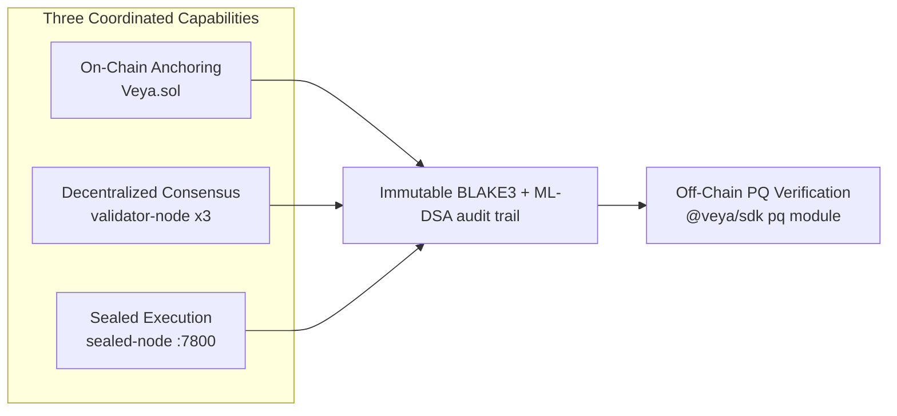
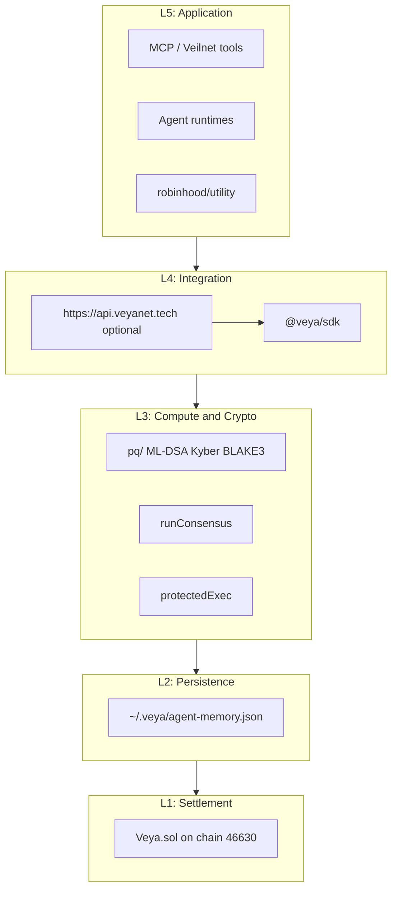

<div align="center">
  

  # VEYA SDK Architecture

  **Bounded autonomous systems infrastructure: post-quantum secured on Robinhood Chain.**

  [](https://explorer.testnet.chain.robinhood.com/address/0x1a1Dc3c55550FCE9F70ef6cDEeF967c0b72a5d84)
  [](https://docs.ethers.org/v6/)
  [](../README.md)

  **[Documentation Hub](../README.md)** • **[Post-Quantum](./POST_QUANTUM.md)** • **[Quickstart](./QUICKSTART.md)** • **[Verification](./VERIFICATION.md)**

</div>

---

This document describes the end-to-end architecture of `@veya/sdk` (this package, at `@veya/sdk`): **bounded multi-agent coordination** (scoped environments, MCP routing, sealed execution, validator consensus) anchored on **Robinhood Chain** with a **post-quantum security layer** (ML-DSA-44, Kyber-768, BLAKE3-256). The design prioritizes **environment isolation**, **decentralized consensus among operator-run nodes**, **optional hosted API**, and harvest-attack-resistant attestations.

The hosted HTTP API at `https://api.veyanet.tech` **imports this SDK**. The SDK itself talks to Robinhood Chain JSON-RPC and to local validator / sealed-node processes. It does not require the API. Integrators who want crypto and settlement in-process use `@veya/sdk` directly.

`Veya.sol` at `0x1a1Dc3c55550FCE9F70ef6cDEeF967c0b72a5d84` is a **protocol contract**. It is not an ERC-20, not a token mint, and not a brokerage wrapper. There is no token address in this product.

---

## Table of Contents

1. [Executive Summary](#executive-summary)
2. [Live Testnet Architecture State](#live-testnet-architecture-state)
3. [Threat Model](#threat-model)
4. [Architectural Design Philosophy](#architectural-design-philosophy)
5. [Layered Architecture](#layered-architecture)
6. [High-Level System Data Flow](#high-level-system-data-flow)
7. [Component Inventory](#component-inventory)
8. [Component Deep Dives](#component-deep-dives)
9. [Identity and Environment Model](#identity-and-environment-model)
10. [Execution Attestation Flow](#execution-attestation-flow)
11. [Consensus Subsystem](#consensus-subsystem)
12. [Sealed Execution Subsystem](#sealed-execution-subsystem)
13. [Memory and Nullifiers](#memory-and-nullifiers)
14. [Spending and Policy Enforcement](#spending-and-policy-enforcement)
15. [Veya.sol Contract Design](#veyasol-contract-design)
16. [Data Flow Diagrams](#data-flow-diagrams)
17. [Trust Boundaries](#trust-boundaries)
18. [Storage Topology](#storage-topology)
19. [Cryptographic Profile](#cryptographic-profile)
20. [Operational Deployment Patterns](#operational-deployment-patterns)
21. [Failure Modes and Recovery](#failure-modes-and-recovery)
22. [Observability and Audit](#observability-and-audit)
23. [Extension Points](#extension-points)
24. [Invariants](#invariants)
25. [Glossary](#glossary)

---

## Executive Summary

`@veya/sdk` provides three coordinated capabilities that together replace a single trusted coordination server as the source of truth for agent settlement:

1. **On-chain anchoring**: `Veya.sol` on Robinhood Chain stores environment identity fingerprints, BLAKE3 execution commitments, ML-DSA signature metadata, spending limits (wei), tool policies, memory nullifiers, and sealed ciphertext chunks across **10 Solidity functions** and **9 storage record types**.

2. **Decentralized compute consensus**: Independent validator nodes at `127.0.0.1:7701`–`7703` execute identical payloads, sign BLAKE3 hashes with ML-DSA-44, and return results. A **2-of-3 quorum** selects the agreed execution hash before optional on-chain attestation.

3. **Protected sealed execution**: A sealed-node service at `127.0.0.1:7800` receives AES-256-GCM encrypted payloads, executes inside a process boundary, and produces BLAKE3 ciphertext commitments suitable for `storeSealedState` on-chain data availability.

All post-quantum signature **verification** occurs off-chain. The EVM runtime does not execute ML-DSA at production cost; instead, the chain records immutable audit artifacts (`bytes32` hashes and optional signature blobs bounded by `MAX_MLDSA_SIG_LEN = 4627`) that survive long-term quantum adversaries targeting classical curves.



The SDK is TypeScript, ethers v6, Node 20+. Settlement is Robinhood Chain (EVM). There is no Solana client in this package, no program-derived addresses, and no SPL Memo companion path.

---

## Live Testnet Architecture State

PQ anchoring is **live on Robinhood Chain testnet**. The protocol contract is deployed and receiving writes.

| Field | Value |
|-------|-------|
| **Network** | Robinhood Chain Testnet |
| **Chain ID** | `46630` (`0xb636`) |
| **RPC** | `https://rpc.testnet.chain.robinhood.com` |
| **Explorer** | `https://explorer.testnet.chain.robinhood.com` |
| **Protocol contract** | `0x1a1Dc3c55550FCE9F70ef6cDEeF967c0b72a5d84` |
| **Contract name** | `Veya.sol` (protocol, not a token) |
| **Native currency** | ETH (18 decimals, amounts in wei) |
| **Client library** | ethers v6 (`JsonRpcProvider` + `Contract`) |
| **Algorithm** | ML-DSA-44 + Kyber-768 + BLAKE3-256 |

### Confirmed transactions

These hashes are live receipts. Open them on the Robinhood testnet explorer; they are not placeholders.

| Operation | Explorer |
|-----------|----------|
| Guest content proof (`storeCommitment`) | [0x4314faef…395d](https://explorer.testnet.chain.robinhood.com/tx/0x4314faefee6f1c635f91dd075384d4816e10abd84b9bb88e3328b51e630e395d) |
| Sealed-execution commitment | [0xd68ab196…31d8](https://explorer.testnet.chain.robinhood.com/tx/0xd68ab19671f0a3be63651cb6d6e24f5decf591da981708502827bca3689d31d8) |
| PQ / environment registration path | [0x9a00af5e…8ad4](https://explorer.testnet.chain.robinhood.com/tx/0x9a00af5ef80fdefb3734df19ad30b82aa57fa212bd493b7ad5b224a343808ad4) |

Architecture implication: hashes and environment bindings are **permanent audit evidence today**. The hosted API (`https://api.veyanet.tech`) uses a relayer that calls this SDK; operators can also sign with their own `payerPrivateKey` and never touch the API.

`EvmAnchor.ensureRobinhoodChain()` queries `eth_chainId` before every write. If the RPC returns anything other than `46630` (or the configured `chainId`), the SDK refuses to send. That is the guard against pointing this package at another EVM by accident.

---

## Threat Model

### Adversary capabilities

| Adversary | Capability | Mitigation | Residual risk |
|-----------|------------|------------|---------------|
| Quantum computer (future) | Grover speedup on hash search | BLAKE3-256 commitments (128-bit post-Grover margin) | Theoretical collision advances |
| Quantum computer (future) | Shor break of ECDSA / secp256k1 | ML-DSA-44 identity; Kyber-768 sessions | Migration window for legacy Ethereum keys used only as `msg.sender` |
| Malicious validator node | Return incorrect execution hash | 2-of-3 quorum requires matching BLAKE3 | Collusion of 2+ nodes |
| Chain observer | Read all on-chain data | Only hashes, metadata, and sealed chunks; PQ keys off-chain | Metadata leakage from events and mapping keys |
| Compromised agent | Exceed spending or invoke forbidden tools | On-chain wei caps and tool policy mappings; SDK `PolicyAgent` preflight | Off-chain execution before an anchor lands |
| Replay attacker | Re-submit old memory entries | `flagMemoryNullifier` enforces spend-once | Unanchored local memory in `~/.veya/agent-memory.json` |
| Harvest-now-decrypt-later | Record classical signatures today | PQ-first identity and BLAKE3 commitments | Pre-migration historical ECDSA receipts |
| Mis-pointed RPC | Land writes on Ethereum mainnet or another L2 | `ensureRobinhoodChain` chain-id check | Operator who disables the check in a fork |
| Hosted API compromise | Relayer key spends gas and writes rooms | SDK works without the API; guest JWT cannot drive the relayer | Relayer key remains a high-value secret when the API is used |

### Trust assumptions

| Assumption | Rationale |
|------------|-----------|
| Robinhood Chain consensus is honest-majority | Standard L1 / app-chain security model for chain ID 46630 |
| At least 2 of 3 validators are honest | Byzantine quorum design |
| Operator secures ML-DSA secret keys | Keys never stored in `Veya.sol` |
| Off-chain verifiers run `@noble/post-quantum` + `hash-wasm` correctly | SDK supply chain |
| `eth_chainId` from the configured RPC is truthful | Operators must not pin a lying proxy |

### Out of scope (v1)

- On-chain ML-DSA verification inside the EVM
- Encrypted mempool or private Robinhood Chain transactions
- Cross-chain bridging of VEYA state
- A token, mint, or ERC-20 wrapper around `Veya.sol`
- Full TFHE / FHE compute (sealed path today is AES-256-GCM + BLAKE3 + ML-DSA)
- SHA-256 on new SDK commitment paths (Use-mode browser content proofs may hash with SHA-256 for preview; the SDK commitment primitive is BLAKE3)

---

## Architectural Design Philosophy

VEYA inverts the traditional agent-platform model. Security boundaries execute **locally** and **on-chain** rather than exclusively through a trusted remote API. The hosted API is a convenience relayer, not the cryptographic root.

### 1. Post-quantum audit artifacts on Robinhood Chain

Every critical state transition maps to a **BLAKE3-256** digest stored as `bytes32`. ML-DSA-44 detached signatures bind operator intent to those digests. `Veya.sol` mappings and events store immutable evidence: verifiable decades later even if secp256k1 is broken. Ethereum ECDSA still authenticates `msg.sender` for authorization; PQ signatures authenticate **agent identity and execution content**.

### 2. Off-chain verification, on-chain anchoring

| Operation | Where it runs | What lands on-chain |
|-----------|---------------|---------------------|
| ML-DSA sign/verify | SDK `pq` module, auditor tooling | Signature bytes in `Attestation.mldsaSig` (optional; hosted relayer often stores the digest only) |
| Kyber encaps/decaps | SDK coordination transport | Never on-chain |
| BLAKE3 commitment | Every layer | `bytes32` in mappings / events |
| Quorum agreement | 3 validator nodes | Agreed hash → `attestExecution` or `storeCommitment` |
| Chain-id guard | `EvmAnchor.ensureRobinhoodChain` | No write if RPC is not 46630 |

### 3. Environment isolation with policy enforcement

Agents operate inside **typed environments** (`Execution` = 0, `SecureEnclave` = 1, `Governance` = 2). On-chain mappings enforce spending limits in **wei**, tool policy ACLs, and memory nullifiers: spend-once semantics without a central policy server as the sole enforcer. The SDK `PolicyAgent` and `setToolPolicy` mirror those rules locally for preflight.

### 4. Hosted API is optional

```
Operator ──► @veya/sdk (VeyaClient / EvmAnchor)
                │
    ┌───────────┼───────────┬──────────────────┐
    ▼           ▼           ▼                  ▼
~/.veya      validators   sealed-node     Robinhood RPC
memory JSON  :7701-7703   :7800 /protected Veya.sol
```

Data does not have to flow through `https://api.veyanet.tech`. Validators agree on BLAKE3 execution hashes. The contract anchors commitments. Auditors verify ML-DSA signatures off-chain. When the API **is** used, it calls the same exports (`runConsensus`, `protectedExec`, `EvmAnchor`) so the hosted path is not a second protocol.

---

## Layered Architecture

```
+-------------------------------------------------------------------------+
|                    Application / Agent Layer                            |
|         (MCP tools, agent runtimes, robinhood/utility dashboard)        |
+---------------------------------+---------------------------------------+
                                  |
+---------------------------------v---------------------------------------+
|                         Integration Layer                               |
|   @veya/sdk (VeyaClient)  |  https://api.veyanet.tech (optional HTTP API)     |
+----------+--------------------------+------------------+----------------+
           |                          |                  |
+----------v----------+  +------------v------------+  +--v----------------+
|  pq/                |  |  compute/consensus.ts   |  |  sealed/          |
|  ML-DSA, Kyber,     |  |  2-of-3 quorum client   |  |  protectedExec    |
|  BLAKE3             |  |  POST /execute          |  |  POST /protected  |
+----------+----------+  +------------+------------+  +--+----------------+
           |                          |                  |
+----------v--------------------------v------------------v----------------+
|              Local persistence (~/.veya/agent-memory.json)              |
|                    environments, agents, memory entries                 |
+---------------------------------+---------------------------------------+
                                  |
+---------------------------------v---------------------------------------+
|              Robinhood Chain: Veya.sol (10 functions)                  |
|   Environment | Agent | Attestation | PqAttestation | Commitment        |
|   SpendingLimit | ToolPolicy | Nullifier | SealedState                  |
+-------------------------------------------------------------------------+
```

Each layer depends only on layers below it. `VeyaClient` constructed without `payerPrivateKey` still hashes, runs consensus, and calls sealed-node. Writes require a funded key and a matching chain id.



---

