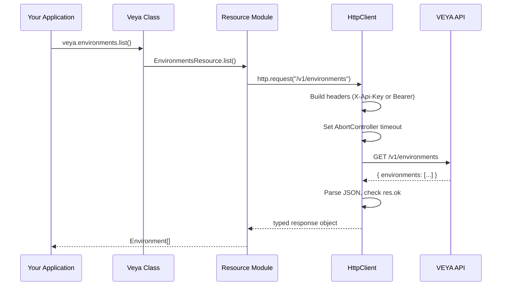
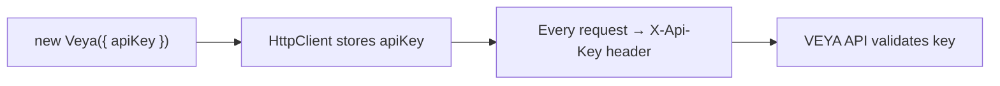
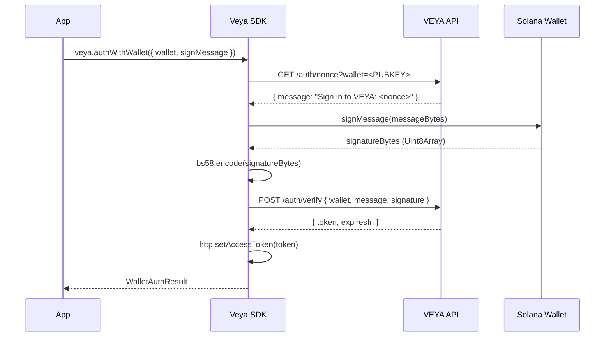
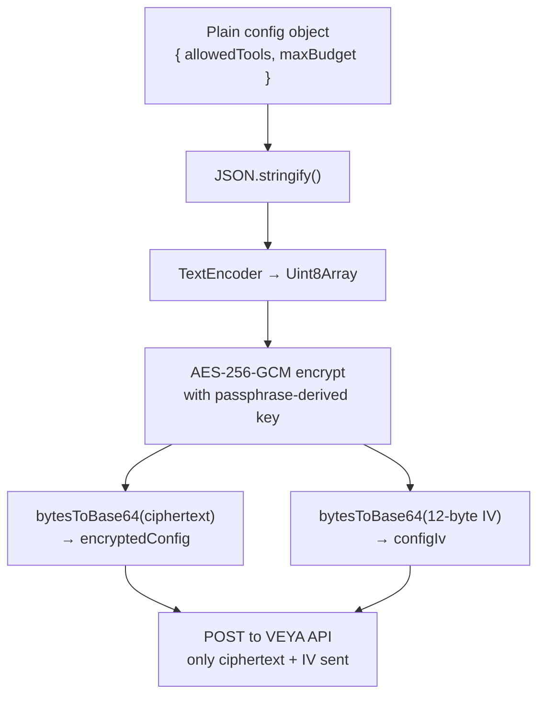
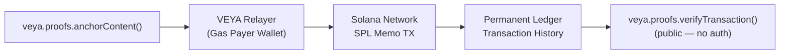

# Architecture — `@veya/sdk`

`@veya/sdk` is the official TypeScript client library for the VEYA API. It is a thin, typed HTTP client — no local database, no daemon, no persistent process. It translates TypeScript method calls into authenticated HTTPS requests and surfaces typed response objects back to the caller. All sensitive computation (decentralized consensus execution, Solana anchoring, memory hash registration) is performed by the VEYA validator fleet and gateway API; the SDK handles transport, authentication, input encryption, and response shaping.

---

## Design Principles

The SDK is built around four hard rules:

**1. No secrets in the repository.**
API keys, passphrases, and JWT tokens are consumed from environment variables or passed at construction time. The SDK never reads from disk, never hard-codes credential values, and never logs auth headers or key material.

**2. Errors always surface as `VeyaError`.**
Every network failure, timeout, non-2xx HTTP response, and validation error is normalized into a `VeyaError` instance with a `.status` (HTTP code), `.message` (human-readable), and optional `.code` (machine-readable string). Callers only need to handle one error type.

**3. Public routes skip auth headers.**
Three routes are unconditionally public regardless of SDK config: `/health`, `/auth/nonce` + `/auth/verify`, and `/api/verify/:signature`. The `HttpClient` accepts an `auth: false` option to suppress the auth header for these routes.

**4. Plaintext never crosses the network for sensitive data.**
Agent configuration objects are encrypted client-side with AES-256-GCM before being sent to the API. Memory content is hashed locally with SHA-256 — only the digest is transmitted. The VEYA API never sees raw agent configs or raw memory content.

---

## Module Layout

```
src/
├── index.ts              Entry point — re-exports the public API surface
├── config.ts             VeyaConfig type + resolveConfig() with env fallbacks
├── crypto.ts             AES-256-GCM encrypt/decrypt for agent configs
│
├── client/
│   ├── VeyaClient.ts     The Veya class — composes all 8 resource modules
│   ├── http.ts           HttpClient — fetch wrapper with auth, timeout, VeyaError
│   └── index.ts          Re-export barrel
│
├── auth/
│   ├── wallet.ts         walletAuth() — nonce → sign → verify flow
│   ├── apiKey.ts         API key header helper
│   └── index.ts          Re-export barrel
│
├── modules/
│   ├── environments.ts   EnvironmentsResource — CRUD for environment workspaces
│   ├── agents.ts         AgentsResource — deploy, update, encrypt-and-deploy
│   ├── memory.ts         MemoryResource — ZK hash store + storeContent() helper
│   ├── executions.ts     ExecutionsResource — standard execution logging
│   ├── compute.ts        DecentralizedComputeResource — multi-node consensus compute
│   ├── protection.ts     ProtectionResource — enclave-shielded execution
│   ├── proofs.ts         ProofsResource — Solana anchoring + verification
│   ├── solana.ts         SolanaResource — PDA registration + attestation tx builder
│   └── apiKeys.ts        ApiKeysResource — key create/list/revoke lifecycle
│
├── types/
│   ├── environment.ts    Environment, EnvironmentType, EnvironmentStatus
│   ├── agent.ts          Agent, AgentType, AgentStatus, DeployAgentInput
│   ├── execution.ts      Execution, MemoryEntry, ApiKeyRow, ProofAnchor, VerifyProofResult
│   └── index.ts          Re-export barrel
│
└── utils/
    ├── hash.ts           sha256Hex() and sha256HexSync() — SHA-256 utilities
    └── encoding.ts       bytesToBase64() and base64ToBytes() — crypto encoding helpers
```

---

## Request Lifecycle

Every SDK call follows the same path from method invocation to typed response:



If the API returns a non-2xx status, `HttpClient` throws a `VeyaError` before the response reaches the resource module. The caller catches a single normalized error type regardless of what went wrong at the network layer.

---

## The `Veya` Class

`Veya` is the single entry point for all SDK operations. It instantiates one `HttpClient` and passes it by reference to all eight resource modules. This means auth state (API key or JWT) is shared across all modules — calling `veya.setAccessToken(token)` switches auth for every subsequent request regardless of which resource module makes it.

```ts
export class Veya {
  readonly config: VeyaConfig;
  private readonly http: HttpClient;

  readonly environments: EnvironmentsResource;
  readonly agents: AgentsResource;
  readonly memory: MemoryResource;
  readonly executions: ExecutionsResource;
  readonly compute: DecentralizedComputeResource;
  readonly proofs: ProofsResource;
  readonly apiKeys: ApiKeysResource;
  readonly solana: SolanaResource;
  readonly protection: ProtectionResource;

  constructor(options: Partial<VeyaConfig> = {}) {
    this.config = resolveConfig(options);
    this.http = new HttpClient(this.config);
    // All resource modules share the same HttpClient instance
    this.environments = new EnvironmentsResource(this.http);
    this.compute = new DecentralizedComputeResource(this.http);
    // ...
  }
}
```

The `Veya` class exposes two methods directly (not via a sub-resource):
- `veya.health()` — calls `GET /health` with `auth: false`
- `veya.authWithWallet(input)` — runs the wallet sign-in flow and sets the JWT on the shared `HttpClient`

---

## Configuration Resolution

`resolveConfig()` merges explicit options with environment variable fallbacks. This allows zero-config construction in environments where the env vars are set:

```ts
export function resolveConfig(input: Partial<VeyaConfig> = {}): VeyaConfig {
  const apiUrl = (input.apiUrl ?? process.env.VEYA_API_URL ?? DEFAULT_API_URL)
    .replace(/\/$/, ""); // strip trailing slash
  return {
    apiUrl,
    accessToken: input.accessToken,
    apiKey: input.apiKey,
    timeoutMs: input.timeoutMs ?? 30_000,
  };
}
```

**Resolution priority for `apiUrl`:**
1. `options.apiUrl` (explicit)
2. `process.env.VEYA_API_URL`
3. `"https://api.veyanet.tech"` (hardcoded default)

**Auth header selection in `HttpClient`:**
1. `apiKey` → sends `X-Api-Key` header
2. `accessToken` (if no `apiKey`) → sends `Authorization: Bearer` header
3. Neither → no auth header (only valid for public routes)

Calling `setAccessToken(token)` on the client removes the stored `apiKey` and switches to JWT auth for all subsequent requests.

---

## HttpClient

`HttpClient` is a minimal wrapper around the browser/Node `fetch` API. It handles:

- **URL construction** — prepends `config.apiUrl` to every path
- **Auth headers** — `X-Api-Key` or `Authorization: Bearer`, based on config
- **Content-Type** — automatically sets `application/json` when a body is present
- **Timeout** — wraps every request in an `AbortController` with `config.timeoutMs` (default 30s)
- **Response parsing** — reads the body as text, attempts `JSON.parse`, falls back to raw string
- **Error normalization** — any non-ok response or network failure throws a `VeyaError`

```ts
const controller = new AbortController();
const timeout = setTimeout(() => controller.abort(), this.config.timeoutMs);

try {
  const res = await fetch(url, { method, headers, body, signal: controller.signal });
  if (!res.ok) throw new VeyaError(err?.error, res.status, err?.code, data);
  return data as T;
} catch (err) {
  if (err instanceof VeyaError) throw err;
  if (err instanceof Error && err.name === "AbortError")
    throw new VeyaError("Request timed out", 408);
  throw new VeyaError(err instanceof Error ? err.message : "Network error", 0);
} finally {
  clearTimeout(timeout);
}
```

---

## Resource Modules

Each module encapsulates one API domain. All modules receive `HttpClient` via constructor injection — they have no direct access to config, credentials, or each other.

| Module | Class | API Domain | Methods |
|---|---|---|---|
| `environments.ts` | `EnvironmentsResource` | `/v1/environments` | `list`, `create`, `get`, `update` |
| `agents.ts` | `AgentsResource` | `/v1/environments/:id/agents` | `list`, `deploy`, `deployEncrypted`, `update` |
| `memory.ts` | `MemoryResource` | `/v1/environments/:id/memory` | `list`, `store`, `storeContent`, `purge` |
| `executions.ts` | `ExecutionsResource` | `/v1/environments/:id/executions` | `list`, `create`, `runStandard` |
| `compute.ts` | `DecentralizedComputeResource` | `/v1/environments/:id/executions/decentralized` | `run` |
| `protection.ts` | `ProtectionResource` | `/v1/environments/:id/executions/protected` | `run`, `runWithFieldLists` |
| `proofs.ts` | `ProofsResource` | `/v1/proofs`, `/api/verify` | `anchorContent`, `anchorText`, `list`, `verifyTransaction` |
| `solana.ts` | `SolanaResource` | `/v1/solana/...` | `cluster`, `environmentRegistration`, `confirmEnvironmentRegistration`, `agentRegistration`, `confirmAgentRegistration`, `buildUnsignedAttestation` |
| `apiKeys.ts` | `ApiKeysResource` | `/v1/api-keys` | `list`, `create`, `revoke` |

Most methods are thin wrappers that call `http.request<T>(path, options)` and unwrap one nesting level from the response (e.g. `{ environments: [...] }` → `Environment[]`). Convenience methods like `storeContent`, `runStandard`, and `runWithFieldLists` add local pre-processing (hashing, default-filling) before delegating to the base method.

---

## Authentication Flow

### API Key Auth

The simplest auth path. Pass `apiKey` at construction and the SDK handles everything:



### Wallet JWT Auth

Used in browser environments or when a Solana wallet adapter is available:



After `authWithWallet` completes, all subsequent requests on that client instance automatically use `Authorization: Bearer <token>`. The wallet adapter's `signMessage` callback receives `Uint8Array` message bytes and must return `Uint8Array` signature bytes — standard for Solana wallet adapters (Phantom, Backpack, Solflare).

---

## Client-Side Cryptography

### Agent Config Encryption (AES-256-GCM)

Agent configurations can contain sensitive tooling rules, budget constraints, or private routing parameters. Before deploying an agent with such data, the SDK encrypts the config object client-side using AES-256-GCM via the Web Crypto API (`node:crypto` → `webcrypto.subtle`).



**Key derivation:** The passphrase is padded or trimmed to exactly 32 bytes using `String.prototype.padEnd(32, '0').slice(0, 32)` after being normalized with `.trim()`. This 32-byte buffer is imported as a raw AES-256-GCM key via `subtle.importKey`. The passphrase must be at least 8 characters.

**Decryption:** `decryptAgentConfig(encryptedConfig, configIv, passphrase)` reverses the process entirely locally. Neither the passphrase nor the plaintext config ever leaves the client environment.

### Zero-Knowledge Memory Hashing (SHA-256)

Memory content is hashed locally before any network call is made:

```ts
// memory.storeContent() — content never leaves the client
async storeContent(environmentId, scope, content, options) {
  const contentHash = await sha256Hex(content); // local hash only
  return this.store(environmentId, { scope, contentHash, ...options });
}
```

`sha256Hex` uses `webcrypto.subtle.digest("SHA-256", ...)` in async environments and a synchronous `createHash("sha256")` fallback in Node.js via `sha256HexSync`. The result is a 64-character lowercase hex string.

---

## Type System

All API response shapes are defined as TypeScript interfaces in `src/types/`. The type system uses strict TypeScript unions for enumerable values:

```ts
type EnvironmentType =
  | "research" | "governance" | "treasury"
  | "contributor" | "protocol" | "desci";

type AgentType =
  | "research" | "coordination" | "memory"
  | "policy" | "presence" | "finance";

type AgentStatus = "active" | "idle" | "executing" | "error";
type EnvironmentStatus = "active" | "paused" | "archived";
```

A runtime type guard is provided for `EnvironmentType`:

```ts
export function isEnvironmentType(value: string): value is EnvironmentType {
  return ["research","governance","treasury","contributor","protocol","desci"]
    .includes(value);
}
```

All types are re-exported from `src/index.ts` via `export type * from "./types/index.js"` and are available to SDK consumers at the top-level import path.

---

## Build & Distribution

The SDK is built with `tsup` and ships dual ESM + CJS bundles with TypeScript declaration files:

| Output | Path | Use Case |
|---|---|---|
| ESM module | `dist/index.js` | Node.js ESM, bundlers (Vite, webpack, Rollup) |
| CJS module | `dist/index.cjs` | CommonJS environments, older tooling |
| Type declarations | `dist/index.d.ts` | TypeScript consumers |

The `package.json` `exports` field routes module resolution automatically:
```json
{
  "exports": {
    ".": {
      "import": "./dist/index.js",
      "require": "./dist/index.cjs",
      "types": "./dist/index.d.ts"
    }
  }
}
```

The only runtime dependency is `bs58` (for base58 encoding of Solana wallet signatures). Everything else — `node:crypto`, `fetch`, `AbortController` — is part of Node.js 18+ and modern browsers natively.

---

## Zero-Knowledge Memory Model — Deep Dive

The memory subsystem is one of the most architecturally significant parts of the SDK because it enforces a strict privacy boundary entirely in client code. The VEYA API acts purely as a hash registry — it stores content digests but has no cryptographic ability to reconstruct the original content from them.

### What Gets Transmitted vs. What Stays Local

When you call `veya.memory.storeContent()`, the SDK executes the following steps entirely on the caller's machine before any network call is made:

```ts
async storeContent(environmentId, scope, content, options) {
  // Step 1 — hash locally using Web Crypto SHA-256
  const contentHash = await sha256Hex(content);

  // Step 2 — only the hash goes over the wire
  return this.store(environmentId, {
    scope,
    contentHash,   // 64-char hex — this is all the API receives
    agentId: options.agentId,
    metadata: options.metadata,
  });
}
```

The raw `content` string — which might be a prompt template, a system instruction, a private configuration note, or a database query — never touches the network. The VEYA API receives only:

- `scope` — a namespace string you define (e.g. `"agent-prompts"`, `"session-logs"`)
- `contentHash` — the 64-character SHA-256 hex digest
- `agentId` — optional association
- `metadata` — arbitrary caller-defined JSON

### Verification Use Case

Because the hash is publicly anchored in the VEYA registry, any agent or system that holds the original plaintext can verify it has not been tampered with by re-hashing and comparing:

```ts
import { sha256Hex } from "@veya/sdk";

const localContent = await readFromLocalStore(memoryId);
const localHash = await sha256Hex(localContent);

const entries = await veya.memory.list(environmentId, "agent-prompts");
const registeredEntry = entries.find((e) => e.id === memoryId);

if (registeredEntry?.contentHash !== localHash) {
  throw new Error("Memory integrity check failed — content has been modified.");
}
```

This pattern is particularly useful in multi-agent coordination scenarios where one agent needs to verify that a shared memory record has not been altered between write and read operations.

### Scope Design

The `scope` field is a free-form string (1–64 characters). Use it to partition memory entries by purpose, agent type, or session identifier:

| Scope Pattern | Example | Use Case |
|---|---|---|
| Feature-based | `"agent-prompts"` | System prompt templates per agent type |
| Session-based | `"session:abc123"` | Ephemeral context for a single agent run |
| Agent-based | `"agent:finance:config"` | Agent-specific configuration hashes |
| Audit-based | `"audit:2025-01"` | Monthly compliance record hashes |

---

## Solana Integration — Mechanics

The SDK integrates with Solana in two distinct ways: **SPL Memo anchoring** (for proof records) and **PDA registration** (for environment and agent identity). These serve different purposes and go through different API routes.

### SPL Memo Anchoring — Proof Records

When you call `veya.proofs.anchorContent()`, the VEYA API's Solana relayer submits a transaction containing a single SPL Memo instruction. The memo payload is a UTF-8 JSON string embedding the content hash:

```json
{ "veya": "1.0", "hash": "5a6b7c8d...", "label": "Board vote", "uri": "https://..." }
```

Because Solana memo instructions are part of the permanent transaction log on every validator node, the hash becomes globally queryable by anyone with the transaction signature — no VEYA API access required. The `veya.proofs.verifyTransaction(signature)` method exploits this by making a public call to `/api/verify/:signature` which itself queries a Solana RPC node, not any internal database.



### PDA Registration — Environment & Agent Identity

Program Derived Addresses (PDAs) give environments and agents a deterministic on-chain identity that is independent of any specific wallet or private key. The registration flow is split across two SDK calls:

**Step 1 — Fetch unsigned transaction:**
```ts
const { registration } = await veya.solana.environmentRegistration(env.id);
// `registration` contains the serialized, unsigned Solana transaction
```

**Step 2 — Sign with wallet adapter and broadcast:**
```ts
// Your wallet adapter (Phantom, Backpack, Solflare) signs the serialized tx
const signature = await walletAdapter.sendTransaction(deserialize(registration));
```

**Step 3 — Confirm with VEYA API:**
```ts
const { environmentPda } = await veya.solana.confirmEnvironmentRegistration(
  env.id,
  signature
);
// The VEYA API now knows the on-chain PDA address for this environment
```

This three-step pattern keeps the SDK transport-agnostic — the SDK never holds a private key or submits transactions itself. It provides the unsigned payload; the caller's wallet infrastructure handles signing and broadcasting.

### Unsigned Attestation Transactions

`veya.solana.buildUnsignedAttestation()` is used when you want to attach an SPL Memo attestation to an existing execution without using the VEYA relayer as the gas payer. Instead, you supply a `feePayer` public key and the API returns a serialized, unsigned transaction that your own wallet signs and broadcasts:

```ts
const { hash, serialized, uri } = await veya.solana.buildUnsignedAttestation(
  { amount: 1_000_000, action: "treasury.transfer", agentId: agent.id },
  myWalletPublicKey
);

// `serialized` is a base64-encoded Solana VersionedTransaction
const txBytes = Buffer.from(serialized, "base64");
const signature = await myWallet.signAndSendTransaction(txBytes);
```

---

## Environment & Agent Data Model

### Environments

An environment is the top-level organizational unit in VEYA. It acts as a namespace that owns agents, memory entries, and execution records. Every environment has:

- **`ownerWallet`** — the Solana public key of the account that created it, used to verify ownership during Solana PDA registration.
- **`type`** — one of six predefined strings that classify the environment's operational purpose (`treasury`, `governance`, `research`, `contributor`, `protocol`, `desci`). The type is used by the API to apply default policy templates.
- **`spendingLimits`** — a JSON object defining per-period Solana spend budgets, checked by the API before every execution that carries a non-zero `spendLamports` value.
- **`policyConfig`** — a JSON object for environment-wide policy enforcement rules (e.g. maximum number of agents, allowed event types).
- **`agentRoster`** — a list of agent UUIDs registered to this environment. Agents outside the roster cannot execute within the environment.
- **`memoryScope`** — a JSON config object that governs memory namespace rules for the environment.

### Agents

Agents are isolated execution principals within an environment. Each agent has:

- **`type`** — one of six strings (`research`, `coordination`, `memory`, `policy`, `presence`, `finance`) that categorize the agent's role and determine which tools it is allowed to invoke.
- **`permissionConfig`** — the primary access control object. Contains `allowedTools`, scope restrictions, and any agent-specific policy overrides.
- **`encryptedConfig` + `configIv`** — if the agent was deployed via `agents.deployEncrypted()` or with explicit AES fields, this contains the AES-256-GCM ciphertext and IV. The VEYA API stores these opaque blobs and returns them on agent fetch; it cannot decrypt them.
- **`spendThisPeriod`** — a running total of lamports spent in the current spending period, used by the API for budget enforcement.
- **`agentKind`** — an optional free-form classifier for custom agent taxonomy beyond the six built-in types.

### Execution Records

Every agent action — whether standard or protected — is recorded as an immutable `Execution` entry:

- **`eventType`** — a caller-defined dot-notation string (e.g. `"treasury.transfer"`, `"memory.verify"`) that categorizes the action for audit querying.
- **`payload`** — the full execution context parameters. For protected executions, sealed fields are returned as hashes rather than plaintext.
- **`protected`** — boolean flag. `true` indicates the execution was routed through an isolated secure enclave.
- **`commitmentHash`** — if `commitResult: true` was set, this is the SHA-256 hash of the execution output that was anchored on Solana.
- **`attestationTx`** — the Solana transaction signature for the on-chain commitment, if applicable.

---

## SDK Extension Patterns

### Adding a New Resource Module

If the VEYA API adds a new resource namespace, extending the SDK follows a consistent four-step pattern:

**1. Define input/output types in `src/types/`:**
```ts
// src/types/webhook.ts
export interface Webhook {
  id: string;
  url: string;
  events: string[];
  createdAt: string;
}
```

**2. Create the resource module in `src/modules/`:**
```ts
// src/modules/webhooks.ts
import type { HttpClient } from "../client/http.js";
import type { Webhook } from "../types/webhook.js";

export class WebhooksResource {
  constructor(private readonly http: HttpClient) {}

  async list(): Promise<Webhook[]> {
    const { webhooks } = await this.http.request<{ webhooks: Webhook[] }>("/v1/webhooks");
    return webhooks;
  }

  async create(input: { url: string; events: string[] }): Promise<Webhook> {
    const { webhook } = await this.http.request<{ webhook: Webhook }>("/v1/webhooks", {
      method: "POST",
      body: input,
    });
    return webhook;
  }
}
```

**3. Register on `VeyaClient`:**
```ts
// src/client/VeyaClient.ts
import { WebhooksResource } from "../modules/webhooks.js";

export class Veya {
  readonly webhooks: WebhooksResource;

  constructor(options: Partial<VeyaConfig> = {}) {
    // ...
    this.webhooks = new WebhooksResource(this.http);
  }
}
```

**4. Export the type from `src/index.ts`:**
```ts
export type { Webhook } from "./types/webhook.js";
```

---

## Testing Architecture

The SDK ships with a Vitest test suite covering the five core subsystems. All tests mock the `fetch` global to avoid real network calls.

### Test Files

| File | What It Tests |
|---|---|
| `tests/auth.test.ts` | `walletAuth()` — nonce fetch, signMessage callback, verify POST, token injection |
| `tests/client.test.ts` | `HttpClient` — header construction, timeout abort, VeyaError mapping, auth priority |
| `tests/environments.test.ts` | `EnvironmentsResource` — list/create/get/update response unwrapping |
| `tests/compute.test.ts` | `DecentralizedComputeResource` — multi-node consensus execution |
| `tests/proofs.test.ts` | `ProofsResource` — anchorContent, verifyTransaction (auth: false), list |
| `tests/protection.test.ts` | `ProtectionResource` — run(), runWithFieldLists() defaults |

### Running Tests

```bash
# Run all tests once
npm run test

# Run in watch mode
npm run test:watch

# Type-check without building
npm run lint
```

### Mocking Pattern

Tests intercept `fetch` at the global level using Vitest's `vi.stubGlobal`:

```ts
vi.stubGlobal("fetch", vi.fn().mockResolvedValue({
  ok: true,
  text: async () => JSON.stringify({ environments: [] }),
}));
```

This ensures tests run in under 100ms with no external dependencies.

---

## Related

- [api-map.md](./api-map.md) — Full HTTP route reference
- [authentication.md](./authentication.md) — Auth flows in depth
- [crypto.md](./crypto.md) — AES-256-GCM and SHA-256 utility reference
- [error-handling.md](./error-handling.md) — `VeyaError`, status codes, and retry patterns
- [decentralized-compute.md](./decentralized-compute.md) — Consensus multi-node compute guide
- [memory.md](./memory.md) — Zero-knowledge memory guide
- [solana.md](./solana.md) — Solana PDA registration and attestation
- [types-reference.md](./types-reference.md) — All TypeScript interfaces and type definitions

