<div align="center">
  

  # VEYA SDK Architecture

  **Bounded autonomous systems infrastructure: post-quantum secured on Robinhood Chain.**

  [](https://explorer.testnet.chain.robinhood.com/address/0x1a1Dc3c55550FCE9F70ef6cDEeF967c0b72a5d84)
  [](https://docs.ethers.org/v6/)
  [](../README.md)

  **[Documentation Hub](../README.md)** • **[Post-Quantum](./POST_QUANTUM.md)** • **[Quickstart](./QUICKSTART.md)** • **[Verification](./VERIFICATION.md)**

</div>

---

This document describes the end-to-end architecture of `@veya/sdk` (this package, at `@veya/sdk`): **bounded multi-agent coordination** (scoped environments, MCP routing, sealed execution, validator consensus) anchored on **Robinhood Chain** with a **post-quantum security layer** (ML-DSA-44, Kyber-768, BLAKE3-256). The design prioritizes **environment isolation**, **decentralized consensus among operator-run nodes**, **optional hosted API**, and harvest-attack-resistant attestations.

The hosted HTTP API at `https://api.veyanet.tech` **imports this SDK**. The SDK itself talks to Robinhood Chain JSON-RPC and to local validator / sealed-node processes. It does not require the API. Integrators who want crypto and settlement in-process use `@veya/sdk` directly.

`Veya.sol` at `0x1a1Dc3c55550FCE9F70ef6cDEeF967c0b72a5d84` is a **protocol contract**. It is not an ERC-20, not a token mint, and not a brokerage wrapper. There is no token address in this product.

---

## Table of Contents

1. [Executive Summary](#executive-summary)
2. [Live Testnet Architecture State](#live-testnet-architecture-state)
3. [Threat Model](#threat-model)
4. [Architectural Design Philosophy](#architectural-design-philosophy)
5. [Layered Architecture](#layered-architecture)
6. [High-Level System Data Flow](#high-level-system-data-flow)
7. [Component Inventory](#component-inventory)
8. [Component Deep Dives](#component-deep-dives)
9. [Identity and Environment Model](#identity-and-environment-model)
10. [Execution Attestation Flow](#execution-attestation-flow)
11. [Consensus Subsystem](#consensus-subsystem)
12. [Sealed Execution Subsystem](#sealed-execution-subsystem)
13. [Memory and Nullifiers](#memory-and-nullifiers)
14. [Spending and Policy Enforcement](#spending-and-policy-enforcement)
15. [Veya.sol Contract Design](#veyasol-contract-design)
16. [Data Flow Diagrams](#data-flow-diagrams)
17. [Trust Boundaries](#trust-boundaries)
18. [Storage Topology](#storage-topology)
19. [Cryptographic Profile](#cryptographic-profile)
20. [Operational Deployment Patterns](#operational-deployment-patterns)
21. [Failure Modes and Recovery](#failure-modes-and-recovery)
22. [Observability and Audit](#observability-and-audit)
23. [Extension Points](#extension-points)
24. [Invariants](#invariants)
25. [Glossary](#glossary)

---

## Executive Summary

`@veya/sdk` provides three coordinated capabilities that together replace a single trusted coordination server as the source of truth for agent settlement:

1. **On-chain anchoring**: `Veya.sol` on Robinhood Chain stores environment identity fingerprints, BLAKE3 execution commitments, ML-DSA signature metadata, spending limits (wei), tool policies, memory nullifiers, and sealed ciphertext chunks across **10 Solidity functions** and **9 storage record types**.

2. **Decentralized compute consensus**: Independent validator nodes at `127.0.0.1:7701`–`7703` execute identical payloads, sign BLAKE3 hashes with ML-DSA-44, and return results. A **2-of-3 quorum** selects the agreed execution hash before optional on-chain attestation.

3. **Protected sealed execution**: A sealed-node service at `127.0.0.1:7800` receives AES-256-GCM encrypted payloads, executes inside a process boundary, and produces BLAKE3 ciphertext commitments suitable for `storeSealedState` on-chain data availability.

All post-quantum signature **verification** occurs off-chain. The EVM runtime does not execute ML-DSA at production cost; instead, the chain records immutable audit artifacts (`bytes32` hashes and optional signature blobs bounded by `MAX_MLDSA_SIG_LEN = 4627`) that survive long-term quantum adversaries targeting classical curves.

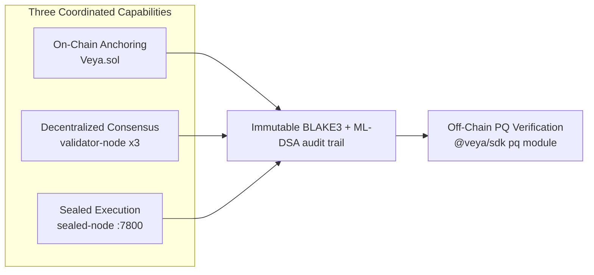

The SDK is TypeScript, ethers v6, Node 20+. Settlement is Robinhood Chain (EVM). There is no Solana client in this package, no program-derived addresses, and no SPL Memo companion path.

---

## Live Testnet Architecture State

PQ anchoring is **live on Robinhood Chain testnet**. The protocol contract is deployed and receiving writes.

| Field | Value |
|-------|-------|
| **Network** | Robinhood Chain Testnet |
| **Chain ID** | `46630` (`0xb636`) |
| **RPC** | `https://rpc.testnet.chain.robinhood.com` |
| **Explorer** | `https://explorer.testnet.chain.robinhood.com` |
| **Protocol contract** | `0x1a1Dc3c55550FCE9F70ef6cDEeF967c0b72a5d84` |
| **Contract name** | `Veya.sol` (protocol, not a token) |
| **Native currency** | ETH (18 decimals, amounts in wei) |
| **Client library** | ethers v6 (`JsonRpcProvider` + `Contract`) |
| **Algorithm** | ML-DSA-44 + Kyber-768 + BLAKE3-256 |

### Confirmed transactions

These hashes are live receipts. Open them on the Robinhood testnet explorer; they are not placeholders.

| Operation | Explorer |
|-----------|----------|
| Guest content proof (`storeCommitment`) | [0x4314faef…395d](https://explorer.testnet.chain.robinhood.com/tx/0x4314faefee6f1c635f91dd075384d4816e10abd84b9bb88e3328b51e630e395d) |
| Sealed-execution commitment | [0xd68ab196…31d8](https://explorer.testnet.chain.robinhood.com/tx/0xd68ab19671f0a3be63651cb6d6e24f5decf591da981708502827bca3689d31d8) |
| PQ / environment registration path | [0x9a00af5e…8ad4](https://explorer.testnet.chain.robinhood.com/tx/0x9a00af5ef80fdefb3734df19ad30b82aa57fa212bd493b7ad5b224a343808ad4) |

Architecture implication: hashes and environment bindings are **permanent audit evidence today**. The hosted API (`https://api.veyanet.tech`) uses a relayer that calls this SDK; operators can also sign with their own `payerPrivateKey` and never touch the API.

`EvmAnchor.ensureRobinhoodChain()` queries `eth_chainId` before every write. If the RPC returns anything other than `46630` (or the configured `chainId`), the SDK refuses to send. That is the guard against pointing this package at another EVM by accident.

---

## Threat Model

### Adversary capabilities

| Adversary | Capability | Mitigation | Residual risk |
|-----------|------------|------------|---------------|
| Quantum computer (future) | Grover speedup on hash search | BLAKE3-256 commitments (128-bit post-Grover margin) | Theoretical collision advances |
| Quantum computer (future) | Shor break of ECDSA / secp256k1 | ML-DSA-44 identity; Kyber-768 sessions | Migration window for legacy Ethereum keys used only as `msg.sender` |
| Malicious validator node | Return incorrect execution hash | 2-of-3 quorum requires matching BLAKE3 | Collusion of 2+ nodes |
| Chain observer | Read all on-chain data | Only hashes, metadata, and sealed chunks; PQ keys off-chain | Metadata leakage from events and mapping keys |
| Compromised agent | Exceed spending or invoke forbidden tools | On-chain wei caps and tool policy mappings; SDK `PolicyAgent` preflight | Off-chain execution before an anchor lands |
| Replay attacker | Re-submit old memory entries | `flagMemoryNullifier` enforces spend-once | Unanchored local memory in `~/.veya/agent-memory.json` |
| Harvest-now-decrypt-later | Record classical signatures today | PQ-first identity and BLAKE3 commitments | Pre-migration historical ECDSA receipts |
| Mis-pointed RPC | Land writes on Ethereum mainnet or another L2 | `ensureRobinhoodChain` chain-id check | Operator who disables the check in a fork |
| Hosted API compromise | Relayer key spends gas and writes rooms | SDK works without the API; guest JWT cannot drive the relayer | Relayer key remains a high-value secret when the API is used |

### Trust assumptions

| Assumption | Rationale |
|------------|-----------|
| Robinhood Chain consensus is honest-majority | Standard L1 / app-chain security model for chain ID 46630 |
| At least 2 of 3 validators are honest | Byzantine quorum design |
| Operator secures ML-DSA secret keys | Keys never stored in `Veya.sol` |
| Off-chain verifiers run `@noble/post-quantum` + `hash-wasm` correctly | SDK supply chain |
| `eth_chainId` from the configured RPC is truthful | Operators must not pin a lying proxy |

### Out of scope (v1)

- On-chain ML-DSA verification inside the EVM
- Encrypted mempool or private Robinhood Chain transactions
- Cross-chain bridging of VEYA state
- A token, mint, or ERC-20 wrapper around `Veya.sol`
- Full TFHE / FHE compute (sealed path today is AES-256-GCM + BLAKE3 + ML-DSA)
- SHA-256 on new SDK commitment paths (Use-mode browser content proofs may hash with SHA-256 for preview; the SDK commitment primitive is BLAKE3)

---

## Architectural Design Philosophy

VEYA inverts the traditional agent-platform model. Security boundaries execute **locally** and **on-chain** rather than exclusively through a trusted remote API. The hosted API is a convenience relayer, not the cryptographic root.

### 1. Post-quantum audit artifacts on Robinhood Chain

Every critical state transition maps to a **BLAKE3-256** digest stored as `bytes32`. ML-DSA-44 detached signatures bind operator intent to those digests. `Veya.sol` mappings and events store immutable evidence: verifiable decades later even if secp256k1 is broken. Ethereum ECDSA still authenticates `msg.sender` for authorization; PQ signatures authenticate **agent identity and execution content**.

### 2. Off-chain verification, on-chain anchoring

| Operation | Where it runs | What lands on-chain |
|-----------|---------------|---------------------|
| ML-DSA sign/verify | SDK `pq` module, auditor tooling | Signature bytes in `Attestation.mldsaSig` (optional; hosted relayer often stores the digest only) |
| Kyber encaps/decaps | SDK coordination transport | Never on-chain |
| BLAKE3 commitment | Every layer | `bytes32` in mappings / events |
| Quorum agreement | 3 validator nodes | Agreed hash → `attestExecution` or `storeCommitment` |
| Chain-id guard | `EvmAnchor.ensureRobinhoodChain` | No write if RPC is not 46630 |

### 3. Environment isolation with policy enforcement

Agents operate inside **typed environments** (`Execution` = 0, `SecureEnclave` = 1, `Governance` = 2). On-chain mappings enforce spending limits in **wei**, tool policy ACLs, and memory nullifiers: spend-once semantics without a central policy server as the sole enforcer. The SDK `PolicyAgent` and `setToolPolicy` mirror those rules locally for preflight.

### 4. Hosted API is optional

```
Operator ──► @veya/sdk (VeyaClient / EvmAnchor)
                │
    ┌───────────┼───────────┬──────────────────┐
    ▼           ▼           ▼                  ▼
~/.veya      validators   sealed-node     Robinhood RPC
memory JSON  :7701-7703   :7800 /protected Veya.sol
```

Data does not have to flow through `https://api.veyanet.tech`. Validators agree on BLAKE3 execution hashes. The contract anchors commitments. Auditors verify ML-DSA signatures off-chain. When the API **is** used, it calls the same exports (`runConsensus`, `protectedExec`, `EvmAnchor`) so the hosted path is not a second protocol.

---

## Layered Architecture

```
+-------------------------------------------------------------------------+
|                    Application / Agent Layer                            |
|         (MCP tools, agent runtimes, robinhood/utility dashboard)        |
+---------------------------------+---------------------------------------+
                                  |
+---------------------------------v---------------------------------------+
|                         Integration Layer                               |
|   @veya/sdk (VeyaClient)  |  https://api.veyanet.tech (optional HTTP API)     |
+----------+--------------------------+------------------+----------------+
           |                          |                  |
+----------v----------+  +------------v------------+  +--v----------------+
|  pq/                |  |  compute/consensus.ts   |  |  sealed/          |
|  ML-DSA, Kyber,     |  |  2-of-3 quorum client   |  |  protectedExec    |
|  BLAKE3             |  |  POST /execute          |  |  POST /protected  |
+----------+----------+  +------------+------------+  +--+----------------+
           |                          |                  |
+----------v--------------------------v------------------v----------------+
|              Local persistence (~/.veya/agent-memory.json)              |
|                    environments, agents, memory entries                 |
+---------------------------------+---------------------------------------+
                                  |
+---------------------------------v---------------------------------------+
|              Robinhood Chain: Veya.sol (10 functions)                  |
|   Environment | Agent | Attestation | PqAttestation | Commitment        |
|   SpendingLimit | ToolPolicy | Nullifier | SealedState                  |
+-------------------------------------------------------------------------+
```

Each layer depends only on layers below it. `VeyaClient` constructed without `payerPrivateKey` still hashes, runs consensus, and calls sealed-node. Writes require a funded key and a matching chain id.

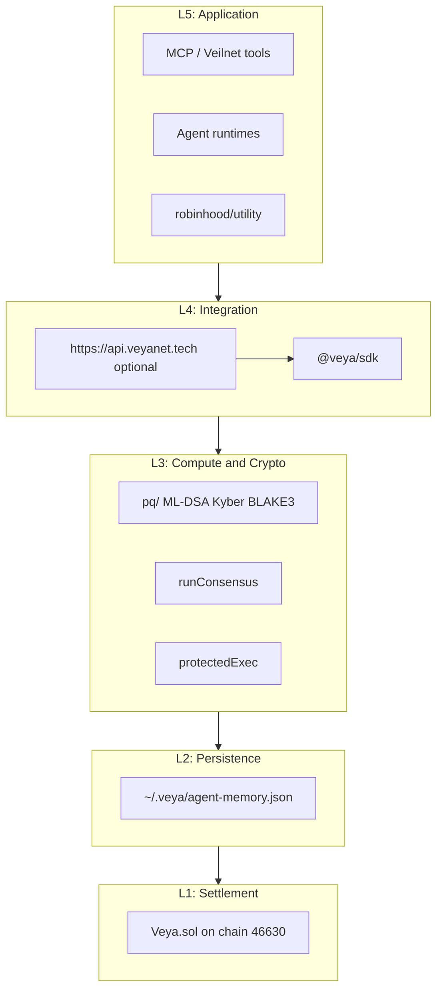

---

## High-Level System Data Flow

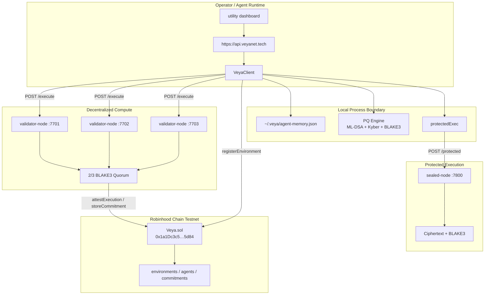

---

## Component Inventory

### `Veya.sol`

The on-chain contract exposes exactly **10 write functions** (ABI names are Solidity camelCase; `INSTRUCTION_NAMES` in `src/program/instructions.ts` is the canonical list):

| # | Function | Primary mapping | Purpose |
|---|----------|-----------------|---------|
| 1 | `registerEnvironment` | `environments[uuid]` | Create environment with PQ pubkey hash |
| 2 | `registerAgent` | `agents[agentUuid]` | Register agent under environment |
| 3 | `attestExecution` | `attestations[keccak256(authority, hash)]` | Anchor BLAKE3 hash + ML-DSA sig bytes |
| 4 | `anchorPqAttestation` | `pqAttestations[executionHash]` | Link identity hash to execution hash |
| 5 | `storeCommitment` | `commitments[commitment]` | Store standalone BLAKE3 commitment |
| 6 | `initSpendingLimit` | `spendingLimits[agentUuid]` | Configure per-agent wei cap |
| 7 | `recordSpend` | (mutates limit) | Increment spent counter with period rollover |
| 8 | `defineToolPolicy` | `toolPolicies[keccak256(agent, tool)]` | ACL for MCP tool invocation |
| 9 | `flagMemoryNullifier` | `nullifiers[memoryId]` | Mark memory entry as consumed |
| 10 | `storeSealedState` | `sealedStates[keccak256(env, state, idx)]` | Store sealed ciphertext chunk |

Contract address: `0x1a1Dc3c55550FCE9F70ef6cDEeF967c0b72a5d84` on chain 46630.

### TypeScript modules (`src`)

| Module | Responsibility |
|--------|----------------|
| `client/VeyaClient.ts` | Facade: PQ, anchoring, consensus, sealed |
| `client/evm.ts` | `EvmAnchor`: ethers v6 writes + chain-id guard |
| `chain.ts` | `ROBINHOOD_TESTNET` constants, explorer URL helpers |
| `config.ts` | `resolveConfig`: env vars and defaults |
| `abi/` | Compiled `VEYA_ABI` + `VEYA_BYTECODE` inlined |
| `pq/` | ML-DSA-44, Kyber-768, BLAKE3 via `@noble/post-quantum` and `hash-wasm` |
| `compute/consensus.ts` | `runConsensus`: HTTP fan-out, threshold 2 |
| `sealed/protectedExec.ts` | sealed-node HTTP client |
| `coordination/` | MCP policy, Kyber sessions, `PolicyAgent` |
| `memory/` | Local BLAKE3-scoped nullifiers |
| `spending/limits.ts` | Local wei cap preflight |
| `errors/veya-error.ts` | `VeyaSdkError` + Solidity selector mapping |
| `program/instructions.ts` | `INSTRUCTION_NAMES` camelCase list |

### Local binaries the SDK talks to

| Binary | Default bind | Endpoint |
|--------|--------------|----------|
| `validator-node` alpha | `127.0.0.1:7701` | `POST /execute` |
| `validator-node` beta | `127.0.0.1:7702` | `POST /execute` |
| `validator-node` gamma | `127.0.0.1:7703` | `POST /execute` |
| `sealed-node` | `127.0.0.1:7800` | `POST /protected` |

These processes are not bundled inside the npm tarball. The SDK is the client. Operators run the nodes beside the SDK (or let `https://api.veyanet.tech` point `VEYA_VALIDATOR_NODES` / `VEYA_SEALED_NODE_URL` at them).

---

## Component Deep Dives

### `Veya.sol` | On-chain settlement

The contract is a single deployable unit. Design constraints:

- **No EVM PQ verify**: `attestExecution` stores `mldsaSig` up to `MAX_MLDSA_SIG_LEN` (4,627 bytes) without cryptographic validation inside Solidity. Verification is the auditor's job using `@veya/sdk` `verifyPQ`.
- **Mapping keys, not PDAs**: Records are keyed by `bytes16` UUIDs, `bytes32` hashes, or `keccak256(abi.encodePacked(...))`. There is no program-derived address scheme.
- **Chunk bounds**: `storeSealedState` rejects chunks larger than `MAX_SEALED_CHUNK` (8,192 bytes).
- **Owner-scoped isolation**: Environment owner is `msg.sender` at `registerEnvironment`. Agent registration, spending-limit init, and tool policy require that owner.

Authorization always requires the environment owner (or, for `recordSpend` / `attestExecution`, any caller once the environment exists: spend and attest are intentionally not owner-only so a relayer can record). Cross-environment agent/policy mismatch returns `Unauthorized`.

Custom errors (`EnvironmentDoesNotExist`, `SpendingLimitExceeded`, `MemoryAlreadyNullified`, `SignatureTooLarge`, …) are decoded by `fromAnchorRevert` in `src/errors/veya-error.ts` using 4-byte selectors.

### `pq/` | PQ engine

Central cryptographic authority for the TypeScript package. Modules:

| Module | Primitive | NIST |
|--------|-----------|------|
| `mldsa.ts` | ML-DSA-44 (`ml_dsa44` from `@noble/post-quantum`) | FIPS 204 |
| `kyber.ts` | Kyber-768 / ML-KEM-768 | FIPS 203 |
| `blake3.ts` | BLAKE3-256 via `hash-wasm` |: |

`generatePQIdentity` returns `{ publicKey, privateKey }`. Secret material never goes on-chain. Fingerprints are `publicKeyHashBlake3(publicKey)`: 32-byte hex stored as `bytes32 pqPubkeyHash`.

Deep dive: [POST_QUANTUM.md](./POST_QUANTUM.md)

### `compute/consensus.ts` | Quorum client

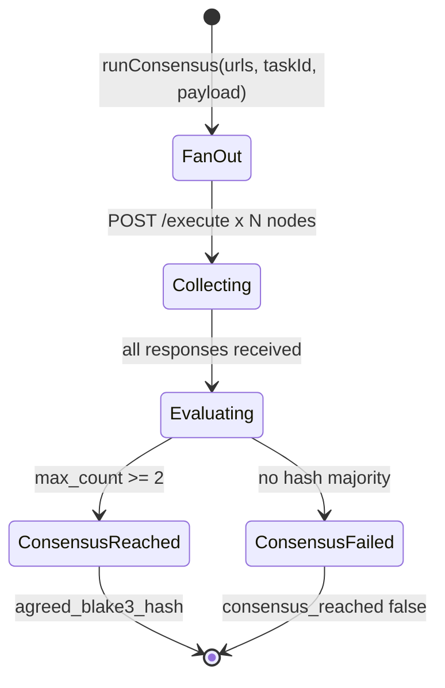

Each validator:

1. Receives `{ task_id, payload }` via HTTP
2. Canonicalizes the payload
3. Computes BLAKE3 execution hash
4. Signs the hash with the node ML-DSA identity
5. Returns `NodeResult { node_id, blake3_execution_hash, mldsa_signature, status }`

Quorum logic: `max_count >= threshold` AND `results.length >= threshold`. Default threshold is **2** with **3** nodes. The SDK does not invent a passing quorum when nodes are down.

### `sealed/protectedExec.ts` | Protected execution client

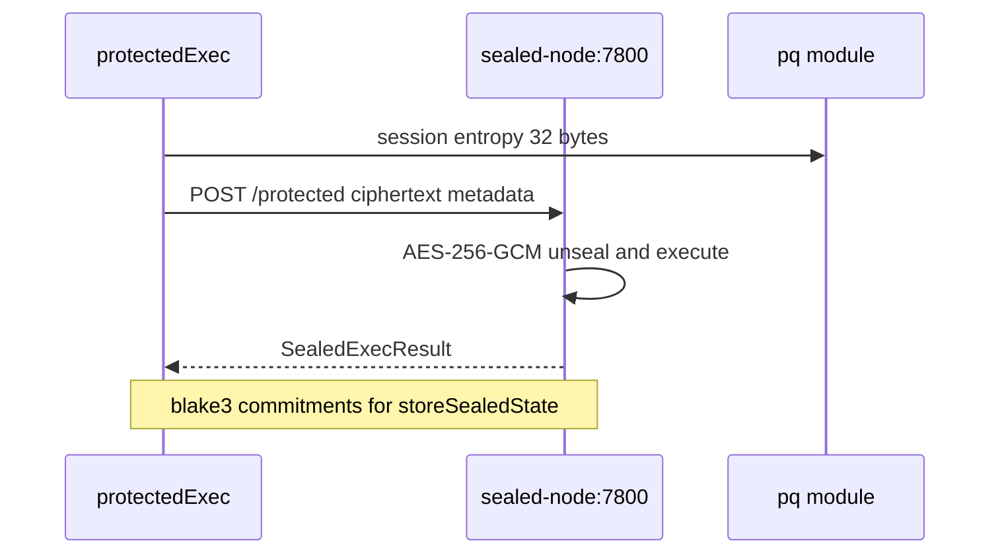

The hosted API **fails closed**: if the sealed node is unreachable, callers get an HTTP error rather than a success badge. The SDK throws `sealed-node error: <status>` on non-OK responses.

### `memory/` | Local persistence

JSON file at `~/.veya/agent-memory.json` holds scoped entries with a BLAKE3 content hash at write time. `readMemory` re-hashes before return. `invalidateMemory` soft-nullifies locally; `flagMemoryNullifier` is the on-chain counterpart. Filesystem permissions are the access-control boundary for the local file.

### `client/evm.ts` | EVM integration

`EvmAnchor` composes an ethers `JsonRpcProvider`, `Wallet`, and `Contract`. It does **not** pin `staticNetwork` so `getNetwork()` always queries `eth_chainId`. Methods map 1:1 to Solidity functions. `registerPqIdentity` is a convenience: ML-DSA keygen, `registerEnvironment`, then `storeCommitment` of the pubkey fingerprint (named `memoTx` in the return object because it is the digest-anchor companion, implemented as `storeCommitment`, not a Solana memo program).

### `https://api.veyanet.tech` | Optional hosted surface

The API depends on `"@veya/sdk": "^1.0.0"`. It uses the SDK for Veilnet tools, protected executions, and PQ attestations. The dashboard talks HTTP to the API. Integrators who do not want a hosted process skip the API entirely.

---

## Identity and Environment Model

An **environment** is the atomic isolation boundary. Each environment has:

- An EVM `owner` address (`msg.sender` at registration)
- A 128-bit `bytes16` UUID
- A BLAKE3 hash of the environment ML-DSA-44 public key (`pqPubkeyHash`)
- An `envType` discriminator: Execution (0), SecureEnclave (1), Governance (2)
- A `revision` counter and `createdAt` timestamp
- An `exists` flag (Solidity mappings cannot distinguish unset from zero without it)

**Agents** register under an environment:

| Field | Type | Purpose |
|-------|------|---------|
| `agentUuid` | `bytes16` | Stable identifier |
| `role` | `uint8` | Coordinator (0), Executor (1), Policy (2) |
| `pqHash` | `bytes32` | BLAKE3 hash of agent ML-DSA pubkey |
| `isActive` | bool | Soft-disable without deleting the mapping |
| `environmentUuid` | `bytes16` | Parent isolation boundary |

Full ML-DSA public keys never appear on-chain. Verifiers fetch keys from local store or out-of-band distribution, then confirm the BLAKE3 fingerprint matches the on-chain hash.

### Mapping derivation (EVM keys, not PDAs)

```
environments[environmentUuid]
agents[agentUuid]
attestations[keccak256(abi.encodePacked(authority, blake3Hash))]
pqAttestations[executionHash]
commitments[commitment]
spendingLimits[agentUuid]
toolPolicies[keccak256(abi.encodePacked(agentUuid, toolName))]
nullifiers[memoryId]
sealedStates[keccak256(abi.encodePacked(environmentUuid, stateId, chunkIndex))]
```

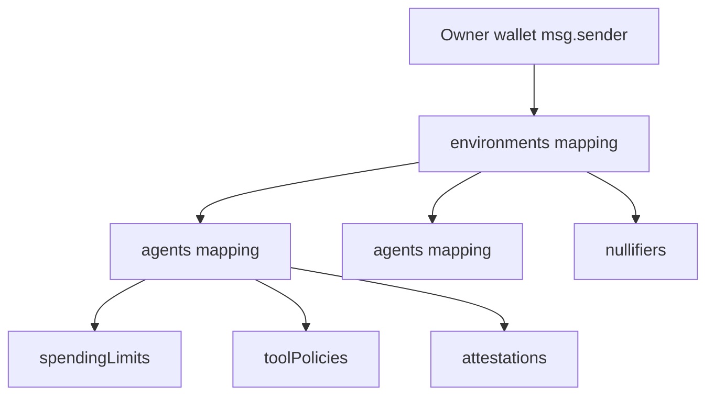

`registerPqOnchain(envType)` defaults `envType = 1` (SecureEnclave). Pass `0` or `2` explicitly for Execution or Governance.

---

## Execution Attestation Flow

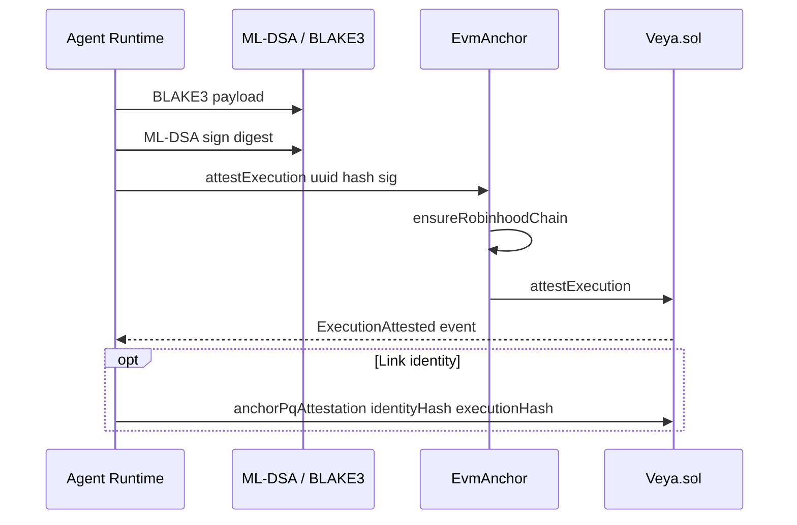

**Verification (off-chain):**

1. Fetch the transaction receipt from `https://rpc.testnet.chain.robinhood.com`
2. Confirm `receipt.to === 0x1a1Dc3c55550FCE9F70ef6cDEeF967c0b72a5d84` (not merely `status === 1`)
3. Decode `ExecutionAttested` or `CommitmentStored`
4. Load the agent ML-DSA public key from local store
5. Confirm `blake3(public_key) == pqHash` on-chain
6. Call `verifyPQ(sig, blake3HashBytes, publicKey)`
7. Optionally cross-check against consensus `agreed_blake3_hash`

The chain stores signature bytes up to 4,627 bytes but does not validate them in the EVM. The hosted relayer path often calls `storeCommitment` of the digest rather than stuffing raw ML-DSA bytes into every receipt; both paths are valid evidence if the auditor knows which one was used.

Procedures: [VERIFICATION.md](./VERIFICATION.md)

---

## Consensus Subsystem

```
                    +-------------+
                    |  VeyaClient |
                    | runConsensus|
                    +------+------+
                           | POST /execute parallel
           +---------------+---------------+
           v               v               v
    +------------+  +------------+  +------------+
    | validator  |  | validator  |  | validator  |
    | alpha:7701 |  | beta:7702  |  | gamma:7703 |
    +-----+------+  +-----+------+  +-----+------+
          |               |               |
          +---------------+---------------+
                          v
                 evaluate hashes threshold=2
                          |
                          v
              agreed_blake3_hash if consensus_reached
```

### Quorum failure modes

| Scenario | `consensus_reached` | Action |
|----------|---------------------|--------|
| All nodes agree | `true` | Proceed to attestation |
| 2-of-3 agree, 1 divergent | `true` | Investigate divergent node; proceed |
| All hashes differ | `false` | Halt settlement; inspect payloads |
| 1+ nodes unreachable | depends on remaining responses | Retry or reduce fleet; do not invent agreement |
| Node returns invalid ML-DSA sig | off-chain detect | Exclude node; do not trust that result |

Invariant: `quorum_hash == local_hash == on_chain_commitment` when an attestation is accepted. A JSON field that claims consensus without three HTTP round-trips is not this SDK.

---

## Sealed Execution Subsystem

```
SDK / VeyaClient                 sealed-node:7800
    |                              |
    |- session_entropy 32 bytes -->|
    |- environmentId, agentId      |
    |- eventType, payload          |
    |                              |- Derive session key Kyber + BLAKE3
    |                              |- AES-256-GCM
    |                              |- protected execute
    |                              +- Return SealedExecResult
    v
Optional: storeSealedState on Veya.sol for DA
```

`protectedExec` posts JSON:

```json
{
  "environment_id": "<uuid>",
  "agent_id": "<uuid>",
  "event_type": "policy_eval",
  "payload_json": "{\"rule\":\"max_spend\"}",
  "session_entropy_hex": "<64 hex chars>"
}
```

The node returns `SealedExecResult` with `output_blake3_hash`, `mldsa_signature`, `verified`, and a `sealed` object (`ciphertext`, `blake3_commitment`, `context_label`). Ciphertext stays large; the chain sees the hash (and optional chunks ≤ 8,192 bytes).

### Sealed execution failure modes

| Failure | Symptom | Recovery |
|---------|---------|----------|
| Node down | `fetch` connection refused | Restart sealed-node; retry |
| Chunk too large | `SealedChunkTooLarge` | Split into ≤8192 byte chunks |
| Key derivation mismatch | Decrypt failure off-chain | Verify Kyber material and `sessionEntropy` |
| HTTP non-OK | `sealed-node error: 503` | Treat as fail-closed; do not mark protected |
| Unauthorized environment | 403 from node | Check environment registration |

Sealed path today is AES-256-GCM + BLAKE3 + ML-DSA. Homomorphic compute is not claimed as live.

---

## Memory and Nullifiers

Scoped memory provides agent-local state with integrity guarantees.

**Off-chain (SDK `memory/nullifier.ts`):**

- `storeMemory`: BLAKE3 content hash at write time into `~/.veya/agent-memory.json`
- `readMemory`: Re-hash and compare before return; throws on integrity failure
- `invalidateMemory`: Soft nullify in the local map
- `listMemory`: Operator viewer for an environment

**On-chain (`flagMemoryNullifier`):**

- Writes `nullifiers[memoryId]` with `nullified == true`
- Second flag returns `MemoryAlreadyNullified`
- Enables cross-agent audit of consumed memory slots

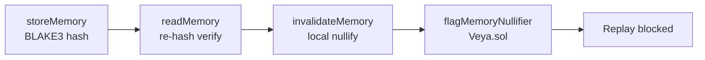

Production deployments should anchor nullifier flags after local invalidation to prevent replay across environments. The hosted API currently enforces spend in its own database and treats memory as content hashes; on-chain nullifier-gated memory is available on the contract and SDK even when a given API route has not wired it yet.

---

## Spending and Policy Enforcement

### Spending limits

SecureEnclave and Governance environments use on-chain **wei** caps (native ETH on Robinhood Chain):

| Function | Effect |
|----------|--------|
| `initSpendingLimit(agentUuid, maxAmount, periodSecs)` | One mapping entry per agent |
| `recordSpend(amount)` | Increments `spentAmount` |
| Period rollover | Resets counter when `now >= periodStart + periodSecs` |
| Overflow | Exceeds cap → `SpendingLimitExceeded` |

SDK local preflight (`setSpendingLimit`, `checkSpendAllowed`, `recordSpend` in `spending/limits.ts`) runs **before** consensus and sealed execution so an operator does not burn gas on a call that will revert. The hosted API also gates with HTTP 402 when a room's JSON cap would be exceeded. On-chain arithmetic remains authoritative for settlement disputes.

### Tool policies

MCP tool invocation is gated by `defineToolPolicy(environmentUuid, agentUuid, toolName, allowed)`:

- Mapping seeded by agent UUID + tool name (max 64 chars, `MAX_TOOL_NAME_LEN`)
- SDK `setToolPolicy` / `routeMessage` mirrors policy locally for preflight
- Deny-by-default: a tool not in the set is `denied`
- `routeSecureMessage` adds a Kyber-768 session id and an ML-DSA signature over the JSON envelope **after** policy allows
- On-chain policy is authoritative for settlement disputes

`PolicyAgent.evaluateToolCall` combines tool ACL and optional `maxWeiPerAction`.

---

## Veya.sol Contract Design

### Why off-chain PQ verification?

| Factor | On-chain verify | Off-chain verify |
|--------|-----------------|------------------|
| Gas | Prohibitive for ML-DSA lattice ops | Native speed in TypeScript / Rust nodes |
| Calldata size | 2.4–4.6 KB signatures | Full keys in local store |
| Audit permanence | Hash + optional sig bytes immutable | Verifier replays anytime |
| Upgrade path | Contract redeploy | npm bump of `@noble/post-quantum` |

### Mapping uniqueness

Several functions revert if a key already exists (`EnvironmentAlreadyExists`, `AttestationAlreadyExists`, `CommitmentAlreadyExists`, `PqAttestationAlreadyExists`). Operators must not retry the same digest as a new write; they should look up the existing record.

### Error taxonomy

| Error category | Examples |
|----------------|----------|
| Authorization | `Unauthorized`, `EnvironmentDoesNotExist` |
| Spending | `SpendingLimitExceeded`, `SpendingLimitDoesNotExist` |
| Crypto storage | `SignatureTooLarge` |
| Sealed | `SealedChunkTooLarge` |
| Memory | `MemoryAlreadyNullified` |
| Identity | `InvalidEnvironmentType`, `InvalidAgentRole` |
| Uniqueness | `CommitmentAlreadyExists`, `AttestationAlreadyExists` |

`fromAnchorRevert` maps known 4-byte selectors onto `VeyaSdkError.code` so callers branch on `SPENDING_EXCEEDED` rather than substring-matching `Error.message`.

### Events as the auditor index

Every write emits an event (`EnvironmentRegistered`, `ExecutionAttested`, `CommitmentStored`, …). Indexers and `explorerTxUrl` receipts are the primary discovery path. Mapping getters (`environments(bytes16)`, `commitments(bytes32)`, …) are the primary read path.

---

## Data Flow Diagrams

### Full agent lifecycle

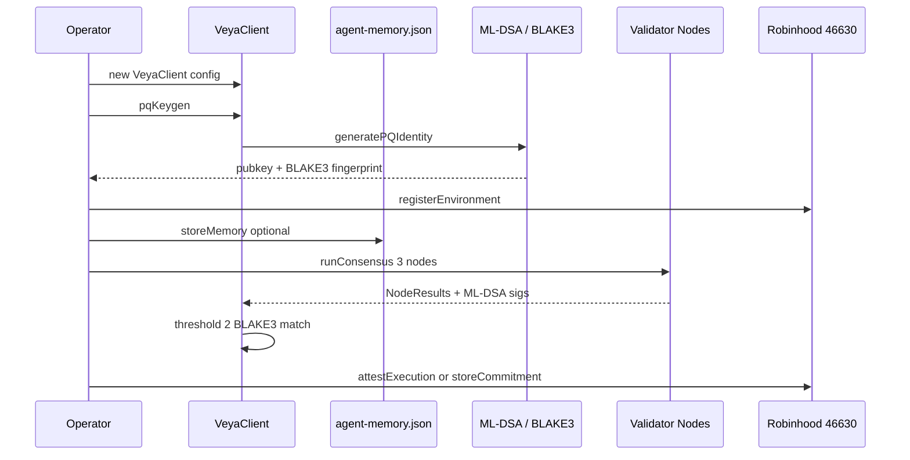

### PQ verification audit

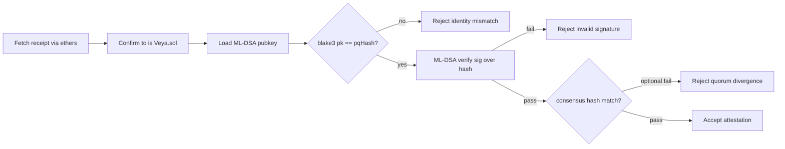

### Hosted API versus direct SDK

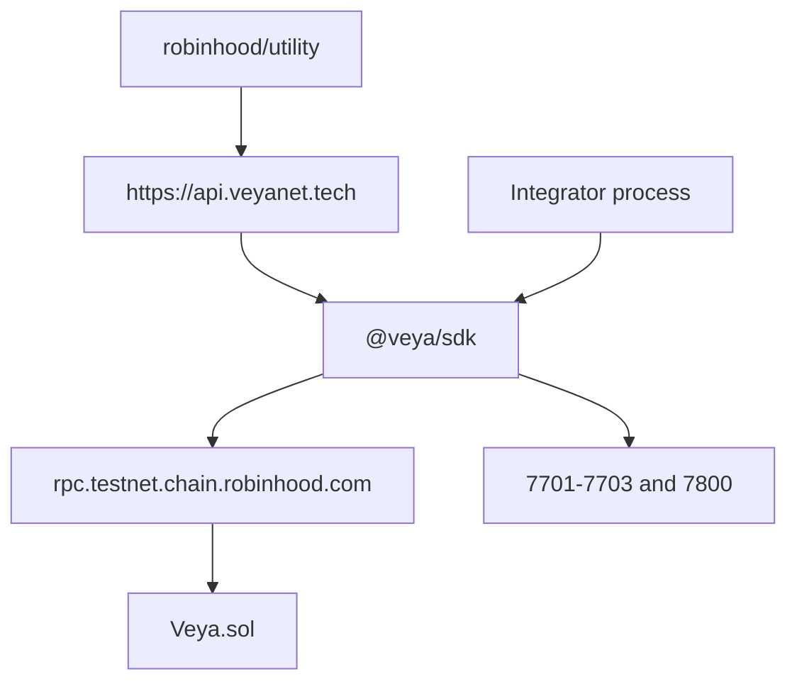

Both paths share one ABI, one chain id, and one commitment primitive.

---

## Trust Boundaries

| Boundary | Trusted party | Verification |
|----------|---------------|--------------|
| Robinhood Chain validators | Chain consensus | Standard JSON-RPC confirmation |
| Environment owner | Wallet holder | `msg.sender` on `registerEnvironment` |
| Validator nodes | Node operator | ML-DSA attestation + quorum |
| Sealed node | Node operator | Ciphertext commitment audit |
| Local store | Machine user | Filesystem permissions on `~/.veya` |
| Hosted API relayer | API operator | Guest cannot drive writes; SDK usable without API |
| RPC endpoint | RPC operator | `eth_chainId` must equal 46630 |

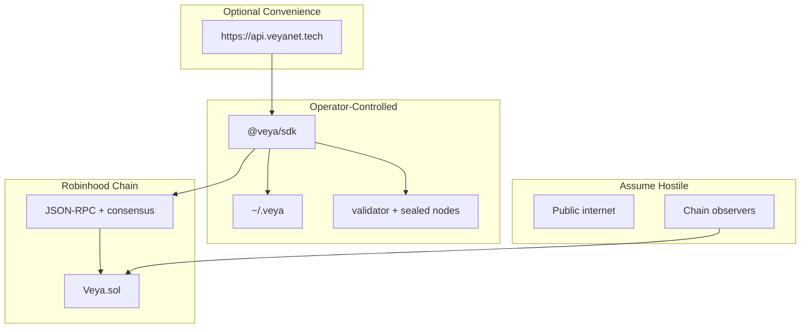

No VEYA-hosted service is **required** inside the trust boundary. When the API is present, treat the relayer key as an operator secret, not as protocol root.

---

## Storage Topology

| Data | Location | Format | Retention |
|------|----------|--------|-----------|
| Environment roster (local) | `~/.veya/agent-memory.json` | JSON | Operator-managed |
| Agent memory | same file | JSON + BLAKE3 | Operator-managed |
| PQ secret keys | Operator custody | Never on-chain | Rotate on compromise |
| Execution attestations | `Veya.sol` mappings | Solidity structs | Permanent on-chain |
| Commitments | `commitments[bytes32]` | `bytes32` + timestamp | Permanent on-chain |
| Sealed ciphertext | mappings + sealed-node | Binary chunks ≤8192 B | Permanent + ephemeral |
| Consensus results | SDK return value / API row | JSON `NodeResult[]` | Match attestation retention |
| Live receipts | Explorer + RPC | Transaction hash | Permanent |

---

## Cryptographic Profile

| Operation | Algorithm | Standard |
|-----------|-----------|----------|
| Identity signatures | ML-DSA-44 | NIST FIPS 204 |
| Session KEM | Kyber-768 (ML-KEM-768) | NIST FIPS 203 |
| Commitments | BLAKE3-256 | Grover-resistant margin |
| Sealed payload encryption | AES-256-GCM | NIST SP 800-38D |
| Transaction authorization | secp256k1 ECDSA | Ethereum `msg.sender` |
| Node attestations | ML-DSA-44 over BLAKE3 | validator-node |

Ethereum ECDSA authorizes **who paid gas**. ML-DSA authorizes **which agent identity bound which digest**. Mixing those two is a design feature, not a contradiction.

Deep dive: [POST_QUANTUM.md](./POST_QUANTUM.md)

---

## Operational Deployment Patterns

### Local development

1. `npm install && npm run build`
2. Start three `validator-node` instances on ports 7701–7703
3. Start one `sealed-node` on port 7800
4. Construct `VeyaClient` with default `validatorNodes` and `sealedNodeUrl`
5. Hash and run consensus without a private key
6. For writes, set `VEYA_DEPLOYER_PRIVATE_KEY` to a funded testnet wallet

### Testnet anchoring (live today)

```bash
export ROBINHOOD_RPC_URL="https://rpc.testnet.chain.robinhood.com"
export ROBINHOOD_CHAIN_ID=46630
export VEYA_CONTRACT_ADDRESS="0x1a1Dc3c55550FCE9F70ef6cDEeF967c0b72a5d84"
export VEYA_DEPLOYER_PRIVATE_KEY="0x..."   # funded; never commit
```

```typescript
const client = new VeyaClient({ payerPrivateKey: process.env.VEYA_DEPLOYER_PRIVATE_KEY });
const result = await client.registerPqOnchain(1);
console.log(result.explorer.environment, result.explorer.memo);
```

### Production considerations

- Keep `ensureRobinhoodChain` enabled
- Run validator nodes on separate hosts
- HSM or enclave custody for ML-DSA secret keys
- Monitor `revision` on environments for policy drift
- Archive receipts (`to` must be Veya.sol) for compliance retention
- Treat the hosted relayer key as production infrastructure, not as a shared demo wallet
- Fund the payer in **ETH wei** on chain 46630; there is no airdrop helper inside this SDK

### Hosted API pattern

`https://api.veyanet.tech` sets `VEYA_VALIDATOR_NODES` and `VEYA_SEALED_NODE_URL`, imports `@veya/sdk`, and relays `storeCommitment` when a room has a 16-byte environment id. Guest JWT cannot create environments or drive the relayer. Direct SDK users skip this pattern.

---

## Failure Modes and Recovery

### Consensus failures

| Failure | Symptom | Root cause | Recovery |
|---------|---------|------------|----------|
| Quorum not reached | `consensus_reached: false` | Divergent hashes or node outage | Retry with healthy nodes; compare per-node hashes |
| Node timeout | Partial `node_results` | Network or overloaded node | Increase timeout; restart node |
| Invalid node signature | Off-chain verify fails | Compromised or misconfigured node | Exclude node; rotate node ML-DSA key |
| Payload canonicalization drift | All hashes differ | JSON key ordering mismatch | Stable serialize; same object on all nodes |

### On-chain failures

| Failure | Symptom | Recovery |
|---------|---------|----------|
| Signature too large | `SignatureTooLarge` | Use ML-DSA-44; sign BLAKE3 digest not raw payload |
| Spending cap hit | `SpendingLimitExceeded` | Wait for period rollover or raise cap via owner |
| Memory already nullified | `MemoryAlreadyNullified` | Allocate new `memoryId` |
| Sealed chunk oversized | `SealedChunkTooLarge` | Split ciphertext into ≤8192 byte chunks |
| Unauthorized signer | `Unauthorized` | Verify environment owner |
| Wrong chain | SDK throws expected-chain-id error | Point RPC at Robinhood testnet 46630 |
| Duplicate commitment | `CommitmentAlreadyExists` | Read existing mapping; do not retry same digest |
| `eth_estimateGas` revert | Preflight fails | Decode custom error; check environment exists |

### Infrastructure failures

| Failure | Symptom | Recovery |
|---------|---------|----------|
| RPC unavailable | SDK transaction timeout | Failover RPC; resubmit with fresh nonce |
| Local memory file locked | Write error | Close concurrent processes using `~/.veya` |
| sealed-node crash | HTTP 502 / connection reset | Restart daemon; check logs |
| Insufficient ETH | `INSUFFICIENT_FUNDS` | Fund the payer on chain 46630 |
| Relayer drained | API 503 on commit | Fund relayer; or sign with operator key via SDK |

### Cryptographic failures

| Failure | Symptom | Recovery |
|---------|---------|----------|
| PQ verify failed | `verifyPQ` returns false | Ensure signature covers 32-byte BLAKE3 hash |
| Identity mismatch | `blake3(pk) != on_chain_hash` | Re-register agent or load correct pubkey |
| Kyber decaps failure | Shared secrets diverge | Re-encapsulate; verify keypair match |

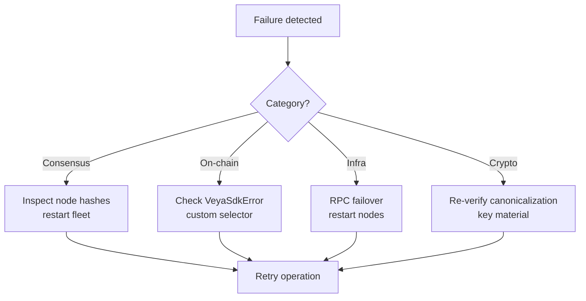

---

## Observability and Audit

| Signal | Source | Use |
|--------|--------|-----|
| Transaction hashes | RPC / explorer | Immutable audit trail |
| `explorerTxUrl(hash)` | SDK helper | Operator-facing links |
| Validator logs | `validator-node` stderr | Quorum divergence diagnosis |
| `revision` on Environment | On-chain | Policy drift detection |
| `VeyaSdkError.code` | SDK | Machine-readable failure class |
| Live receipts | Listed above | Regression baseline |

Audit checklist:

1. Confirm receipt `to` equals `0x1a1Dc3c55550FCE9F70ef6cDEeF967c0b72a5d84`
2. Confirm `status === 1` and logs decode to the expected event
3. Verify BLAKE3 digest matches off-chain recomputation
4. Verify ML-DSA signature over digest when sig bytes are present
5. Cross-check consensus quorum hash if applicable
6. Archive transaction hash, block number, and `block.timestamp`

Procedures: [VERIFICATION.md](./VERIFICATION.md)

---

## Extension Points

| Extension | Location | Status |
|-----------|----------|--------|
| Additional environment types | `EnvironmentType` enum | Requires contract migration |
| Hosted relayer `attestExecution` with raw ML-DSA bytes | API + `EvmAnchor` | Contract and SDK ready; relayer often uses `storeCommitment` |
| On-chain PQ verify | Future precompile research | Out of scope v1 |
| Cross-environment policy | Composite keys | Not in v1 |
| TFHE homomorphic ops | sealed-node | Not claimed as live |

Do not invent a token address, a second protocol contract, or a Solana companion program as an extension of this SDK.

---

## Invariants

The following statements are true of a correctly configured `@veya/sdk` deployment. An auditor who finds a counterexample should reject the deployment, not patch the docs.

1. **Chain identity.** Every successful `EvmAnchor` write was preceded by `eth_chainId == 46630` (or the explicitly configured `chainId`).
2. **Contract identity.** Every settlement receipt’s `to` field is `0x1a1Dc3c55550FCE9F70ef6cDEeF967c0b72a5d84`. A transfer of ETH to another address is not a VEYA proof.
3. **No token.** `Veya.sol` does not implement ERC-20. There is no token address to document.
4. **Commitment algorithm.** New SDK commitment paths hash with BLAKE3-256. The digest is 32 bytes / 64 hex chars.
5. **Identity algorithm.** Agent and validator identity is ML-DSA-44. Ethereum ECDSA is only `msg.sender`.
6. **Quorum.** `consensus_reached` is true only when at least two live `/execute` responses share a BLAKE3 hash.
7. **Sealed fail-closed.** A protected execution that did not reach `:7800` is an error, not a success with empty ciphertext.
8. **Environment binding.** A commitment is stored under a `bytes16` environment UUID that already exists. Global junk-drawer hashes are not the product.
9. **Spend units.** Caps are wei of native ETH on Robinhood Chain.
10. **Hosted API optional.** All of the above hold when the caller never starts `https://api.veyanet.tech`.

---

## Glossary

| Term | Definition |
|------|------------|
| **Anchor** | A `Veya.sol` write that stores VEYA settlement state on Robinhood Chain |
| **Attestation** | BLAKE3 execution commitment optionally accompanied by ML-DSA sig bytes |
| **Environment** | Isolation boundary for agents, memory, and policies (`bytes16` UUID) |
| **EvmAnchor** | SDK class that submits ethers v6 transactions after a chain-id check |
| **Nullifier** | On-chain flag marking a memory entry as consumed |
| **PQ** | Post-quantum: algorithms resistant to Shor/Grover attacks |
| **Quorum** | Minimum agreeing validator count (default 2 of 3) |
| **Relayer** | Optional `https://api.veyanet.tech` wallet that pays gas using this SDK |
| **Sealed execution** | AES-encrypted payload processing with commitment output |
| **Veya.sol** | Protocol contract at `0x1a1Dc3c55550FCE9F70ef6cDEeF967c0b72a5d84`: not a token |
| **Wei** | 1e-18 ETH; unit of `initSpendingLimit` / `recordSpend` |
| **Chain ID 46630** | Robinhood Chain Testnet |

---

<div align="center">

*Cryptographic primitives: [POST_QUANTUM.md](./POST_QUANTUM.md) • Operator tutorial: [QUICKSTART.md](./QUICKSTART.md) • Auditor procedures: [VERIFICATION.md](./VERIFICATION.md)*

</div>
