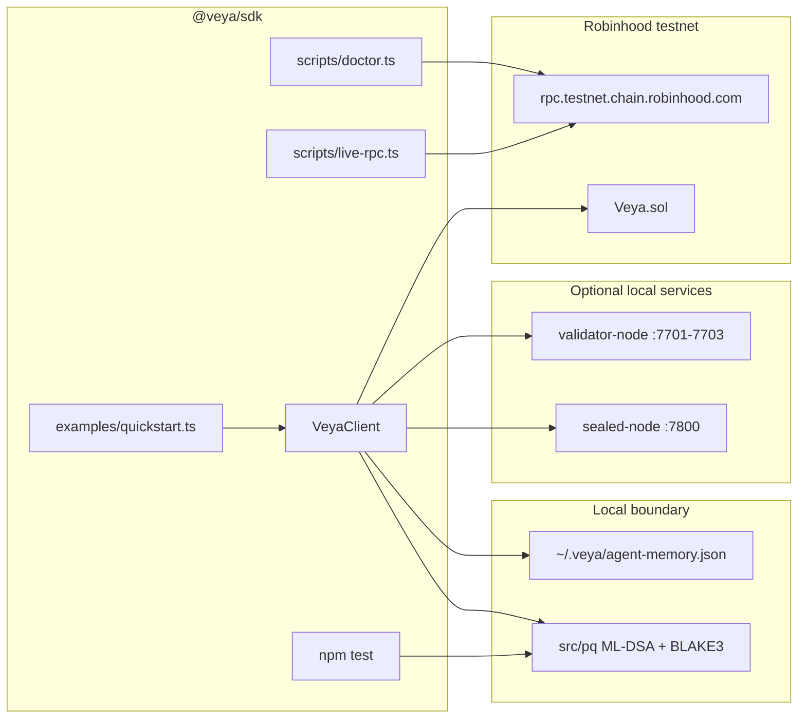
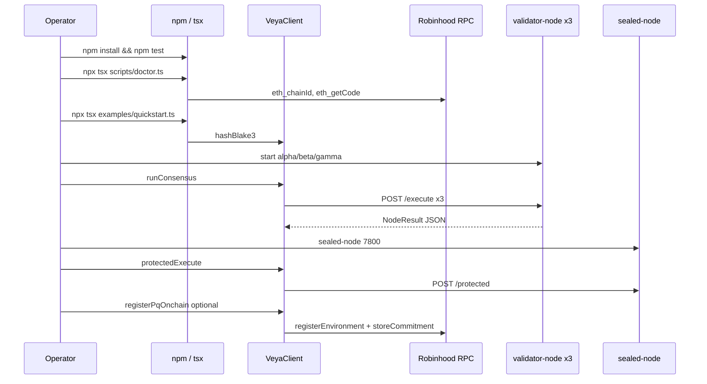

# Operator Surface | Node and `@veya/sdk`

**Post-quantum operator interface for the VEYA TypeScript SDK on Robinhood Chain.**

This package (`@veya/sdk`, path `@veya/sdk`) is a **TypeScript library**, not a Rust CLI. Operators drive it from Node: `npm test`, `examples/quickstart.ts`, `scripts/doctor.ts`, `scripts/live-rpc.ts`, and small `tsx` programs that construct `VeyaClient` / `EvmAnchor`. JSON-RPC settlement is **Veya.sol** on chain id **46630**. Local consensus uses validator HTTP on ports **7701–7703**. Sealed execution uses port **7800**.

The optional binary `veya` (`veya-cli`) lives in **`cli`**. Use it if you want SQLite-backed `veya env create` from a Rust install. It is **not** shipped in this npm package. HTTP contracts (`POST /execute`, `POST /protected`) match, so Node `runConsensus` / `protectedExec` are the SDK equivalents of those CLI subcommands.

| Field | Value |
|-------|-------|
| **Package** | `@veya/sdk` |
| **Version** | 1.0.0 |
| **Runtime** | Node.js 20+ |
| **Crypto** | ML-DSA-44, Kyber-768, BLAKE3-256 |
| **Chain** | Robinhood Chain testnet `46630` |
| **Writes** | ethers v6 → Veya.sol (not ERC-20) |

**Related:** [README.md](./README.md) • [DEPLOYMENT.md](./DEPLOYMENT.md) • [api/types-reference.md](./api/types-reference.md) • [../README.md](../README.md)

---

## Table of Contents

1. [Installation](#installation)
2. [Global Behavior](#global-behavior)
3. [Command Tree](#command-tree)
4. [Operator Workflow](#operator-workflow)
5. [npm scripts](#npm-scripts)
6. [examples/quickstart.ts](#examplesquickstartts)
7. [scripts/doctor.ts](#scriptsdoctorts)
8. [scripts/live-rpc.ts](#scriptslive-rpts)
9. [Programmatic VeyaClient](#programmatic-veyaclient)
10. [Consensus from Node](#consensus-from-node)
11. [Sealed execution from Node](#sealed-execution-from-node)
12. [On-chain writes from Node](#on-chain-writes-from-node)
13. [JSON shapes](#json-shapes)
14. [Exit Codes](#exit-codes)
15. [Environment Variables](#environment-variables)
16. [Shell Integration](#shell-integration)
17. [Relationship to veya-cli](#relationship-to-veya-cli)
18. [Troubleshooting](#troubleshooting)
19. [Security Notes](#security-notes)
20. [See Also](#see-also)

---

## Installation

### From this repository (recommended)

```bash
npm install
npm test
npm run build
```

The hosted API consumes the package as `"@veya/sdk": "^1.0.0"`. After `npm run build`, `dist/` is what Node resolves.

### Run examples without a global install

```bash
npm install
npx tsx examples/quickstart.ts
npx tsx scripts/doctor.ts
npx tsx scripts/live-rpc.ts
```

`tsx` executes TypeScript against `src/` using the package’s `type: module` layout.

### Consume from another Node app

```ts
import {
  VeyaClient,
  EvmAnchor,
  ROBINHOOD_TESTNET,
  runConsensus,
  protectedExec,
  pq,
} from "@veya/sdk";
```

```ts
import * as pq from "@veya/sdk/pq";
```

---

## Global Behavior

| Property | Behavior |
|----------|----------|
| **Stdout** | Scripts print JSON or structured `console.log` objects |
| **Stderr** | Node errors, ethers revert reasons |
| **Config files** | SDK does **not** load `.env` automatically: export vars in the shell or pass `VeyaClientConfig` |
| **Persistence** | `~/.veya/agent-memory.json` for `storeMemory` |
| **PQ primitives** | `@noble/post-quantum` ML-DSA-44 / ML-KEM-768; BLAKE3 via `hash-wasm` |
| **Writes** | Only if `payerPrivateKey` / `VEYA_DEPLOYER_PRIVATE_KEY` is set |
| **Chain guard** | `EvmAnchor.ensureRobinhoodChain()` before the first send |



---

## Command Tree

```
@veya/sdk
├── npm test              vitest: PQ + chain constants + ABI camelCase
├── npm run build         tsup ESM + CJS + dts
├── npm run lint          tsc --noEmit
├── examples/
│   └── quickstart.ts     hash locally; print resolved testnet targets
└── scripts/
    ├── doctor.ts         RPC, chain id, code-at-address, env completeness
    └── live-rpc.ts       live eth_chainId / eth_getCode / optional view
```

There is no `veya` binary in this folder. Node **is** the operator shell.

---

## Operator Workflow

Canonical path from cold start to consensus + optional chain write:



---

## npm scripts

Defined in `package.json`:

| Script | Command | When to run |
|--------|---------|-------------|
| `test` | `vitest run` | Every change to `src/` |
| `build` | `tsup` | Before API restart / publish |
| `lint` | `tsc --noEmit` | CI and pre-push |

### `npm test`

Coverage that **must** stay green:

1. `src/pq/pq.test.ts`: BLAKE3 determinism (64 hex chars); ML-DSA sign/verify round-trip
2. `src/chain.test.ts`: `ROBINHOOD_TESTNET.chainId === 46630`; contract address pin; explorer URL host; `resolveConfig` defaults; `INSTRUCTION_NAMES` present on `VEYA_ABI`; snake_case `register_environment` **absent**

Live RPC writes are **not** in `npm test`. CI must not require `VEYA_DEPLOYER_PRIVATE_KEY`.

```bash
npm install
npm test
```

Expected: vitest summary with passing files. A failure on chain-id means someone edited `src/chain.ts` away from Robinhood testnet. A failure on ABI names means `src/abi/Veya.json` drifted from `INSTRUCTION_NAMES`.

### `npm run build`

Emits `dist/index.js`, `dist/index.cjs`, `dist/index.d.ts`, and `dist/pq/*`. Dual package exports:

```
"."     types + import + require
"./pq"  PQ subpath
```

### `npm run lint`

`tsc --noEmit` using `tsconfig.json`. Catches export mismatches before runtime.

---

## examples/quickstart.ts

Minimal SDK usage: hash locally, then print default Robinhood targets.

```bash
npm install
npx tsx examples/quickstart.ts
```

**Behavior:**

1. `new VeyaClient()` with no key
2. `hashBlake3("veya-sdk-quickstart " + ISO timestamp)`
3. `resolveConfig()` for rpc / contract / chainId
4. Logs `{ chain, chainId, rpc, contract, blake3, evmReady }`

**Does not** send a transaction. `evmReady` is true only if `VEYA_DEPLOYER_PRIVATE_KEY` is already in the environment.

**Typical stdout fields:**

| Field | Example |
|-------|---------|
| `chain` | `Robinhood Chain Testnet` |
| `chainId` | `46630` |
| `rpc` | `https://rpc.testnet.chain.robinhood.com` |
| `contract` | `0x1a1Dc3c55550FCE9F70ef6cDEeF967c0b72a5d84` |
| `blake3` | 64 hex chars |
| `evmReady` | `false` unless a payer key is set |

Use this as a first check after `npm install`. If it throws on WASM/hash-wasm, the Node version is too old or the install is incomplete.

---

## scripts/doctor.ts

Operator connectivity and configuration check. Run before any live write.

```bash
npx tsx scripts/doctor.ts
```

**Purpose:** Fail closed when the workstation cannot honestly talk to Robinhood Chain testnet or when required env vars for the intended mode are missing.

### Checks (in order)

1. **Node version**: `process.versions.node` major ≥ 20
2. **Resolved config**: `resolveConfig()`; print rpc, chainId, contract, explorer, validator list, sealed URL; redact payer key (present/absent only)
3. **`eth_chainId`**: JSON-RPC against `cfg.rpcUrl`; must equal `BigInt(cfg.chainId)` (default `46630` / `0xb636`)
4. **`eth_getCode`**: at `cfg.contractAddress`; must be non-empty bytecode (not `0x`)
5. **Validator origins**: optional TCP/HTTP probe of each `validatorNodes` URL (warn if down; do not fail doctor if you only needed RPC)
6. **Sealed origin**: optional probe of `sealedNodeUrl` (same policy)
7. **Payer**: if `VEYA_DEPLOYER_PRIVATE_KEY` is set, derive address with `ethers.Wallet` and print **address only**; optionally `eth_getBalance`

### Suggested JSON result

```json
{
  "ok": true,
  "node": "20.19.0",
  "chainId": 46630,
  "rpc": "https://rpc.testnet.chain.robinhood.com",
  "contract": "0x1a1Dc3c55550FCE9F70ef6cDEeF967c0b72a5d84",
  "codeBytes": 12345,
  "payerConfigured": false,
  "validators": [
    { "url": "http://127.0.0.1:7701", "reachable": true },
    { "url": "http://127.0.0.1:7702", "reachable": true },
    { "url": "http://127.0.0.1:7703", "reachable": true }
  ],
  "sealed": { "url": "http://127.0.0.1:7800", "reachable": true }
}
```

Exact field names may match the script’s `console.log`. Treat `ok: false` as exit code 1.

### Failure modes

| Symptom | Meaning |
|---------|---------|
| chain id mismatch | `ROBINHOOD_RPC_URL` points at another EVM |
| empty code | Wrong `VEYA_CONTRACT_ADDRESS` or RPC is not Robinhood testnet |
| fetch error | Network / DNS / TLS to RPC |
| payer configured but balance 0 | Writes will revert on gas |

Doctor must **never** print the private key. Redact hex that looks like 64-nibble secrets if they appear in argv.

---

## scripts/live-rpc.ts

Live JSON-RPC probe against Robinhood Chain. Complements doctor with raw method traces useful in tickets.

```bash
npx tsx scripts/live-rpc.ts
```

**Purpose:** Prove the public testnet endpoint answers `eth_chainId` and that Veya.sol has code, without constructing `EvmAnchor` or spending gas.

### Methods

| JSON-RPC method | Params | Expect |
|-----------------|--------|--------|
| `eth_chainId` | `[]` | `0xb636` |
| `eth_blockNumber` | `[]` | advancing hex |
| `eth_getCode` | `[VEYA_CONTRACT_ADDRESS, "latest"]` | bytecode |
| `eth_call` (optional) | `MAX_MLDSA_SIG_LEN()` | `4627` |

Optional second mode when `VEYA_DEPLOYER_PRIVATE_KEY` is set: `eth_getBalance` of the derived address. Still **no** `eth_sendRawTransaction`.

### Example operator session

```bash
export ROBINHOOD_RPC_URL=https://rpc.testnet.chain.robinhood.com
export VEYA_CONTRACT_ADDRESS=0x1a1Dc3c55550FCE9F70ef6cDEeF967c0b72a5d84
npx tsx scripts/live-rpc.ts
```

Stdout should include explorer links built with `explorerAddressUrl` / `explorerTxUrl` helpers so a human can click through.

### When to use live-rpc vs doctor

| Script | Audience |
|--------|----------|
| `doctor.ts` | Pre-flight: config + fleet + key presence |
| `live-rpc.ts` | RPC-only proof; debugging a bad endpoint |

Both belong in an operator runbook before `registerPqOnchain`.

---

## Programmatic VeyaClient

The primary “CLI” is a few lines of TypeScript.

### Hash only

```typescript
import { VeyaClient } from "@veya/sdk";

const client = new VeyaClient();
const digest = await client.hashBlake3("treasury vote");
console.log(digest);
```

### PQ keygen (no chain)

```typescript
const { publicKey, privateKey } = await client.pqKeygen();
const fp = await client.hashBlake3(publicKey);
console.log(fp);
// keep privateKey in memory / vault: do not log
```

### Full registration (funded)

```typescript
const client = new VeyaClient({
  payerPrivateKey: process.env.VEYA_DEPLOYER_PRIVATE_KEY!,
});
const out = await client.registerPqOnchain(1);
console.log(out.explorer.environment);
console.log(out.explorer.memo);
```

`envType` `1` is `SecureEnclave`. Use `0` Execution or `2` Governance when that is the workspace class.

Run ad-hoc files with:

```bash
npx tsx path/to/operator-script.ts
```

---

## Consensus from Node

```typescript
import { VeyaClient } from "@veya/sdk";

const client = new VeyaClient({
  validatorNodes: [
    "http://127.0.0.1:7701",
    "http://127.0.0.1:7702",
    "http://127.0.0.1:7703",
  ],
});

const result = await client.runConsensus("rebalance-42", {
  pool: "ETH-USD",
  bps: 50,
});

if (!result.consensus_reached) {
  process.exit(1);
}
console.log(result.agreed_blake3_hash);
```

### Prerequisites

Start three validator processes on 7701–7703 (VEYA node runtime, not this npm package). Health:

```bash
curl -s -X POST http://127.0.0.1:7701/execute \
  -H "Content-Type: application/json" \
  -d '{"task_id":"health","payload":{}}'
```

### `ConsensusResult` fields

| Field | Type | Description |
|-------|------|-------------|
| `task_id` | string | Echo of the task id |
| `consensus_reached` | boolean | ≥2 matching success hashes |
| `agreed_blake3_hash` | string \| null | Hex digest when quorum met |
| `node_results` | array | Per-node `NodeResult` |
| `threshold` | number | `2` |

Equivalent Rust CLI (external package): `veya consensus run --task-id ... --payload ...` in `cli`. Same HTTP body `{ task_id, payload }`.

---

## Sealed execution from Node

```typescript
import { randomBytes } from "node:crypto";
import { VeyaClient } from "@veya/sdk";

const client = new VeyaClient({
  sealedNodeUrl: "http://127.0.0.1:7800",
});

const sealed = await client.protectedExecute({
  environmentId: envId,
  agentId: agentId,
  eventType: "audit",
  payload: { step: "operator" },
  sessionEntropy: randomBytes(32),
});
```

Wire body uses snake_case. HTTP errors throw `sealed-node error: <status>`.

Optional persist:

```typescript
await client.evm!.storeSealedState(
  envUuidBytes,
  stateIdBytes,
  0,
  hash32,
  ciphertextChunk,
);
```

Requires a payer key and `ciphertextChunk.length ≤ 8192`.

---

## On-chain writes from Node

All writes: `EvmAnchor` methods matching `InstructionName` camelCase. See [veya-contract.md](./programs/veya-contract.md).

```typescript
import { EvmAnchor, pq } from "@veya/sdk";
import { randomBytes } from "node:crypto";

const evm = new EvmAnchor({
  payerPrivateKey: process.env.VEYA_DEPLOYER_PRIVATE_KEY!,
});

const envUuid = randomBytes(16);
const { publicKey } = await pq.generatePQIdentity();
const hashHex = await pq.publicKeyHashBlake3(publicKey);
const hashBytes = Uint8Array.from(Buffer.from(hashHex, "hex"));

const tx1 = await evm.registerEnvironment(envUuid, hashBytes, 0);
const tx2 = await evm.storeCommitment(envUuid, hashBytes);
console.log(evm.explorerFor(tx1));
console.log(evm.explorerFor(tx2));
```

If `eth_chainId` is not 46630 (or your configured id), the first write throws before send.

Spending uses **wei**:

```typescript
await evm.initSpendingLimit(agentUuid, 1_000_000_000_000_000_000n, 86400);
await evm.recordSpend(agentUuid, 1_000_000_000_000_000n);
```

---

## JSON shapes

### Quickstart / doctor style object

| Field | Description |
|-------|-------------|
| `chainId` | Number 46630 |
| `rpc` | HTTPS URL |
| `contract` | Veya.sol address |
| `blake3` | 64 hex chars when hashing |

### ConsensusResult

See [types-reference.md](./api/types-reference.md#consensusresult). Pipe with `jq` if you wrap the client in a shell that prints JSON:

```bash
npx tsx scripts/run-consensus.ts | jq -r .agreed_blake3_hash
```

### MemoryEntry (local)

| Field | Description |
|-------|-------------|
| `id` | UUID |
| `environmentId` | string |
| `agentId` | string |
| `data` | payload string |
| `blake3ContentHash` | hex |
| `nullified` | boolean |

---

## Exit Codes

| Code | Meaning | Typical causes |
|------|---------|----------------|
| **0** | Success | tests passed; doctor ok; script finished |
| **1** | General error | RPC down, chain mismatch, empty bytecode, quorum false, sealed HTTP error, ethers revert |
| **2** | Usage / env | Missing Node 20, vitest not installed |

Vitest uses its own non-zero codes on assertion failure. Treat any non-zero as a broken operator workstation.

```bash
npm test || exit 1
npx tsx scripts/doctor.ts || exit 1
npx tsx scripts/live-rpc.ts || exit 1
```

---

## Environment Variables

| Variable | Used by | Purpose |
|----------|---------|---------|
| `ROBINHOOD_RPC_URL` | `resolveConfig` | JSON-RPC |
| `ROBINHOOD_CHAIN_ID` | `resolveConfig` | Expected chain id |
| `ROBINHOOD_EXPLORER_URL` | `resolveConfig` | Explorer origin |
| `VEYA_CONTRACT_ADDRESS` | `resolveConfig` | Protocol address |
| `VEYA_DEPLOYER_PRIVATE_KEY` | `VeyaClient` / `EvmAnchor` | Payer hex key |
| `VEYA_VALIDATOR_NODES` | `resolveConfig` | Comma-separated origins |
| `VEYA_SEALED_NODE_URL` | `resolveConfig` | Sealed origin |

The SDK does not read `SOLANA_*` variables. Setting them has no effect.

Copy values from [DEPLOYMENT.md](./DEPLOYMENT.md#environment-configuration). Never commit the payer key.

---

## Shell Integration

### Bash | hash then doctor

```bash
#!/usr/bin/env bash
set -euo pipefail
npm install
npm test
npx tsx scripts/doctor.ts
npx tsx examples/quickstart.ts
```

### Bash | consensus after fleet up

```bash
export VEYA_VALIDATOR_NODES=http://127.0.0.1:7701,http://127.0.0.1:7702,http://127.0.0.1:7703
npx tsx -e "
import { VeyaClient } from './src/index.ts';
const c = new VeyaClient();
const r = await c.runConsensus('health', { ping: true });
if (!r.consensus_reached) process.exit(1);
console.log(JSON.stringify(r));
"
```

### PowerShell

```powershell
cd D:\Script\AirdropsVault\Scripts\projects\veya-privacy\robinhood\sdk
npm test
npx tsx examples/quickstart.ts
$env:ROBINHOOD_CHAIN_ID = "46630"
npx tsx scripts/live-rpc.ts
```

Do not echo `$env:VEYA_DEPLOYER_PRIVATE_KEY`.

---

## Relationship to veya-cli

| Task | This package (`@veya/sdk`) | `cli` |
|------|----------------------------|-------------------------------------|
| Install | `npm install` in `@veya/sdk` | `cargo install --path clients/cli` |
| Binary | none (`tsx` / `node`) | `veya` |
| Local env rows | JSON memory + chain mappings | SQLite `~/.veya/veya.db` |
| Consensus | `runConsensus` | `veya consensus run` |
| Sealed | `protectedExec` | `veya sealed exec` |
| Robinhood writes | `EvmAnchor` | not the primary path in that CLI |

If a runbook says “run `veya init`”, that instruction applies to the **Rust** CLI, not this SDK. Here you run `npm test` and `npx tsx examples/quickstart.ts`.

Validators and sealed-node binaries are still the VEYA node runtimes; only the **client** differs.

---

## Troubleshooting

| Symptom | Diagnosis | Fix |
|---------|-----------|-----|
| `VEYA SDK expected chain id 46630` | RPC is not Robinhood testnet | Set `ROBINHOOD_RPC_URL` to the official endpoint |
| `payerPrivateKey required` | `client.evm` undefined | Export `VEYA_DEPLOYER_PRIVATE_KEY` |
| `transaction mined without a hash` | Receipt anomaly | Retry; check explorer by from-address |
| `Connection refused` on consensus | Validators down | Start 7701–7703 |
| `consensus_reached: false` | Hash drift | Identical payloads; inspect `node_results` |
| `sealed-node error: 500` | Node panic / bad entropy | Check sealed logs; 32-byte `sessionEntropy` |
| `SpendingLimitExceeded` | Wei cap | Lower amount or wait for period rollover |
| `CommitmentAlreadyExists` | Same 32-byte digest | Use a new commitment |
| vitest ABI failure | `Veya.json` stale | Recompile Solidity and refresh ABI |
| `hash-wasm` / WASM load | Node too old | Upgrade to Node 20+ |
| Empty `eth_getCode` | Wrong address | Confirm `0x1a1Dc3c55550FCE9F70ef6cDEeF967c0b72a5d84` |

---

## Security Notes

| Topic | Guidance |
|-------|----------|
| **Payer key** | secp256k1 gas key only; never log; never commit |
| **ML-DSA secrets** | `pqKeygen` material stays in process; not printed by quickstart |
| **Memory JSON** | `chmod 700 ~/.veya` on POSIX; contains agent data + hashes |
| **Consensus transport** | Default HTTP to localhost: TLS + auth in production |
| **Sealed transport** | Same; mTLS at the proxy |
| **Doctor / live-rpc** | Must not dump env dumps that include keys |
| **Veya.sol** | Protocol storage is public; do not put secrets in `storeCommitment` payloads |

PQ verification of anchored attestations is **off-chain**: `pq.verifyPQ` after reading `attestations` via the ABI getter.

---

## See Also

| Guide | Description |
|-------|-------------|
| [README.md](./README.md) | Documentation hub |
| [DEPLOYMENT.md](./DEPLOYMENT.md) | Testnet consume, fleet, gas |
| [api/types-reference.md](./api/types-reference.md) | `VeyaClient`, `EvmAnchor`, `ConsensusResult` |
| [programs/veya-contract.md](./programs/veya-contract.md) | Solidity functions |
| [../README.md](../README.md) | Package intro |
| `cli` | Optional Rust `veya-cli` |
