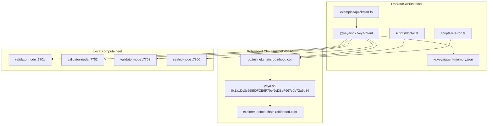
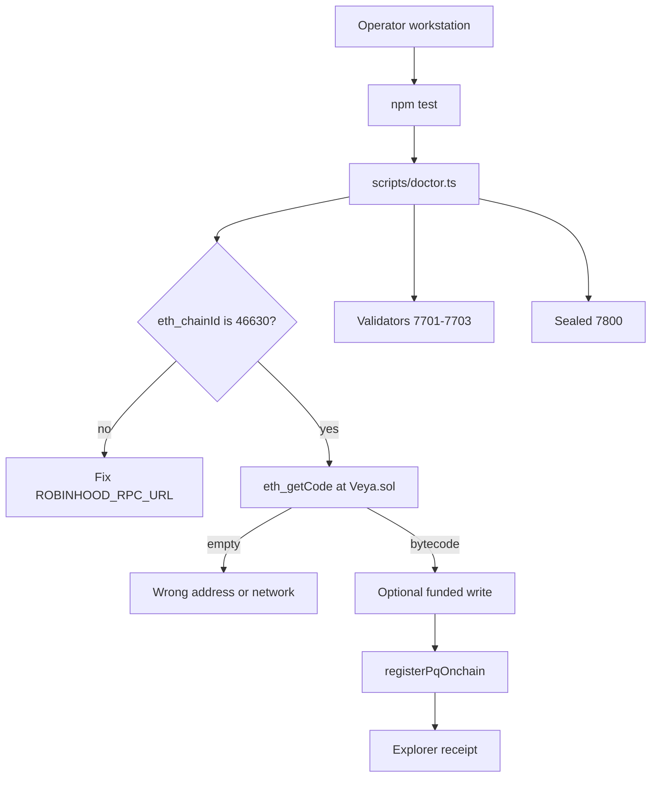

# Deployment Guide

**Deploy and operate `@veya/sdk` against Veya.sol on Robinhood Chain testnet, including validator and sealed-node clusters.**

VEYA on Robinhood Chain requires **no hosted API server**. Operators run Node (`@veya/sdk`), local memory at `~/.veya/agent-memory.json`, validator nodes (×3 quorum on ports 7701–7703), and a sealed-node process on port 7800. The protocol contract **Veya.sol** is already **deployed** on Robinhood Chain testnet. This guide covers using that deployment from the SDK, redeploying only when you intentionally replace the contract, and wiring the off-chain fleet.

`Veya.sol` is a **protocol contract**. It is **not** an ERC-20. Settlement is EVM transaction receipts, not program-derived accounts and not a memo program.

| Field | Live testnet value |
|-------|-------------------|
| **Network** | Robinhood Chain Testnet |
| **chainId** | `46630` (`0xb636`) |
| **Status** | `deployed` |
| **RPC** | `https://rpc.testnet.chain.robinhood.com` |
| **Explorer** | `https://explorer.testnet.chain.robinhood.com` |
| **Veya.sol** | `0x1a1Dc3c55550FCE9F70ef6cDEeF967c0b72a5d84` |
| **Deployer** | `0xa4b900461B265fD1ECdD97792eb3362EEC27bF08` |
| **Deployed at** | `2026-07-15T16:16:30.000Z` |
| **Client** | ethers v6, `EvmAnchor`, `VeyaClient`, `resolveConfig` |
| **Algorithm** | ML-DSA-44 + Kyber-768 + BLAKE3-256 |

**Related:** [deployments/testnet.json](../../deployments/testnet.json) • [CLI.md](./CLI.md) • [programs/veya-contract.md](./programs/veya-contract.md) • [api/types-reference.md](./api/types-reference.md)

---

## Table of Contents

1. [Deployment Topology](#deployment-topology)
2. [Prerequisites](#prerequisites)
3. [Live Testnet State](#live-testnet-state)
4. [Payer Key Management](#payer-key-management)
5. [RPC Configuration](#rpc-configuration)
6. [Using the Deployed Contract from the SDK](#using-the-deployed-contract-from-the-sdk)
7. [Redeploying Veya.sol](#redeploying-veyasol)
8. [Contract Address Management](#contract-address-management)
9. [Validator Cluster Deployment](#validator-cluster-deployment)
10. [Sealed Node Deployment](#sealed-node-deployment)
11. [Post-Deploy Verification](#post-deploy-verification)
12. [Environment Configuration](#environment-configuration)
13. [Networking and TLS](#networking-and-tls)
14. [Monitoring](#monitoring)
15. [Upgrade Procedures](#upgrade-procedures)
16. [Rollback](#rollback)
17. [Gas and Funding](#gas-and-funding)
18. [Deployment Checklist](#deployment-checklist)
19. [See Also](#see-also)

---

## Deployment Topology



The hosted API (`https://api.veyanet.tech`) sits on the same SDK edge: it constructs `VeyaClient` / `EvmAnchor` with the same env vars. The dashboard never talks to JSON-RPC directly.

---

## Prerequisites

| Component | Version | Purpose |
|-----------|---------|---------|
| **Node.js** | 20+ | SDK, vitest, tsx scripts |
| **npm** | 9+ | Install this package |
| **Funded payer** | testnet ETH | Gas for `EvmAnchor` writes |
| **ethers v6** | bundled | JSON-RPC + Contract |
| **Validator binaries** | optional | 2-of-3 consensus (ports 7701–7703) |
| **Sealed-node binary** | optional | Protected execution (port 7800) |

```bash
# Verify toolchain
node --version
npm --version

# Clone/build this package
npm install
npm test
npm run build
```

You do **not** need solana-cli, Anchor, or a BPF toolchain. You do **not** need an ERC-20 deploy. If you rebuild Solidity, use the toolchain in `Veya Protocol` (Hardhat / Foundry / ethers deploy script there) and then refresh `src/abi/Veya.json` in this package.

---

## Live Testnet State

The protocol is live. Operators consume it; they do not need to deploy before hashing or reading.

### Confirmed deployment record

| Field | Value |
|-------|-------|
| Address | `0x1a1Dc3c55550FCE9F70ef6cDEeF967c0b72a5d84` |
| Deployer | `0xa4b900461B265fD1ECdD97792eb3362EEC27bF08` |
| chainId | `46630` |
| Timestamp | `2026-07-15T16:16:30.000Z` |
| RPC | `https://rpc.testnet.chain.robinhood.com` |
| Note | Deployed to Robinhood Chain Testnet using ethers.js |

Machine-readable: [deployments/testnet.json](../../deployments/testnet.json).

Explorer:

- Contract: `https://explorer.testnet.chain.robinhood.com/address/0x1a1Dc3c55550FCE9F70ef6cDEeF967c0b72a5d84`
- Deployer: `https://explorer.testnet.chain.robinhood.com/address/0xa4b900461B265fD1ECdD97792eb3362EEC27bF08`

### What “deployed” means for the SDK

| Capability | Available without a new deploy |
|------------|--------------------------------|
| `pq.hashBlake3` / `pqKeygen` | Yes (offline) |
| `runConsensus` | Yes (needs local validators) |
| `protectedExec` | Yes (needs sealed node) |
| `getEnvironment` / mapping reads | Yes (public RPC) |
| `registerEnvironment` and other writes | Yes, with funded `VEYA_DEPLOYER_PRIVATE_KEY` |

---

## Payer Key Management

### What the payer is

The payer is an **secp256k1** EVM account. It pays gas in native ETH. It is **not** an ML-DSA identity. PQ keys are generated by `pq.generatePQIdentity()` and only their BLAKE3 fingerprints go on-chain.

| Item | Value / path |
|------|----------------|
| **Recorded deployer** | `0xa4b900461B265fD1ECdD97792eb3362EEC27bF08` |
| **SDK env var** | `VEYA_DEPLOYER_PRIVATE_KEY` |
| **Constructor field** | `VeyaClientConfig.payerPrivateKey` |
| **Format** | Hex string, with or without `0x` prefix (ethers `Wallet` accepts both) |

### Generate a fresh testnet payer (dev only)

```bash
node -e "const { Wallet } = require('ethers'); const w = Wallet.createRandom(); console.log(w.address); console.log('set VEYA_DEPLOYER_PRIVATE_KEY locally, never commit')"
```

Fund the address on Robinhood Chain testnet using the network’s faucet or an operator-controlled drip. Confirm:

```bash
curl -s https://rpc.testnet.chain.robinhood.com \
  -H 'content-type: application/json' \
  -d '{"jsonrpc":"2.0","id":1,"method":"eth_getBalance","params":["0xYOUR_ADDRESS","latest"]}'
```

Balance is a hex wei quantity. Writes fail with insufficient funds if the account cannot cover gas.

### Environment injection (never commit)

```bash
# POSIX
export VEYA_DEPLOYER_PRIVATE_KEY=0x...   # 32-byte secp256k1 scalar

# PowerShell
$env:VEYA_DEPLOYER_PRIVATE_KEY = "0x..."
```

**Security rules:**

- Do not put the key in `robinhood/deployments/testnet.json`, git, CI logs, or chat
- Restrict file permissions if you keep a keystore on disk
- Prefer a dedicated testnet account; do not reuse a mainnet operator key
- Rotate if the key ever appears in a shell history that is backed up

`EvmAnchor` constructs `ethers.Wallet(privateKey, provider)`. The constructor does **not** send a transaction. The first write calls `ensureRobinhoodChain()`.

---

## RPC Configuration

Public Robinhood Chain testnet RPC is the SDK default.

```bash
export ROBINHOOD_RPC_URL=https://rpc.testnet.chain.robinhood.com
export ROBINHOOD_CHAIN_ID=46630
export ROBINHOOD_EXPLORER_URL=https://explorer.testnet.chain.robinhood.com
```

| Setting | Recommended | Avoid |
|---------|-------------|-------|
| **Endpoint** | Official testnet RPC | A random Ethereum RPC that happens to speak JSON-RPC |
| **chainId check** | Leave `EvmAnchor.ensureRobinhoodChain` enabled | Pinning `staticNetwork` so a wrong RPC can impersonate 46630 |
| **Commitment** | Wait for `tx.wait()` (mined receipt) | Treating `sendTransaction` hash as final without a receipt |

Verify connectivity:

```bash
curl -s https://rpc.testnet.chain.robinhood.com \
  -H 'content-type: application/json' \
  -d '{"jsonrpc":"2.0","id":1,"method":"eth_chainId","params":[]}'
# expect 0xb636
```

`scripts/doctor.ts` and `scripts/live-rpc.ts` wrap this check for operators. See [CLI.md](./CLI.md).

---

## Using the Deployed Contract from the SDK

This is the primary “deployment” path: **consume** the live address.

### Read-only (no key)

```typescript
import { VeyaClient, ROBINHOOD_TESTNET, resolveConfig } from "@veya/sdk";

const client = new VeyaClient();
const digest = await client.hashBlake3("operator smoke");
const cfg = resolveConfig();

console.log({
  chainId: cfg.chainId,                 // 46630
  rpc: cfg.rpcUrl,
  contract: cfg.contractAddress,        // 0x1a1Dc3c55550FCE9F70ef6cDEeF967c0b72a5d84
  evmReady: Boolean(client.evm),        // false without a key
  digest,
  explorer: ROBINHOOD_TESTNET.explorerUrl,
});
```

### Write path (funded key)

```typescript
import { VeyaClient } from "@veya/sdk";

const client = new VeyaClient({
  payerPrivateKey: process.env.VEYA_DEPLOYER_PRIVATE_KEY!,
  // rpcUrl / contractAddress / chainId default to Robinhood testnet
});

const result = await client.registerPqOnchain(1); // envType 1 = SecureEnclave
console.log(result.explorer.environment);
console.log(result.explorer.memo);
```

`registerPqOnchain` (via `EvmAnchor.registerPqIdentity`):

1. Generates an ML-DSA-44 keypair
2. Computes `BLAKE3(publicKey)` as 32 bytes
3. Draws a random `bytes16` uuid
4. Calls `registerEnvironment(uuid, pqHash, envType)`
5. Calls `storeCommitment(uuid, pqHash)` as the “memo” companion **on the same contract** (not an external memo program)

Both transactions are ordinary EVM writes. Explorer URLs are built with `explorerTxUrl`.

### Direct `EvmAnchor` usage

```typescript
import { EvmAnchor } from "@veya/sdk";
import { randomBytes } from "node:crypto";

const evm = new EvmAnchor({
  payerPrivateKey: process.env.VEYA_DEPLOYER_PRIVATE_KEY!,
});

const envUuid = randomBytes(16);
const pqHash = randomBytes(32); // in production: BLAKE3 of a real ML-DSA pubkey
const tx = await evm.registerEnvironment(envUuid, pqHash, 0); // Execution
console.log(evm.explorerFor(tx));
```

Every write goes through `send()` → `ensureRobinhoodChain()` → `tx.wait()`. A mismatched `eth_chainId` throws before calldata is sent.

---

## Redeploying Veya.sol

Redeploy only when you intend to replace the protocol address. Existing mapping state at `0x1a1Dc3c55550FCE9F70ef6cDEeF967c0b72a5d84` does **not** migrate automatically.

### Source of truth

Canonical Solidity: `robinhood/contracts/Veya.sol`.

This package inlines the compiled ABI at `src/abi/Veya.json` and re-exports:

```typescript
import { VEYA_ABI, VEYA_BYTECODE, VEYA_CONTRACT_ADDRESS } from "@veya/sdk";
```

After a Solidity change:

1. Compile in `Veya Protocol`
2. Copy ABI + bytecode into `src/abi/Veya.json`
3. Deploy with ethers `ContractFactory` from a funded payer
4. Update `VEYA_CONTRACT_ADDRESS` in `src/abi/index.ts` and `ROBINHOOD_TESTNET.contractAddress` in `src/chain.ts`
5. Update `robinhood/deployments/testnet.json`
6. Run `npm test` (ABI camelCase names must match `INSTRUCTION_NAMES`)

### ethers v6 factory sketch

```typescript
import { ContractFactory, JsonRpcProvider, Wallet } from "ethers";
import { VEYA_ABI, VEYA_BYTECODE } from "@veya/sdk";

const provider = new JsonRpcProvider(process.env.ROBINHOOD_RPC_URL);
const wallet = new Wallet(process.env.VEYA_DEPLOYER_PRIVATE_KEY!, provider);
const net = await provider.getNetwork();
if (net.chainId !== 46630n) throw new Error(`unexpected chain ${net.chainId}`);

const factory = new ContractFactory(VEYA_ABI, VEYA_BYTECODE, wallet);
const contract = await factory.deploy();
await contract.waitForDeployment();
console.log(await contract.getAddress());
```

`Veya.sol` has **no constructor arguments**. There is no proxy in v1; the implementation address **is** the protocol address.

### Verify bytecode

```bash
curl -s https://rpc.testnet.chain.robinhood.com \
  -H 'content-type: application/json' \
  -d '{"jsonrpc":"2.0","id":1,"method":"eth_getCode","params":["0x1a1Dc3c55550FCE9F70ef6cDEeF967c0b72a5d84","latest"]}'
```

Empty `0x` means you pointed at an EOA or the wrong network. `scripts/live-rpc.ts` fails closed on empty code.

---

## Contract Address Management

| Stage | Address |
|-------|---------|
| **Live testnet (this package default)** | `0x1a1Dc3c55550FCE9F70ef6cDEeF967c0b72a5d84` |
| **Override** | `VEYA_CONTRACT_ADDRESS` or `VeyaClientConfig.contractAddress` |
| **After a replacement deploy** | New `0x` address from `waitForDeployment()` |

Post-replace steps:

1. Update `src/chain.ts` `ROBINHOOD_TESTNET.contractAddress`
2. Update `src/abi/index.ts` `VEYA_CONTRACT_ADDRESS`
3. Set `VEYA_CONTRACT_ADDRESS` in operator and API environments
4. Update `robinhood/deployments/testnet.json`
5. Rebuild consumers (`https://api.veyanet.tech` file: dependency)

**Never** mix a leftover address from another EVM with Robinhood Chain writes. The chain-id guard is necessary but not sufficient if you also override `contractAddress` to a random ERC-20: the ABI would still encode Veya function selectors against the wrong bytecode.

---

## Validator Cluster Deployment

Consensus is **off-chain HTTP**. The chain does not run the quorum. After 2-of-3 agreement, operators optionally call `attestExecution`.

### Ports

| Instance | Default origin | Port |
|----------|----------------|------|
| alpha | `http://127.0.0.1:7701` | 7701 |
| beta | `http://127.0.0.1:7702` | 7702 |
| gamma | `http://127.0.0.1:7703` | 7703 |

`resolveConfig()` reads `VEYA_VALIDATOR_NODES` as a comma-separated list, defaulting to the three localhost URLs above.

### HTTP contract

| Endpoint | Method | Body |
|----------|--------|------|
| `/execute` | POST | `{ "task_id": string, "payload": object }` |

Successful nodes return `{ "result": NodeResult }` where `NodeResult` includes `blake3_execution_hash`, `mldsa_signature`, and `status: "success" | "fail"`.

### SDK call

```typescript
import { VeyaClient } from "@veya/sdk";

const client = new VeyaClient({
  validatorNodes: [
    "http://127.0.0.1:7701",
    "http://127.0.0.1:7702",
    "http://127.0.0.1:7703",
  ],
});

const quorum = await client.runConsensus("health", { ping: true });
if (!quorum.consensus_reached) {
  throw new Error("quorum not reached");
}
```

Threshold is **2**. `consensus_reached` is true when at least two successful nodes share the same BLAKE3 hash **and** at least two results were collected.

### Production bind

Bind validators to a private network. Put TLS in front. Do not expose `/execute` to the public internet without authentication. The SDK uses `fetch` with JSON; it does not implement mTLS itself.

systemd sketch (alpha):

```ini
[Unit]
Description=VEYA Validator Node alpha
After=network.target

[Service]
ExecStart=/usr/local/bin/validator-node alpha 7701
Restart=always
User=veya
Environment=RUST_LOG=info

[Install]
WantedBy=multi-user.target
```

The validator binary itself is not this npm package; it is the VEYA node runtime. The SDK is the client.

---

## Sealed Node Deployment

| Service | Port | Endpoint |
|---------|------|----------|
| sealed-node | 7800 | `POST /protected` |

```bash
export VEYA_SEALED_NODE_URL=http://127.0.0.1:7800
```

```typescript
import { randomBytes } from "node:crypto";
import { VeyaClient } from "@veya/sdk";

const client = new VeyaClient();
const sealed = await client.protectedExecute({
  environmentId: envUuid,
  agentId: agentUuid,
  eventType: "audit",
  payload: { step: "post-deploy" },
  sessionEntropy: randomBytes(32),
});
```

Request body fields are snake_case on the wire (`environment_id`, `payload_json`, `session_entropy_hex`) even though TypeScript params are camelCase. HTTP 4xx/5xx throw `sealed-node error: <status>`.

After a successful sealed run, operators may persist chunks with `EvmAnchor.storeSealedState` (max 8192 bytes per chunk, plus a client-supplied BLAKE3 of the chunk).

---

## Post-Deploy Verification



| Step | Command |
|------|---------|
| Unit tests | `npm test` |
| Typecheck | `npm run lint` |
| Doctor | `npx tsx scripts/doctor.ts` |
| Live RPC | `npx tsx scripts/live-rpc.ts` |
| Quickstart | `npx tsx examples/quickstart.ts` |
| Optional write | Node script calling `registerPqOnchain` |

`npm test` does **not** send transactions. That is intentional: CI should not require funded keys.

---

## Environment Configuration

### Operator workstation

```bash
export ROBINHOOD_RPC_URL=https://rpc.testnet.chain.robinhood.com
export ROBINHOOD_CHAIN_ID=46630
export ROBINHOOD_EXPLORER_URL=https://explorer.testnet.chain.robinhood.com
export VEYA_CONTRACT_ADDRESS=0x1a1Dc3c55550FCE9F70ef6cDEeF967c0b72a5d84
export VEYA_DEPLOYER_PRIVATE_KEY=0x...          # writes only
export VEYA_VALIDATOR_NODES=http://127.0.0.1:7701,http://127.0.0.1:7702,http://127.0.0.1:7703
export VEYA_SEALED_NODE_URL=http://127.0.0.1:7800
```

### Resolution order (`resolveConfig`)

1. Explicit `VeyaClientConfig` fields
2. Process environment
3. `ROBINHOOD_TESTNET` constants

`payerPrivateKey` has no default. Missing key means `client.evm` is `undefined` and `registerPqOnchain` throws `payerPrivateKey required for on-chain ops on Robinhood Chain`.

### Local memory store

```bash
# Created on first storeMemory()
# Path: ~/.veya/agent-memory.json
chmod 700 ~/.veya   # POSIX
```

This JSON file is **not** the chain. Nullifiers on-chain (`flagMemoryNullifier`) are the spend-once audit flag; content lives locally.

---

## Networking and TLS

| Concern | Testnet default | Hardened production |
|---------|-----------------|---------------------|
| Validator bind | `127.0.0.1` | Private VPC + TLS reverse proxy |
| Sealed node | `127.0.0.1:7800` | mTLS between SDK host and node |
| RPC | Official HTTPS testnet RPC | Dedicated RPC with key rotation if a vendor is used |
| Memory JSON | Local disk only | Never network-mounted unencrypted |
| Payer key | Env var | HSM / cloud KMS signing (custom Wallet) |

`JsonRpcProvider` uses HTTPS for the default RPC URL. Validator and sealed defaults are cleartext HTTP on loopback.

---

## Monitoring

| Signal | Source | Alert threshold |
|--------|--------|-----------------|
| RPC `eth_chainId` | `scripts/live-rpc.ts` | Not `0xb636` |
| Contract code | `eth_getCode` | Empty or unexpected size drop |
| Node uptime | `POST /execute` | Any validator down > 60s |
| Quorum failures | `consensus_reached: false` | 3 consecutive failures |
| Sealed node | `POST /protected` | HTTP not 200 |
| Payer balance | `eth_getBalance` | Below a few million gas-worth of wei |
| Reverts | `VeyaSdkError.code` | Spike in `SPENDING_EXCEEDED` / `COMMITMENT_EXISTS` |
| Disk | `~/.veya` | > 80% volume capacity |

Explorer links from `explorerTxUrl(hash)` should be stored next to application logs so an auditor can open the receipt without reconstructing the hash.

---

## Upgrade Procedures

### Contract (not a proxy)

v1 has no transparent proxy. An “upgrade” is a **new deploy** plus address cutover:

1. Freeze writes on the old address at the application layer
2. Deploy new bytecode
3. Cut `VEYA_CONTRACT_ADDRESS` / `ROBINHOOD_TESTNET.contractAddress`
4. Rebuild `@veya/sdk` and `https://api.veyanet.tech`
5. Run `npm test` and `scripts/doctor.ts`

State in mappings does not copy. Plan an application-level re-register of environments if you must move.

### SDK publish / consume

This repo consumes the package as `@veya/sdk`. After source changes:

```bash
npm install
npm test
npm run build
# applications pick up dist/ after restart
```

### Validator rolling restart

1. Stop gamma → ensure alpha+beta still reach 2-of-3
2. Restart gamma, `POST /execute` health
3. Repeat for beta, then alpha

### Sealed node

Restart is independent of validators. In-flight `protectedExec` calls fail with HTTP errors; retry at the application layer.

---

## Rollback

| Component | Action | Reversible? |
|-----------|--------|-------------|
| SDK npm/file version | Pin previous `dist` | Yes |
| Validator binary | Redeploy prior release | Yes |
| Sealed-node binary | Redeploy prior release | Yes |
| Env var `VEYA_CONTRACT_ADDRESS` | Point back at previous address | Yes, if old code still exists |
| Mapping writes already mined | **Not reversible** | No |
| `flagMemoryNullifier` | Immutable once set | No |

Plan identifier namespaces (`bytes16` uuids) so a cutover does not collide with existing keys on a reused address.

---

## Gas and Funding

Robinhood Chain uses ETH with 18 decimals. All `initSpendingLimit` / `recordSpend` amounts are **wei**.

| Operation | Relative calldata size | Notes |
|-----------|------------------------|-------|
| `registerEnvironment` | Small | uuid + hash + uint8 |
| `registerAgent` | Small | two uuids + role + hash |
| `storeCommitment` | Small | uuid + bytes32 |
| `attestExecution` | Large if sig present | `mldsaSig` up to 4627 bytes |
| `storeSealedState` | Large | chunk up to 8192 bytes |

Fund the payer with enough testnet ETH to cover several `attestExecution` transactions, not only tiny `storeCommitment` calls. `tx.wait()` returns the hash used in explorer URLs; gas used is on the receipt.

Spending-limit **application** amounts (treasury caps) are independent of **gas**. Recording `recordSpend(1e18)` means “one ETH of agent spend”, not “one ETH of gas”.

---

## Deployment Checklist

### Pre-flight

- [ ] `node --version` is 20+
- [ ] `npm install` in `@veya/sdk`
- [ ] `npm test` passes (chain id 46630, ABI camelCase, PQ round-trip)
- [ ] `npm run build` succeeds
- [ ] `VEYA_DEPLOYER_PRIVATE_KEY` is unset in git and set only in the operator shell if writes are planned
- [ ] Payer has testnet ETH if writes are planned

### Consume live contract

- [ ] `ROBINHOOD_RPC_URL` reachable
- [ ] `eth_chainId` returns `0xb636`
- [ ] `eth_getCode` at `0x1a1Dc3c55550FCE9F70ef6cDEeF967c0b72a5d84` is non-empty
- [ ] `npx tsx scripts/doctor.ts` exits 0
- [ ] `npx tsx scripts/live-rpc.ts` exits 0
- [ ] `npx tsx examples/quickstart.ts` prints digest + defaults

### Off-chain fleet

- [ ] Three validators respond on 7701–7703
- [ ] `runConsensus` returns `consensus_reached: true` for a shared payload
- [ ] Sealed node responds on 7800 `/protected`
- [ ] `~/.veya` directory mode is operator-only

### Optional first write

- [ ] `registerPqOnchain` returns two explorer URLs
- [ ] Receipts visible on `explorer.testnet.chain.robinhood.com`
- [ ] `getEnvironment` returns `exists: true` for the new uuid

---

## See Also

| Guide | Description |
|-------|-------------|
| [README.md](./README.md) | Documentation hub |
| [CLI.md](./CLI.md) | Node operator surface |
| [programs/veya-contract.md](./programs/veya-contract.md) | Function reference |
| [programs/storage-layouts.md](./programs/storage-layouts.md) | Mapping keys and slots |
| [api/types-reference.md](./api/types-reference.md) | TypeScript types |
| [../README.md](../README.md) | Package intro |
| [../../deployments/testnet.json](../../deployments/testnet.json) | Live address record |
