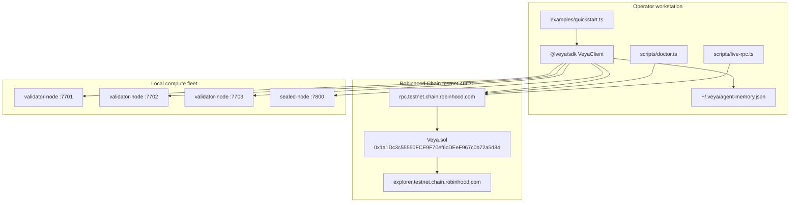

# Deployment Guide

**Deploy and operate `@veya/sdk` against Veya.sol on Robinhood Chain testnet, including validator and sealed-node clusters.**

VEYA on Robinhood Chain requires **no hosted API server**. Operators run Node (`@veya/sdk`), local memory at `~/.veya/agent-memory.json`, validator nodes (×3 quorum on ports 7701–7703), and a sealed-node process on port 7800. The protocol contract **Veya.sol** is already **deployed** on Robinhood Chain testnet. This guide covers using that deployment from the SDK, redeploying only when you intentionally replace the contract, and wiring the off-chain fleet.

`Veya.sol` is a **protocol contract**. It is **not** an ERC-20. Settlement is EVM transaction receipts, not program-derived accounts and not a memo program.

| Field | Live testnet value |
|-------|-------------------|
| **Network** | Robinhood Chain Testnet |
| **chainId** | `46630` (`0xb636`) |
| **Status** | `deployed` |
| **RPC** | `https://rpc.testnet.chain.robinhood.com` |
| **Explorer** | `https://explorer.testnet.chain.robinhood.com` |
| **Veya.sol** | `0x1a1Dc3c55550FCE9F70ef6cDEeF967c0b72a5d84` |
| **Deployer** | `0xa4b900461B265fD1ECdD97792eb3362EEC27bF08` |
| **Deployed at** | `2026-07-15T16:16:30.000Z` |
| **Client** | ethers v6, `EvmAnchor`, `VeyaClient`, `resolveConfig` |
| **Algorithm** | ML-DSA-44 + Kyber-768 + BLAKE3-256 |

**Related:** [deployments/testnet.json](../../deployments/testnet.json) • [CLI.md](./CLI.md) • [programs/veya-contract.md](./programs/veya-contract.md) • [api/types-reference.md](./api/types-reference.md)

---

## Table of Contents

1. [Deployment Topology](#deployment-topology)
2. [Prerequisites](#prerequisites)
3. [Live Testnet State](#live-testnet-state)
4. [Payer Key Management](#payer-key-management)
5. [RPC Configuration](#rpc-configuration)
6. [Using the Deployed Contract from the SDK](#using-the-deployed-contract-from-the-sdk)
7. [Redeploying Veya.sol](#redeploying-veyasol)
8. [Contract Address Management](#contract-address-management)
9. [Validator Cluster Deployment](#validator-cluster-deployment)
10. [Sealed Node Deployment](#sealed-node-deployment)
11. [Post-Deploy Verification](#post-deploy-verification)
12. [Environment Configuration](#environment-configuration)
13. [Networking and TLS](#networking-and-tls)
14. [Monitoring](#monitoring)
15. [Upgrade Procedures](#upgrade-procedures)
16. [Rollback](#rollback)
17. [Gas and Funding](#gas-and-funding)
18. [Deployment Checklist](#deployment-checklist)
19. [See Also](#see-also)

---

## Deployment Topology



The hosted API (`https://api.veyanet.tech`) sits on the same SDK edge: it constructs `VeyaClient` / `EvmAnchor` with the same env vars. The dashboard never talks to JSON-RPC directly.

---

## Prerequisites

| Component | Version | Purpose |
|-----------|---------|---------|
| **Node.js** | 20+ | SDK, vitest, tsx scripts |
| **npm** | 9+ | Install this package |
| **Funded payer** | testnet ETH | Gas for `EvmAnchor` writes |
| **ethers v6** | bundled | JSON-RPC + Contract |
| **Validator binaries** | optional | 2-of-3 consensus (ports 7701–7703) |
| **Sealed-node binary** | optional | Protected execution (port 7800) |

```bash
# Verify toolchain
node --version
npm --version

# Clone/build this package
npm install
npm test
npm run build
```

You do **not** need solana-cli, Anchor, or a BPF toolchain. You do **not** need an ERC-20 deploy. If you rebuild Solidity, use the toolchain in `Veya Protocol` (Hardhat / Foundry / ethers deploy script there) and then refresh `src/abi/Veya.json` in this package.

---

## Live Testnet State

The protocol is live. Operators consume it; they do not need to deploy before hashing or reading.

### Confirmed deployment record

| Field | Value |
|-------|-------|
| Address | `0x1a1Dc3c55550FCE9F70ef6cDEeF967c0b72a5d84` |
| Deployer | `0xa4b900461B265fD1ECdD97792eb3362EEC27bF08` |
| chainId | `46630` |
| Timestamp | `2026-07-15T16:16:30.000Z` |
| RPC | `https://rpc.testnet.chain.robinhood.com` |
| Note | Deployed to Robinhood Chain Testnet using ethers.js |

Machine-readable: [deployments/testnet.json](../../deployments/testnet.json).

Explorer:

- Contract: `https://explorer.testnet.chain.robinhood.com/address/0x1a1Dc3c55550FCE9F70ef6cDEeF967c0b72a5d84`
- Deployer: `https://explorer.testnet.chain.robinhood.com/address/0xa4b900461B265fD1ECdD97792eb3362EEC27bF08`

### What “deployed” means for the SDK

| Capability | Available without a new deploy |
|------------|--------------------------------|
| `pq.hashBlake3` / `pqKeygen` | Yes (offline) |
| `runConsensus` | Yes (needs local validators) |
| `protectedExec` | Yes (needs sealed node) |
| `getEnvironment` / mapping reads | Yes (public RPC) |
| `registerEnvironment` and other writes | Yes, with funded `VEYA_DEPLOYER_PRIVATE_KEY` |

---

## Payer Key Management

### What the payer is

The payer is an **secp256k1** EVM account. It pays gas in native ETH. It is **not** an ML-DSA identity. PQ keys are generated by `pq.generatePQIdentity()` and only their BLAKE3 fingerprints go on-chain.

| Item | Value / path |
|------|----------------|
| **Recorded deployer** | `0xa4b900461B265fD1ECdD97792eb3362EEC27bF08` |
| **SDK env var** | `VEYA_DEPLOYER_PRIVATE_KEY` |
| **Constructor field** | `VeyaClientConfig.payerPrivateKey` |
| **Format** | Hex string, with or without `0x` prefix (ethers `Wallet` accepts both) |

### Generate a fresh testnet payer (dev only)

```bash
node -e "const { Wallet } = require('ethers'); const w = Wallet.createRandom(); console.log(w.address); console.log('set VEYA_DEPLOYER_PRIVATE_KEY locally, never commit')"
```

Fund the address on Robinhood Chain testnet using the network’s faucet or an operator-controlled drip. Confirm:

```bash
curl -s https://rpc.testnet.chain.robinhood.com \
  -H 'content-type: application/json' \
  -d '{"jsonrpc":"2.0","id":1,"method":"eth_getBalance","params":["0xYOUR_ADDRESS","latest"]}'
```

Balance is a hex wei quantity. Writes fail with insufficient funds if the account cannot cover gas.

### Environment injection (never commit)

```bash
# POSIX
export VEYA_DEPLOYER_PRIVATE_KEY=0x...   # 32-byte secp256k1 scalar

# PowerShell
$env:VEYA_DEPLOYER_PRIVATE_KEY = "0x..."
```

**Security rules:**

- Do not put the key in `robinhood/deployments/testnet.json`, git, CI logs, or chat
- Restrict file permissions if you keep a keystore on disk
- Prefer a dedicated testnet account; do not reuse a mainnet operator key
- Rotate if the key ever appears in a shell history that is backed up

`EvmAnchor` constructs `ethers.Wallet(privateKey, provider)`. The constructor does **not** send a transaction. The first write calls `ensureRobinhoodChain()`.

---

## RPC Configuration

Public Robinhood Chain testnet RPC is the SDK default.

```bash
export ROBINHOOD_RPC_URL=https://rpc.testnet.chain.robinhood.com
export ROBINHOOD_CHAIN_ID=46630
export ROBINHOOD_EXPLORER_URL=https://explorer.testnet.chain.robinhood.com
```

| Setting | Recommended | Avoid |
|---------|-------------|-------|
| **Endpoint** | Official testnet RPC | A random Ethereum RPC that happens to speak JSON-RPC |
| **chainId check** | Leave `EvmAnchor.ensureRobinhoodChain` enabled | Pinning `staticNetwork` so a wrong RPC can impersonate 46630 |
| **Commitment** | Wait for `tx.wait()` (mined receipt) | Treating `sendTransaction` hash as final without a receipt |

Verify connectivity:

```bash
curl -s https://rpc.testnet.chain.robinhood.com \
  -H 'content-type: application/json' \
  -d '{"jsonrpc":"2.0","id":1,"method":"eth_chainId","params":[]}'
# expect 0xb636
```

`scripts/doctor.ts` and `scripts/live-rpc.ts` wrap this check for operators. See [CLI.md](./CLI.md).

---

## Using the Deployed Contract from the SDK

This is the primary “deployment” path: **consume** the live address.

### Read-only (no key)

```typescript
import { VeyaClient, ROBINHOOD_TESTNET, resolveConfig } from "@veya/sdk";

const client = new VeyaClient();
const digest = await client.hashBlake3("operator smoke");
const cfg = resolveConfig();

console.log({
  chainId: cfg.chainId,                 // 46630
  rpc: cfg.rpcUrl,
  contract: cfg.contractAddress,        // 0x1a1Dc3c55550FCE9F70ef6cDEeF967c0b72a5d84
  evmReady: Boolean(client.evm),        // false without a key
  digest,
  explorer: ROBINHOOD_TESTNET.explorerUrl,
});
```

### Write path (funded key)

```typescript
import { VeyaClient } from "@veya/sdk";

const client = new VeyaClient({
  payerPrivateKey: process.env.VEYA_DEPLOYER_PRIVATE_KEY!,
  // rpcUrl / contractAddress / chainId default to Robinhood testnet
});

const result = await client.registerPqOnchain(1); // envType 1 = SecureEnclave
console.log(result.explorer.environment);
console.log(result.explorer.memo);
```

`registerPqOnchain` (via `EvmAnchor.registerPqIdentity`):

1. Generates an ML-DSA-44 keypair
2. Computes `BLAKE3(publicKey)` as 32 bytes
3. Draws a random `bytes16` uuid
4. Calls `registerEnvironment(uuid, pqHash, envType)`
5. Calls `storeCommitment(uuid, pqHash)` as the “memo” companion **on the same contract** (not an external memo program)

Both transactions are ordinary EVM writes. Explorer URLs are built with `explorerTxUrl`.

### Direct `EvmAnchor` usage

```typescript
import { EvmAnchor } from "@veya/sdk";
import { randomBytes } from "node:crypto";

const evm = new EvmAnchor({
  payerPrivateKey: process.env.VEYA_DEPLOYER_PRIVATE_KEY!,
});

const envUuid = randomBytes(16);
const pqHash = randomBytes(32); // in production: BLAKE3 of a real ML-DSA pubkey
const tx = await evm.registerEnvironment(envUuid, pqHash, 0); // Execution
console.log(evm.explorerFor(tx));
```

Every write goes through `send()` → `ensureRobinhoodChain()` → `tx.wait()`. A mismatched `eth_chainId` throws before calldata is sent.

---

## Redeploying Veya.sol

Redeploy only when you intend to replace the protocol address. Existing mapping state at `0x1a1Dc3c55550FCE9F70ef6cDEeF967c0b72a5d84` does **not** migrate automatically.

### Source of truth

Canonical Solidity: `robinhood/contracts/Veya.sol`.

This package inlines the compiled ABI at `src/abi/Veya.json` and re-exports:

```typescript
import { VEYA_ABI, VEYA_BYTECODE, VEYA_CONTRACT_ADDRESS } from "@veya/sdk";
```

After a Solidity change:

1. Compile in `Veya Protocol`
2. Copy ABI + bytecode into `src/abi/Veya.json`
3. Deploy with ethers `ContractFactory` from a funded payer
4. Update `VEYA_CONTRACT_ADDRESS` in `src/abi/index.ts` and `ROBINHOOD_TESTNET.contractAddress` in `src/chain.ts`
5. Update `robinhood/deployments/testnet.json`
6. Run `npm test` (ABI camelCase names must match `INSTRUCTION_NAMES`)

### ethers v6 factory sketch

```typescript
import { ContractFactory, JsonRpcProvider, Wallet } from "ethers";
import { VEYA_ABI, VEYA_BYTECODE } from "@veya/sdk";

const provider = new JsonRpcProvider(process.env.ROBINHOOD_RPC_URL);
const wallet = new Wallet(process.env.VEYA_DEPLOYER_PRIVATE_KEY!, provider);
const net = await provider.getNetwork();
if (net.chainId !== 46630n) throw new Error(`unexpected chain ${net.chainId}`);

const factory = new ContractFactory(VEYA_ABI, VEYA_BYTECODE, wallet);
const contract = await factory.deploy();
await contract.waitForDeployment();
console.log(await contract.getAddress());
```

`Veya.sol` has **no constructor arguments**. There is no proxy in v1; the implementation address **is** the protocol address.

### Verify bytecode

```bash
curl -s https://rpc.testnet.chain.robinhood.com \
  -H 'content-type: application/json' \
  -d '{"jsonrpc":"2.0","id":1,"method":"eth_getCode","params":["0x1a1Dc3c55550FCE9F70ef6cDEeF967c0b72a5d84","latest"]}'
```

Empty `0x` means you pointed at an EOA or the wrong network. `scripts/live-rpc.ts` fails closed on empty code.

---

