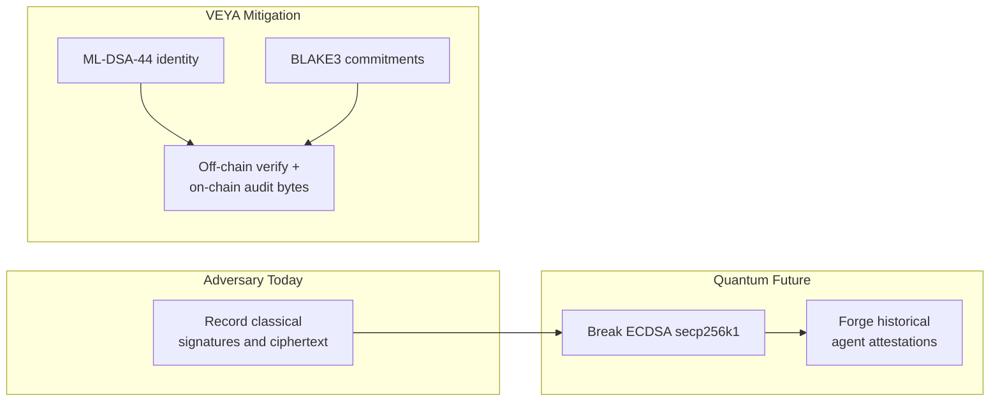
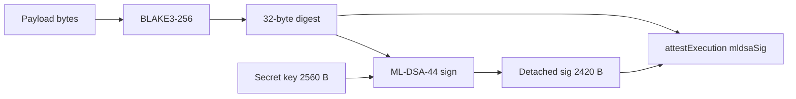

<div align="center">
  

  # Post-Quantum Cryptography in @veya/sdk

  **ML-DSA-44 • Kyber-768 • BLAKE3-256: harvest-attack-resistant by design.**

  [](https://csrc.nist.gov/pubs/fips/204/final)
  [](https://csrc.nist.gov/pubs/fips/203/final)
  [](https://explorer.testnet.chain.robinhood.com)

  **[Architecture](./ARCHITECTURE.md)** • **[Verification](./VERIFICATION.md)** • **[Quickstart](./QUICKSTART.md)** • **[README](../README.md)**

</div>

---

`@veya/sdk` is built **post-quantum first**. Every new code path in this package uses **ML-DSA-44** for signatures, **Kyber-768** for key encapsulation, and **BLAKE3-256** for commitments. Ethereum secp256k1 remains the chain’s transaction authorization (`msg.sender` on `Veya.sol`); it is not the agent identity algorithm.

This guide explains how each primitive is used in the TypeScript SDK, where verification happens, byte-level sizes, NIST alignment, and how on-chain storage on Robinhood Chain relates to off-chain cryptographic assurance.

Settlement is EVM. Hashes land as `bytes32`. Signature blobs land as `bytes` bounded by `MAX_MLDSA_SIG_LEN = 4627`. The contract does not run Dilithium. Auditors run `verifyPQ`.

---

## Table of Contents

1. [Why Post-Quantum First](#why-post-quantum-first)
2. [Live Testnet Cryptographic Proof](#live-testnet-cryptographic-proof)
3. [Algorithm Selection Matrix](#algorithm-selection-matrix)
4. [ML-DSA-44 Identity and Attestation](#ml-dsa-44-identity-and-attestation)
5. [Kyber-768 Session Transport](#kyber-768-session-transport)
6. [BLAKE3 Commitments](#blake3-commitments)
7. [AES-256-GCM Sealed Path](#aes-256-gcm-sealed-path)
8. [Hybrid Migration Reality](#hybrid-migration-reality)
9. [On-Chain vs Off-Chain Verification](#on-chain-vs-off-chain-verification)
10. [TypeScript Implementation](#typescript-implementation)
11. [Key Lifecycle](#key-lifecycle)
12. [Attestation Canonicalization](#attestation-canonicalization)
13. [Security Properties](#security-properties)
14. [Domain Separation](#domain-separation)
15. [Operational Checklist](#operational-checklist)
16. [Failure Modes](#failure-modes)
17. [Invariants](#invariants)
18. [References](#references)

---

## Why Post-Quantum First

Harvest-now-decrypt-later attacks target long-lived agent identities and settlement records. An adversary recording today’s ECDSA-signed Ethereum transactions may not forge `msg.sender` history (the chain’s account model still binds an address), but they **can** forge classical signatures that were used as **agent identity** once a cryptographically relevant quantum computer exists. If your “agent cert” was secp256k1, the cert dies. If it was ML-DSA-44, the cert survives.



VEYA mitigates HNDL by:

- Anchoring **BLAKE3** digests (Grover-resistant at 256-bit output) as `bytes32` on `Veya.sol`
- Storing **ML-DSA** signature bytes alongside commitments when the caller uses `attestExecution`
- Using **Kyber-768** for coordination session keys (never on-chain)
- Keeping full public keys off-chain while storing **BLAKE3(pubkey)** fingerprints on-chain

**Design rule:** SHA-256 is not used on new SDK commitment paths. BLAKE3 is the sole hash standard in `@veya/sdk`. keccak256 appears only as EVM mapping-key derivation (`abi.encodePacked`), which is addressing, not a VEYA commitment.

Ethereum ECDSA still pays gas. That is not a PQ identity. Mixing the two on purpose is the architecture: chain authorization versus agent authorization.

---

## Live Testnet Cryptographic Proof

PQ operations are **confirmed on Robinhood Chain testnet**: real contract writes, real receipts, real explorer links.

| Field | Value |
|-------|-------|
| **Network** | Robinhood Chain Testnet |
| **Chain ID** | `46630` |
| **RPC** | `https://rpc.testnet.chain.robinhood.com` |
| **Explorer** | `https://explorer.testnet.chain.robinhood.com` |
| **Veya.sol** | `0x1a1Dc3c55550FCE9F70ef6cDEeF967c0b72a5d84` |
| **Algorithm** | ML-DSA-44 + Kyber-768 + BLAKE3-256 |
| **Client** | ethers v6 + `@noble/post-quantum` + `hash-wasm` |

### Confirmed transactions

| Operation | Explorer |
|-----------|----------|
| Guest content proof | [0x4314faef…395d](https://explorer.testnet.chain.robinhood.com/tx/0x4314faefee6f1c635f91dd075384d4816e10abd84b9bb88e3328b51e630e395d) |
| Sealed-execution commitment | [0xd68ab196…31d8](https://explorer.testnet.chain.robinhood.com/tx/0xd68ab19671f0a3be63651cb6d6e24f5decf591da981708502827bca3689d31d8) |
| PQ / environment registration path | [0x9a00af5e…8ad4](https://explorer.testnet.chain.robinhood.com/tx/0x9a00af5ef80fdefb3734df19ad30b82aa57fa212bd493b7ad5b224a343808ad4) |

Re-run locally: `npm install && npm test` for round-trips; funded writes via `VeyaClient.registerPqOnchain` or the live ship check. There is no token address in these receipts. `receipt.to` is the protocol contract.

---

## Algorithm Selection Matrix

| Use case | Algorithm | NIST standard | Parameter set | Package |
|----------|-----------|---------------|---------------|---------|
| Environment / agent identity | ML-DSA-44 | [FIPS 204](https://csrc.nist.gov/pubs/fips/204/final) | Dilithium2 | `@noble/post-quantum` `ml_dsa44` |
| Validator node attestation | ML-DSA-44 | FIPS 204 | Dilithium2 | same, plus node binary |
| Coordination session KEM | Kyber-768 | [FIPS 203](https://csrc.nist.gov/pubs/fips/203/final) | ML-KEM-768 | `@noble/post-quantum` `ml_kem768` |
| Execution commitments | BLAKE3-256 |: | 256-bit output | `hash-wasm` `createBLAKE3` |
| Sealed payload encryption | AES-256-GCM | [SP 800-38D](https://csrc.nist.gov/pubs/sp/800/38d/final) | 256-bit key | sealed-node |
| Pubkey fingerprint | BLAKE3(pubkey_bytes) |: | 32-byte digest | `publicKeyHashBlake3` |
| Transaction authorization | secp256k1 ECDSA | Ethereum |: | ethers v6 `Wallet` |
| Mapping keys | keccak256 | EVM | addressing only | Solidity `abi.encodePacked` |

`Veya.sol` stores detached ML-DSA signatures with `MAX_MLDSA_SIG_LEN = 4627`. That bound is larger than ML-DSA-44’s typical signature so a future parameter-set bump does not immediately require a storage-layout change. v1 signers still use ML-DSA-44.

---

## ML-DSA-44 Identity and Attestation

### Purpose

ML-DSA (Module-Lattice-Based Digital Signature Algorithm) provides EUF-CMA unforgeability under quantum adversaries assuming Module-LWE hardness. VEYA uses ML-DSA-44 for:

- Environment and agent identity (pubkey hash on-chain)
- Execution attestation signatures (bytes stored in `Attestation.mldsaSig`)
- Validator node `NodeResult` attestations
- `routeSecureMessage` envelopes after policy allows the tool

### Byte sizes (ML-DSA-44 / FIPS 204)

| Artifact | Bytes | Hex chars | Notes |
|----------|-------|-----------|-------|
| Public key | 1,312 | 2,624 | Stored off-chain only |
| Secret key | 2,560 | 5,120 | Operator custody |
| Signature | 2,420 | 4,840 | Detached; typical ML-DSA-44 |
| On-chain max sig | 4,627 | 9,254 | `MAX_MLDSA_SIG_LEN` storage bound |
| Seed | 32 | 64 | Key generation entropy |
| Fingerprint | 32 | 64 | BLAKE3 of public key |

### NIST parameter mapping

| NIST designation | CRYSTALS name | VEYA v1 |
|------------------|---------------|---------|
| ML-DSA-44 | Dilithium2 | **Default identity algorithm** (`ml_dsa44`) |
| ML-DSA-65 | Dilithium3 | Not used |
| ML-DSA-87 | Dilithium5 | Not used; storage bound can hold a larger sig |

If you generate ML-DSA-87 keys and try to pass them through `attestExecution`, you may still fit the 4,627-byte cap, but verifiers in this SDK call `ml_dsa44.verify`. Stay on ML-DSA-44.

### Signing flow



**Critical rule:** On-chain attestations sign the **32-byte BLAKE3 digest**, not the raw payload and not the hex encoding of the digest.

### TypeScript API

```typescript
import * as pq from "@veya/sdk/pq";

const { publicKey, privateKey } = await pq.generatePQIdentity();
const digest = await pq.hashBlake3Bytes(payloadBytes);
const sig = await pq.signPQ(digest, privateKey);
const ok = await pq.verifyPQ(sig, digest, publicKey);
const hash = await pq.publicKeyHashBlake3(publicKey);
```

`VeyaClient.pqKeygen()` is the same `generatePQIdentity`.

### On-chain storage model

The contract never stores full public keys. Registration functions accept:

| Field | Size | Function |
|-------|------|----------|
| `pqPubkeyHash` | 32 bytes | `registerEnvironment` |
| `agentPqHash` | 32 bytes | `registerAgent` |
| `mldsaSig` | ≤ 4,627 bytes | `attestExecution` |
| `identityHash` + `executionHash` | 32 + 32 | `anchorPqAttestation` |

Verifiers recompute `BLAKE3(public_key_bytes)` locally and compare to the on-chain fingerprint. `anchorPqAttestation` links those two hashes without repeating the signature blob: useful when the relayer stored only a commitment.

---

