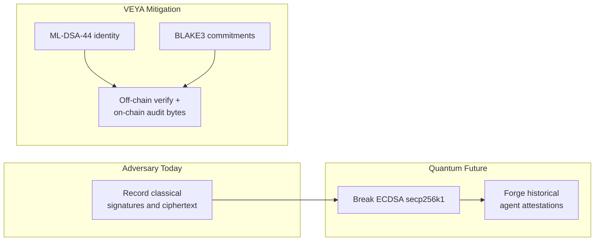
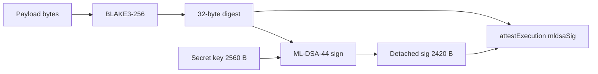
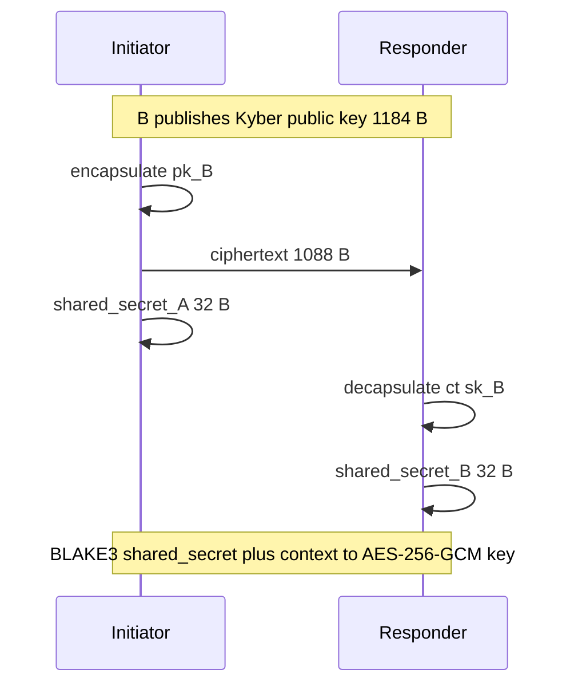
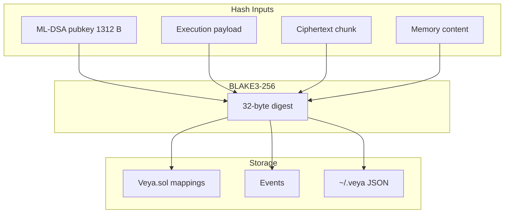
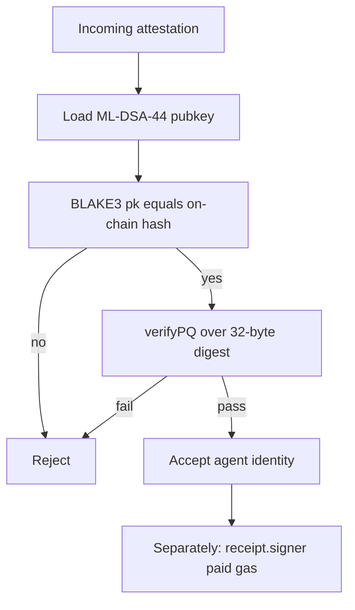
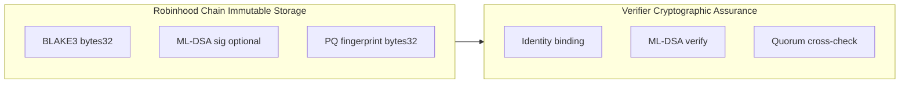
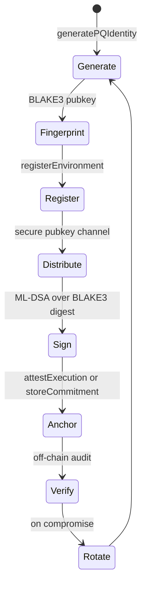
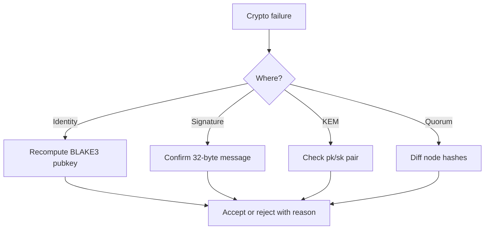

<div align="center">
  

  # Post-Quantum Cryptography in @veyanet/sdk

  **ML-DSA-44 • Kyber-768 • BLAKE3-256: harvest-attack-resistant by design.**

  [](https://csrc.nist.gov/pubs/fips/204/final)
  [](https://csrc.nist.gov/pubs/fips/203/final)
  [](https://explorer.testnet.chain.robinhood.com)

  **[Architecture](./ARCHITECTURE.md)** • **[Verification](./VERIFICATION.md)** • **[Quickstart](./QUICKSTART.md)** • **[README](../README.md)**

</div>

---

`@veyanet/sdk` is built **post-quantum first**. Every new code path in this package uses **ML-DSA-44** for signatures, **Kyber-768** for key encapsulation, and **BLAKE3-256** for commitments. Ethereum secp256k1 remains the chain’s transaction authorization (`msg.sender` on `Veya.sol`); it is not the agent identity algorithm.

This guide explains how each primitive is used in the TypeScript SDK, where verification happens, byte-level sizes, NIST alignment, and how on-chain storage on Robinhood Chain relates to off-chain cryptographic assurance.

Settlement is EVM. Hashes land as `bytes32`. Signature blobs land as `bytes` bounded by `MAX_MLDSA_SIG_LEN = 4627`. The contract does not run Dilithium. Auditors run `verifyPQ`.

---

## Table of Contents

1. [Why Post-Quantum First](#why-post-quantum-first)
2. [Live Testnet Cryptographic Proof](#live-testnet-cryptographic-proof)
3. [Algorithm Selection Matrix](#algorithm-selection-matrix)
4. [ML-DSA-44 Identity and Attestation](#ml-dsa-44-identity-and-attestation)
5. [Kyber-768 Session Transport](#kyber-768-session-transport)
6. [BLAKE3 Commitments](#blake3-commitments)
7. [AES-256-GCM Sealed Path](#aes-256-gcm-sealed-path)
8. [Hybrid Migration Reality](#hybrid-migration-reality)
9. [On-Chain vs Off-Chain Verification](#on-chain-vs-off-chain-verification)
10. [TypeScript Implementation](#typescript-implementation)
11. [Key Lifecycle](#key-lifecycle)
12. [Attestation Canonicalization](#attestation-canonicalization)
13. [Security Properties](#security-properties)
14. [Domain Separation](#domain-separation)
15. [Operational Checklist](#operational-checklist)
16. [Failure Modes](#failure-modes)
17. [Invariants](#invariants)
18. [References](#references)

---

## Why Post-Quantum First

Harvest-now-decrypt-later attacks target long-lived agent identities and settlement records. An adversary recording today’s ECDSA-signed Ethereum transactions may not forge `msg.sender` history (the chain’s account model still binds an address), but they **can** forge classical signatures that were used as **agent identity** once a cryptographically relevant quantum computer exists. If your “agent cert” was secp256k1, the cert dies. If it was ML-DSA-44, the cert survives.



VEYA mitigates HNDL by:

- Anchoring **BLAKE3** digests (Grover-resistant at 256-bit output) as `bytes32` on `Veya.sol`
- Storing **ML-DSA** signature bytes alongside commitments when the caller uses `attestExecution`
- Using **Kyber-768** for coordination session keys (never on-chain)
- Keeping full public keys off-chain while storing **BLAKE3(pubkey)** fingerprints on-chain

**Design rule:** SHA-256 is not used on new SDK commitment paths. BLAKE3 is the sole hash standard in `@veyanet/sdk`. keccak256 appears only as EVM mapping-key derivation (`abi.encodePacked`), which is addressing, not a VEYA commitment.

Ethereum ECDSA still pays gas. That is not a PQ identity. Mixing the two on purpose is the architecture: chain authorization versus agent authorization.

---

## Live Testnet Cryptographic Proof

PQ operations are **confirmed on Robinhood Chain testnet**: real contract writes, real receipts, real explorer links.

| Field | Value |
|-------|-------|
| **Network** | Robinhood Chain Testnet |
| **Chain ID** | `46630` |
| **RPC** | `https://rpc.testnet.chain.robinhood.com` |
| **Explorer** | `https://explorer.testnet.chain.robinhood.com` |
| **Veya.sol** | `0x1a1Dc3c55550FCE9F70ef6cDEeF967c0b72a5d84` |
| **Algorithm** | ML-DSA-44 + Kyber-768 + BLAKE3-256 |
| **Client** | ethers v6 + `@noble/post-quantum` + `hash-wasm` |

### Confirmed transactions

| Operation | Explorer |
|-----------|----------|
| Guest content proof | [0x4314faef…395d](https://explorer.testnet.chain.robinhood.com/tx/0x4314faefee6f1c635f91dd075384d4816e10abd84b9bb88e3328b51e630e395d) |
| Sealed-execution commitment | [0xd68ab196…31d8](https://explorer.testnet.chain.robinhood.com/tx/0xd68ab19671f0a3be63651cb6d6e24f5decf591da981708502827bca3689d31d8) |
| PQ / environment registration path | [0x9a00af5e…8ad4](https://explorer.testnet.chain.robinhood.com/tx/0x9a00af5ef80fdefb3734df19ad30b82aa57fa212bd493b7ad5b224a343808ad4) |

Re-run locally: `npm install && npm test` for round-trips; funded writes via `VeyaClient.registerPqOnchain` or the live ship check. There is no token address in these receipts. `receipt.to` is the protocol contract.

---

## Algorithm Selection Matrix

| Use case | Algorithm | NIST standard | Parameter set | Package |
|----------|-----------|---------------|---------------|---------|
| Environment / agent identity | ML-DSA-44 | [FIPS 204](https://csrc.nist.gov/pubs/fips/204/final) | Dilithium2 | `@noble/post-quantum` `ml_dsa44` |
| Validator node attestation | ML-DSA-44 | FIPS 204 | Dilithium2 | same, plus node binary |
| Coordination session KEM | Kyber-768 | [FIPS 203](https://csrc.nist.gov/pubs/fips/203/final) | ML-KEM-768 | `@noble/post-quantum` `ml_kem768` |
| Execution commitments | BLAKE3-256 |: | 256-bit output | `hash-wasm` `createBLAKE3` |
| Sealed payload encryption | AES-256-GCM | [SP 800-38D](https://csrc.nist.gov/pubs/sp/800/38d/final) | 256-bit key | sealed-node |
| Pubkey fingerprint | BLAKE3(pubkey_bytes) |: | 32-byte digest | `publicKeyHashBlake3` |
| Transaction authorization | secp256k1 ECDSA | Ethereum |: | ethers v6 `Wallet` |
| Mapping keys | keccak256 | EVM | addressing only | Solidity `abi.encodePacked` |

`Veya.sol` stores detached ML-DSA signatures with `MAX_MLDSA_SIG_LEN = 4627`. That bound is larger than ML-DSA-44’s typical signature so a future parameter-set bump does not immediately require a storage-layout change. v1 signers still use ML-DSA-44.

---

## ML-DSA-44 Identity and Attestation

### Purpose

ML-DSA (Module-Lattice-Based Digital Signature Algorithm) provides EUF-CMA unforgeability under quantum adversaries assuming Module-LWE hardness. VEYA uses ML-DSA-44 for:

- Environment and agent identity (pubkey hash on-chain)
- Execution attestation signatures (bytes stored in `Attestation.mldsaSig`)
- Validator node `NodeResult` attestations
- `routeSecureMessage` envelopes after policy allows the tool

### Byte sizes (ML-DSA-44 / FIPS 204)

| Artifact | Bytes | Hex chars | Notes |
|----------|-------|-----------|-------|
| Public key | 1,312 | 2,624 | Stored off-chain only |
| Secret key | 2,560 | 5,120 | Operator custody |
| Signature | 2,420 | 4,840 | Detached; typical ML-DSA-44 |
| On-chain max sig | 4,627 | 9,254 | `MAX_MLDSA_SIG_LEN` storage bound |
| Seed | 32 | 64 | Key generation entropy |
| Fingerprint | 32 | 64 | BLAKE3 of public key |

### NIST parameter mapping

| NIST designation | CRYSTALS name | VEYA v1 |
|------------------|---------------|---------|
| ML-DSA-44 | Dilithium2 | **Default identity algorithm** (`ml_dsa44`) |
| ML-DSA-65 | Dilithium3 | Not used |
| ML-DSA-87 | Dilithium5 | Not used; storage bound can hold a larger sig |

If you generate ML-DSA-87 keys and try to pass them through `attestExecution`, you may still fit the 4,627-byte cap, but verifiers in this SDK call `ml_dsa44.verify`. Stay on ML-DSA-44.

### Signing flow



**Critical rule:** On-chain attestations sign the **32-byte BLAKE3 digest**, not the raw payload and not the hex encoding of the digest.

### TypeScript API

```typescript
import * as pq from "@veyanet/sdk/pq";

const { publicKey, privateKey } = await pq.generatePQIdentity();
const digest = await pq.hashBlake3Bytes(payloadBytes);
const sig = await pq.signPQ(digest, privateKey);
const ok = await pq.verifyPQ(sig, digest, publicKey);
const hash = await pq.publicKeyHashBlake3(publicKey);
```

`VeyaClient.pqKeygen()` is the same `generatePQIdentity`.

### On-chain storage model

The contract never stores full public keys. Registration functions accept:

| Field | Size | Function |
|-------|------|----------|
| `pqPubkeyHash` | 32 bytes | `registerEnvironment` |
| `agentPqHash` | 32 bytes | `registerAgent` |
| `mldsaSig` | ≤ 4,627 bytes | `attestExecution` |
| `identityHash` + `executionHash` | 32 + 32 | `anchorPqAttestation` |

Verifiers recompute `BLAKE3(public_key_bytes)` locally and compare to the on-chain fingerprint. `anchorPqAttestation` links those two hashes without repeating the signature blob: useful when the relayer stored only a commitment.

---

## Kyber-768 Session Transport

### Purpose

Kyber (ML-KEM) provides IND-CCA2 secure key encapsulation. VEYA uses Kyber-768 to establish shared secrets between coordination participants. Session keys are derived via BLAKE3 from the shared secret: **never used raw**, **never written to `Veya.sol`**.

### Byte sizes (Kyber-768 / ML-KEM-768)

| Artifact | Bytes | Notes |
|----------|-------|-------|
| Public key | 1,184 | KEM encapsulation input |
| Secret key | 2,400 | Decapsulation only |
| Ciphertext | 1,088 | Transmitted to decapsulator |
| Shared secret | 32 | Derived into AES-256-GCM key via BLAKE3 |

### NIST parameter mapping

| NIST designation | Security category | VEYA usage |
|------------------|-------------------|------------|
| ML-KEM-512 | Category 1 | Not used |
| ML-KEM-768 | Category 3 | **Default** session KEM |
| ML-KEM-1024 | Category 5 | Available in the library; not default |

### KEM flow



### TypeScript API

```typescript
import * as pq from "@veyanet/sdk/pq";
import { establishKyberSession, getNodeKyberPublicKey } from "@veyanet/sdk";

const { publicKey, privateKey } = pq.generateKyberKeys();
const { ciphertext, sharedSecret } = pq.encapsulateKyber(publicKey);
const recovered = pq.decapsulateKyber(ciphertext, privateKey);

const session = await establishKyberSession("agent-a", "agent-b");
// session.sessionId is BLAKE3(from:to:timestamp)
```

`establishKyberSession` encapsulates to a process-local Kyber key (`getNodeKyberPublicKey`). Session IDs are BLAKE3 of the agent pair plus timestamp. Shared secrets stay in an in-memory map. They are not chain objects.

`routeSecureMessage` runs policy first. On allow, it attaches `kyberSessionId` and an ML-DSA signature over the JSON envelope. Policy is a gate, not a cryptographic afterthought.

### Usage in sealed execution

The SDK passes `sessionEntropy` (32 bytes) to sealed-node as `session_entropy_hex`. Combined with Kyber-derived material, the node derives AES-256-GCM keys. Kyber material **never** lands on-chain.

---

## BLAKE3 Commitments

### Why BLAKE3 over SHA-256?

| Property | SHA-256 | BLAKE3-256 |
|----------|---------|------------|
| Classical collision resistance | 128-bit | 128-bit |
| Post-Grover preimage margin | 128-bit | **256-bit output → 128-bit margin** |
| Throughput (software) | Moderate | High (WASM in this SDK) |
| VEYA SDK v1 status | Not used on new paths | **Required** |

SHA-256 provides 128-bit security against Grover's algorithm. BLAKE3 at 256-bit output maintains comfortable margin for long-lived settlement records that must remain verifiable for decades.

The hosted Use-mode content proof may hash with SHA-256 so a browser can preview without a PQ stack. That is an API product choice. This SDK’s `hashBlake3` is BLAKE3 only.

### Byte sizes

| Artifact | Bytes | Encoding |
|----------|-------|----------|
| BLAKE3 digest | 32 | Raw or 64 hex chars |
| Chunk hash (sealed) | 32 | Per ≤8,192-byte ciphertext chunk |
| Mapping key (EVM) | 32 | keccak of packed fields: not the commitment |

### Commitment domains

| Domain | Input | Output location |
|--------|-------|-----------------|
| Execution | Canonical payload bytes | `Attestation.blake3Hash` |
| Pubkey fingerprint | ML-DSA public key bytes (1,312 B) | `Environment.pqPubkeyHash` |
| Standalone result | Application-defined 32 bytes | `Commitment.commitment` |
| Memory content | Memory entry data string | SDK `blake3ContentHash` |
| Ciphertext chunk | Sealed chunk bytes | `SealedState.blake3CiphertextHash` |
| Consensus | Validator payload | `NodeResult.blake3_execution_hash` |
| Kyber session id | `from:to:timestamp` string | In-memory `KyberSession.sessionId` |

### Commitment graph



### TypeScript

```typescript
import { pq } from "@veyanet/sdk";

const hex = await pq.hashBlake3(payload);
const bytes = await pq.hashBlake3Bytes(payload);
```

Implementation: `createBLAKE3()` from `hash-wasm`, `init`, `update`, `digest("hex")`. Empty input is a valid message; do not special-case it as “no hash.”

Unlike some program runtimes, `Veya.sol` does **not** recompute BLAKE3 inside the EVM on `storeSealedState`. The caller supplies `blake3CiphertextHash`. Auditors must recompute BLAKE3(chunk) off-chain and compare. That is a trust-boundary difference versus an in-program hash: the chain guarantees **what hash was declared with what chunk**, not that the hash is well-formed. Always recompute.

---

## AES-256-GCM Sealed Path

Sealed execution is a **process boundary**, not a homomorphic marketplace.

| Step | Primitive | Where |
|------|-----------|-------|
| Session entropy | 32 random bytes | SDK caller |
| Key derivation | Kyber + BLAKE3 | sealed-node |
| Payload privacy | AES-256-GCM | sealed-node |
| Output binding | BLAKE3 of result / ciphertext | `SealedExecResult` |
| Node authenticity | ML-DSA over execution hash | `mldsa_signature` |
| Data availability | optional chunk + declared hash | `storeSealedState` |

Full TFHE / FHE compute is **not** claimed as live. If a document says “homomorphic” without naming AES-256-GCM as the current path, it is describing a future module, not this SDK.

Fail-closed: if `:7800` is down, `protectedExec` throws. Painting `verified: true` without a node round-trip is a lie this client will not tell.

---

## Hybrid Migration Reality

This SDK does not ship a `ClassicalLegacy` write path for agent identity. New environments register `pqPubkeyHash` from ML-DSA-44. Operators still use secp256k1 wallets to pay gas because that is how Robinhood Chain authenticates transactions.

| Lane | Algorithms | New agent keys | Notes |
|------|------------|----------------|-------|
| Agent identity | ML-DSA-44 + BLAKE3 | Required | Fingerprint on-chain |
| Session transport | Kyber-768 | Required | Off-chain only |
| Gas / `msg.sender` | secp256k1 | EVM requirement | Not an agent cert |
| Historical ECDSA agent certs |: | Forbidden | Do not register keccak(ethAddress) as `pqPubkeyHash` |

If you are rotating a fleet that previously treated an Ethereum address as identity, generate ML-DSA keys, register a new environment (or a new `revision` after a contract that supports rotation), and distribute the full pubkey out of band. Dual-signing during a window is an operator procedure, not a SDK mode flag.



Never treat `receipt.from` as a substitute for `pqPubkeyHash`.

---

## On-Chain vs Off-Chain Verification

```
+------------------------------------------------------------------+
|                 ON-CHAIN  Veya.sol  chain 46630                  |
|  Store blake3Hash bytes32                                        |
|  Store mldsaSig bytes length <= 4627                             |
|  Store pqPubkeyHash bytes32                                      |
|  Enforce spending, policy, nullifier rules                       |
|  Store sealed chunk + caller-declared hash                       |
|  ECDSA check is the EVM's msg.sender                             |
|  No ML-DSA verify                                                |
|  No Kyber decapsulate                                            |
|  No BLAKE3 opcode                                                |
+------------------------------------------------------------------+
+------------------------------------------------------------------+
|                 OFF-CHAIN  @veyanet/sdk  pq/                        |
|  ML-DSA sign and verify                                          |
|  Kyber encapsulate / decapsulate                                 |
|  BLAKE3 hash and compare                                         |
|  Quorum evaluation                                               |
|  Full pubkey distribution                                        |
+------------------------------------------------------------------+
```



This split is intentional. Robinhood Chain provides **immutable audit storage**; operators and auditors provide **cryptographic verification**. See [VERIFICATION.md](./VERIFICATION.md).

---

## TypeScript Implementation

Workspace dependencies (from `package.json`):

| Dependency | Purpose |
|------------|---------|
| `@noble/post-quantum` | ML-DSA-44 (`ml-dsa.js`) and ML-KEM-768 (`ml-kem.js`) |
| `hash-wasm` | BLAKE3 |
| `ethers` | JSON-RPC, wallets, `Veya.sol` ABI |

Modules:

| File | Exports |
|------|---------|
| `src/pq/mldsa.ts` | `generatePQIdentity`, `signPQ`, `verifyPQ`, `publicKeyHashBlake3` |
| `src/pq/kyber.ts` | `generateKyberKeys`, `encapsulateKyber`, `decapsulateKyber` |
| `src/pq/blake3.ts` | `hashBlake3`, `hashBlake3Bytes` |
| `src/pq/index.ts` | re-export; also `@veyanet/sdk/pq` subpath |

Tests in `src/pq/pq.test.ts` round-trip sign/verify and hash stability. `src/chain.test.ts` pins network constants so a port cannot silently revert to another chain’s IDs.

Do not add a second PQ library “for browsers” that disagrees on byte lengths. One implementation, two runtimes (Node and whatever bundler consumes ESM).

---

## Key Lifecycle



| Step | Operation | Storage |
|------|-----------|---------|
| 1. Generation | `generatePQIdentity()` | Secret key off-chain |
| 2. Fingerprint | BLAKE3 hash | On-chain at registration |
| 3. Distribution | Full pubkey | Encrypted file, HSM, operator handoff |
| 4. Signing | Detached signature over digest |: |
| 5. Anchoring | Submit hash and optional sig | `Veya.sol` mappings |
| 6. Verification | Off-chain `verifyPQ` | Before trusting attestation |
| 7. Rotation | New fingerprint; new agent UUID if needed | Old key revoked operationally |

Secret keys must never be committed to git, logged, or stored on-chain. `VEYA_DEPLOYER_PRIVATE_KEY` is an **Ethereum** key for gas. It is not the ML-DSA secret. Losing either is bad; confusing them is worse.

---

## Attestation Canonicalization

Inconsistent serialization breaks signature verification and quorum.

| Context | Canonical form | Signs |
|---------|----------------|-------|
| Validator consensus | JSON body `{ task_id, payload }` as posted | BLAKE3 of node-canonical bytes |
| SDK memory | UTF-8 string of `data` field | BLAKE3 of string |
| Sealed execution | `payload_json` string as provided | BLAKE3 inside sealed flow |
| On-chain attestation | 32-byte BLAKE3 hash | ML-DSA over raw 32 bytes |
| Secure MCP envelope | `JSON.stringify` of unsigned message | ML-DSA over UTF-8 bytes |

Always sign the **hash bytes**, not the hex string, for on-chain attestations.

If three validators disagree, first suspect key order and `undefined` fields in JSON, not lattice math.

---

## Security Properties

| Property | Mechanism | Assumption |
|----------|-----------|------------|
| Unforgeability (PQ) | ML-DSA-44 EUF-CMA | Module-LWE hardness |
| Commitment binding | BLAKE3 collision resistance | Hash function security |
| Session confidentiality | Kyber-768 IND-CCA2 + AES-256-GCM | Lattice + AES assumptions |
| Forward audit | Immutable on-chain hash storage | Robinhood Chain liveness |
| Identity binding | `blake3(pk) == on_chain_hash` | Correct off-chain key distribution |
| Grover margin | BLAKE3-256 output | 128-bit post-quantum preimage |
| Gas payer authenticity | secp256k1 `msg.sender` | ECDSA until quantum; not agent cert |

### Threat matrix

| Threat | Affected primitive | Mitigation |
|--------|-------------------|------------|
| Shor attack | secp256k1 (gas only) | ML-DSA-44 for agent identity |
| Grover attack | 128-bit hashes | BLAKE3-256 on SDK paths |
| HNDL recording | Classical agent certs | PQ-first anchoring today |
| Key compromise | ML-DSA secret | Rotation + nullifier flags |
| Validator collusion | Consensus | Require 2-of-3 independent operators |
| Hash substitution on sealed chunks | Caller-declared hash | Auditor recomputes BLAKE3(chunk) |
| Wrong chain | All anchors | `ensureRobinhoodChain` |

---

## Domain Separation

BLAKE3 is used in several contexts. Do not feed one domain’s preimage into another domain’s verifier without labeling.

| Domain label (operator convention) | Preimage | Verifier |
|------------------------------------|----------|----------|
| Identity | ML-DSA public key bytes | `publicKeyHashBlake3` vs `pqPubkeyHash` |
| Execution | Canonical payload | `NodeResult` / `attestExecution` |
| Commitment | Application 32-byte value | `storeCommitment` uniqueness |
| Memory | Entry `data` string | `readMemory` re-hash |
| Sealed chunk | Ciphertext bytes | Off-chain recompute vs `blake3CiphertextHash` |
| Session | `from:to:timestamp` | `establishKyberSession` |

The chain does not enforce domain labels. A 32-byte value is a 32-byte value. Operators who store an identity hash in `commitments[]` and later treat it as an execution hash have a process bug, not a cryptography bug. `anchorPqAttestation` exists specifically to bind identity hash to execution hash as separate fields.

---

## Operational Checklist

- Generate ML-DSA-44 keys only (`generatePQIdentity`)
- Store secret keys outside the repository (HSM for production)
- Verify `blake3(pubkey) == on_chain_hash` before trusting identity
- Verify ML-DSA signature over the 32-byte execution hash before settlement
- Cross-check attestation hash against consensus quorum when applicable
- Rotate keys on agent compromise; nullify affected memory entries
- Run `npm test` in `@veyanet/sdk` after dependency upgrades
- Confirm live receipts on the Robinhood explorer (`to` must be Veya.sol)
- Never introduce SHA-256 on new SDK commitment paths
- Never document a token address
- Keep Kyber session maps out of logs (they contain `sharedSecretHex`)

Verify a live receipt:

```bash
# open in browser
# https://explorer.testnet.chain.robinhood.com/tx/0x4314faefee6f1c635f91dd075384d4816e10abd84b9bb88e3328b51e630e395d
```

Then run the TypeScript verifier in [VERIFICATION.md](./VERIFICATION.md).

---

## Failure Modes

| Symptom | Cause | Fix |
|---------|-------|-----|
| `verifyPQ` false, hash matches | Signed hex string instead of 32-byte digest | Use raw digest bytes |
| Identity mismatch | Wrong pubkey for agent | Reload from vault |
| `SignatureTooLarge` | Algorithm larger than cap / garbage bytes | Use ML-DSA-44; check length |
| Quorum mismatch | Non-canonical JSON | Stable key order |
| Sealed hash mismatch | Declared hash != BLAKE3(chunk) | Recompute; reject caller hash |
| Kyber secrets differ | Wrong public key | Encapsulate to the decapsulator’s pk |
| `CommitmentAlreadyExists` | Same digest written twice | Intended uniqueness; look up original |
| Chain mismatch | RPC not 46630 | Fix URL; do not disable the guard |



---

## Invariants

1. Agent identity is ML-DSA-44. `pqPubkeyHash` is BLAKE3 of that public key, 32 bytes.
2. Commitments in this SDK are BLAKE3-256. keccak256 is EVM addressing, not a VEYA digest.
3. Kyber-768 shared secrets never appear in `Veya.sol` storage or events.
4. `attestExecution` may store a signature; it never verifies one.
5. `storeSealedState` stores the caller’s hash; auditors recompute.
6. Ethereum ECDSA authenticates the gas payer. It does not authenticate the agent.
7. `MAX_MLDSA_SIG_LEN` is 4627. ML-DSA-44 signatures are 2420 bytes and fit.
8. There is no token, mint, or ERC-20 in this cryptographic profile.
9. Quorum agreement is hash equality, not a count of HTTP 200s with distinct hashes.
10. Hosted API cryptography is this SDK. A second algorithm set in the API is a bug.

---

## References

| Document | URL / location |
|----------|----------------|
| NIST FIPS 203: ML-KEM (Kyber) | https://csrc.nist.gov/pubs/fips/203/final |
| NIST FIPS 204: ML-DSA (Dilithium) | https://csrc.nist.gov/pubs/fips/204/final |
| NIST SP 800-38D: AES-GCM | https://csrc.nist.gov/pubs/sp/800/38d/final |
| BLAKE3 specification | https://github.com/BLAKE3-team/BLAKE3-specs |
| `@noble/post-quantum` | https://github.com/paulmillr/noble-post-quantum |
| VEYA architecture | [ARCHITECTURE.md](./ARCHITECTURE.md) |
| Verification procedures | [VERIFICATION.md](./VERIFICATION.md) |
| Quickstart | [QUICKSTART.md](./QUICKSTART.md) |
| `Veya.sol` | [../../contracts/Veya.sol](../../contracts/Veya.sol) |

---

<div align="center">

**@veyanet/sdk Cryptographic Profile**: Post-quantum first. BLAKE3 commitments. Robinhood Chain storage. Hosted API optional.

[Architecture](./ARCHITECTURE.md) • [Verification](./VERIFICATION.md) • [Quickstart](./QUICKSTART.md)

</div>
