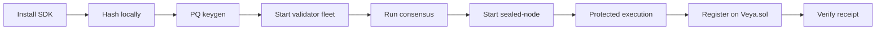
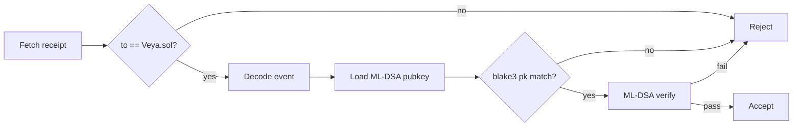
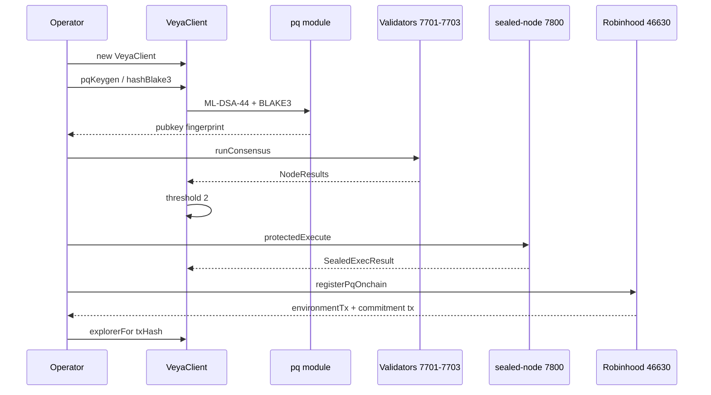
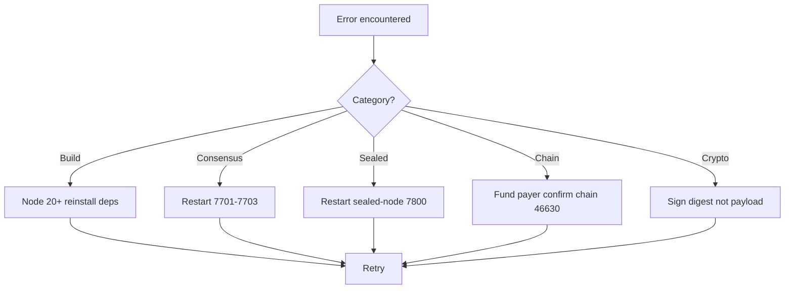

<div align="center">
  

  # VEYA SDK Quickstart

  **From zero to post-quantum agent settlement on Robinhood Chain.**

  [](../package.json)
  [](https://docs.ethers.org/v6/)
  [](https://explorer.testnet.chain.robinhood.com)

  **[Documentation Hub](../README.md)** • **[Architecture](./ARCHITECTURE.md)** • **[Post-Quantum](./POST_QUANTUM.md)** • **[Verification](./VERIFICATION.md)**

</div>

---

Get `@veyanet/sdk` running locally, execute a full post-quantum workflow, and optionally anchor attestations to **live Robinhood Chain testnet**. This walkthrough does **not** require the hosted API at `https://api.veyanet.tech`. You need Node 20+, this package, and: for writes: a funded testnet wallet. Validator and sealed-node processes are local HTTP services the SDK calls; they are not a VEYA cloud.

`Veya.sol` is a protocol contract. It is not a token. Do not look for an ERC-20 address.

### Prerequisites

| Tool | Version | Verify |
|------|---------|--------|
| **Node.js** | 20+ | `node --version` |
| **npm** | 10+ (bundled with Node) | `npm --version` |
| **Funded wallet** | ETH on chain 46630 | needed only for on-chain writes |
| **validator-node** | local binaries | ports 7701–7703 for consensus |
| **sealed-node** | local binary | port 7800 for protected execution |

### What you will accomplish



Hashing and keygen need no chain. Consensus needs three local nodes. Writes need `VEYA_DEPLOYER_PRIVATE_KEY` and ETH for gas.

---

## Table of Contents

1. [Install and Build](#1-install-and-build)
2. [Construct a Client](#2-construct-a-client)
3. [Generate Post-Quantum Keys](#3-generate-post-quantum-keys)
4. [Hash a Commitment](#4-hash-a-commitment)
5. [Start Validator Nodes](#5-start-validator-nodes)
6. [Run Consensus](#6-run-consensus)
7. [Start Sealed Node](#7-start-sealed-node)
8. [Protected Sealed Execution](#8-protected-sealed-execution)
9. [Configure Robinhood Chain](#9-configure-robinhood-chain)
10. [Register an Environment On-Chain](#10-register-an-environment-on-chain)
11. [Call the Ten Solidity Functions](#11-call-the-ten-solidity-functions)
12. [Verify a Receipt](#12-verify-a-receipt)
13. [Run Tests](#13-run-tests)
14. [Use With the Hosted API](#14-use-with-the-hosted-api)
15. [End-to-End Lifecycle Diagram](#15-end-to-end-lifecycle-diagram)
16. [Environment Variables](#16-environment-variables)
17. [Troubleshooting](#17-troubleshooting)
18. [Operator Runbook](#18-operator-runbook)
19. [Next Steps](#19-next-steps)

---

## 1. Install and Build

From this repository:

```bash
npm install
npm test
npm run build
```

This compiles `src/` with tsup into ESM + CJS under `dist/`, including types.

### Consume from another package in the monorepo

`https://api.veyanet.tech` already depends on the SDK as a file path:

```json
"@veyanet/sdk": "^1.0.0"
```

```ts
import {
  VeyaClient,
  EvmAnchor,
  ROBINHOOD_TESTNET,
  runConsensus,
  protectedExec,
  pq,
} from "@veyanet/sdk";
```

### Verify build artifacts

| Artifact | Path |
|----------|------|
| ESM bundle | `dist/index.js` |
| CJS bundle | `dist/index.cjs` |
| Types | `dist/index.d.ts` |
| PQ subpath | `dist/pq/index.js` (`@veyanet/sdk/pq`) |
| Example | `examples/quickstart.ts` |

Run the example (hash only, no wallet):

```bash
npx tsx examples/quickstart.ts
```

Expected shape: chain name, chain id `46630`, RPC, contract `0x1a1Dc3c55550FCE9F70ef6cDEeF967c0b72a5d84`, a 64-char BLAKE3 hex string, and `evmReady: false` unless `VEYA_DEPLOYER_PRIVATE_KEY` is set.

---

## 2. Construct a Client

Local hashing needs no wallet:

```ts
import { VeyaClient, ROBINHOOD_TESTNET, explorerTxUrl } from "@veyanet/sdk";

const client = new VeyaClient();
const digest = await client.hashBlake3("treasury vote 31 Aug");
// digest is 64 hex chars: BLAKE3-256
console.log(ROBINHOOD_TESTNET.chainId); // 46630
```

On-chain write (funded testnet key):

```ts
const client = new VeyaClient({
  payerPrivateKey: process.env.VEYA_DEPLOYER_PRIVATE_KEY!,
  // rpcUrl / contractAddress / chainId default to Robinhood testnet
});

const { environmentTx, memoTx, explorer } = await client.registerPqOnchain();
console.log(explorer.memo);
```

`registerPqOnchain` is a convenience that generates an ML-DSA identity, calls `registerEnvironment`, then `storeCommitment` of the pubkey fingerprint. The return field `memoTx` is that commitment transaction: it is **not** an SPL Memo and not a Solana signature.

`EvmAnchor` refuses to send if the RPC `eth_chainId` is not `46630` (or the `chainId` you passed in).

### Configuration fields

| Field | Default | Purpose |
|-------|---------|---------|
| `rpcUrl` | `https://rpc.testnet.chain.robinhood.com` | JSON-RPC |
| `contractAddress` | `0x1a1Dc3c55550FCE9F70ef6cDEeF967c0b72a5d84` | `Veya.sol` |
| `chainId` | `46630` | Guarded by `ensureRobinhoodChain` |
| `explorerUrl` | `https://explorer.testnet.chain.robinhood.com` | `explorerTxUrl` |
| `payerPrivateKey` | `VEYA_DEPLOYER_PRIVATE_KEY` | Enables `client.evm` |
| `validatorNodes` | `http://127.0.0.1:7701,7702,7703` | Consensus |
| `sealedNodeUrl` | `http://127.0.0.1:7800` | Protected exec |

Without a private key, `client.evm` is undefined and `registerPqOnchain` throws `payerPrivateKey required for on-chain ops on Robinhood Chain`. Hashing, consensus, and sealed-node calls still work.

---

## 3. Generate Post-Quantum Keys

```ts
import { VeyaClient } from "@veyanet/sdk";
import * as pq from "@veyanet/sdk/pq";

const client = new VeyaClient();
const { publicKey, privateKey } = await client.pqKeygen();
const hash = await pq.publicKeyHashBlake3(publicKey);
console.log("BLAKE3 fingerprint:", hash);
```

`pqKeygen` is `generatePQIdentity` from `src/pq/mldsa.ts`: `@noble/post-quantum` `ml_dsa44.keygen()`. The public key is 1,312 bytes (ML-DSA-44). The secret key is 2,560 bytes. Neither belongs in git, logs, or `Veya.sol`.

Sign and verify a digest:

```ts
const digestBytes = await pq.hashBlake3Bytes("execution payload");
const sig = await pq.signPQ(digestBytes, privateKey);
const ok = await pq.verifyPQ(sig, digestBytes, publicKey);
```

**Critical:** on-chain attestations sign the **32-byte BLAKE3 digest**, not the raw JSON and not the hex string.

Cryptographic details: [POST_QUANTUM.md](./POST_QUANTUM.md)

---

## 4. Hash a Commitment

```ts
import { pq } from "@veyanet/sdk";

const hex = await pq.hashBlake3("veya-sdk-quickstart");
const bytes = await pq.hashBlake3Bytes(new TextEncoder().encode("veya-sdk-quickstart"));
```

`hashBlake3` always returns 64 lowercase hex characters. `hashBlake3Bytes` returns `Uint8Array(32)` suitable for `ethers.hexlify` into a `bytes32` argument.

Do not introduce SHA-256 on new SDK commitment paths. Browser Use-mode content proofs in the hosted product may hash with SHA-256 so a stranger can preview without WASM; that split lives in the API, not in this package.

---

## 5. Start Validator Nodes

Open **three terminals** (or your process supervisor). Bind the canonical local ports:

```bash
# Terminal 1
validator-node alpha 7701

# Terminal 2
validator-node beta 7702

# Terminal 3
validator-node gamma 7703
```

Each node listens on `POST /execute` and returns a BLAKE3 execution hash signed with its node ML-DSA identity. The SDK does not start these processes for you.

### Health check

```bash
curl -s -X POST http://127.0.0.1:7701/execute \
  -H "Content-Type: application/json" \
  -d "{\"task_id\":\"ping\",\"payload\":{\"action\":\"ping\"}}"
```

A live node returns JSON containing a `result` object with `blake3_execution_hash` and `mldsa_signature`. Connection refused means the binary is not running: the SDK will not invent a quorum.

Default URLs in `resolveConfig`:

| Node | URL |
|------|-----|
| alpha | `http://127.0.0.1:7701` |
| beta | `http://127.0.0.1:7702` |
| gamma | `http://127.0.0.1:7703` |

Override with `VEYA_VALIDATOR_NODES` as a comma-separated list.

---

## 6. Run Consensus

```ts
import { VeyaClient } from "@veyanet/sdk";

const client = new VeyaClient({
  validatorNodes: [
    "http://127.0.0.1:7701",
    "http://127.0.0.1:7702",
    "http://127.0.0.1:7703",
  ],
});

const result = await client.runConsensus("task-001", {
  action: "rebalance",
  amount: 1000,
});
console.log(result.agreed_blake3_hash, result.consensus_reached);
```

Successful output shape (`ConsensusResult`):

```json
{
  "task_id": "task-001",
  "agreed_blake3_hash": "<64 hex chars>",
  "consensus_reached": true,
  "threshold": 2,
  "node_results": []
}
```

The quorum requires **2-of-3** matching BLAKE3 hashes among successful node results. Save `agreed_blake3_hash` for on-chain attestation. If two nodes are down, `consensus_reached` is false. That is correct.

You can also call `runConsensus(urls, taskId, payload)` as a free function without constructing `VeyaClient`.

---

## 7. Start Sealed Node

```bash
sealed-node 7800
```

Listens on `POST /protected` for encrypted execution requests.

| Service | Bind | Endpoint |
|---------|------|----------|
| sealed-node | `127.0.0.1:7800` | `POST /protected` |

Override with `VEYA_SEALED_NODE_URL`. If the node is down, `protectedExec` throws. The hosted API treats that as fail-closed (HTTP 503). Do not paint a protected badge when this step did not run.

---

## 8. Protected Sealed Execution

Ensure the sealed node from step 7 is running, then:

```ts
import { randomBytes } from "node:crypto";
import { VeyaClient } from "@veyanet/sdk";

const client = new VeyaClient({
  sealedNodeUrl: "http://127.0.0.1:7800",
});

const result = await client.protectedExecute({
  environmentId: "env-uuid",
  agentId: "agent-uuid",
  eventType: "policy_eval",
  payload: { rule: "max_spend", value: 500 },
  sessionEntropy: randomBytes(32),
});

console.log(result.output_blake3_hash, result.verified);
```

`sessionEntropy` must be 32 bytes. The SDK hex-encodes it as `session_entropy_hex`. The node returns `SealedExecResult`:

| Field | Meaning |
|-------|---------|
| `output_blake3_hash` | Execution digest |
| `mldsa_signature` | Node signature over the digest |
| `verified` | Node-side check flag |
| `sealed.ciphertext` | Encrypted payload bytes |
| `sealed.blake3_commitment` | Commitment over ciphertext |
| `sealed.context_label` | Domain label |

Anchor the hash with `storeSealedState` or `storeCommitment` after you have a registered environment. Live sealed-path receipt: [0xd68ab196…31d8](https://explorer.testnet.chain.robinhood.com/tx/0xd68ab19671f0a3be63651cb6d6e24f5decf591da981708502827bca3689d31d8).

---

## 9. Configure Robinhood Chain

| Field | Value |
|-------|-------|
| **Network** | Robinhood Chain Testnet |
| **Chain ID** | `46630` |
| **RPC** | `https://rpc.testnet.chain.robinhood.com` |
| **Explorer** | `https://explorer.testnet.chain.robinhood.com` |
| **Veya.sol** | `0x1a1Dc3c55550FCE9F70ef6cDEeF967c0b72a5d84` |
| **Native currency** | ETH (18 decimals) |

```ts
import { ROBINHOOD_TESTNET, ROBINHOOD_TESTNET_CHAIN_ID, VEYA_ABI } from "@veyanet/sdk";

ROBINHOOD_TESTNET.chainId;         // 46630
ROBINHOOD_TESTNET.contractAddress; // Veya.sol
VEYA_ABI;                          // compiled ABI, inlined: no extra package
```

Override only when you mean to:

```ts
new VeyaClient({
  rpcUrl: process.env.ROBINHOOD_RPC_URL,
  contractAddress: process.env.VEYA_CONTRACT_ADDRESS,
  chainId: Number(process.env.ROBINHOOD_CHAIN_ID ?? 46630),
  validatorNodes: [
    "http://127.0.0.1:7701",
    "http://127.0.0.1:7702",
    "http://127.0.0.1:7703",
  ],
  sealedNodeUrl: "http://127.0.0.1:7800",
});
```

MetaMask (or any wallet you use beside the SDK) must be on chain **46630**. A write that lands on Ethereum mainnet is a misconfiguration the SDK is designed to refuse.

---

## 10. Register an Environment On-Chain

```ts
import { VeyaClient } from "@veyanet/sdk";

const client = new VeyaClient({
  payerPrivateKey: process.env.VEYA_DEPLOYER_PRIVATE_KEY!,
});

const { publicKeyHash, environmentTx, memoTx, explorer } =
  await client.registerPqOnchain(1); // 1 = SecureEnclave

console.log(publicKeyHash);
console.log(explorer.environment);
console.log(explorer.memo);
```

Environment types (`Veya.sol` `EnvironmentType`):

| Type | Enum | Typical use |
|------|------|-------------|
| Execution | `0` | General agent work |
| SecureEnclave | `1` | Default for `registerPqOnchain`; spend-sensitive rooms |
| Governance | `2` | Policy agents, tool ACLs |

The convenience path generates a random `bytes16` UUID. For a stable room identity (the hosted API maps an app UUID onto 16 bytes), call `EvmAnchor.registerEnvironment` yourself with a chosen UUID.

Live registration-path receipt: [0x9a00af5e…8ad4](https://explorer.testnet.chain.robinhood.com/tx/0x9a00af5ef80fdefb3734df19ad30b82aa57fa212bd493b7ad5b224a343808ad4).

Guest content-proof receipt (hosted API using this SDK): [0x4314faef…395d](https://explorer.testnet.chain.robinhood.com/tx/0x4314faefee6f1c635f91dd075384d4816e10abd84b9bb88e3328b51e630e395d).

---

## 11. Call the Ten Solidity Functions

`client.evm` is an `EvmAnchor`. Methods match ABI names in `INSTRUCTION_NAMES`.

```ts
import { randomBytes } from "node:crypto";
import { VeyaClient, pq } from "@veyanet/sdk";

const client = new VeyaClient({
  payerPrivateKey: process.env.VEYA_DEPLOYER_PRIVATE_KEY!,
});
const evm = client.evm!;

const envUuid = randomBytes(16);
const agentUuid = randomBytes(16);
const { publicKey, privateKey } = await client.pqKeygen();
const envHash = Uint8Array.from(Buffer.from(await pq.publicKeyHashBlake3(publicKey), "hex"));
const agentHash = envHash; // distinct keygen in production

await evm.registerEnvironment(envUuid, envHash, 1);
await evm.registerAgent(envUuid, agentUuid, 1, agentHash);

const digest = await pq.hashBlake3Bytes("payload");
const sig = await pq.signPQ(digest, privateKey);
await evm.attestExecution(envUuid, digest, sig);
await evm.anchorPqAttestation(envUuid, envHash, digest);
await evm.storeCommitment(envUuid, digest);

await evm.initSpendingLimit(agentUuid, 1_000_000_000_000_000_000n, 3600);
await evm.recordSpend(agentUuid, 1_000_000_000_000_000n);
await evm.defineToolPolicy(envUuid, agentUuid, "veya_hash_blake3", true);

const memoryId = randomBytes(16);
await evm.flagMemoryNullifier(envUuid, memoryId);

const chunk = new Uint8Array(32);
const chunkHash = await pq.hashBlake3Bytes(chunk);
const stateId = randomBytes(16);
await evm.storeSealedState(envUuid, stateId, 0, chunkHash, chunk);
```

Spending amounts are **wei**, not any other chain's native unit. `initSpendingLimit` requires the environment owner. `recordSpend` may be called by a relayer. Duplicate `storeCommitment` of the same 32-byte digest reverts `CommitmentAlreadyExists`.

Read back:

```ts
const env = await evm.getEnvironment(envUuid);
console.log(env.owner, env.pqPubkeyHash, env.exists);
```

---

## 12. Verify a Receipt

After anchoring, verification is off-chain. The chain stores bytes; cryptographic assurance is your responsibility.

```ts
import { ethers } from "ethers";
import { ROBINHOOD_TESTNET, VEYA_ABI, VEYA_CONTRACT_ADDRESS } from "@veyanet/sdk";

const provider = new ethers.JsonRpcProvider(ROBINHOOD_TESTNET.rpcUrl);
const txHash = "0x4314faefee6f1c635f91dd075384d4816e10abd84b9bb88e3328b51e630e395d";
const receipt = await provider.getTransactionReceipt(txHash);

if (receipt?.to?.toLowerCase() !== VEYA_CONTRACT_ADDRESS.toLowerCase()) {
  throw new Error("receipt is not a Veya.sol write");
}

const iface = new ethers.Interface(VEYA_ABI);
for (const log of receipt.logs) {
  try {
    console.log(iface.parseLog({ topics: log.topics as string[], data: log.data }));
  } catch {
    /* not a Veya.sol event */
  }
}
```

Then load the ML-DSA public key, confirm `blake3(pubkey) == pqPubkeyHash`, and `verifyPQ` over the 32-byte digest. Full procedures: [VERIFICATION.md](./VERIFICATION.md)



---

## 13. Run Tests

```bash
npm install
npm test
npm run lint
```

Unit tests pin chain id `46630`, explorer host, `VEYA_CONTRACT_ADDRESS`, ABI camelCase function names, and the absence of Solana-style `register_environment`. PQ tests round-trip ML-DSA sign/verify and BLAKE3.

Live RPC writes are **not** part of unit tests. They need a funded key. The hosted tree covers them with `https://api.veyanet.tech/scripts/live-ship-check.ts`.

| Suite | Command | Scope |
|-------|---------|-------|
| SDK unit | `npm test` | Chain defaults, ABI, PQ roundtrip |
| Typecheck | `npm run lint` | `tsc --noEmit` |
| Live ship | live-ship-check | Funded RPC + nodes |

---

## 14. Use With the Hosted API

The SDK does not depend on a hosted API server.

When you **do** run the API:

1. Point `VEYA_VALIDATOR_NODES` and `VEYA_SEALED_NODE_URL` at the same local fleet
2. Fund the relayer wallet on chain 46630
3. Keep guest JWT off write routes (guest may verify proofs; guest may not drive `registerEnvironment`)
4. Confirm receipts with `receipt.to === Veya.sol`, not merely `status === 1`

The dashboard (`robinhood/utility`) talks HTTP to the API. Integrators who want crypto + chain in-process skip both and import `@veyanet/sdk`.

If the API is down, this quickstart still works: you have Node, three validators, one sealed-node, and a payer key.

---

## 15. End-to-End Lifecycle Diagram



---

## 16. Environment Variables

| Variable | Default | Purpose |
|----------|---------|---------|
| `ROBINHOOD_RPC_URL` | public testnet RPC | JSON-RPC |
| `ROBINHOOD_CHAIN_ID` | `46630` | Must match `eth_chainId` |
| `ROBINHOOD_EXPLORER_URL` | testnet explorer origin | Link helper |
| `VEYA_CONTRACT_ADDRESS` | `0x1a1Dc3c55550FCE9F70ef6cDEeF967c0b72a5d84` | Protocol contract |
| `VEYA_DEPLOYER_PRIVATE_KEY` |: | Hex key; never commit |
| `VEYA_VALIDATOR_NODES` | localhost 7701–7703 | Comma-separated origins |
| `VEYA_SEALED_NODE_URL` | `http://127.0.0.1:7800` | Sealed execution |

### Recommended testnet shell

```bash
export ROBINHOOD_RPC_URL="https://rpc.testnet.chain.robinhood.com"
export ROBINHOOD_CHAIN_ID=46630
export VEYA_CONTRACT_ADDRESS="0x1a1Dc3c55550FCE9F70ef6cDEeF967c0b72a5d84"
export VEYA_VALIDATOR_NODES="http://127.0.0.1:7701,http://127.0.0.1:7702,http://127.0.0.1:7703"
export VEYA_SEALED_NODE_URL="http://127.0.0.1:7800"
# export VEYA_DEPLOYER_PRIVATE_KEY=0x...   # funded; local only
```

There is no Solana cluster variable, no program id, and no memo program id in this package.

---

## 17. Troubleshooting

### Install and build

| Issue | Symptom | Fix |
|-------|---------|-----|
| Node too old | engine warning / ESM errors | Install Node 20+ |
| SDK build fails | tsup / types | `rm -rf node_modules dist && npm install && npm run build` |
| Example cannot import | path vs package name | Run from `@veyanet/sdk` with `npx tsx examples/quickstart.ts` |

### Consensus

| Issue | Symptom | Fix |
|-------|---------|-----|
| `consensus_reached: false` | No agreed hash | Ensure all three validator nodes are running on 7701–7703 |
| Node connection refused | `fetch` failed | Start `validator-node`; verify localhost firewall |
| Divergent hashes | Quorum fails with different hashes | Use identical payload objects; check canonical JSON |
| Node timeout | Partial `node_results` | Restart overloaded node; confirm `/execute` |

### Sealed execution

| Issue | Symptom | Fix |
|-------|---------|-----|
| `sealed-node error: 500` | HTTP 500 | Check sealed-node logs; verify port 7800 is free |
| Connection refused | ECONNREFUSED | Start `sealed-node` before `protectedExecute` |
| Invalid environment | 403 | Register the environment UUID on-chain and locally |

### Robinhood Chain

| Issue | Symptom | Fix |
|-------|---------|-----|
| Chain mismatch | expected chain id 46630 | Point RPC at `rpc.testnet.chain.robinhood.com` |
| Insufficient funds | ethers `INSUFFICIENT_FUNDS` | Fund the payer with ETH on chain 46630 |
| Wrong `to` on receipt | Proof looks confirmed | Require `receipt.to === Veya.sol` |
| `CommitmentAlreadyExists` | Retry of same digest | Read the mapping; do not resubmit |
| `EnvironmentDoesNotExist` | Attest before register | `registerEnvironment` first |
| RPC rate limit | HTTP 429 | Back off; dedicated RPC if you have one |
| `eth_estimateGas` revert | Preflight fails | Decode `VeyaSdkError` / custom error selector |

### Cryptography

| Issue | Symptom | Fix |
|-------|---------|-----|
| PQ verify failed | `verifyPQ` false | Sign the **BLAKE3 hash bytes** (32), not hex text |
| Identity mismatch | Hash comparison fails | Reload the matching ML-DSA pubkey |
| Kyber mismatch | Shared secrets differ | Same public key on encapsulate and decapsulate |

### Recovery flowchart



---

## 18. Operator Runbook

Use this when bringing a fresh machine online.

### Cold start

1. Clone the repository. `npm install && npm test`.
2. Confirm `ROBINHOOD_TESTNET.chainId === 46630` via `examples/quickstart.ts`.
3. Start validator-node on 7701, 7702, 7703. Curl `/execute` on each.
4. Start sealed-node on 7800. A connection refused here is a stop, not a skip.
5. Export `VEYA_DEPLOYER_PRIVATE_KEY` for a wallet that already holds testnet ETH.
6. Run `registerPqOnchain(1)`. Open `explorer.environment` in the Robinhood testnet explorer.
7. Confirm the receipt `to` address is `0x1a1Dc3c55550FCE9F70ef6cDEeF967c0b72a5d84`.
8. Archive the three live baseline hashes (guest proof, sealed commitment, registration path) so you can tell a new receipt from a known-good one.

### Daily checks

| Check | Pass criteria |
|-------|---------------|
| Validators | Three `/execute` responses, threshold 2 still reachable |
| Sealed-node | `POST /protected` not connection-refused |
| RPC | `eth_chainId` → `0xb636` (46630) |
| Contract | `eth_getCode` at Veya.sol is non-empty |
| Relayer (if API used) | ETH balance covers several `storeCommitment` writes |

### Incident: quorum lost

Unplug is the design. Kill one validator: two honest hashes still bind. Kill two: there is no quorum. Do not lower the threshold in production to “make CI green.” Restore the node or wait.

### Incident: sealed-node down

Treat every in-flight protected execution as failed. Restart the process. Re-run `protectedExecute`. Only then consider `storeSealedState`. A hash from a previous day is not proof that today’s payload ran.

### Incident: RPC returns the wrong chain

The SDK throws before send. Fix the URL. If you wrapped `EvmAnchor` and skipped `ensureRobinhoodChain`, you have a fork, not this package: restore the guard.

### Incident: duplicate commitment

The contract is working. Look up `commitments[digest]`. The original `authority` and `timestamp` are the audit record. Submit a new digest if the payload changed; never “retry until it sticks” for the same 32 bytes.

---

## 19. Next Steps

| Goal | Guide |
|------|-------|
| System design deep dive | [ARCHITECTURE.md](./ARCHITECTURE.md) |
| PQ byte sizes and NIST refs | [POST_QUANTUM.md](./POST_QUANTUM.md) |
| Off-chain audit procedures | [VERIFICATION.md](./VERIFICATION.md) |
| Package README | [../README.md](../README.md) |
| Contract source | [../../contracts/Veya.sol](../../contracts/Veya.sol) |

---

<div align="center">

**@veyanet/sdk Quickstart**: Post-quantum agent settlement on Robinhood Chain. Protocol contract, not a token. Hosted API optional.

[Architecture](./ARCHITECTURE.md) • [Post-Quantum](./POST_QUANTUM.md) • [Verification](./VERIFICATION.md)

</div>
