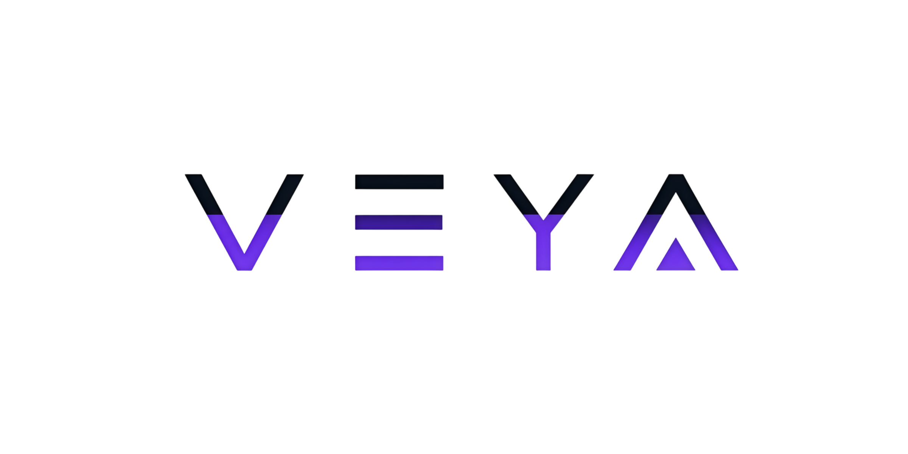
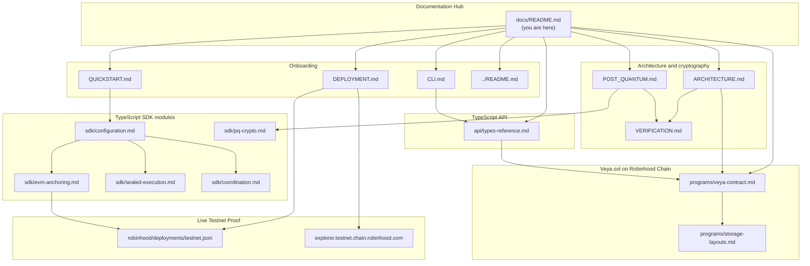
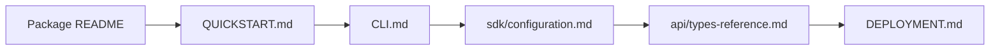
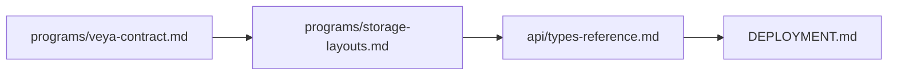
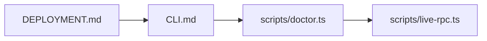
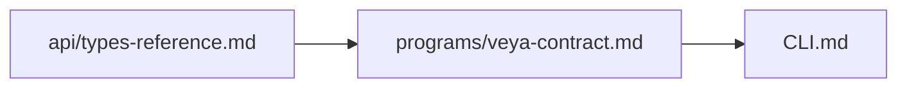
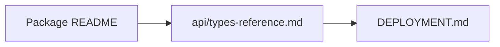
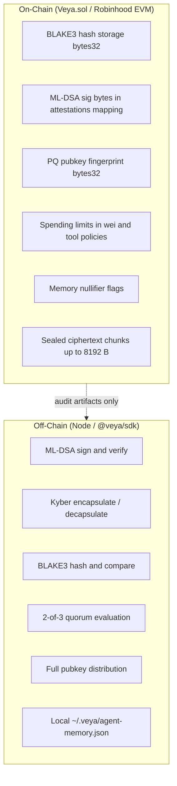

<div align="center">
  

  # VEYA TypeScript SDK Documentation Hub

  **Bounded autonomous systems on Robinhood Chain: post-quantum identity, sealed execution, and Veya.sol settlement.**

  [](../README.md)
  [](../package.json)
  [](../package.json)
  [](../package.json)
  [](https://explorer.testnet.chain.robinhood.com)

  **[Package README](../README.md)** • **[Deployment](./DEPLOYMENT.md)** • **[Operator surface](./CLI.md)** • **[Types](./api/types-reference.md)** • **[Veya.sol](./programs/veya-contract.md)**

</div>

---

## 💡 Information: What This Documentation Covers

The `docs/` tree is the authoritative reference for **`@veya/sdk`**: the TypeScript SDK that integrators and the hosted Robinhood API (`https://api.veyanet.tech`) import in-process. The package provides ML-DSA-44 identity, Kyber-768 session transport, BLAKE3-256 commitments, 2-of-3 validator consensus, sealed-node protected execution, and **ethers v6** writes against **Veya.sol** on **Robinhood Chain**.

This is not a Solana SDK. Settlement is EVM. There is no program ID, no PDA derivation as the product surface, and no SPL Memo companion as the settlement path. `Veya.sol` is a **protocol contract** (environments, agents, attestations, commitments, spending caps, tool policies, memory nullifiers, sealed-state chunks). It is **not** an ERC-20 and it is not a token mint.

No hosted VEYA coordination API is required to use the primitives documented here. Operators run Node scripts against local validator nodes (ports 7701–7703), a sealed node (port 7800), and the public Robinhood Chain testnet JSON-RPC. The optional Rust operator binary `veya-cli` lives in `cli`; this documentation set is about driving `@veya/sdk` from Node.

### Live Robinhood Chain testnet status

`Veya.sol` is **deployed** on Robinhood Chain testnet. Machine-readable state lives in [deployments/testnet.json](../../deployments/testnet.json).

| Field | Value |
|-------|-------|
| **Network** | Robinhood Chain Testnet |
| **chainId** | `46630` (`0xb636`) |
| **Status** | `deployed` |
| **RPC** | `https://rpc.testnet.chain.robinhood.com` |
| **Explorer** | `https://explorer.testnet.chain.robinhood.com` |
| **Veya.sol** | [`0x1a1Dc3c55550FCE9F70ef6cDEeF967c0b72a5d84`](https://explorer.testnet.chain.robinhood.com/address/0x1a1Dc3c55550FCE9F70ef6cDEeF967c0b72a5d84) |
| **Deployer** | `0xa4b900461B265fD1ECdD97792eb3362EEC27bF08` |
| **Deployed at** | `2026-07-15T16:16:30.000Z` |
| **Algorithm** | ML-DSA-44 + Kyber-768 + BLAKE3-256 |
| **Client stack** | ethers v6, `EvmAnchor`, `VeyaClient`, `resolveConfig` |

Contract writes are ordinary EVM transactions. Auditors recompute BLAKE3 digests and verify ML-DSA signatures **off-chain**; the contract stores hashes, signature bytes, and policy state for permanent audit.

---

## 📖 Table of Contents

1. [Design Principles](#design-principles)
2. [Documentation Map (Mermaid)](#documentation-map-mermaid)
3. [Reading Paths by Role](#reading-paths-by-role)
4. [Package Layout](#package-layout)
5. [Documentation Catalog](#documentation-catalog)
6. [On-Chain vs Off-Chain Boundary](#on-chain-vs-off-chain-boundary)
7. [Contract Identity](#contract-identity)
8. [Toolchain Requirements](#toolchain-requirements)
9. [Cross-Cutting Concerns](#cross-cutting-concerns)
10. [Scripts and Operator Utilities](#scripts-and-operator-utilities)
11. [Testing and Verification Entry Points](#testing-and-verification-entry-points)
12. [Glossary](#glossary)
13. [FAQ](#faq)
14. [Support and Security](#support-and-security)

---

## Design Principles

These constraints apply to every document, code path, and operator workflow in this package.

| Principle | What it means | Where to learn more |
|-----------|---------------|---------------------|
| **Environment isolation** | Typed environments with on-chain spending limits, tool policies, memory nullifiers | [programs/veya-contract.md](./programs/veya-contract.md) |
| **No API dependency for primitives** | Local JSON store (`~/.veya`), Node scripts, validator nodes, sealed node: no hosted coordination API required | [CLI.md](./CLI.md) |
| **Validator consensus** | 2-of-3 quorum on critical executions before `attestExecution` | [api/types-reference.md](./api/types-reference.md#consensusresult) |
| **Post-quantum security** | ML-DSA-44 identity and attestation; Kyber-768 session transport; BLAKE3 commitments | Package README and `src/pq/` |
| **Off-chain PQ verification** | EVM gas cannot run ML-DSA at production throughput; chain stores hashes and signature bytes | [programs/veya-contract.md](./programs/veya-contract.md) |
| **BLAKE3 everywhere** | Execution hashes, pubkey fingerprints, ciphertext commitments | `pq.hashBlake3` |
| **Chain-id guard** | `EvmAnchor.ensureRobinhoodChain()` refuses writes when `eth_chainId` is not `46630` (or the configured id) | [DEPLOYMENT.md](./DEPLOYMENT.md) |
| **Wei, not another chain’s native unit** | Spending caps on Robinhood Chain are **wei** (18-decimal ETH) | [programs/storage-layouts.md](./programs/storage-layouts.md) |

**Explicit exclusions:** Solana program IDs, PDA-as-settlement, SPL Memo as the product path, ERC-20 token semantics for `Veya.sol`, and SHA-256 on new commitment paths.

---

## Documentation Map (Mermaid)

The following diagram shows how guides in this tree relate to the live testnet contract and the SDK modules.



---

## Reading Paths by Role

Choose a path based on your responsibility. Each path is ordered for minimal context switching.

### Path A | New integrator (SDK + local Node)



**Goal:** Install `@veya/sdk`, hash with BLAKE3, optionally write to Robinhood Chain testnet with a funded payer key, run consensus against local validators.

### Path B | Smart contract auditor



**Goal:** Understand Solidity function semantics, mapping keys, packed struct layouts, custom errors, and how `EvmAnchor` encodes calldata.

### Path C | Infrastructure operator



**Goal:** Confirm RPC, chain id, contract bytecode, validator fleet (7701–7703), sealed node (7800), and funded deployer key.

### Path D | Policy / MCP runtime developer



**Goal:** Tool policy routing, `PolicyAgent`, memory nullifiers, on-chain `defineToolPolicy` alignment.

### Path E | Hosted API maintainer



**Goal:** Applications consume this package via `@veya/sdk`. Keep ABI, chain constants, and env vars in lockstep.

---

## Package Layout

```

├── src/
│   ├── abi/              # Inlined Veya.sol ABI + bytecode (no @veya/program dep)
│   ├── chain.ts          # ROBINHOOD_TESTNET constants, explorer helpers
│   ├── config.ts         # VeyaClientConfig, resolveConfig
│   ├── index.ts          # Public barrel
│   ├── client/
│   │   ├── VeyaClient.ts # High-level facade
│   │   └── evm.ts        # EvmAnchor: ethers v6 writes
│   ├── compute/          # 2-of-3 runConsensus
│   ├── coordination/     # MCP router, Kyber sessions, PolicyAgent
│   ├── errors/           # VeyaSdkError, revert selector map
│   ├── memory/           # Local ~/.veya/agent-memory.json + nullifiers
│   ├── pq/               # ML-DSA-44, Kyber-768, BLAKE3
│   ├── program/          # INSTRUCTION_NAMES camelCase
│   ├── sealed/           # protectedExec HTTP client
│   └── spending/         # In-process wei caps (pre-chain)
├── examples/
│   └── quickstart.ts     # Hash locally; print testnet targets
├── scripts/
│   ├── doctor.ts         # Operator connectivity / config check
│   └── live-rpc.ts       # Live JSON-RPC probe against testnet
├── docs/                 # You are here
├── package.json          # name: @veya/sdk
└── README.md             # Package intro
```

Related trees outside this package:

| Path | Role |
|------|------|
| `robinhood/contracts/Veya.sol` | Protocol source pin; ABI in `src/abi/` must stay in lockstep |
| `robinhood/deployments/testnet.json` | Live address, deployer, timestamp |
| `robinhood/fixtures/testnet-proofs.json` | Known testnet receipt hashes |
| `cli` | Optional Rust `veya-cli` (not this package) |
| `https://api.veyanet.tech` | Hosted API that imports `@veya/sdk` |
| `robinhood/utility` | Dashboard; talks HTTP to the API, not to this package directly |

---

## Documentation Catalog

### 🚀 Getting Started

| Guide | Description |
|-------|-------------|
| [../README.md](../README.md) | Package intro, install, five-minute hash + optional on-chain write |
| [QUICKSTART.md](./QUICKSTART.md) | End-to-end Node walkthrough against Robinhood testnet |
| [CLI.md](./CLI.md) | Node operator surface: `npm test`, examples, `scripts/doctor.ts`, `scripts/live-rpc.ts` |
| [DEPLOYMENT.md](./DEPLOYMENT.md) | Using the deployed contract, funding a payer, validator/sealed cluster, env vars |

### 🛡️ Architecture and Cryptography

| Guide | Description |
|-------|-------------|
| [ARCHITECTURE.md](./ARCHITECTURE.md) | System architecture, trust boundaries, component deep dives |
| [POST_QUANTUM.md](./POST_QUANTUM.md) | ML-DSA-44, Kyber-768, BLAKE3 sizes and verification split |
| [VERIFICATION.md](./VERIFICATION.md) | Off-chain PQ verification workflows and audit procedures |

### ⛓️ On-Chain Protocol

| Guide | Description |
|-------|-------------|
| [programs/veya-contract.md](./programs/veya-contract.md) | All ten `Veya.sol` functions with args, events, errors, and `EvmAnchor` mapping |
| [programs/storage-layouts.md](./programs/storage-layouts.md) | Mapping keys, packed structs, slot math, calldata encoding |

### 🧩 TypeScript SDK Modules

| Guide | Responsibility |
|-------|----------------|
| [sdk/configuration.md](./sdk/configuration.md) | `VeyaClientConfig`, environment variables, `resolveConfig` |
| [sdk/pq-crypto.md](./sdk/pq-crypto.md) | SDK PQ primitives: keygen, sign, verify, BLAKE3 hash |
| [sdk/evm-anchoring.md](./sdk/evm-anchoring.md) | `EvmAnchor`, ethers v6 writes, chain-id guard |
| [sdk/sealed-execution.md](./sdk/sealed-execution.md) | `protectedExec`, sealed-node HTTP protocol |
| [sdk/coordination.md](./sdk/coordination.md) | MCP routing, Kyber sessions, `PolicyAgent` |

### 📚 API Reference

| Guide | Description |
|-------|-------------|
| [api/types-reference.md](./api/types-reference.md) | `VeyaClientConfig`, `ConsensusResult`, `SealedExecResult`, `MemoryEntry`, `SpendingLimit`, `PolicyAgent`, `ROBINHOOD_TESTNET`, `EvmAnchor`, `InstructionName` |

---

## On-Chain vs Off-Chain Boundary

Understanding this split is prerequisite for every other guide.



| Data class | On-chain | Off-chain |
|------------|----------|-----------|
| Full ML-DSA public keys | Fingerprint only (`bytes32 pqPubkeyHash`) | Operator vault / SDK process memory |
| Signature validity | Stored in `attestations[key].mldsaSig`, not verified in Solidity | `pq.verifyPQ` |
| Kyber session keys | Never stored | `establishKyberSession` |
| Execution payload | BLAKE3 digest only | Validator / sealed-node bodies |
| Consensus results | Optional `attestExecution` after quorum | Ephemeral JSON from validator fleet |
| Memory content | Nullifier flag only | `~/.veya/agent-memory.json` |

`EvmAnchor` is the only module that submits transactions. `VeyaClient` constructed without `payerPrivateKey` still hashes, runs consensus, and calls the sealed node.

---

## Contract Identity

| Field | Value |
|-------|-------|
| Solidity source | `robinhood/contracts/Veya.sol` |
| Testnet address | `0x1a1Dc3c55550FCE9F70ef6cDEeF967c0b72a5d84` |
| SDK constant | `VEYA_CONTRACT_ADDRESS` / `ROBINHOOD_TESTNET.contractAddress` |
| Function count | 10 writes + public mapping getters + constants |
| Record types | 9 structs behind 9 mappings |
| Max ML-DSA signature on-chain | 4,627 bytes (`MAX_MLDSA_SIG_LEN`) |
| Max sealed chunk | 8,192 bytes (`MAX_SEALED_CHUNK`) |
| Max tool name | 64 bytes (`MAX_TOOL_NAME_LEN`) |
| Native currency | ETH, 18 decimals, amounts in **wei** |
| Token interface | None: not ERC-20, not ERC-721 |

Function catalog (camelCase, matching Solidity and `INSTRUCTION_NAMES`): [programs/veya-contract.md](./programs/veya-contract.md). Storage keys: [programs/storage-layouts.md](./programs/storage-layouts.md).

---

## Toolchain Requirements

| Tool | Minimum version | Purpose |
|------|-----------------|---------|
| **Node.js** | 20+ | SDK runtime (`engines.node`) |
| **npm** | 9+ | Install, test, build |
| **TypeScript** | 5.9 (dev) | `npm run lint` (`tsc --noEmit`) |
| **ethers** | 6.x | JSON-RPC + `Contract` writes |
| **vitest** | 3.x | `npm test` |
| **tsup** | 8.x | Dual ESM/CJS build |
| **Funded testnet ETH** | enough for gas | Required only for `EvmAnchor` writes |

```bash
npm install
node --version    # v20+
npm install
npm test
npm run build
```

Rust, Anchor, and Solana CLI are **not** required to consume this package. They are relevant only if you rebuild `Veya.sol` from `Veya Protocol` or run `veya-cli`.

---

## Cross-Cutting Concerns

### Error handling

Solidity custom errors (`EnvironmentDoesNotExist`, `SpendingLimitExceeded`, …) surface through ethers as revert data. `src/errors/veya-error.ts` maps known 4-byte selectors onto `VeyaSdkError.code`. Unknown selectors remain `ANCHOR_REVERT` with raw data attached. See [api/types-reference.md](./api/types-reference.md#veyasdkerror).

### Versioning

Package version is **1.0.0** (`package.json`). Breaking changes to `VeyaClientConfig`, `INSTRUCTION_NAMES`, or `ROBINHOOD_TESTNET` are treated as major. The inlined ABI in `src/abi/Veya.json` must match `Veya.sol` at the deployed address.

### Environment variables

| Variable | Default | Purpose |
|----------|---------|---------|
| `ROBINHOOD_RPC_URL` | `https://rpc.testnet.chain.robinhood.com` | JSON-RPC endpoint |
| `ROBINHOOD_CHAIN_ID` | `46630` | Expected `eth_chainId` |
| `ROBINHOOD_EXPLORER_URL` | `https://explorer.testnet.chain.robinhood.com` | Explorer origin |
| `VEYA_CONTRACT_ADDRESS` | `0x1a1Dc3c55550FCE9F70ef6cDEeF967c0b72a5d84` | Protocol contract |
| `VEYA_DEPLOYER_PRIVATE_KEY` | unset | Payer hex key for writes (never commit) |
| `VEYA_VALIDATOR_NODES` | `http://127.0.0.1:7701,7702,7703` | Comma-separated origins |
| `VEYA_SEALED_NODE_URL` | `http://127.0.0.1:7800` | Sealed execution origin |

Resolution order is constructor argument, then env, then `ROBINHOOD_TESTNET`. Full table: [DEPLOYMENT.md](./DEPLOYMENT.md#environment-configuration) and `resolveConfig` in [api/types-reference.md](./api/types-reference.md#veyaclientconfig).

### Contributing to docs

When Solidity behavior changes, update `veya-contract.md` and `storage-layouts.md` in the same change as `src/abi/Veya.json`. When SDK types change, update `api/types-reference.md`. Use PQ-first language; do not introduce SHA-256 on new commitment paths.

---

## Scripts and Operator Utilities

This package is a TypeScript SDK, not a Rust CLI. Operators drive it from Node:

| Entry | Purpose |
|-------|---------|
| `examples/quickstart.ts` | Local BLAKE3 hash; prints default testnet targets |
| `scripts/doctor.ts` | Checks RPC, chain id, contract address, env completeness |
| `scripts/live-rpc.ts` | Live `eth_chainId` / `eth_getCode` / optional read of `environments` |
| `npm test` | Vitest: PQ round-trip, chain constants, camelCase ABI names |
| `npm run build` | tsup ESM + CJS + dts |
| `npm run lint` | `tsc --noEmit` |

```bash
npm install
npx tsx examples/quickstart.ts
npx tsx scripts/doctor.ts
npx tsx scripts/live-rpc.ts
```

Deep dive: [CLI.md](./CLI.md).

The optional binary `veya` (`veya-cli`) is **not** shipped here. If you need SQLite-backed `veya env create` / `veya consensus run` from a Rust binary, use `cli`. Consensus and sealed HTTP contracts are the same (`POST /execute`, `POST /protected`), so Node `runConsensus` / `protectedExec` are interchangeable with that CLI for fleet smoke checks.

---

## Testing and Verification Entry Points

| Suite | Command | Scope |
|-------|---------|-------|
| SDK unit | `npm test` | BLAKE3 determinism, ML-DSA sign/verify, chain id 46630, ABI camelCase |
| Typecheck | `npm run lint` | Public types vs implementation |
| Operator doctor | `npx tsx scripts/doctor.ts` | Env + RPC + contract code present |
| Live RPC | `npx tsx scripts/live-rpc.ts` | Real `eth_chainId` against testnet |
| Quickstart | `npx tsx examples/quickstart.ts` | Hash + print resolved config |

Live writes (`registerEnvironment`, `storeCommitment`, …) require `VEYA_DEPLOYER_PRIVATE_KEY` and a funded testnet wallet. They are not part of `npm test`. The hosted API may run a separate live ship check; this package’s unit tests stay offline so CI does not spend ETH.

Verify a mined transaction:

```bash
# Explorer
# https://explorer.testnet.chain.robinhood.com/tx/<0xhash>

# JSON-RPC
curl -s https://rpc.testnet.chain.robinhood.com \
  -H 'content-type: application/json' \
  -d '{"jsonrpc":"2.0","id":1,"method":"eth_getTransactionReceipt","params":["0x..."]}'
```

---

## Glossary

| Term | Meaning |
|------|---------|
| **Veya.sol** | Protocol contract on Robinhood Chain. Not an ERC-20. |
| **EvmAnchor** | ethers v6 client that encodes the ten write functions and waits for receipts |
| **VeyaClient** | Facade: PQ + consensus + sealed + optional `EvmAnchor` |
| **resolveConfig** | Merges constructor args, env vars, and `ROBINHOOD_TESTNET` |
| **Attestation** | BLAKE3 execution commitment with optional ML-DSA sig bytes in mapping storage |
| **Nullifier** | On-chain flag that a memory slot was consumed (spend-once) |
| **Quorum** | Minimum agreeing validators (default 2 of 3) |
| **Sealed execution** | AES-256-GCM protected workload at the sealed node, with BLAKE3 output commitments |
| **Wei** | 1e-18 ETH on Robinhood Chain; unit for `initSpendingLimit` / `recordSpend` |
| **bytes16 uuid** | 128-bit environment / agent / memory identifier passed as `bytes16` |
| **Mapping key** | `keccak256` of packed fields (or the uuid / hash itself): see storage-layouts |
| **InstructionName** | CamelCase Solidity function name in `INSTRUCTION_NAMES` |
| **Harvest-now-decrypt-later** | Adversary records classical signatures today to forge after a quantum break |

---

## FAQ

### Why is ML-DSA verification off-chain?

Robinhood Chain is EVM. Dilithium verification inside a Solidity contract is impractical at production gas and throughput. The contract stores immutable hash and signature bytes; auditors verify with `pq.verifyPQ` at native speed.

### Do I need a VEYA API server?

**No** for hashing, consensus against self-hosted validators, sealed-node calls, and direct `EvmAnchor` writes. The hosted `https://api.veyanet.tech` is an optional product surface that itself imports this SDK.

### Which hash function should I use?

**BLAKE3-256** for all new commitments. Do not introduce SHA-256 on new commitment paths in this package.

### How many validator nodes do I need?

Minimum **three** with a **2-of-3** quorum threshold for Byzantine tolerance of one faulty node. Defaults bind `127.0.0.1:7701–7703`.

### Where are secret keys stored?

Off-chain only. `VEYA_DEPLOYER_PRIVATE_KEY` is an secp256k1 hex key for gas payment. ML-DSA secret keys stay in process memory or an operator vault. On-chain records store BLAKE3 pubkey hashes only.

### Is Veya.sol a token?

**No.** There is no `transfer`, no `balanceOf`, no decimals on a VEYA token. Native ETH pays gas. Spending limits count **wei** of native currency recorded by agents, not token balances.

### How is this different from the Solana VEYA program?

The Solana tree (`anchor/`) uses PDAs and (historically) memo companions. This package talks to **mappings** on **Veya.sol** at a 20-byte address on chain id **46630**. Function names are camelCase (`registerEnvironment`), not snake_case. Amounts are wei.

### Where do I report security issues?

Never commit `VEYA_DEPLOYER_PRIVATE_KEY`, funded keystore files, or `~/.veya` memory dumps. Disclose privately to the maintainers. Do not open a public issue that includes key material.

### Can I point this SDK at Ethereum mainnet or another L2?

`EvmAnchor` will send only if `eth_chainId` matches `config.chainId` (default 46630). Pointing at another EVM by accident is the failure mode the guard exists to prevent. A deliberate override of `chainId` + `rpcUrl` + `contractAddress` is possible but is not the supported product path.

---

## Support and Security

| Resource | Link |
|----------|------|
| Package intro | [../README.md](../README.md) |
| Operator surface | [CLI.md](./CLI.md) |
| Deployment | [DEPLOYMENT.md](./DEPLOYMENT.md) |
| Contract functions | [programs/veya-contract.md](./programs/veya-contract.md) |
| Storage | [programs/storage-layouts.md](./programs/storage-layouts.md) |
| Types | [api/types-reference.md](./api/types-reference.md) |
| Testnet explorer | [Veya.sol](https://explorer.testnet.chain.robinhood.com/address/0x1a1Dc3c55550FCE9F70ef6cDEeF967c0b72a5d84) |
| License | MIT |

---

<div align="center">

**@veya/sdk documentation v1.0.0**: Bounded autonomous systems on Robinhood Chain, post-quantum secured, without treating Veya.sol as a token.

[Deployment](./DEPLOYMENT.md) • [Types](./api/types-reference.md) • [Veya.sol](./programs/veya-contract.md) • [Operator surface](./CLI.md)

</div>
