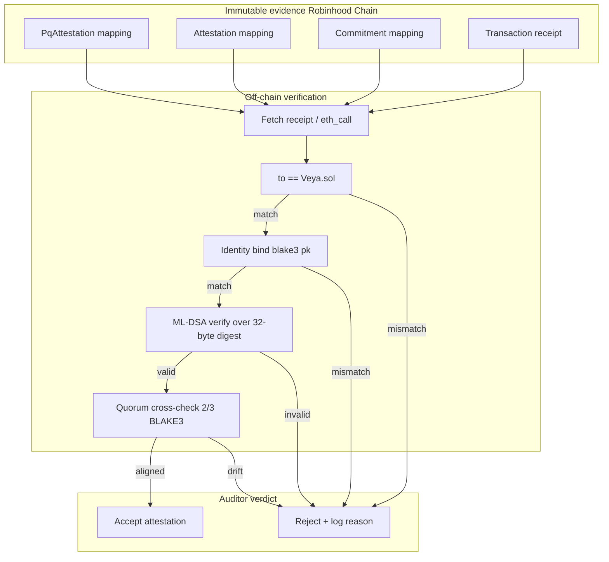
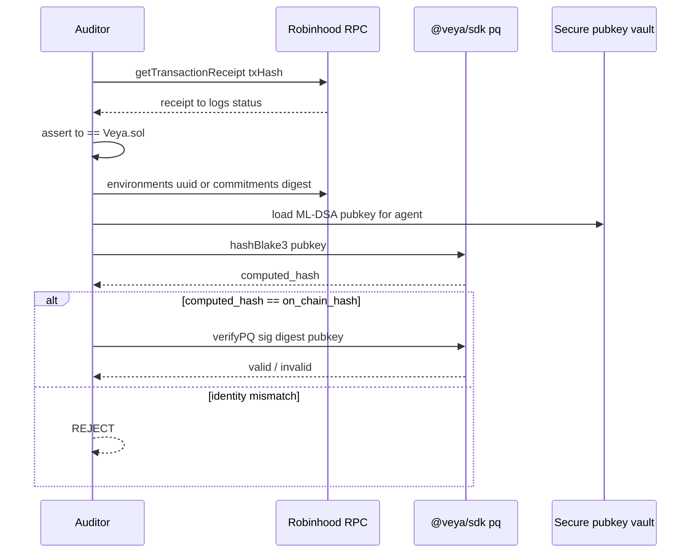
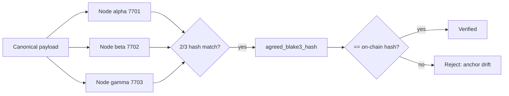

<div align="center">
  

  # Off-Chain PQ Verification

  **Cryptographic assurance for @veya/sdk attestations: ML-DSA-44 and BLAKE3-256, verified off-chain; immutable evidence on Robinhood Chain.**

  [](https://explorer.testnet.chain.robinhood.com)
  [](https://explorer.testnet.chain.robinhood.com/address/0x1a1Dc3c55550FCE9F70ef6cDEeF967c0b72a5d84)

  **[Architecture](./ARCHITECTURE.md)** • **[Post-Quantum](./POST_QUANTUM.md)** • **[Quickstart](./QUICKSTART.md)**

</div>

---

`Veya.sol` stores ML-DSA signature bytes and BLAKE3 hashes on Robinhood Chain but **does not verify lattice signatures inside the EVM**. Gas cost cannot run Dilithium at production throughput. This document defines verification workflows for operators, auditors, and integrators who must trust anchored attestations without treating `https://api.veyanet.tech` as an oracle.

The SDK (`@veya/sdk`) is the verifier. The hosted API uses the same library. You can complete every procedure below with ethers v6, `@veya/sdk/pq`, RPC `https://rpc.testnet.chain.robinhood.com`, and a copy of the agent’s ML-DSA public key.

| Principle | Implementation |
|-----------|----------------|
| **On-chain** | Hashes, optional signature bytes, mappings, events |
| **Off-chain** | ML-DSA verify, BLAKE3 recompute, quorum cross-check |
| **Commitment algo** | BLAKE3-256 only on SDK paths |
| **Identity algo** | ML-DSA-44 (NIST FIPS 204) |
| **Settlement** | Robinhood Chain ID `46630`, ethers v6 |
| **Contract** | `0x1a1Dc3c55550FCE9F70ef6cDEeF967c0b72a5d84` (protocol, not a token) |

**Live testnet receipts** (open on the explorer; confirm `to` is Veya.sol):

| Artifact | Transaction |
|----------|-------------|
| Guest content proof | [0x4314faefee6f1c635f91dd075384d4816e10abd84b9bb88e3328b51e630e395d](https://explorer.testnet.chain.robinhood.com/tx/0x4314faefee6f1c635f91dd075384d4816e10abd84b9bb88e3328b51e630e395d) |
| Sealed-execution commitment | [0xd68ab19671f0a3be63651cb6d6e24f5decf591da981708502827bca3689d31d8](https://explorer.testnet.chain.robinhood.com/tx/0xd68ab19671f0a3be63651cb6d6e24f5decf591da981708502827bca3689d31d8) |
| PQ / environment registration | [0x9a00af5ef80fdefb3734df19ad30b82aa57fa212bd493b7ad5b224a343808ad4](https://explorer.testnet.chain.robinhood.com/tx/0x9a00af5ef80fdefb3734df19ad30b82aa57fa212bd493b7ad5b224a343808ad4) |

---

## Table of Contents

1. [Verification Philosophy](#verification-philosophy)
2. [Audit Flow Overview](#audit-flow-overview)
3. [What the Chain Guarantees](#what-the-chain-guarantees)
4. [Auditor Checklist](#auditor-checklist)
5. [Receipt Identity Checks](#receipt-identity-checks)
6. [Identity Verification](#identity-verification)
7. [Commitment Verification](#commitment-verification)
8. [Execution Attestation Verification](#execution-attestation-verification)
9. [Consensus Cross-Check](#consensus-cross-check)
10. [PQ Attestation Record Verification](#pq-attestation-record-verification)
11. [Sealed State Verification](#sealed-state-verification)
12. [Memory Integrity Verification](#memory-integrity-verification)
13. [Spending and Policy Verification](#spending-and-policy-verification)
14. [Automated Verification Pipeline](#automated-verification-pipeline)
15. [TypeScript Verifier Examples](#typescript-verifier-examples)
16. [ethers v6 Fetch Patterns](#ethers-v6-fetch-patterns)
17. [Audit Trail Requirements](#audit-trail-requirements)
18. [Common Failure Modes](#common-failure-modes)
19. [Operator Runbook](#operator-runbook)
20. [Invariants](#invariants)
21. [Glossary](#glossary)
22. [See Also](#see-also)

---

## Verification Philosophy

On-chain storage provides **immutable evidence**. Off-chain verification provides **cryptographic assurance**. Splitting these concerns delivers:

- Permanent audit records resistant to harvest-now-decrypt-later adversaries
- Native-speed ML-DSA verification in TypeScript (`@noble/post-quantum` via `@veya/sdk`)
- Independent re-verification decades after anchoring: even if secp256k1 is broken for agent-identity purposes

A verifier with Robinhood Chain RPC access, the agent’s ML-DSA public key, and either an `Attestation` mapping row or a `CommitmentStored` event can validate an attestation **without trusting VEYA hosted infrastructure**.



Status `1` on a receipt whose `to` is **not** Veya.sol is not a VEYA proof. ETH transfers confirm; they do not attest.

---

## Audit Flow Overview

End-to-end auditor path from explorer hash to cryptographic accept:



RPC URL: `https://rpc.testnet.chain.robinhood.com`. Explorer: `https://explorer.testnet.chain.robinhood.com/tx/<hash>`. Chain ID must be `46630`.

---

## What the Chain Guarantees

| Guarantee | Mechanism |
|-----------|-----------|
| Record existence | Mapping `exists == true` at write time |
| Timestamp ordering | `block.timestamp` stored on the struct |
| Authority binding | `msg.sender` recorded as `owner` / `authority` |
| Environment binding | `bytes16 environmentUuid` on the record |
| Signature size bound | `mldsaSig.length <= 4627` |
| Spending enforcement | `SpendingLimit` arithmetic in wei |
| Nullifier uniqueness | `MemoryAlreadyNullified` on replay |
| Commitment uniqueness | `CommitmentAlreadyExists` |
| Chain identity of the write | `receipt.to` equals the protocol contract |

The chain does **not** guarantee:

- ML-DSA signature validity
- Correctness of the execution payload behind a hash
- That a caller-supplied `blake3CiphertextHash` equals BLAKE3(chunk)
- Kyber session security (never on-chain)
- That `https://api.veyanet.tech` told the truth in its JSON row

---

## Auditor Checklist

Use this checklist for each attestation under review.

### Phase 1 | Evidence collection

- [ ] Record the Robinhood Chain transaction hash
- [ ] Fetch the full receipt via ethers `getTransactionReceipt`
- [ ] Assert `receipt.to` equals `0x1a1Dc3c55550FCE9F70ef6cDEeF967c0b72a5d84` (checksum-insensitive compare)
- [ ] Assert `receipt.status === 1`
- [ ] Decode logs with `VEYA_ABI`
- [ ] Archive raw JSON snapshot (BLAKE3-chain audit log recommended)
- [ ] Confirm `eth_chainId` is `46630`

### Phase 2 | Identity binding

- [ ] Obtain ML-DSA-44 public key from a secure source (operator handoff, HSM, not from an unauthenticated HTTP API alone)
- [ ] Compute `BLAKE3(public_key_bytes)` (32-byte digest, hex-encode for comparison)
- [ ] Compare to `pqPubkeyHash` / `pqHash` / `identityHash`
- [ ] Confirm environment `owner` matches the expected operator wallet if the claim is “this org registered the room”

### Phase 3 | Signature verification

- [ ] Extract 32-byte `blake3Hash` (not hex string) as the ML-DSA message
- [ ] Load detached `mldsaSig` bytes from the attestation mapping when present
- [ ] Run `verifyPQ` from `@veya/sdk/pq`
- [ ] Confirm algorithm is ML-DSA-44 only
- [ ] If the hosted relayer used `storeCommitment` without sig bytes, skip this phase and rely on identity + digest + quorum

### Phase 4 | Consensus alignment (if applicable)

- [ ] Collect `NodeResult` JSON from the validator run
- [ ] Verify each node’s ML-DSA sig over the execution digest
- [ ] Assert `agreed_blake3_hash == on_chain hash`

### Phase 5 | Policy and spend (treasury / SecureEnclave flows)

- [ ] Read `spendingLimits[agentUuid]`: `spentAmount <= maxAmount` within `periodSecs`
- [ ] Read `toolPolicies` for invoked MCP tools
- [ ] Check `nullifiers[memoryId]` for consumed memory slots

### Phase 6 | Sign-off

- [ ] Document verifier identity, timestamp, `@veya/sdk` version, `@noble/post-quantum` version
- [ ] Store pass/fail in retention system (regulated treasuries typically keep ≥ 7 years)

---

## Receipt Identity Checks

Before cryptography, reject garbage.

```typescript
import { ethers } from "ethers";
import {
  ROBINHOOD_TESTNET,
  VEYA_CONTRACT_ADDRESS,
  isRobinhoodTestnet,
} from "@veya/sdk";

const provider = new ethers.JsonRpcProvider(ROBINHOOD_TESTNET.rpcUrl);
const network = await provider.getNetwork();
if (!isRobinhoodTestnet(network.chainId)) {
  throw new Error(`not Robinhood testnet: chain ${network.chainId}`);
}

function assertVeyaReceipt(receipt: ethers.TransactionReceipt) {
  if (receipt.status !== 1) throw new Error("tx reverted");
  if (receipt.to?.toLowerCase() !== VEYA_CONTRACT_ADDRESS.toLowerCase()) {
    throw new Error("not a Veya.sol write");
  }
}
```

`explorerTxUrl(hash)` builds `https://explorer.testnet.chain.robinhood.com/tx/0x…`. Humans can click it; machines still fetch RPC. Do not accept a screenshot of the explorer as the only artifact.

A known-good baseline:

| Hash | Why it is useful |
|------|------------------|
| `0x4314faef…395d` | Public proof path; `storeCommitment` |
| `0xd68ab196…31d8` | Sealed path commitment |
| `0x9a00af5e…8ad4` | Registration path |

If your receipt’s `to` matches those receipts’ `to`, you are at least on the protocol contract. Then do identity and hash checks.

---

## Identity Verification

### Inputs

| Input | Source |
|-------|--------|
| On-chain hash | `Environment.pqPubkeyHash` or `Agent.pqHash` |
| Full pubkey | Off-chain secure store |

### Algorithm

```
computed = BLAKE3-256(ml_dsa_public_key_bytes)
assert computed == on_chain_hash
```

### TypeScript

```typescript
import { publicKeyHashBlake3 } from "@veya/sdk/pq";
import { EvmAnchor } from "@veya/sdk";

const hash = await publicKeyHashBlake3(publicKey);
const env = await evm.getEnvironment(environmentUuid);
const onChain = (env.pqPubkeyHash as string).replace(/^0x/, "");
if (hash !== onChain) throw new Error("identity mismatch");
```

Public keys are 1,312 bytes for ML-DSA-44. Hashing a hex string of the key (UTF-8) is a different preimage and will fail. Hash the raw bytes.

---

## Commitment Verification

`storeCommitment(environmentUuid, commitment)` is the common hosted-relayer path. Uniqueness is by the 32-byte value itself (`commitments[commitment]`).

Steps:

1. Decode `CommitmentStored(authority, environmentUuid, commitment)` from logs.
2. `eth_call` `commitments(commitment)` and assert `exists`.
3. Assert `environmentUuid` matches the room you think produced the proof.
4. Recompute BLAKE3 over the claimed off-chain payload; compare to `commitment`.
5. Reject if the API row’s digest and the event’s digest differ.

Guest proofs in the hosted product may use SHA-256 for **browser-previewable** content hashing, then the relayer still writes a `bytes32` into `Veya.sol`. If you are auditing a Use-mode content proof, ask which hash function produced the 32 bytes. SDK-native agent attestations are BLAKE3. Mixing them without labeling is an audit finding.

---

## Execution Attestation Verification

### Inputs

- `Attestation` at `attestations[keccak256(abi.encodePacked(authority, blake3Hash))]`
- Agent ML-DSA public key
- Optional: canonical execution payload (recompute BLAKE3)

### Steps

1. Fetch receipt; assert Veya.sol `to`
2. Parse `ExecutionAttested(authority, environmentUuid, blake3Hash)`
3. `eth_call` the mapping with the same key the contract uses
4. Extract `blake3Hash` (32 bytes) and `mldsaSig`
5. Optionally: `BLAKE3(canonical_payload) == blake3Hash`
6. `verifyPQ(sig, blake3HashBytes, pubkey)`

**Critical:** Sign and verify over the **32-byte BLAKE3 digest**, not the hex-encoded string.

### TypeScript

```typescript
import { verifyPQ, hashBlake3Bytes } from "@veya/sdk/pq";

const ok = await verifyPQ(signatureBytes, hashBytes, publicKey);
if (!ok) throw new Error("ML-DSA verification failed");

const recomputed = await hashBlake3Bytes(canonicalPayload);
if (Buffer.compare(recomputed, hashBytes) !== 0) {
  throw new Error("payload does not match anchored digest");
}
```

If `mldsaSig` is empty, the write is a timestamped hash from `msg.sender`, not a PQ attestation. Treat it as a commitment, then look for `anchorPqAttestation` or validator `NodeResult` signatures off-chain.

---

## Consensus Cross-Check

When execution flows through validator nodes:



**Invariant:**

```
quorum_hash == local_hash == on_chain_blake3
```

`runConsensus` in this SDK POSTs `/execute` to each URL and counts matching `blake3_execution_hash` values among `status === "success"` results. Threshold is 2. HTTP failures do not count as votes.

Verify each `NodeResult.mldsa_signature` with `verifyPQ` over the same digest the node hashed. A node that returns a hash but a broken signature is excluded, not averaged.

---

## PQ Attestation Record Verification

`anchorPqAttestation` creates a `PqAttestation` keyed by `executionHash`.

| Field | Must equal |
|-------|------------|
| `identityHash` | `BLAKE3(agent_ml_dsa_pubkey)` |
| `executionHash` | `Attestation.blake3Hash` or the consensus agreed hash |
| `environmentUuid` | Same environment on both records |
| `authority` | Expected signer / relayer |

This record exists so a relayer can store a compact binding without repeating 2,420 signature bytes in every receipt. It is not a substitute for `verifyPQ` when signature bytes exist elsewhere (validator logs, `attestExecution`).

Duplicate `executionHash` reverts `PqAttestationAlreadyExists`. A second “updated” attestation for the same digest will not land; that is a feature.

---

## Sealed State Verification

For each `SealedState` chunk:

1. Download `ciphertext` from `sealedStates[keccak256(env, stateId, chunkIndex)]`
2. Recompute `BLAKE3(ciphertext)` off-chain
3. Compare to `blake3CiphertextHash` (caller-declared at store time: **not** computed in the EVM)
4. Reassemble chunks by `stateId` + ascending `chunkIndex`
5. Decrypt off-chain with session keys from the sealed-node exchange (AES-256-GCM)
6. Confirm `output_blake3_hash` from `protectedExec` matches any `storeCommitment` companion

Because the contract does not re-hash, a malicious caller can store `(chunk A, hash-of-B)`. Detection is the auditor’s recompute. Production operators should store chunks only from `protectedExec` output they themselves received.

Live sealed-path companion: [0xd68ab196…31d8](https://explorer.testnet.chain.robinhood.com/tx/0xd68ab19671f0a3be63651cb6d6e24f5decf591da981708502827bca3689d31d8). Ciphertext may stay off-chain; the chain sees the hash.

Max chunk: 8,192 bytes (`MAX_SEALED_CHUNK`). Larger payloads split. `totalChunks` on the struct is a hint, not a Merkle root: walk indices until `exists` is false, then confirm count.

---

## Memory Integrity Verification

### Off-chain (SDK)

`readMemory` re-hashes `data` and compares to `blake3ContentHash`. Integrity failure throws. Nullified entries throw. Missing keys throw. The file is `~/.veya/agent-memory.json`.

### On-chain

| Step | Check |
|------|-------|
| Before consume | `nullifiers[memoryId].nullified` is false / not exists |
| After consume | Nullifier exists with `nullified == true` and matching `environmentUuid` |

A local invalidate without `flagMemoryNullifier` is not visible to other machines. Production should anchor after local invalidation.

---

## Spending and Policy Verification

Amounts are **wei** of native ETH on Robinhood Chain.

| Account | Auditor action |
|---------|----------------|
| `spendingLimits[agentUuid]` | `spentAmount <= maxAmount` within `periodSecs`; note rollover at `periodStart + periodSecs` |
| `toolPolicies[keccak256(agentUuid, toolName)]` | `allowed == true` for the invoked tool; deny-by-default off-chain |
| `agents[agentUuid]` | `isActive`; `pqHash` matches off-chain pubkey; `environmentUuid` matches room |

SDK `checkSpendAllowed` is preflight. The hosted API may return HTTP 402 before a write. On-chain `recordSpend` is the settlement record. An API that says “under cap” while the mapping says `SpendingLimitExceeded` on replay is an API bug.

`PolicyAgent.evaluateToolCall` combines tool ACL and optional `maxWeiPerAction`. Governance environments should require `requireConsensus` so a tool allow list cannot skip quorum.

---

