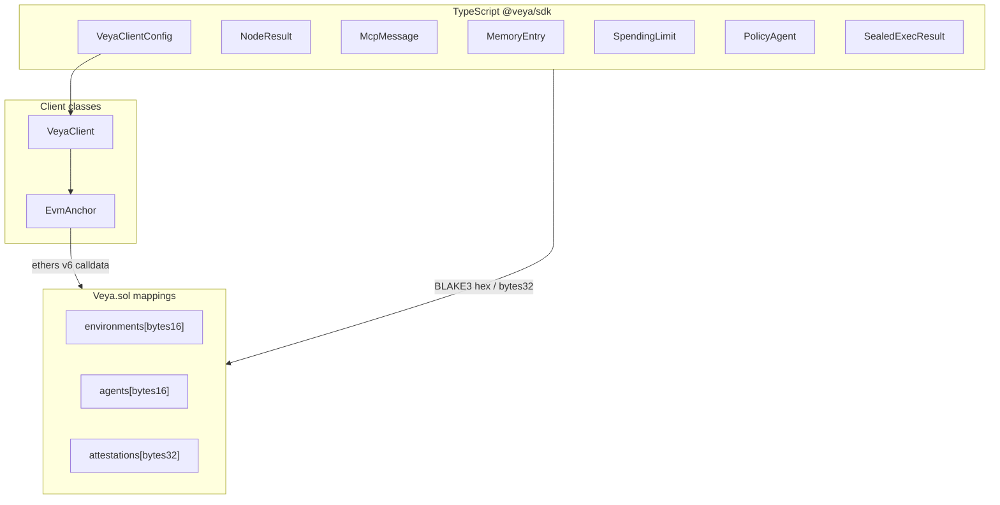
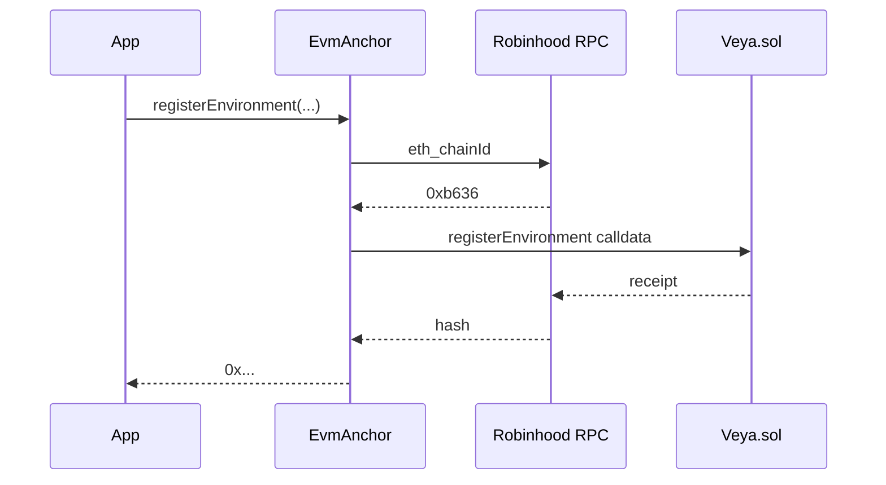
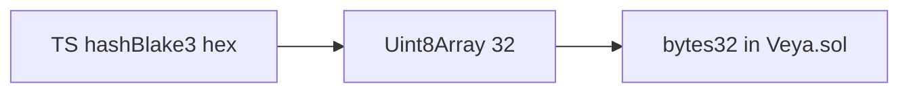

# Types Reference

**Complete TypeScript type catalog for `@veya/sdk` on Robinhood Chain.**

Use this reference when building Node integrations, the hosted API (`https://api.veyanet.tech`), audit tooling, or MCP agents. All new commitments use **BLAKE3-256**. Identity and attestations use **ML-DSA-44**. Coordination sessions use **Kyber-768**. PQ signature verification is **off-chain only**. On-chain types are Solidity structs behind mappings on **Veya.sol**: not Solana account layouts.

Package: `@veya/sdk` at `@veya/sdk`. Client: ethers v6. Facade: `VeyaClient`. Writes: `EvmAnchor`. Config: `resolveConfig`.

**Related:** [../README.md](../README.md) • [veya-contract.md](../programs/veya-contract.md) • [storage-layouts.md](../programs/storage-layouts.md) • [DEPLOYMENT.md](../DEPLOYMENT.md)

---

## Table of Contents

1. [Type System Overview](#type-system-overview)
2. [Constants](#constants)
3. [ROBINHOOD_TESTNET](#robinhood_testnet)
4. [VeyaClientConfig](#veyaclientconfig)
5. [resolveConfig and ResolvedVeyaConfig](#resolveconfig-and-resolvedveyaconfig)
6. [VeyaClient](#veyaclient)
7. [EvmAnchor](#evmanchor)
8. [InstructionName](#instructionname)
9. [ABI exports](#abi-exports)
10. [Consensus types](#consensus-types)
11. [SealedExecResult](#sealedexecresult)
12. [MemoryEntry](#memoryentry)
13. [SpendingLimit](#spendinglimit)
14. [PolicyAgent](#policyagent)
15. [Coordination and Kyber](#coordination-and-kyber)
16. [PQ module (`@veya/sdk/pq`)](#pq-module-veyasdkpq)
17. [VeyaSdkError](#veyasdkerror)
18. [Solidity struct mirrors](#solidity-struct-mirrors)
19. [Explorer helpers](#explorer-helpers)
20. [Serialization notes](#serialization-notes)
21. [Cross-layer mapping](#cross-layer-mapping)
22. [See Also](#see-also)

---

## Type System Overview



| Layer | Module | Primary types |
|-------|--------|---------------|
| Config | `src/config.ts` | `VeyaClientConfig`, `ResolvedVeyaConfig` |
| Network | `src/chain.ts` | `ROBINHOOD_TESTNET`, `RobinhoodNetwork` |
| Client | `src/client/` | `VeyaClient`, `EvmAnchor` |
| Crypto | `src/pq/` | identity pair, Kyber pair, hex digest |
| Compute | `src/compute/consensus.ts` | `NodeResult`, `ConsensusResult` |
| Sealed | `src/sealed/` | `SealedPayload`, `SealedExecResult` |
| Memory | `src/memory/` | `MemoryEntry` |
| Spend | `src/spending/limits.ts` | `SpendingLimit` |
| Policy | `src/coordination/policyAgent.ts` | `PolicyAgent`, `PolicyDecision` |
| Errors | `src/errors/veya-error.ts` | `VeyaSdkError`, `VeyaErrorCode` |
| Settlement | `src/program/instructions.ts` | `InstructionName` |

---

## Constants

| Name | Value | Location | Description |
|------|-------|----------|-------------|
| `ROBINHOOD_TESTNET_CHAIN_ID` | `46630` | `chain.ts` | Decimal chain id |
| `chainIdHex` | `0xb636` | `ROBINHOOD_TESTNET` | Hex chain id |
| `VEYA_CONTRACT_ADDRESS` | `0x1a1Dc3c55550FCE9F70ef6cDEeF967c0b72a5d84` | `abi/index.ts` | Protocol contract |
| `MAX_MLDSA_SIG_LEN` | `4627` | `Veya.sol` | Max Dilithium sig bytes stored |
| `MAX_SEALED_CHUNK` | `8192` | `Veya.sol` | Max ciphertext per chunk |
| `MAX_TOOL_NAME_LEN` | `64` | `Veya.sol` | Tool ACL name limit |
| Default quorum threshold | `2` | `consensus.ts` | 2-of-3 validators |
| Default validator ports | `7701–7703` | `config.ts` | Local fleet |
| Default sealed port | `7800` | `config.ts` | sealed-node |
| BLAKE3 digest size | `32` bytes | All layers | Commitment width |
| UUID width | `16` bytes | `bytes16` | environment / agent / memory ids |
| Native decimals | `18` | ETH on Robinhood Chain | Spend amounts in **wei** |
| ML-DSA parameter set | ML-DSA-44 | `mldsa.ts` | FIPS 204 |
| KEM parameter set | ML-KEM-768 | `kyber.ts` | FIPS 203 (Kyber-768) |

There is no program ID constant. The protocol identity is a 20-byte EVM address.

---

## ROBINHOOD_TESTNET

```typescript
declare const ROBINHOOD_TESTNET_CHAIN_ID = 46630;

declare const ROBINHOOD_TESTNET: {
  readonly chainId: 46630;
  readonly chainIdHex: "0xb636";
  readonly name: "Robinhood Chain Testnet";
  readonly rpcUrl: "https://rpc.testnet.chain.robinhood.com";
  readonly explorerUrl: "https://explorer.testnet.chain.robinhood.com";
  readonly nativeCurrency: {
    readonly name: "ETH";
    readonly symbol: "ETH";
    readonly decimals: 18;
  };
  readonly contractAddress: "0x1a1Dc3c55550FCE9F70ef6cDEeF967c0b72a5d84";
};

type RobinhoodNetwork = typeof ROBINHOOD_TESTNET;
```

| Field | Meaning |
|-------|---------|
| `chainId` | Passed to `resolveConfig` and compared in `EvmAnchor.ensureRobinhoodChain` |
| `rpcUrl` | Default JSON-RPC; override with `ROBINHOOD_RPC_URL` |
| `explorerUrl` | Origin without trailing slash |
| `nativeCurrency` | ETH; spending APIs use wei (`bigint`) |
| `contractAddress` | Veya.sol: protocol, **not** an ERC-20 |

```typescript
import {
  ROBINHOOD_TESTNET,
  ROBINHOOD_TESTNET_CHAIN_ID,
  isRobinhoodTestnet,
} from "@veya/sdk";

isRobinhoodTestnet(46630); // true
isRobinhoodTestnet(1n);    // false
```

`isRobinhoodTestnet` accepts `number | bigint` and compares with `BigInt(46630)`.

---

## VeyaClientConfig

```typescript
type VeyaClientConfig = {
  rpcUrl?: string;
  contractAddress?: string;
  chainId?: number;
  explorerUrl?: string;
  payerPrivateKey?: string;
  validatorNodes?: string[];
  sealedNodeUrl?: string;
};
```

| Field | Type | Default via `resolveConfig` | Notes |
|-------|------|----------------------------|-------|
| `rpcUrl` | `string` | `ROBINHOOD_RPC_URL` or testnet RPC | HTTPS JSON-RPC |
| `contractAddress` | `string` | `VEYA_CONTRACT_ADDRESS` | 20-byte checksum-optional |
| `chainId` | `number` | `ROBINHOOD_CHAIN_ID` or `46630` | Compared as `bigint` on-chain |
| `explorerUrl` | `string` | explorer testnet origin | No trailing slash preferred |
| `payerPrivateKey` | `string` | `VEYA_DEPLOYER_PRIVATE_KEY` | Hex secp256k1; never commit |
| `validatorNodes` | `string[]` | split `VEYA_VALIDATOR_NODES` or localhost 7701–7703 | Origins, no `/execute` suffix |
| `sealedNodeUrl` | `string` | `VEYA_SEALED_NODE_URL` or `http://127.0.0.1:7800` | Origin, no `/protected` suffix |

All fields are optional. An empty constructor is valid and yields a client that can hash and call local nodes but cannot write.

---

## resolveConfig and ResolvedVeyaConfig

```typescript
type ResolvedVeyaConfig = {
  rpcUrl: string;
  contractAddress: string;
  chainId: number;
  explorerUrl: string;
  payerPrivateKey: string | undefined;
  validatorNodes: string[];
  sealedNodeUrl: string;
};

declare function resolveConfig(config?: VeyaClientConfig): ResolvedVeyaConfig;
```

`ResolvedVeyaConfig` is the **filled** form: every field except `payerPrivateKey` is a concrete string or number. `VeyaClient` stores this on `client.config`.

Precedence (first wins):

1. Value passed in `config`
2. Matching environment variable
3. `ROBINHOOD_TESTNET` / hardcoded localhost nodes

`VEYA_VALIDATOR_NODES` is split on commas **without trimming in older mental models**: the consensus client **does** `base.trim()` per URL. Prefer no spaces, or rely on trim.

---

## VeyaClient

```typescript
declare class VeyaClient {
  readonly config: ResolvedVeyaConfig;
  evm?: EvmAnchor;
  constructor(config?: VeyaClientConfig);
  explorerFor(txHash: string): string;
  pqKeygen(): Promise<{ publicKey: Uint8Array; privateKey: Uint8Array }>;
  hashBlake3(data: string | Uint8Array): Promise<string>;
  registerPqOnchain(envType?: number): Promise<{
    publicKey: Uint8Array;
    publicKeyHash: string;
    environmentTx: string;
    memoTx: string;
    explorer: { environment: string; memo: string };
  }>;
  runConsensus(taskId: string, payload: object): Promise<ConsensusResult>;
  protectedExecute(params: {
    environmentId: string;
    agentId: string;
    eventType: string;
    payload: object;
    sessionEntropy: Uint8Array;
  }): Promise<SealedExecResult>;
}
```

| Method | Returns | Requires |
|--------|---------|----------|
| `constructor` | `VeyaClient` | Nothing; key optional |
| `explorerFor` | Explorer `/tx/` URL | Nothing |
| `pqKeygen` | ML-DSA-44 pair | Nothing |
| `hashBlake3` | 64-char hex | Nothing |
| `registerPqOnchain` | Two tx hashes + explorer URLs | `evm` (payer key) |
| `runConsensus` | `ConsensusResult` | Reachable `validatorNodes` |
| `protectedExecute` | `SealedExecResult` | Reachable `sealedNodeUrl` |

`evm` is set only when `payerPrivateKey` or `VEYA_DEPLOYER_PRIVATE_KEY` is present. `registerPqOnchain` throws if `evm` is missing.

`envType` default is **1** (`SecureEnclave`). See [EnvironmentType](#environmenttype).

The field names `environmentTx` / `memoTx` on the registration result refer to `registerEnvironment` and `storeCommitment` receipts. The second write is a **Veya.sol commitment**, not an external memo program.

---

## EvmAnchor

```typescript
declare class EvmAnchor {
  readonly provider: ethers.JsonRpcProvider;
  readonly contract: ethers.Contract;
  readonly wallet: ethers.Wallet;
  readonly chainId: number;
  readonly explorerUrl: string;
  readonly contractAddress: string;
  constructor(config: VeyaClientConfig & { payerPrivateKey: string });
  explorerFor(txHash: string): string;
  ensureRobinhoodChain(): Promise<void>;
  registerEnvironment(environmentUuid: Uint8Array, pqPubkeyHash: Uint8Array, envType: number): Promise<string>;
  registerAgent(environmentUuid: Uint8Array, agentUuid: Uint8Array, agentRole: number, agentPqHash: Uint8Array): Promise<string>;
  storeCommitment(environmentUuid: Uint8Array, commitment: Uint8Array): Promise<string>;
  anchorPqAttestation(environmentUuid: Uint8Array, identityHash: Uint8Array, executionHash: Uint8Array): Promise<string>;
  attestExecution(environmentUuid: Uint8Array, blake3Hash: Uint8Array, mldsaSig: Uint8Array): Promise<string>;
  initSpendingLimit(agentUuid: Uint8Array, maxAmount: bigint, periodSecs: number): Promise<string>;
  recordSpend(agentUuid: Uint8Array, amount: bigint): Promise<string>;
  defineToolPolicy(environmentUuid: Uint8Array, agentUuid: Uint8Array, toolName: string, allowed: boolean): Promise<string>;
  flagMemoryNullifier(environmentUuid: Uint8Array, memoryId: Uint8Array): Promise<string>;
  storeSealedState(
    environmentUuid: Uint8Array,
    stateId: Uint8Array,
    chunkIndex: number,
    blake3CiphertextHash: Uint8Array,
    ciphertextChunk: Uint8Array,
  ): Promise<string>;
  getEnvironment(environmentUuid: Uint8Array): Promise<any>;
  anchorMemo(environmentUuid: Uint8Array, blake3Hex: string): Promise<string>;
  registerPqIdentity(envType?: number): Promise<{ /* same as registerPqOnchain */ }>;
}
```

### Encoding rules

| Argument | SDK type | ethers encoding |
|----------|----------|-----------------|
| uuid / memory / state id | `Uint8Array` length 16 | `ethers.hexlify` → `bytes16` |
| 32-byte hash | `Uint8Array` length 32 | `hexlify` → `bytes32` |
| ML-DSA sig | `Uint8Array` | passed as `bytes` (not hexlified as 32) |
| ciphertext chunk | `Uint8Array` | `bytes` |
| envType / role | `number` | `uint8` |
| maxAmount / amount | `bigint` | `uint256` wei |
| periodSecs | `number` | `uint64` |
| toolName | `string` | Solidity `string` |
| allowed | `boolean` | `bool` |
| chunkIndex | `number` | `uint16` |

Return value of each write is the **receipt hash** (`string`), after `tx.wait()`.

### Lifecycle



`ensureRobinhoodChain` runs once per instance (`networkChecked`). The provider is **not** constructed with `staticNetwork`, so `getNetwork()` actually queries `eth_chainId`.

`getEnvironment` is a view: `contract.environments(hexlify(uuid))`. Tuple shape matches the Solidity `Environment` struct (see below).

---

## InstructionName

Veya.sol function names are **camelCase**. The SDK does not export snake_case instruction names.

```typescript
const INSTRUCTION_NAMES = [
  "registerEnvironment",
  "registerAgent",
  "attestExecution",
  "anchorPqAttestation",
  "storeCommitment",
  "initSpendingLimit",
  "recordSpend",
  "defineToolPolicy",
  "flagMemoryNullifier",
  "storeSealedState",
] as const;

type InstructionName = (typeof INSTRUCTION_NAMES)[number];
```

`src/chain.test.ts` asserts every `InstructionName` exists on `VEYA_ABI` and that `"register_environment"` is **not** in the list.

`EvmAnchor` method names match `InstructionName` one-for-one, plus helpers `getEnvironment`, `anchorMemo`, `registerPqIdentity`, `ensureRobinhoodChain`, `explorerFor`.

---

## ABI exports

```typescript
declare const VEYA_ABI: InterfaceAbi;
declare const VEYA_BYTECODE: string;
declare const VEYA_CONTRACT_ADDRESS: "0x1a1Dc3c55550FCE9F70ef6cDEeF967c0b72a5d84";
```

`VEYA_ABI` is the compiled JSON ABI inlined so `@veya/sdk` does not depend on `@veya/program`. Keep it in lockstep with `robinhood/contracts/Veya.sol`.

Public ABI surface includes:

- Custom errors (see `VeyaSdkError` mapping)
- Events for each write
- The ten write functions
- Public mapping getters (`environments`, `agents`, …)
- Constants `MAX_MLDSA_SIG_LEN`, `MAX_SEALED_CHUNK`, `MAX_TOOL_NAME_LEN`

---

## Consensus types

```typescript
type NodeResult = {
  node_id: string;
  blake3_execution_hash: string;
  mldsa_signature: string;
  mldsa_public_key_hex?: string;
  status: "success" | "fail";
};

type ConsensusResult = {
  task_id: string;
  agreed_blake3_hash: string | null;
  node_results: NodeResult[];
  consensus_reached: boolean;
  threshold: number;
};

declare function runConsensus(
  nodeUrls: string[],
  taskId: string,
  payload: object,
): Promise<ConsensusResult>;
```

| Field | Semantics |
|-------|-----------|
| `blake3_execution_hash` | 64-char hex; counted only when `status === "success"` |
| `threshold` | Always `2` in this package |
| `agreed_blake3_hash` | Hash with the highest success count if `max >= 2`, else `null` |
| `consensus_reached` | `max >= 2 && results.length >= 2` |

Wire: `POST {url}/execute` with `{ task_id, payload }`. The SDK reads `body.result` as `NodeResult`. Nodes that omit `result` are skipped (they do not contribute to `node_results`).

`VeyaClient.runConsensus(taskId, payload)` uses `this.config.validatorNodes`.

---

## SealedExecResult

```typescript
type SealedPayload = {
  ciphertext: number[];
  blake3_commitment: string;
  context_label: string;
};

type SealedExecResult = {
  sealed: SealedPayload;
  output_blake3_hash: string;
  mldsa_signature: string;
  verified: boolean;
};

declare function protectedExec(
  sealedNodeUrl: string,
  params: {
    environmentId: string;
    agentId: string;
    eventType: string;
    payload: object;
    sessionEntropy: Uint8Array;
  },
): Promise<SealedExecResult>;
```

| JSON field to node | Source |
|--------------------|--------|
| `environment_id` | `params.environmentId` |
| `agent_id` | `params.agentId` |
| `event_type` | `params.eventType` |
| `payload_json` | `JSON.stringify(params.payload)` |
| `session_entropy_hex` | hex of 32-byte entropy |

Response: prefers `body.result` as `SealedExecResult`. A flat body with `blake3_execution_hash` is accepted as a compatibility shape and normalized into `output_blake3_hash`.

HTTP not OK throws `Error("sealed-node error: " + status)`.

---

## MemoryEntry

```typescript
type MemoryEntry = {
  id: string;
  environmentId: string;
  agentId: string;
  data: string;
  blake3ContentHash: string;
  nullified: boolean;
};

declare function storeMemory(environmentId: string, agentId: string, data: string): Promise<MemoryEntry>;
declare function readMemory(environmentId: string, id: string): Promise<MemoryEntry>;
declare function invalidateMemory(environmentId: string, id: string): void;
declare function listMemory(environmentId: string): MemoryEntry[];
```

Persistence: `~/.veya/agent-memory.json` (see `MEMORY_FILE` in `src/memory/store.ts`). Keys are `environmentId:id`.

| Function | Behavior |
|----------|----------|
| `storeMemory` | New UUID `id`, `blake3ContentHash = hashBlake3(data)`, `nullified: false` |
| `readMemory` | Throws if missing, nullified, or hash mismatch |
| `invalidateMemory` | Sets `nullified: true` locally |
| `listMemory` | Filter by `environmentId` |

On-chain counterpart is `flagMemoryNullifier(environmentUuid, memoryId)` with `bytes16` ids. Local string UUIDs must be converted to 16 bytes before the EVM call.

---

## SpendingLimit

```typescript
type SpendingLimit = {
  agentId: string;
  environmentId: string;
  maxAmount: bigint | number;
  periodSecs: number;
  spentAmount: bigint | number;
  periodStart: number;
};

declare function setSpendingLimit(
  environmentId: string,
  agentId: string,
  maxAmount: bigint | number,
  periodSecs: number,
): SpendingLimit;

declare function getSpendingLimit(
  environmentId: string,
  agentId: string,
): SpendingLimit | undefined;

declare function recordSpend(
  environmentId: string,
  agentId: string,
  amount: bigint | number,
): boolean;

declare function checkSpendAllowed(
  environmentId: string,
  agentId: string,
  amount: bigint | number,
): boolean;
```

This module is an **in-process** cap used before consensus / sealed execution. It is **not** the on-chain mapping. Units are **wei** when you treat amounts as native ETH. Arithmetic uses `BigInt`.

| Rule | Detail |
|------|--------|
| Missing limit | `recordSpend` returns `true` (allowed); `checkSpendAllowed` returns `true` |
| Period rollover | If `now - periodStart >= periodSecs`, spent resets to 0 |
| Over cap | `recordSpend` throws; `checkSpendAllowed` returns `false` |

On-chain: `EvmAnchor.initSpendingLimit(agentUuid, maxAmount: bigint, periodSecs)` and `recordSpend(agentUuid, amount: bigint)` against `spendingLimits[agentUuid]`.

---

## PolicyAgent

```typescript
type PolicyDecision = {
  allowed: boolean;
  reason: string;
  routed?: McpMessage;
};

type PolicyAgentConfig = {
  environmentId: string;
  agentId: string;
  maxWeiPerAction?: number;
  requireConsensus?: boolean;
};

declare class PolicyAgent {
  readonly config: PolicyAgentConfig;
  constructor(config: PolicyAgentConfig);
  evaluateToolCall(msg: Omit<McpMessage, "policyStatus">): PolicyDecision;
  gateConsensus(required: boolean): PolicyDecision;
}
```

`evaluateToolCall` runs `routeMessage` (in-memory tool ACL). Denied tools return `reason: "tool not in agent policy"`. If `maxWeiPerAction` is set, `checkSpendAllowed` is invoked with that wei cap for `msg.fromAgent`.

`gateConsensus`:

| `requireConsensus` (config) | `required` arg | Result |
|-----------------------------|----------------|--------|
| true | true | allowed, consensus required and enabled |
| true | false | denied, consensus required for this environment |
| false | any | allowed, consensus optional |

Amounts are **wei on Robinhood Chain**. Do not pass another chain’s native unit.

---

## Coordination and Kyber

```typescript
type McpMessage = {
  id: string;
  fromAgent: string;
  toAgent: string;
  tool: string;
  payload: unknown;
  policyStatus: "allowed" | "denied";
  kyberSessionId?: string;
  mlDsaSig?: string;
};

declare function setToolPolicy(agentId: string, tool: string, allowed: boolean): void;
declare function routeMessage(msg: Omit<McpMessage, "policyStatus">): McpMessage;

type SecureRouteOptions = {
  senderPublicKey: Uint8Array;
  senderPrivateKey: Uint8Array;
};

declare function routeSecureMessage(
  msg: Omit<McpMessage, "policyStatus" | "kyberSessionId" | "mlDsaSig">,
  identity: SecureRouteOptions,
): Promise<McpMessage>;

declare function verifySecureMessage(msg: McpMessage, senderPublicKey: Uint8Array): Promise<boolean>;

type KyberSession = {
  sessionId: string;
  ciphertext: string;
  sharedSecretHex: string;
  createdAt: number;
};

declare function getNodeKyberPublicKey(): Uint8Array;
declare function establishKyberSession(fromAgent: string, toAgent: string): Promise<KyberSession>;
declare function getKyberSession(sessionId: string): KyberSession | undefined;
```

In-process `setToolPolicy` is the SDK ACL. On-chain ACL is `defineToolPolicy` on Veya.sol. Keep them aligned in production: a tool allowed in memory but denied on-chain (or the reverse) is an operator bug.

`routeSecureMessage` encapsulates to the process Kyber pubkey, sets `kyberSessionId`, and ML-DSA-signs the JSON envelope. `verifySecureMessage` returns false if sig or session id is missing.

---

## PQ module (`@veya/sdk/pq`)

Also re-exported as namespace `pq` from `@veya/sdk`.

| Function | Async | Output |
|----------|-------|--------|
| `generatePQIdentity()` | yes | `{ publicKey, privateKey }` ML-DSA-44 |
| `signPQ(msg, sk)` | yes | `Uint8Array` detached sig |
| `verifyPQ(sig, msg, pk)` | yes | `boolean` |
| `publicKeyHashBlake3(pk)` | yes | 64-char hex |
| `generateKyberKeys()` | no | `{ publicKey, privateKey }` ML-KEM-768 |
| `encapsulateKyber(pk)` | no | `{ ciphertext, sharedSecret }` |
| `decapsulateKyber(ct, sk)` | no | `sharedSecret` |
| `hashBlake3(data)` | yes | hex string |
| `hashBlake3Bytes(data)` | yes | `Uint8Array` length 32 |

Sign the **raw 32-byte digest** when attesting, not the hex UTF-8 string, unless your validator fleet hashes the same encoding.

---

## VeyaSdkError

```typescript
type VeyaErrorCode =
  | "CHAIN_MISMATCH"
  | "RPC_UNREACHABLE"
  | "MISSING_PAYER"
  | "INVALID_HEX"
  | "INVALID_UUID"
  | "INVALID_ADDRESS"
  | "INVALID_CONFIG"
  | "CONSENSUS_UNREACHABLE"
  | "CONSENSUS_NO_QUORUM"
  | "SEALED_UNREACHABLE"
  | "SEALED_REJECTED"
  | "ANCHOR_REVERT"
  | "COMMITMENT_EXISTS"
  | "ENVIRONMENT_EXISTS"
  | "ENVIRONMENT_MISSING"
  | "ATTESTATION_EXISTS"
  | "PQ_ATTESTATION_EXISTS"
  | "SPENDING_EXCEEDED"
  | "PQ_VERIFY_FAILED"
  | "MEMORY_INTEGRITY"
  | "MEMORY_NULLIFIED"
  | "MEMORY_MISSING";

declare class VeyaSdkError extends Error {
  readonly code: VeyaErrorCode;
  readonly details?: Record<string, unknown>;
  toJSON(): { name: string; code: VeyaErrorCode; message: string; details?: Record<string, unknown> };
}

declare function fromAnchorRevert(err: unknown): VeyaSdkError;
declare function assertHex32(value: string, label: string): string;
declare function assertHexAddress(value: string, label?: string): string;
```

Known Solidity selectors mapped in `VEYA_REVERT_SELECTORS`:

| Selector | Code |
|----------|------|
| `0x145718a7` | `COMMITMENT_EXISTS` |
| `0xb6d54abb` | `ENVIRONMENT_EXISTS` |
| `0xb90193fa` | `ENVIRONMENT_MISSING` |
| `0x631ecd51` | `ATTESTATION_EXISTS` |
| `0x2d37333f` | `PQ_ATTESTATION_EXISTS` |
| `0x8a9e71ea` | `SPENDING_EXCEEDED` |

Unknown selectors become `ANCHOR_REVERT` with `{ selector, data }` in `details`. Branch on `code`, not on `message` substrings.

---

## Solidity struct mirrors

These are the values returned by public mapping getters. They are not TypeScript exports today; decode via ethers `Result` / named tuple.

### EnvironmentType

| Value | Variant | Typical `registerPqOnchain` |
|-------|---------|------------------------------|
| `0` | `Execution` | explicit `0` |
| `1` | `SecureEnclave` | default (`1`) |
| `2` | `Governance` | explicit `2` |

Invalid: `envType > 2` → `InvalidEnvironmentType`.

### Agent role (`uint8`)

| Value | Convention in this SDK |
|-------|------------------------|
| `0` | Coordinator |
| `1` | Executor |
| `2` | Policy |

Invalid: `agentRole > 2` → `InvalidAgentRole`. Solidity stores a raw `uint8`, not an enum type.

### Environment (getter `environments(bytes16)`)

| Field | Solidity | Notes |
|-------|----------|-------|
| `owner` | `address` | `msg.sender` at register |
| `uuid` | `bytes16` | mapping key |
| `pqPubkeyHash` | `bytes32` | BLAKE3 of ML-DSA pubkey |
| `envType` | `EnvironmentType` | 0/1/2 |
| `createdAt` | `uint64` | `block.timestamp` |
| `revision` | `uint32` | `1` at create |
| `exists` | `bool` | tombstone for empty slots |

### Agent, Attestation, others

See [storage-layouts.md](../programs/storage-layouts.md) for packed slot diagrams. TypeScript write path always goes through `EvmAnchor` rather than hand-packed storage.

---

## Explorer helpers

```typescript
declare function explorerTxUrl(txHash: string, explorerBase?: string): string;
declare function explorerAddressUrl(address: string, explorerBase?: string): string;
```

| Input | Output |
|-------|--------|
| hash without `0x` | base + `/tx/0x` + hash |
| hash with `0x` | base + `/tx/` + hash |
| address | base + `/address/` + address |

Default base: `ROBINHOOD_TESTNET.explorerUrl`. Trailing slash on the base is stripped.

---

## Serialization notes

| Type | JSON / TS | EVM |
|------|-----------|-----|
| BLAKE3 hash | 64-char lowercase hex | `bytes32` |
| ML-DSA sig | hex string or `Uint8Array` | `bytes` ≤ 4627 |
| Environment uuid | UUID string locally; `Uint8Array(16)` on writes | `bytes16` |
| `NodeStatus` | `"success"` / `"fail"` | not stored on-chain |
| Consensus payload | `JSON.stringify` must match across nodes | digest only |
| Sealed HTTP body | snake_case fields | chunk `bytes` + hash |
| Wei | `bigint` | `uint256` |
| Tool name | JS string | UTF-8, length ≤ 64 |

Domain-separated execution hashing (operator convention, not enforced by Solidity):

```
prefix || environment_id || agent_id || event_type || payload_json
```

Validators and the sealed node must share this encoding or quorum will never agree.

---

## Cross-layer mapping

| Concept | TypeScript | Veya.sol |
|---------|------------|----------|
| PQ pubkey fingerprint | `string` hex / `Uint8Array` 32 | `bytes32 pqPubkeyHash` |
| Execution hash | `hashBlake3()` | `bytes32 blake3Hash` |
| ML-DSA signature | `Uint8Array` | `bytes mldsaSig` |
| Node attestation | `NodeResult` |: (off-chain) |
| Quorum result | `ConsensusResult` | optional `attestExecution` |
| Sealed ciphertext | `SealedPayload` | `sealedStates[key].ciphertext` |
| Environment id | UUID string / `Uint8Array(16)` | `bytes16` mapping key |
| Spend cap | `SpendingLimit.maxAmount` wei | `uint256 maxAmount` |
| Kyber session | `KyberSession` | never stored |
| Instruction | `InstructionName` camelCase | same function name |



---

## See Also

- [veya-contract.md](../programs/veya-contract.md): Function handlers, events, errors
- [storage-layouts.md](../programs/storage-layouts.md): Mapping keys and packed slots
- [DEPLOYMENT.md](../DEPLOYMENT.md): Env vars and chain-id guard
- [CLI.md](../CLI.md): Node operator scripts
- [README.md](../README.md): Hub
- Package source: `src/index.ts` barrel exports
