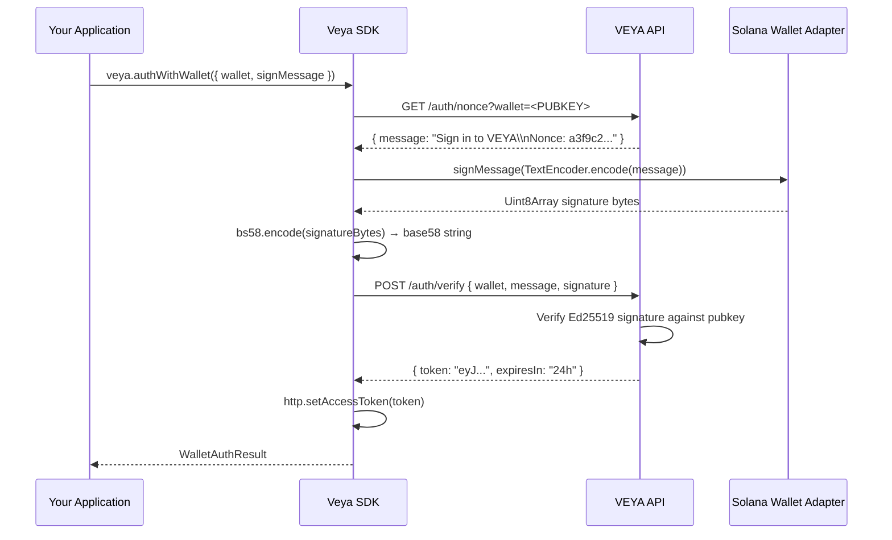

# Authentication — API Key & Wallet JWT Sign-In

The VEYA SDK supports two authentication mechanisms: **API key auth** for server-side and automated environments, and **wallet JWT auth** for browser-based or user-present flows. Both mechanisms ultimately result in a credential being attached to every authenticated HTTP request by the `HttpClient`. Understanding how they differ and when to use each is fundamental to building secure VEYA integrations.

---

## Choosing an Auth Method

| Scenario | Recommended Method |
|---|---|
| Backend service, daemon, or API server | API Key (`X-Api-Key`) |
| CI/CD pipeline or automated script | API Key (`X-Api-Key`) |
| Browser wallet integration (Phantom, Backpack) | Wallet JWT (`Authorization: Bearer`) |
| Agent environment requiring no user interaction | API Key (`X-Api-Key`) |
| Per-user scoped access with Solana identity | Wallet JWT (`Authorization: Bearer`) |
| MCP server or stdio-bound process | API Key (`X-Api-Key`) |

If you are running a server process or automated workload, use API keys. If you are building a frontend application where a human signs in with their Solana wallet, use wallet JWT auth.

---

## Method 1 — API Key Authentication

API keys are long-lived, server-side credentials. Once created, they can be used indefinitely until explicitly revoked. They are the simplest auth method: the SDK attaches the key as the `X-Api-Key` header on every authenticated request with no additional steps.

### Setup

```bash
# Set these in your environment or secrets manager
export VEYA_API_URL="https://api.veyanet.tech"
export VEYA_API_KEY="vya_live_38a209c1-bfed-492a-a5f1-example"
```

```ts
import { Veya } from "@veya/sdk";

// Option 1 — explicit construction
const veya = new Veya({
  apiUrl: process.env.VEYA_API_URL,
  apiKey: process.env.VEYA_API_KEY,
});

// Option 2 — zero-config (reads VEYA_API_URL and VEYA_API_KEY from env)
const veya = new Veya();
```

### How It Works Internally

When `apiKey` is present in the resolved config, `HttpClient.request()` sets the following header on every request where `auth !== false`:

```ts
headers.set("X-Api-Key", this.config.apiKey);
```

No token exchange, no expiry, no refresh — just the key on the wire.

### Key Tiers

| Tier | Prefix | Intended Use |
|---|---|---|
| Development | `vya_dev_…` | Local machines, staging, CI pipelines |
| Live | `vya_live_…` | Production infrastructure only |

Dev keys and live keys are functionally equivalent in the SDK — the difference is enforced server-side. Never use a live key in development to avoid accidentally mutating production data.

### Creating a Key Programmatically

```ts
// Must be authenticated (via another key or wallet JWT) to create a new key
const { apiKey, warning } = await veya.apiKeys.create({
  name: "my-agent-daemon",
  tier: "live",
  environmentId: env.id, // optional — scope to one environment
});

// ⚠ Save this value now — it is never shown again
console.log(apiKey.key); // vya_live_...
```

See [api-keys.md](./api-keys.md) for the full key management reference.

### Verifying API Key Auth Works

```ts
const health = await veya.health(); // public route — confirms connectivity
const envs = await veya.environments.list(); // authenticated route — confirms key is valid

console.log(health.status); // "ok"
console.log(envs.length);   // number of environments visible to this key
```

If the key is invalid, `veya.environments.list()` will throw a `VeyaError` with `status: 401`.

---

## Method 2 — Wallet JWT Authentication

Wallet JWT auth is designed for browser environments where a user authenticates with their Solana wallet (Phantom, Backpack, Solflare, or any adapter implementing the standard `signMessage` interface). The flow issues a short-lived JWT that is used as a Bearer token for subsequent API calls.

### Flow Overview



### Setup

```ts
import { Veya } from "@veya/sdk";

// Create client without any auth — wallet sign-in will set the token
const veya = new Veya({
  apiUrl: process.env.VEYA_API_URL,
});

const session = await veya.authWithWallet({
  wallet: publicKey.toBase58(),       // base58 Solana public key string
  signMessage: async (messageBytes) => {
    // messageBytes is a Uint8Array — pass directly to your wallet adapter
    return await walletAdapter.signMessage(messageBytes);
  },
});

console.log(session.token);      // JWT string
console.log(session.wallet);     // Solana public key (echoed back)
console.log(session.tokenType);  // "Bearer"
console.log(session.expiresIn);  // "24h"
```

After `authWithWallet` completes, the JWT is automatically set on the shared `HttpClient`. All subsequent calls on this `veya` instance use `Authorization: Bearer <token>` — no additional configuration needed.

### Step-by-Step Breakdown

**Step 1 — Nonce fetch (`GET /auth/nonce`)**

The SDK fetches a one-time challenge message from the API. This nonce is unique per request and time-limited server-side to prevent replay attacks.

```ts
const { message } = await http.request<{ message: string }>(
  `/auth/nonce?wallet=${encodeURIComponent(input.wallet)}`,
  { auth: false }  // public route — no auth header
);
// message: "Sign in to VEYA\nNonce: a3f9c2d1-4e5b-..."
```

The SDK validates that the message is at least 8 characters before proceeding. A too-short nonce response causes an early error.

**Step 2 — Wallet signature**

The message string is encoded as UTF-8 bytes and passed to the `signMessage` callback:

```ts
const messageBytes = new TextEncoder().encode(message);
const signatureBytes = await input.signMessage(messageBytes);
```

The callback must return a `Uint8Array` of the raw Ed25519 signature. The SDK does not validate the signature locally — it is sent to the API for server-side verification.

**Step 3 — Base58 encoding**

The raw signature bytes are base58-encoded using the `bs58` library (the only runtime dependency of the SDK):

```ts
import bs58 from "bs58";
const signature = bs58.encode(signatureBytes);
```

This produces a standard Solana-format signature string.

**Step 4 — Verify (`POST /auth/verify`)**

```ts
const result = await http.request<WalletAuthResult>("/auth/verify", {
  method: "POST",
  auth: false,  // public route
  body: { wallet: input.wallet, message, signature },
});
```

The API verifies the Ed25519 signature using the wallet's public key. If verification passes, it issues a signed JWT.

**Step 5 — Token injection**

```ts
http.setAccessToken(result.token);
```

The `setAccessToken` call stores the JWT in the `HttpClient` config and deletes any previously stored `apiKey`. From this point forward, every authenticated request carries `Authorization: Bearer <token>`.

### Wallet Adapter Compatibility

The `signMessage` callback accepts any function with the signature `(message: Uint8Array) => Promise<Uint8Array>`. This is compatible with all major Solana wallet adapters out of the box:

```ts
// Phantom (via @solana/wallet-adapter-react)
signMessage: (msg) => phantomWallet.signMessage(msg)

// Backpack
signMessage: (msg) => backpackWallet.signMessage(msg)

// Solflare
signMessage: (msg) => solflareWallet.signMessage(msg)

// Hardware wallet (Ledger via @solana/wallet-adapter-ledger)
signMessage: (msg) => ledgerWallet.signMessage(msg)

// Node.js test (using @solana/web3.js Keypair)
import { Keypair } from "@solana/web3.js";
import nacl from "tweetnacl";
const keypair = Keypair.generate();
signMessage: (msg) => Promise.resolve(nacl.sign.detached(msg, keypair.secretKey))
```

---

## Token Lifecycle & Expiry

Wallet JWTs expire after **24 hours** by default. The SDK does not automatically refresh tokens — you are responsible for detecting expiry and re-authenticating.

### Detecting Expiry

A request made with an expired JWT returns `VeyaError` with `status: 401`. Catch it and re-run the wallet sign-in:

```ts
import { isVeyaError } from "@veya/sdk";

async function withReauth<T>(
  veya: Veya,
  fn: () => Promise<T>,
  reauthFn: () => Promise<void>
): Promise<T> {
  try {
    return await fn();
  } catch (err) {
    if (isVeyaError(err) && err.status === 401) {
      await reauthFn(); // re-run wallet sign-in
      return await fn(); // retry once
    }
    throw err;
  }
}

// Usage
const envs = await withReauth(
  veya,
  () => veya.environments.list(),
  () => veya.authWithWallet({ wallet: pubkey, signMessage })
);
```

### Storing and Reusing a Token

If you need to persist a JWT across page reloads or share it with a second `Veya` instance, extract it from the session result and inject it manually:

```ts
// Sign in and persist token
const session = await veya.authWithWallet({ wallet, signMessage });
localStorage.setItem("veya_token", session.token);

// Later — restore session without re-signing
const storedToken = localStorage.getItem("veya_token");
if (storedToken) {
  const veya2 = new Veya({ apiUrl: process.env.VEYA_API_URL });
  veya2.setAccessToken(storedToken);
  // veya2 is now authenticated
}
```

> [!CAUTION]
> Do not store JWTs in `localStorage` in high-security production contexts — use `httpOnly` cookies or a secure session store. `localStorage` is accessible to any JavaScript running on the page and is vulnerable to XSS attacks.

---

## Auth Priority in the SDK

When both `apiKey` and `accessToken` exist on the same client, the SDK resolves them in this order:

```
1. apiKey present  →  X-Api-Key header (accessToken is ignored)
2. accessToken present (no apiKey)  →  Authorization: Bearer header
3. Neither present  →  no auth header (only valid for public routes)
```

Switching from API key to JWT auth mid-session:

```ts
const veya = new Veya({
  apiUrl: process.env.VEYA_API_URL,
  apiKey: process.env.VEYA_API_KEY, // starts with key auth
});

// ... later, sign in with wallet
const session = await veya.authWithWallet({ wallet, signMessage });
// setAccessToken() clears apiKey and sets accessToken
// All subsequent requests now use Bearer auth
```

To switch back to API key auth, create a new `Veya` instance:

```ts
const veyaWithKey = new Veya({
  apiUrl: process.env.VEYA_API_URL,
  apiKey: process.env.VEYA_API_KEY,
});
```

---

## Multi-Client Patterns

### Separate Instances Per Auth Context

```ts
// Admin client — uses master live key
const adminVeya = new Veya({
  apiUrl: process.env.VEYA_API_URL,
  apiKey: process.env.VEYA_ADMIN_KEY,
});

// User client — uses scoped JWT per user session
const userVeya = new Veya({ apiUrl: process.env.VEYA_API_URL });
await userVeya.authWithWallet({ wallet: userPubkey, signMessage });
```

Each `Veya` instance has its own independent `HttpClient` — changing auth on one does not affect the other.

### Per-Request Auth Override

The SDK does not support per-request auth overrides at the method level. If you need a one-off request with different credentials, instantiate a separate `Veya` client for that context.

---

## Public Routes — No Auth Required

These routes skip auth headers regardless of SDK configuration. Calling them on an unauthenticated client is safe and expected:

| Route | SDK Method | Use Case |
|---|---|---|
| `GET /health` | `veya.health()` | Connectivity and service health check |
| `GET /auth/nonce` | internal | Fetch sign-in challenge (step 1 of wallet auth) |
| `POST /auth/verify` | internal | Verify signature and receive JWT (step 2) |
| `GET /api/verify/:sig` | `veya.proofs.verifyTransaction()` | Public proof verification — no account needed |

---

## Security Considerations

### API Key Security

- Treat API key values like passwords. They grant full account access (or environment-scoped access if scoped).
- Never embed key values in client-side JavaScript, mobile apps, or public repositories.
- Use environment variables or a secrets manager at runtime. The SDK reads `VEYA_API_KEY` from `process.env` automatically.
- Rotate live keys every 90 days. Revoke immediately on any suspected exposure.

### JWT Security

- JWTs are signed by the VEYA API and verified on every request. The SDK does not validate JWT signatures locally — it passes the token as an opaque Bearer credential.
- The wallet's Ed25519 private key is never accessible to the SDK. The `signMessage` callback is an inversion of control — the SDK provides bytes to sign; your wallet adapter handles the private key operation internally.
- The nonce challenge is time-limited and single-use server-side. Replay attacks are not possible.
- Do not log `session.token` values, even in debug output.

---

## Related

- [api-keys.md](./api-keys.md) — Full API key lifecycle (create, list, revoke)
- [configuration.md](./configuration.md) — `VeyaConfig`, auth priority, and env var resolution
- [error-handling.md](./error-handling.md) — Handling `401` and auth-related errors
