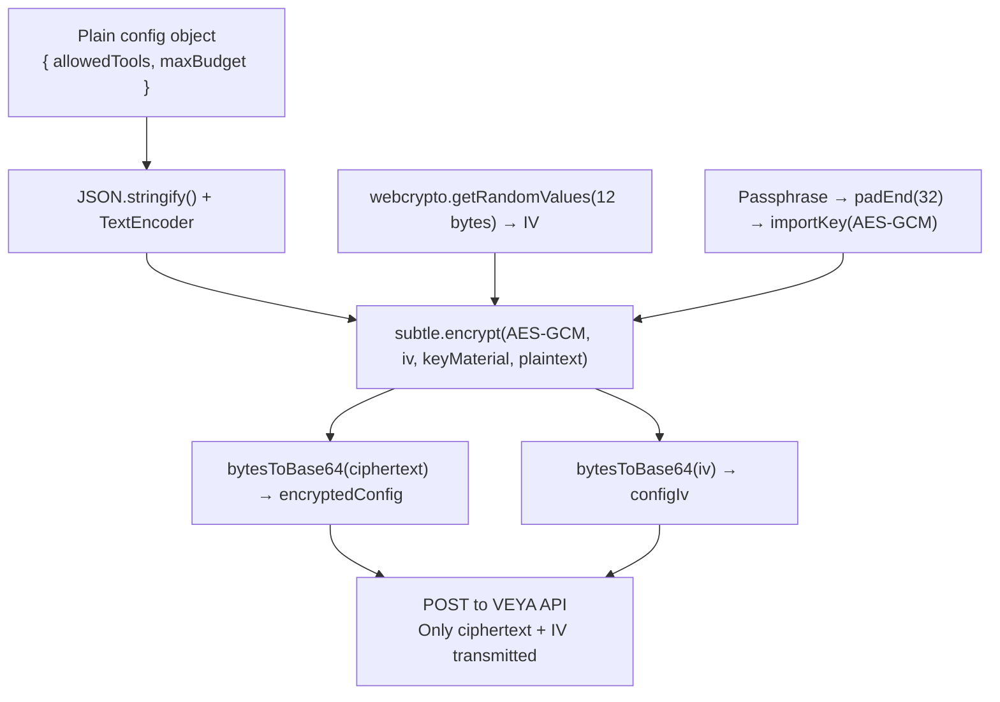

# Cryptography — AES-256-GCM Encryption & SHA-256 Hashing

The `@veya/sdk` ships with two categories of client-side cryptographic primitives: **AES-256-GCM symmetric encryption** for protecting agent configuration objects, and **SHA-256 hashing** for zero-knowledge memory registration and proof anchoring. Both are implemented using the Web Crypto API (`node:crypto` → `webcrypto.subtle`) — no third-party cryptography libraries are involved.

The core privacy guarantee of both systems is identical: **sensitive data never leaves your environment in plaintext**. The VEYA API stores only ciphertext blobs and SHA-256 digests. It has no ability to recover the original data without the passphrase or plaintext that only you hold.

---

## AES-256-GCM Agent Config Encryption

### Why Encrypt Agent Configs?

Agent configurations often contain sensitive operational parameters: allowed toolsets, budget constraints, private routing rules, or internal API references. When an agent is deployed to the VEYA API, its configuration is stored server-side. Without encryption, this would expose sensitive parameters to anyone who can query the agent record.

The SDK solves this by encrypting the config object entirely on the client before transmitting it. The VEYA API stores the opaque ciphertext blob. Only a client that holds the original passphrase can decrypt and read the configuration.

---

### `encryptAgentConfig(config, passphrase)`

Encrypts a plain JavaScript object using AES-256-GCM. Returns two base64-encoded strings: the ciphertext and the initialization vector (IV).

**Signature:**
```ts
async function encryptAgentConfig(
  plaintext: Record<string, unknown>,
  passphrase: string
): Promise<{ encryptedConfig: string; configIv: string }>
```

**Example:**
```ts
import { encryptAgentConfig } from "@veya/sdk";

const { encryptedConfig, configIv } = await encryptAgentConfig(
  {
    allowedTools: ["treasury.transfer", "treasury.query"],
    maxBudgetLamports: 5_000_000,
    allowedRecipients: ["vault-a", "vault-b"],
    internalNote: "Finance agent — production tier",
  },
  process.env.AGENT_CONFIG_PASSPHRASE!
);

console.log(encryptedConfig); // base64-encoded AES-256-GCM ciphertext
console.log(configIv);        // base64-encoded 12-byte IV
```

**Deploying the encrypted config:**
```ts
import { Veya, encryptAgentConfig } from "@veya/sdk";

const veya = new Veya({ apiUrl: process.env.VEYA_API_URL, apiKey: process.env.VEYA_API_KEY });

const { encryptedConfig, configIv } = await encryptAgentConfig(
  { allowedTools: ["transfer"], maxBudget: 500 },
  process.env.AGENT_CONFIG_PASSPHRASE!
);

const agent = await veya.agents.deploy(environmentId, {
  type: "finance",
  permissionConfig: { allowedTools: ["transfer"] }, // public-facing config
  encryptedConfig,  // private encrypted config — only readable with passphrase
  configIv,
});

// The VEYA API stores `encryptedConfig` and `configIv` as opaque blobs
// It cannot decrypt them — your passphrase never leaves this process
```

**Return values:**

| Field | Type | Description |
|---|---|---|
| `encryptedConfig` | `string` | Base64-encoded AES-256-GCM ciphertext of the JSON-serialized config |
| `configIv` | `string` | Base64-encoded 12-byte random initialization vector |

---

### `decryptAgentConfig(encryptedConfig, configIv, passphrase)`

Decrypts a previously encrypted agent config. The decryption is performed entirely locally — the ciphertext is obtained from the agent record, and the passphrase must be available in your environment.

**Signature:**
```ts
async function decryptAgentConfig(
  encryptedConfig: string,
  configIv: string,
  passphrase: string
): Promise<Record<string, unknown>>
```

**Example — fetch agent and decrypt config:**
```ts
const agents = await veya.agents.list(environmentId);
const financeAgent = agents.find((a) => a.type === "finance")!;

const config = await decryptAgentConfig(
  financeAgent.encryptedConfig!,
  financeAgent.configIv!,
  process.env.AGENT_CONFIG_PASSPHRASE!
);

console.log(config.allowedTools);       // ["treasury.transfer", "treasury.query"]
console.log(config.maxBudgetLamports);  // 5000000
console.log(config.allowedRecipients);  // ["vault-a", "vault-b"]
```

**Updating a config — decrypt, modify, re-encrypt, re-deploy:**
```ts
// 1. Fetch and decrypt current config
const current = await decryptAgentConfig(
  agent.encryptedConfig!,
  agent.configIv!,
  process.env.AGENT_CONFIG_PASSPHRASE!
);

// 2. Apply your changes
const updated = {
  ...current,
  maxBudgetLamports: 10_000_000, // double the budget
  allowedRecipients: [...(current.allowedRecipients as string[]), "vault-c"],
};

// 3. Re-encrypt and update the agent
const { encryptedConfig, configIv } = await encryptAgentConfig(
  updated,
  process.env.AGENT_CONFIG_PASSPHRASE!
);

await veya.agents.update(environmentId, agent.id, { encryptedConfig, configIv });
```

> [!NOTE]
> `decryptAgentConfig` is not exported from the package's main `index.ts` entry point. Import it directly from the crypto source when needed in server-side scripts or tooling:
> ```ts
> import { decryptAgentConfig } from "@veya/sdk/dist/crypto.js";
> ```

---

### Encryption Internals — How It Works

Understanding the internals helps you reason about the security guarantees.

**1. Key derivation from passphrase:**

```ts
function deriveAesKeyMaterial(passphrase: string): Uint8Array {
  const normalized = passphrase.trim();
  if (normalized.length < 8) {
    throw new Error("Passphrase must be at least 8 characters for agent config encryption");
  }
  return new TextEncoder().encode(normalized.padEnd(32, "0").slice(0, 32));
}
```

The passphrase is trimmed, then padded or trimmed to exactly **32 bytes** to match the AES-256 key size requirement. This means:
- A passphrase of exactly 32 characters maps 1:1 to the key material.
- A passphrase shorter than 32 characters is zero-padded with `"0"` characters.
- A passphrase longer than 32 characters is truncated at 32.

**2. Key import:**

```ts
const keyMaterial = await subtle.importKey(
  "raw",
  deriveAesKeyMaterial(passphrase),
  "AES-GCM",
  false,      // not extractable
  ["encrypt"] // usage: encrypt only
);
```

The key is imported as non-extractable — the raw bytes cannot be read back out of the crypto context once imported.

**3. IV generation:**

```ts
const iv = webcrypto.getRandomValues(new Uint8Array(12));
```

A fresh 12-byte random IV is generated for every encryption call using the cryptographically secure `webcrypto.getRandomValues`. AES-256-GCM requires a 96-bit (12-byte) nonce. **Never reuse an IV with the same key** — the SDK guarantees this by generating a new IV on every `encryptAgentConfig` call.

**4. Encryption:**

```ts
const encoded = new TextEncoder().encode(JSON.stringify(plaintext));
const ciphertext = await subtle.encrypt({ name: "AES-GCM", iv }, keyMaterial, encoded);
```

The config object is JSON-serialized, UTF-8 encoded to bytes, then encrypted. AES-256-GCM produces ciphertext of the same length as the plaintext plus a 16-byte authentication tag appended to the output.

**5. Output encoding:**

```ts
return {
  encryptedConfig: bytesToBase64(new Uint8Array(ciphertext)),
  configIv: bytesToBase64(iv),
};
```

Both the ciphertext and IV are base64-encoded for safe transport and storage as JSON string fields.

**Full encryption flow:**


---

### Passphrase Requirements & Best Practices

**Minimum length:** 8 characters (enforced — throws if shorter).

**Key derivation note:** The SDK derives key material by simple UTF-8 encoding and padding — it does not use a KDF like PBKDF2, scrypt, or Argon2. This means:
- A stronger, longer, high-entropy passphrase directly produces better key material.
- A short passphrase like `"secret01"` will have predictable key bytes due to padding.
- For maximum security, use a 32-character random passphrase (generated by your secrets manager).

**Recommended passphrase pattern:**
```bash
# Generate a 32-character hex passphrase
openssl rand -hex 16
# → a3f9c2d1e4b5f6a7b8c9d0e1f2a3b4c5

# Store it in your secrets manager
# Never hardcode it in source files
```

**Storage:**
```bash
# Add to environment
export AGENT_CONFIG_PASSPHRASE="a3f9c2d1e4b5f6a7b8c9d0e1f2a3b4c5"
```

The passphrase must be available to any process that needs to decrypt agent configs. If you lose the passphrase, the encrypted configs are **permanently unrecoverable** — the VEYA API cannot help you decrypt them.

**Rotation:**

To rotate the passphrase:
1. Decrypt all affected agent configs with the old passphrase.
2. Re-encrypt them with the new passphrase.
3. Update each agent via `veya.agents.update(envId, agentId, { encryptedConfig, configIv })`.
4. Update the passphrase in your secrets manager.
5. Revoke the old passphrase value from all locations.

---

## SHA-256 Hashing Utilities

The SDK exports two SHA-256 utilities used internally by `memory.storeContent()` and `proofs.anchorText()`. They are also part of the public API so you can use them directly in your integration code.

### `sha256Hex(content)`

Async SHA-256 hash using `webcrypto.subtle.digest`. Returns a lowercase 64-character hex string.

**Signature:**
```ts
async function sha256Hex(content: string): Promise<string>
```

**Example:**
```ts
import { sha256Hex } from "@veya/sdk";

const hash = await sha256Hex("Connect to the primary database cluster.");
console.log(hash);
// → "5a6b7c8d9e0f1a2b3c4d5e6f7a8b9c0d1e2f3a4b5c6d7e8f9a0b1c2d3e4f5a6"
// 64 lowercase hex characters — always
```

**Usage in memory integrity verification:**
```ts
import { sha256Hex } from "@veya/sdk";

// Hash local content
const localHash = await sha256Hex(localContent);

// Compare against the registered hash in VEYA
const entries = await veya.memory.list(environmentId, "agent-prompts");
const entry = entries.find((e) => e.id === targetId);

if (!entry || entry.contentHash !== localHash) {
  throw new Error("Integrity check failed — content does not match registered hash.");
}
```

**Usage in manual proof anchoring:**
```ts
import { sha256Hex } from "@veya/sdk";

const content = "Board vote: Proposal 42 passed 7-0.";
const hash = await sha256Hex(content);

// Compare against what the proof anchor recorded
const verified = await veya.proofs.verifyTransaction(txSignature);
if (verified.hash !== hash) {
  throw new Error("Proof hash mismatch — content may have been altered.");
}
```

---

### `sha256HexSync(content)`

Synchronous SHA-256 using Node.js `createHash("sha256")`. Only available in Node.js environments.

**Signature:**
```ts
function sha256HexSync(content: string): string
```

**Example:**
```ts
import { sha256HexSync } from "@veya/sdk";

// Synchronous — no await needed
const hash = sha256HexSync("Connect to the primary database cluster.");
console.log(hash); // same 64-char hex output
```

Use `sha256HexSync` when you need a synchronous hash result in a Node.js context — for example, inside a non-async function or during module initialization. Prefer `sha256Hex` in all other cases for maximum runtime compatibility (browser and Node.js).

---

### Encoding Utilities

The SDK exposes two internal encoding helpers used by the crypto module. They are not part of the primary public API but are available if you need them:

**`bytesToBase64(bytes: Uint8Array): string`**

Encodes a `Uint8Array` as a standard base64 string. Used to encode ciphertext and IV values for JSON transport.

```ts
import { bytesToBase64 } from "@veya/sdk/dist/utils/encoding.js";

const bytes = new Uint8Array([72, 101, 108, 108, 111]);
console.log(bytesToBase64(bytes)); // "SGVsbG8="
```

**`base64ToBytes(base64: string): Uint8Array`**

Decodes a base64 string back to `Uint8Array`. Used internally during `decryptAgentConfig` to recover the IV and ciphertext from their stored base64 form.

```ts
import { base64ToBytes } from "@veya/sdk/dist/utils/encoding.js";

const bytes = base64ToBytes("SGVsbG8=");
console.log(bytes); // Uint8Array [72, 101, 108, 108, 111]
```

---

## Security Model Summary

| Operation | What the SDK Does | What the API Receives | What the API Can Recover |
|---|---|---|---|
| `encryptAgentConfig()` | AES-256-GCM encrypts config locally | `encryptedConfig` (ciphertext) + `configIv` | Nothing — no passphrase |
| `decryptAgentConfig()` | AES-256-GCM decrypts locally | Nothing | N/A |
| `memory.storeContent()` | SHA-256 hashes content locally | `contentHash` (64-char hex) | Nothing — SHA-256 is one-way |
| `proofs.anchorContent()` | Sends plaintext to API for hashing + anchoring | `label` + `content` | Full content (intended) |
| `sha256Hex()` / `sha256HexSync()` | Hashes locally | Nothing — utility function | N/A |

> [!IMPORTANT]
> `proofs.anchorContent()` is the one operation that does send plaintext content to the API — this is intentional, as the API needs the content to compute the hash for Solana anchoring. If you need to anchor without sending plaintext, use `sha256Hex()` locally and call `veya.proofs.anchorContent({ label, content: hash })` — or use the low-level Solana attestation route to sign and broadcast the memo transaction yourself.

---

## Related

- [memory.md](./memory.md) — Zero-knowledge memory storage using SHA-256
- [proofs-and-anchoring.md](./proofs-and-anchoring.md) — Solana proof anchoring and public verification
- [ARCHITECTURE.md](./ARCHITECTURE.md) — Crypto internals in the full SDK architecture context
- [environments-and-agents.md](./environments-and-agents.md) — Deploying agents with encrypted configs
