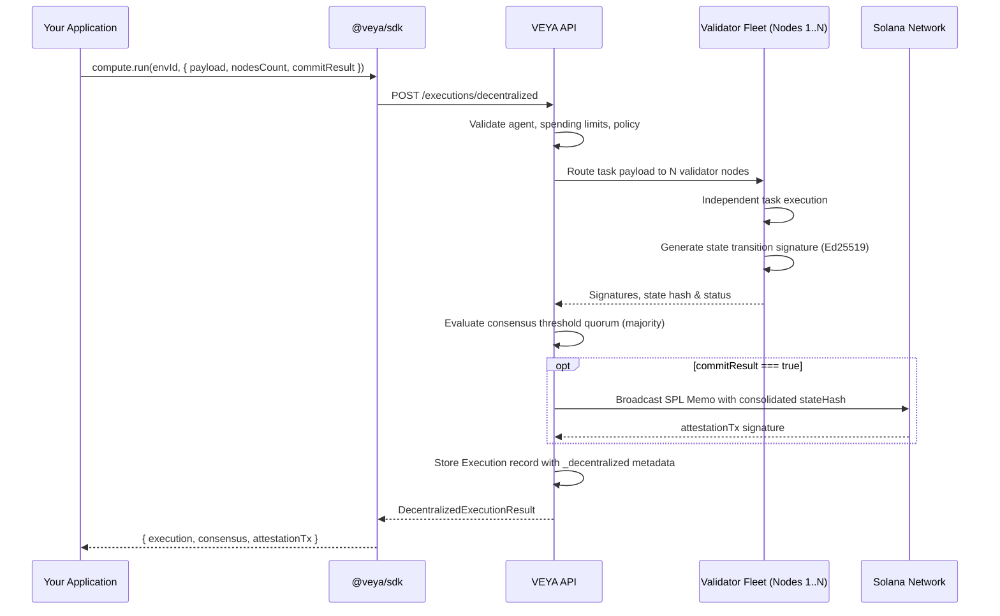

# Decentralized Compute — Verifiable, Consensus-Based Executions

`veya.compute` provides VEYA's decentralized, consensus-based multi-node execution capability. It coordinates validator nodes, cryptographically verifies their state transition signatures, and anchors consensus states directly to the Solana blockchain.

Decentralized compute is designed for high-integrity autonomous agent tasks (such as cross-chain token swaps, consensus-driven oracle reads, and governance executions) where relying on a single host environment or centralized runner introduces single points of failure or trust compromises.

---

## Execution Models: Standard vs. Protected vs. Decentralized Compute

| Capability | Standard (`executions`) | Protected (`protection`) | Decentralized (`compute`) |
|---|---|---|---|
| Execution Layer | Centralized Host Server | Hardware Enclave (TEE) | Multi-Node Validator Fleet |
| Consensus Verification | ❌ No | ❌ No | ✅ Yes (Ed25519 Quorum) |
| State Attestation | ❌ No | Single CPU Signature | Cryptographic Multi-Signatures |
| Payload Encryption | ❌ No | Sealed fields hashed | Full payload visibility to fleet |
| Solana Anchor | Optional | Optional | Optional (Memo State Commit) |
| Spending Enforcement | ✅ Yes | ✅ Yes | ✅ Yes |

---

## How Decentralized Compute Works



---

## Methods

### `compute.run(environmentId, input)`

Runs a decentralized consensus execution across a pool of validator nodes.

**Signature:**
```ts
run(environmentId: string, input: DecentralizedExecutionInput): Promise<DecentralizedExecutionResult>
```

**Input Parameters:**
```ts
type DecentralizedExecutionInput = {
  agentId: string;
  eventType: string;
  payload: Record<string, unknown>;
  nodesCount?: number;     // Number of nodes (1 to 10, defaults to 3)
  commitResult?: boolean;  // Anchor consensus state on Solana (defaults to true)
  spendLamports?: number;  // Validated against the environment's limit caps (defaults to 1000)
};
```

**Result Object:**
```ts
type DecentralizedExecutionResult = {
  execution: Execution;
  consensus: {
    consensusReached: boolean;
    nodesCount: number;
    nodes: Array<{
      nodeId: string;
      publicKey: string;
      signature: string;
      status: "SUCCESS" | "FAILED";
    }>;
    stateHash: string;
  };
  attestationTx?: string;
};
```

**Example — executing a consensus task across 3 validator nodes:**
```ts
import { Veya, isVeyaError } from "@veya/sdk";

const veya = new Veya({
  apiUrl: process.env.VEYA_API_URL,
  apiKey: process.env.VEYA_API_KEY,
});

try {
  const result = await veya.compute.run(environmentId, {
    agentId: "agent-uuid-here",
    eventType: "decentralized.oracle",
    payload: {
      feed: "SOL/USD",
      timestamp: Date.now()
    },
    nodesCount: 3,
    commitResult: true,
    spendLamports: 1000,
  });

  console.log("Consensus Reached:", result.consensus.consensusReached);
  console.log("Consensus State Hash:", result.consensus.stateHash);
  console.log("Validator Signatures:");
  result.consensus.nodes.forEach(node => {
    console.log(`Node: ${node.nodeId} | Signature: ${node.signature.slice(0, 16)}... | Status: ${node.status}`);
  });

  if (result.attestationTx) {
    console.log("Solana Proof Anchored at Signature:", result.attestationTx);
  }
} catch (err) {
  if (isVeyaError(err)) {
    console.error(`Veya API Error [${err.status}]: ${err.message}`);
  } else {
    console.error("Unknown error:", err);
  }
}
```

---

## HTTP Equivalent

To execute decentralized compute directly via raw HTTP calls:

```bash
curl -X POST "$VEYA_API_URL/v1/environments/$ENV_ID/executions/decentralized" \
  -H "X-Api-Key: $VEYA_API_KEY" \
  -H "Content-Type: application/json" \
  -d '{
    "agentId": "550e8400-e29b-41d4-a716-446655440001",
    "eventType": "oracle.fetch",
    "payload": {
      "pair": "SOL/USD"
    },
    "nodesCount": 3,
    "commitResult": true,
    "spendLamports": 1000
  }'
```

---

## Validator Consensus & On-Chain Proofs

When the execution completes:
1. **Consensus Quorum**: The orchestrator matches state transition outputs. Quorum is reached when a majority of validator nodes produce matching outputs.
2. **On-Chain Commit**: If `commitResult` is `true`, a Solana transaction is sent referencing the unified state hash.
3. **Verifying Consensus**:
   ```ts
   // Get the attestation signature from the execution result
   const { attestationTx, consensus } = result;

   // Verify transaction directly on-chain
   const verification = await veya.proofs.verifyTransaction(attestationTx!);

   console.log("Valid on Solana:", verification.valid);
   console.log("State hash matches on-chain memo:", verification.hash === consensus.stateHash);
   console.log("Explorer Link:", verification.explorerUrl);
   ```

---

## Related Guides

- [executions.md](./executions.md) — Standard (non-protected) execution logging
- [protected-execution.md](./protected-execution.md) — TEE Enclave isolated runs
- [proofs-and-anchoring.md](./proofs-and-anchoring.md) — Manual proof anchoring and verification
- [types-reference.md](./types-reference.md) — SDK types reference sheet
