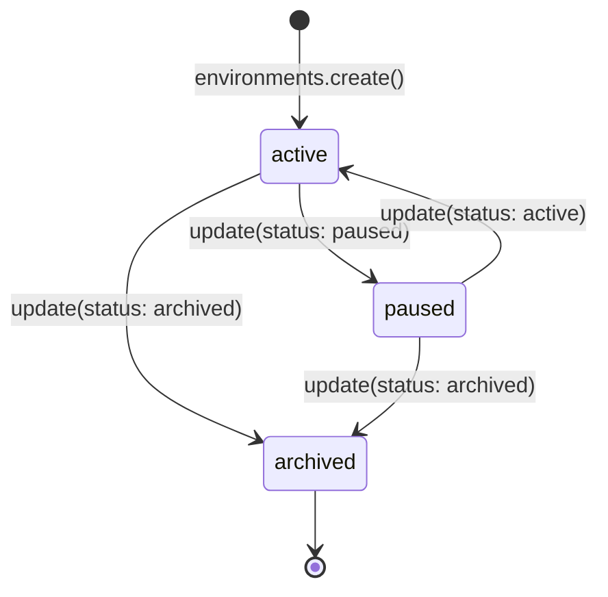
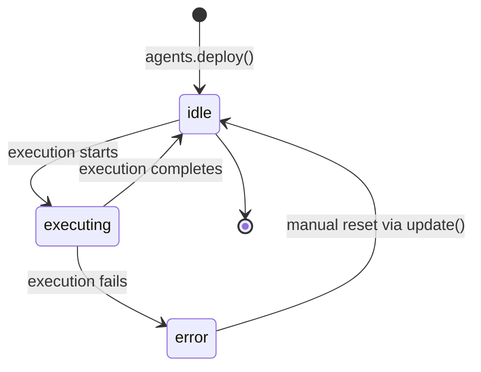

# Environments & Agents — Workspaces, Policies, and Execution Principals

Environments and agents are the two foundational primitives of the VEYA platform. An **environment** is an isolated workspace that owns all associated resources — agents, memory entries, executions, and spending budgets. An **agent** is a permissioned execution principal that operates within an environment, carrying its own type, toolset, and optionally an encrypted private configuration.

Understanding how to model your use case across environments and agents is the most important architectural decision you will make when integrating VEYA.

---

## Environments

### What Is an Environment?

An environment is a namespace that groups related agents and their activity under a single administrative boundary. Every VEYA resource (memory entry, execution record, agent) belongs to exactly one environment. Environments carry:

- A **type** that classifies the workspace's operational purpose
- A **spending limit** configuration that caps Solana expenditure per time period
- A **policy config** for enforcement rules across agents
- An **agent roster** listing which agent IDs are permitted to operate within the environment
- A **memory scope** configuration governing hash registration namespaces

A single VEYA account can own multiple environments. You might use separate environments to isolate production from staging, separate different product verticals, or enforce distinct spending budgets on different agent workloads.

### Environment Types

The `type` field classifies the environment and determines which default policy templates the API applies:

| Type | Use Case |
|---|---|
| `treasury` | Financial agent operations — Solana transfers, budget tracking |
| `governance` | Voting, proposal management, DAO coordination |
| `research` | Data collection, analysis pipelines, report generation |
| `contributor` | Developer tooling, CI/CD agents, code review automation |
| `protocol` | On-chain protocol interaction, smart contract coordination |
| `desci` | Decentralized science — data integrity, experiment logging |

### `environments.list()`

Returns all environments owned by the authenticated account.

**Signature:**
```ts
list(): Promise<Environment[]>
```

**Example:**
```ts
import { Veya } from "@veya/sdk";

const veya = new Veya({
  apiUrl: process.env.VEYA_API_URL,
  apiKey: process.env.VEYA_API_KEY,
});

const environments = await veya.environments.list();

for (const env of environments) {
  console.log(`[${env.type.toUpperCase()}] ${env.name} — status: ${env.status}`);
  console.log(`  ID         : ${env.id}`);
  console.log(`  Owner      : ${env.ownerWallet}`);
  console.log(`  Agents     : ${env.agentRoster?.length ?? 0}`);
  console.log(`  Created    : ${new Date(env.createdAt).toLocaleString()}`);
}
```

**HTTP:**
```bash
curl "$VEYA_API_URL/v1/environments" \
  -H "X-Api-Key: $VEYA_API_KEY"
```

---

### `environments.create(input)`

Creates a new environment. All fields except `name` and `type` are optional and default to empty objects or arrays.

**Signature:**
```ts
create(input: CreateEnvironmentInput): Promise<Environment>
```

**Input type:**
```ts
type CreateEnvironmentInput = {
  name: string;
  type: EnvironmentType;
  memoryScope?: Record<string, unknown>;
  policyConfig?: Record<string, unknown>;
  spendingLimits?: Record<string, unknown>;
  agentRoster?: string[];
};
```

**Minimal example:**
```ts
const env = await veya.environments.create({
  name: "Treasury Operations",
  type: "treasury",
});
```

**Full example with spending limits and policy:**
```ts
const env = await veya.environments.create({
  name: "Treasury Operations — Production",
  type: "treasury",
  policyConfig: {
    maxAgents: 5,
    allowedEventTypes: ["treasury.transfer", "treasury.query", "treasury.check"],
    requireAttestation: true,
  },
  spendingLimits: {
    finance: {
      maxSolPerPeriod: 1,          // 1 SOL max per period
      periodHours: 24,              // resets every 24 hours
      maxSingleTransactionSol: 0.1, // per-tx cap
    },
  },
  memoryScope: {
    allowedScopes: ["agent-prompts", "session-logs", "audit"],
    maxEntriesPerScope: 500,
  },
});

console.log(env.id);     // "env_01HXYZ..."
console.log(env.status); // "active"
```

**HTTP:**
```bash
curl -X POST "$VEYA_API_URL/v1/environments" \
  -H "X-Api-Key: $VEYA_API_KEY" \
  -H "Content-Type: application/json" \
  -d '{
    "name": "Treasury Operations",
    "type": "treasury",
    "spendingLimits": {
      "finance": { "maxSolPerPeriod": 1, "periodHours": 24 }
    }
  }'
```

---

### `environments.get(id)`

Returns a single environment by ID.

**Signature:**
```ts
get(id: string): Promise<Environment>
```

**Example:**
```ts
const env = await veya.environments.get("env_01HXYZ");

console.log(env.name);          // "Treasury Operations — Production"
console.log(env.status);        // "active"
console.log(env.agentRoster);   // ["agent_01HABC", "agent_01HDEF"]
```

**HTTP:**
```bash
curl "$VEYA_API_URL/v1/environments/env_01HXYZ" \
  -H "X-Api-Key: $VEYA_API_KEY"
```

---

### `environments.update(id, input)`

Partially updates an environment. Only specified fields are modified — all others are left unchanged.

**Signature:**
```ts
update(id: string, input: UpdateEnvironmentInput): Promise<Environment>
```

**Input type:**
```ts
type UpdateEnvironmentInput = Partial<{
  name: string;
  status: EnvironmentStatus;   // "active" | "paused" | "archived"
  memoryScope: Record<string, unknown>;
  policyConfig: Record<string, unknown>;
  spendingLimits: Record<string, unknown>;
  agentRoster: string[];
}>;
```

**Pause an environment:**
```ts
await veya.environments.update(env.id, { status: "paused" });
// All agents in this environment are blocked from executing
```

**Update spending limits:**
```ts
await veya.environments.update(env.id, {
  spendingLimits: {
    finance: { maxSolPerPeriod: 2, periodHours: 24 },
  },
});
```

**Add an agent to the roster:**
```ts
const current = await veya.environments.get(env.id);
await veya.environments.update(env.id, {
  agentRoster: [...(current.agentRoster ?? []), newAgent.id],
});
```

**Archive (soft-delete):**
```ts
await veya.environments.update(env.id, { status: "archived" });
// Archived environments are read-only — no new executions permitted
```

**HTTP:**
```bash
curl -X PATCH "$VEYA_API_URL/v1/environments/env_01HXYZ" \
  -H "X-Api-Key: $VEYA_API_KEY" \
  -H "Content-Type: application/json" \
  -d '{"status": "paused"}'
```

---

### Environment Status Lifecycle



| Status | Description | Executions Allowed |
|---|---|---|
| `active` | Normal operating state | ✅ Yes |
| `paused` | Temporarily suspended | ❌ No |
| `archived` | Permanently decommissioned | ❌ No |

---

## Agents

### What Is an Agent?

An agent is a permissioned execution principal tied to a specific environment. It carries:

- A **type** that classifies its operational role
- A **permissionConfig** defining which tools it may invoke and within what constraints
- An optional **encrypted private configuration** (AES-256-GCM) for storing sensitive operational parameters that must not be visible to the API
- A **spending budget** tracked as `spendThisPeriod` (lamports spent in the current window)
- A **status** reflecting its current operational state

### Agent Types

| Type | Role |
|---|---|
| `finance` | Solana transfers, treasury management, budget-aware transactions |
| `research` | Data collection, analysis, report generation |
| `coordination` | Orchestrating other agents, routing decisions, multi-agent workflows |
| `memory` | Memory management, hash registration, content verification |
| `policy` | Policy enforcement, rule evaluation, compliance checking |
| `presence` | User-facing or identity-aware operations |

### `agents.list(environmentId)`

Returns all agents deployed within an environment.

**Signature:**
```ts
list(environmentId: string): Promise<Agent[]>
```

**Example:**
```ts
const agents = await veya.agents.list(env.id);

for (const agent of agents) {
  console.log(`[${agent.type}] status: ${agent.status}`);
  console.log(`  ID              : ${agent.id}`);
  console.log(`  Spend this period: ${agent.spendThisPeriod ?? "0"} lamports`);
  console.log(`  Has encrypted cfg: ${agent.encryptedConfig ? "yes" : "no"}`);
}
```

---

### `agents.deploy(environmentId, input)`

Deploys a new agent into an environment.

**Signature:**
```ts
deploy(environmentId: string, input: DeployAgentInput): Promise<Agent>
```

**Input type:**
```ts
interface DeployAgentInput {
  type: AgentType;
  permissionConfig: Record<string, unknown>;
  encryptedConfig?: string;
  configIv?: string;
  agentKind?: string;
}
```

**Basic deployment:**
```ts
const agent = await veya.agents.deploy(env.id, {
  type: "finance",
  permissionConfig: {
    allowedTools: ["treasury.transfer", "treasury.query"],
    maxSingleTransactionLamports: 100_000_000, // 0.1 SOL per tx
    allowedRecipients: ["vault-address-a", "vault-address-b"],
  },
});

console.log(agent.id);     // "agent_01HABC..."
console.log(agent.status); // "idle"
```

**HTTP:**
```bash
curl -X POST "$VEYA_API_URL/v1/environments/env_01HXYZ/agents" \
  -H "X-Api-Key: $VEYA_API_KEY" \
  -H "Content-Type: application/json" \
  -d '{
    "type": "finance",
    "permissionConfig": {
      "allowedTools": ["treasury.transfer"],
      "maxSingleTransactionLamports": 100000000
    }
  }'
```

---

### `agents.deployEncrypted(environmentId, input)`

Deploys an agent with an AES-256-GCM encrypted private config blob. The VEYA API stores the ciphertext opaquely — only a caller holding the original passphrase can decrypt it.

**Signature:**
```ts
deployEncrypted(
  environmentId: string,
  input: DeployAgentInput & { encryptedConfig: string; configIv: string }
): Promise<Agent>
```

**Example — encrypting and deploying:**
```ts
import { Veya, encryptAgentConfig } from "@veya/sdk";

const veya = new Veya({
  apiUrl: process.env.VEYA_API_URL,
  apiKey: process.env.VEYA_API_KEY,
});

// Private config — never sent plaintext to the API
const privateConfig = {
  internalApiKey: process.env.INTERNAL_TREASURY_API_KEY,
  allowedRecipients: ["vault-a", "vault-b", "vault-c"],
  maxBudgetLamports: 5_000_000_000, // 5 SOL total budget
  internalNote: "Production finance agent — do not share",
};

const { encryptedConfig, configIv } = await encryptAgentConfig(
  privateConfig,
  process.env.AGENT_CONFIG_PASSPHRASE!
);

const agent = await veya.agents.deployEncrypted(env.id, {
  type: "finance",
  permissionConfig: {
    allowedTools: ["treasury.transfer", "treasury.query"],
  },
  encryptedConfig,
  configIv,
  agentKind: "treasury-ops-v2",
});

console.log(agent.id);
console.log(agent.encryptedConfig); // opaque base64 blob
console.log(agent.configIv);        // base64 IV
```

---

### `agents.update(environmentId, agentId, input)`

Partially updates an agent's status or configuration.

**Signature:**
```ts
update(
  environmentId: string,
  agentId: string,
  input: UpdateAgentInput
): Promise<Agent>
```

**Input type:**
```ts
type UpdateAgentInput = Partial<{
  status: AgentStatus;           // "active" | "idle" | "executing" | "error"
  permissionConfig: Record<string, unknown>;
  encryptedConfig: string;
  configIv: string;
}>;
```

**Pause an agent:**
```ts
await veya.agents.update(env.id, agent.id, { status: "idle" });
```

**Rotate the encrypted config:**
```ts
// 1. Decrypt current config
import { decryptAgentConfig } from "@veya/sdk/dist/crypto.js";
const current = await decryptAgentConfig(
  agent.encryptedConfig!,
  agent.configIv!,
  process.env.AGENT_CONFIG_PASSPHRASE!
);

// 2. Apply updates
const updated = { ...current, maxBudgetLamports: 10_000_000_000 };

// 3. Re-encrypt and update
const { encryptedConfig, configIv } = await encryptAgentConfig(
  updated,
  process.env.AGENT_CONFIG_PASSPHRASE!
);

await veya.agents.update(env.id, agent.id, { encryptedConfig, configIv });
```

**HTTP:**
```bash
curl -X PATCH "$VEYA_API_URL/v1/environments/env_01HXYZ/agents/agent_01HABC" \
  -H "X-Api-Key: $VEYA_API_KEY" \
  -H "Content-Type: application/json" \
  -d '{"status": "idle"}'
```

---

### Agent Status Lifecycle



| Status | Description |
|---|---|
| `idle` | Available and waiting for an execution request |
| `executing` | Currently processing an execution |
| `active` | General active state — not mid-execution |
| `error` | Last execution failed; manual intervention may be needed |

---

## Full Workflow Example

A complete end-to-end setup: create an environment, deploy an encrypted agent, and verify it is ready.

```ts
import { Veya, encryptAgentConfig } from "@veya/sdk";

async function setupTreasuryWorkspace() {
  const veya = new Veya({
    apiUrl: process.env.VEYA_API_URL,
    apiKey: process.env.VEYA_API_KEY,
  });

  // 1. Create environment
  const env = await veya.environments.create({
    name: "Treasury — Production",
    type: "treasury",
    policyConfig: { requireAttestation: true },
    spendingLimits: {
      finance: { maxSolPerPeriod: 1, periodHours: 24 },
    },
  });
  console.log("Environment created:", env.id);

  // 2. Encrypt private agent config
  const { encryptedConfig, configIv } = await encryptAgentConfig(
    {
      allowedRecipients: ["vault-a", "vault-b"],
      internalKey: process.env.TREASURY_INTERNAL_KEY,
    },
    process.env.AGENT_CONFIG_PASSPHRASE!
  );

  // 3. Deploy agent
  const agent = await veya.agents.deploy(env.id, {
    type: "finance",
    permissionConfig: { allowedTools: ["treasury.transfer", "treasury.query"] },
    encryptedConfig,
    configIv,
    agentKind: "treasury-v1",
  });
  console.log("Agent deployed:", agent.id, "— status:", agent.status);

  // 4. Add agent to environment roster
  await veya.environments.update(env.id, {
    agentRoster: [agent.id],
  });

  // 5. Confirm health
  const health = await veya.health();
  console.log("API status:", health.status);

  return { env, agent };
}

setupTreasuryWorkspace().catch(console.error);
```

---

## Related

- [executions.md](./executions.md) — Logging and tracking agent execution activity
- [protected-execution.md](./protected-execution.md) — Enclave-shielded execution with field filtering
- [memory.md](./memory.md) — Zero-knowledge scoped memory for agents
- [crypto.md](./crypto.md) — AES-256-GCM agent config encryption in depth
- [types-reference.md](./types-reference.md) — `Environment`, `Agent`, `DeployAgentInput` type definitions
