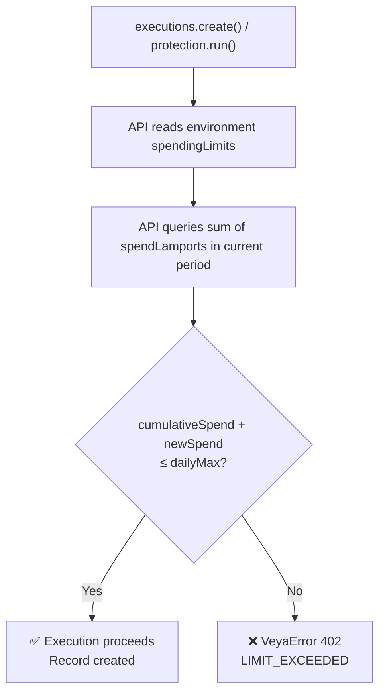

# Executions — Activity Logging, Spend Tracking & Audit Trail

`veya.executions` is the observability and audit layer of the VEYA SDK. Every meaningful action an agent performs — whether reading environment state, triggering a treasury operation, or running a policy check — should be recorded as an execution. This creates an immutable, queryable history of agent activity tied to Solana on-chain commitments for the actions that warrant it.

Standard executions (non-protected) are lightweight log entries with optional spend tracking. Protected executions (via `veya.protection`) extend this with enclave-shielded field filtering and optional Solana attestation. This document covers standard executions. See [protected-execution.md](./protected-execution.md) for the enclave-shielded variant.

---

## What Is an Execution?

An execution record captures a discrete agent action within an environment. It contains:

- **`eventType`** — a dot-notation label you define to classify the action (e.g. `"treasury.transfer"`, `"memory.verify"`, `"health.ping"`)
- **`payload`** — the full execution context: parameters, inputs, outputs, or state at the time of the action
- **`protected`** — whether the execution was routed through a secure enclave
- **`spendLamports`** — the number of Solana lamports debited from the environment's spending budget
- **`commitmentHash`** — the SHA-256 hash of the execution result, anchored on Solana if `commitResult: true`
- **`attestationTx`** — the Solana transaction signature for any on-chain commitment

Executions are append-only. Once created, they cannot be modified or deleted. This immutability is what makes them useful as an audit trail.

---

## Methods

### `executions.list(environmentId)`

Returns all execution records for an environment, ordered by creation time (most recent last).

**Signature:**
```ts
list(environmentId: string): Promise<Execution[]>
```

**Example:**
```ts
import { Veya } from "@veya/sdk";

const veya = new Veya({
  apiUrl: process.env.VEYA_API_URL,
  apiKey: process.env.VEYA_API_KEY,
});

const executions = await veya.executions.list(env.id);

console.log(`Total executions: ${executions.length}`);

for (const exec of executions) {
  const protected_ = exec.protected ? "🔒 PROTECTED" : "📋 STANDARD";
  console.log(`${protected_} [${exec.eventType}]`);
  console.log(`  ID           : ${exec.id}`);
  console.log(`  Agent        : ${exec.agentId ?? "none"}`);
  console.log(`  Spend        : ${exec.spendLamports} lamports`);
  console.log(`  Attestation  : ${exec.attestationTx ?? "none"}`);
  console.log(`  Created      : ${new Date(exec.createdAt).toLocaleString()}`);
}
```

**HTTP:**
```bash
curl "$VEYA_API_URL/v1/environments/env_01HXYZ/executions" \
  -H "X-Api-Key: $VEYA_API_KEY"
```

**Response:** `{ executions: Execution[] }`

**Filtering client-side by event type:**
```ts
const allExecs = await veya.executions.list(env.id);

// Filter to only transfer events
const transfers = allExecs.filter((e) => e.eventType === "treasury.transfer");

// Filter to only protected executions with attestations
const attested = allExecs.filter((e) => e.protected && e.attestationTx !== null);

// Sum total lamports spent today
const today = new Date();
today.setHours(0, 0, 0, 0);
const todaySpend = allExecs
  .filter((e) => new Date(e.createdAt) >= today)
  .reduce((sum, e) => sum + BigInt(e.spendLamports), 0n);
console.log("Today's total spend:", todaySpend.toString(), "lamports");
```

---

### `executions.create(environmentId, input)`

Creates an execution record directly with full control over all fields.

**Signature:**
```ts
create(environmentId: string, input: CreateExecutionInput): Promise<Execution>
```

**Input type:**
```ts
type CreateExecutionInput = {
  eventType: string;
  payload: Record<string, unknown>;
  protected: boolean;
  spendLamports: number;
  agentId?: string;
};
```

**Example — audit log entry:**
```ts
const exec = await veya.executions.create(env.id, {
  eventType: "treasury.query",
  payload: {
    queryType: "balance",
    target: "vault-a",
    result: { lamports: 5_000_000_000, usd: 12.45 },
    timestamp: Date.now(),
  },
  protected: false,
  spendLamports: 0, // read-only — no spend
  agentId: agent.id,
});

console.log(exec.id);        // UUID
console.log(exec.createdAt); // ISO 8601 timestamp
```

**Example — transfer log with spend:**
```ts
const exec = await veya.executions.create(env.id, {
  eventType: "treasury.transfer",
  payload: {
    from: "vault-a",
    to: "vault-b",
    lamports: 100_000_000, // 0.1 SOL
    memo: "Q2 budget allocation",
    status: "completed",
  },
  protected: false,
  spendLamports: 100_000_000,
  agentId: agent.id,
});
```

**HTTP:**
```bash
curl -X POST "$VEYA_API_URL/v1/environments/env_01HXYZ/executions" \
  -H "X-Api-Key: $VEYA_API_KEY" \
  -H "Content-Type: application/json" \
  -d '{
    "eventType": "treasury.query",
    "payload": { "queryType": "balance", "target": "vault-a" },
    "protected": false,
    "spendLamports": 0,
    "agentId": "agent_01HABC"
  }'
```

---

### `executions.runStandard(environmentId, params)`

Convenience wrapper for non-protected executions. Automatically sets `protected: false` and defaults `spendLamports` to `0`.

**Signature:**
```ts
runStandard(
  environmentId: string,
  params: {
    eventType: string;
    payload: Record<string, unknown>;
    agentId?: string;
    spendLamports?: number;
  }
): Promise<Execution>
```

**Example — health ping:**
```ts
const exec = await veya.executions.runStandard(env.id, {
  eventType: "health.ping",
  payload: { status: "ok", uptime: process.uptime() },
  agentId: agent.id,
});
```

**Example — policy evaluation log:**
```ts
const exec = await veya.executions.runStandard(env.id, {
  eventType: "policy.evaluate",
  payload: {
    rule: "max-single-tx",
    input: { lamports: 50_000_000 },
    result: "PASS",
    reason: "Amount is within the 0.1 SOL per-transaction cap.",
  },
  agentId: agent.id,
});
```

**Example — with spend tracking:**
```ts
const exec = await veya.executions.runStandard(env.id, {
  eventType: "memory.verify",
  payload: {
    scope: "agent-prompts",
    memoryId: "mem_01HABC",
    hashMatch: true,
  },
  agentId: agent.id,
  spendLamports: 1000, // minimal lamport cost for the verification operation
});
```

---

## Execution Record Shape

Full interface reference for the `Execution` type:

```ts
interface Execution {
  id: string;                        // UUID v4
  environmentId: string;             // Parent environment UUID
  agentId?: string | null;           // Executing agent UUID (optional)
  eventType: string;                 // Dot-notation label
  payload: Record<string, unknown>;  // Full execution context
  protected: boolean;                // true = enclave-shielded
  spendLamports: string;             // Lamports debited (string — large number safe)
  commitmentHash?: string | null;    // SHA-256 hash (if committed)
  attestationTx?: string | null;     // Solana tx signature (if anchored)
  attestationUri?: string | null;    // VEYA attestation URI (if anchored)
  createdAt: string;                 // ISO 8601 timestamp
}
```

**Field notes:**

- `spendLamports` is typed as `string` rather than `number` to safely handle large values (Solana lamports can exceed JavaScript's safe integer range for high-value transactions). Parse with `BigInt(exec.spendLamports)` for arithmetic.
- `payload` is returned as-is from the API. For protected executions, sealed fields will be hashed or removed from the payload based on the `sealFields` configuration.
- `commitmentHash` and `attestationTx` are only populated for protected executions with `commitResult: true`.

---

## Event Type Conventions

The `eventType` field is a free-form string but following a consistent dot-notation convention makes filtering and auditing significantly easier:

```
<domain>.<action>
```

| Pattern | Examples |
|---|---|
| `treasury.*` | `treasury.transfer`, `treasury.query`, `treasury.check`, `treasury.approve` |
| `memory.*` | `memory.store`, `memory.verify`, `memory.purge` |
| `policy.*` | `policy.evaluate`, `policy.override`, `policy.audit` |
| `health.*` | `health.ping`, `health.report` |
| `agent.*` | `agent.start`, `agent.stop`, `agent.rotate-config` |
| `governance.*` | `governance.vote`, `governance.propose`, `governance.resolve` |

Using consistent event types enables meaningful query patterns:

```ts
const allExecs = await veya.executions.list(env.id);

// Group by domain
const byDomain = allExecs.reduce<Record<string, Execution[]>>((acc, exec) => {
  const domain = exec.eventType.split(".")[0];
  acc[domain] = acc[domain] ?? [];
  acc[domain].push(exec);
  return acc;
}, {});

console.log("Executions by domain:");
for (const [domain, execs] of Object.entries(byDomain)) {
  console.log(`  ${domain}: ${execs.length}`);
}
```

---

## Spending Limits & Budget Enforcement

Every execution that carries a non-zero `spendLamports` value is checked against the environment's configured spending limits before being allowed to proceed. This check is performed server-side in a transaction block to prevent race conditions during concurrent execution.

### How Budget Checking Works



### Configuring Spending Limits

Spending limits are set on the environment and scoped per agent type:

```ts
await veya.environments.update(env.id, {
  spendingLimits: {
    finance: {
      maxSolPerPeriod: 1,            // 1 SOL per rolling period
      periodHours: 24,               // 24-hour rolling window
      maxSingleTransactionSol: 0.1,  // per-transaction cap
    },
    research: {
      maxSolPerPeriod: 0.1,          // research agents have tighter limits
      periodHours: 24,
    },
  },
});
```

### Handling the `402` Error

```ts
import { isVeyaError } from "@veya/sdk";

try {
  await veya.executions.runStandard(env.id, {
    eventType: "treasury.transfer",
    payload: { lamports: 500_000_000 },
    agentId: agent.id,
    spendLamports: 500_000_000,
  });
} catch (err) {
  if (isVeyaError(err) && err.status === 402) {
    console.warn("Spending limit hit for this execution period.");

    // Inspect current environment limits
    const currentEnv = await veya.environments.get(env.id);
    console.log("Current limits:", JSON.stringify(currentEnv.spendingLimits, null, 2));

    // Calculate remaining budget from execution history
    const execs = await veya.executions.list(env.id);
    const periodStart = new Date(Date.now() - 24 * 60 * 60 * 1000);
    const periodSpend = execs
      .filter((e) => new Date(e.createdAt) >= periodStart)
      .reduce((sum, e) => sum + BigInt(e.spendLamports), 0n);

    console.log("Period spend so far:", periodSpend.toString(), "lamports");
    console.log("Remaining:", (1_000_000_000n - periodSpend).toString(), "lamports");
  }
}
```

---

## Audit Trail Patterns

### Full Agent Activity Report

```ts
async function agentActivityReport(
  veya: Veya,
  environmentId: string,
  agentId: string
) {
  const allExecs = await veya.executions.list(environmentId);
  const agentExecs = allExecs.filter((e) => e.agentId === agentId);

  const totalSpend = agentExecs.reduce(
    (sum, e) => sum + BigInt(e.spendLamports),
    0n
  );
  const attestedCount = agentExecs.filter((e) => e.attestationTx).length;
  const protectedCount = agentExecs.filter((e) => e.protected).length;

  const eventTypeBreakdown = agentExecs.reduce<Record<string, number>>(
    (acc, e) => ({ ...acc, [e.eventType]: (acc[e.eventType] ?? 0) + 1 }),
    {}
  );

  return {
    agentId,
    totalExecutions: agentExecs.length,
    protectedExecutions: protectedCount,
    attestedExecutions: attestedCount,
    totalSpendLamports: totalSpend.toString(),
    eventTypeBreakdown,
    lastExecution: agentExecs.at(-1)?.createdAt ?? null,
  };
}

const report = await agentActivityReport(veya, env.id, agent.id);
console.log(JSON.stringify(report, null, 2));
```

### Finding All On-Chain Attestations

```ts
const executions = await veya.executions.list(env.id);

const attested = executions.filter((e) => e.attestationTx !== null);

console.log(`${attested.length} executions with Solana attestations:`);
for (const exec of attested) {
  console.log(`  [${exec.eventType}] tx: ${exec.attestationTx}`);
  if (exec.attestationUri) {
    console.log(`  URI: ${exec.attestationUri}`);
  }
  // Verify each attestation on-chain
  const verified = await veya.proofs.verifyTransaction(exec.attestationTx!);
  console.log(`  Valid: ${verified.valid}`);
}
```

---

## Standard vs. Protected Executions

| Feature | Standard (`executions`) | Protected (`protection`) |
|---|---|---|
| Enclave isolation | ❌ No | ✅ Yes |
| Field-level sealing | ❌ No | ✅ Yes (`sealFields`) |
| Field-level disclosure | ❌ No | ✅ Yes (`discloseFields`) |
| Solana attestation | Optional via `commitResult` | Optional via `commitResult` |
| Spending enforcement | ✅ Yes | ✅ Yes |
| Payload stored plaintext | ✅ Yes | Sealed fields hashed/removed |
| Use case | Logging, observability | Sensitive treasury, policy ops |

---

## Related

- [protected-execution.md](./protected-execution.md) — Enclave-shielded execution with field filtering
- [environments-and-agents.md](./environments-and-agents.md) — Configuring spending limits on environments
- [error-handling.md](./error-handling.md) — Handling `402` spending limit errors
- [proofs-and-anchoring.md](./proofs-and-anchoring.md) — Verifying on-chain attestations
- [types-reference.md](./types-reference.md) — Full `Execution` interface
