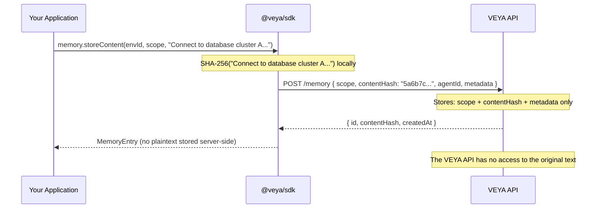

# Memory — Zero-Knowledge Scoped Memory Registry

`veya.memory` implements the zero-knowledge memory layer of the VEYA SDK. It enables agents to register content in a globally queryable registry without ever exposing the plaintext content to the VEYA API. This is achieved through a strict client-side SHA-256 hashing boundary: your application hashes content locally, and only the 64-character hex digest is transmitted and stored.

The VEYA API acts as a tamper-evident hash registry. It cannot reconstruct content from hashes, cannot read agent prompts, system instructions, or private context that agents store. It only records that a particular hash was registered by a particular agent in a particular environment at a particular time.

---

## The Privacy Guarantee

Before covering the API, it is important to understand exactly what the privacy boundary means in practice:



**What the VEYA API stores per memory entry:**
- `environmentId` — the owning environment
- `agentId` — the registering agent (if specified)
- `scope` — caller-defined namespace string
- `contentHash` — 64-character SHA-256 hex digest
- `metadata` — arbitrary caller-defined JSON object
- `createdAt` — ISO 8601 timestamp

**What the VEYA API never receives:**
- The raw content string
- Any plaintext representation of the stored data
- The passphrase or key used for any related encryption

---

## Methods

### `memory.list(environmentId, scope?)`

Lists all memory entries for an environment. Optionally filters by scope to retrieve only entries within a specific namespace.

**Signature:**
```ts
list(environmentId: string, scope?: string): Promise<MemoryEntry[]>
```

**List all entries:**
```ts
const entries = await veya.memory.list(env.id);

console.log(`Total memory entries: ${entries.length}`);

for (const entry of entries) {
  console.log(`[${entry.scope}] ${entry.contentHash.slice(0, 12)}...`);
  console.log(`  ID       : ${entry.id}`);
  console.log(`  Agent    : ${entry.agentId ?? "none"}`);
  console.log(`  Metadata : ${JSON.stringify(entry.metadata ?? {})}`);
  console.log(`  Created  : ${new Date(entry.createdAt).toLocaleString()}`);
}
```

**Filter by scope:**
```ts
const promptEntries = await veya.memory.list(env.id, "agent-prompts");
const sessionLogs = await veya.memory.list(env.id, "session-logs");
const auditHashes = await veya.memory.list(env.id, "audit:2025-06");
```

**HTTP:**
```bash
# All entries
curl "$VEYA_API_URL/v1/environments/env_01HXYZ/memory" \
  -H "X-Api-Key: $VEYA_API_KEY"

# Scoped
curl "$VEYA_API_URL/v1/environments/env_01HXYZ/memory?scope=agent-prompts" \
  -H "X-Api-Key: $VEYA_API_KEY"
```

---

### `memory.store(environmentId, input)`

Stores a pre-computed SHA-256 content hash directly. Use this when you have already computed the hash yourself or when you need to store a hash from a different hashing pipeline.

**Signature:**
```ts
store(environmentId: string, input: StoreMemoryInput): Promise<MemoryEntry>
```

**Input type:**
```ts
type StoreMemoryInput = {
  scope: string;
  contentHash: string;          // 64-char SHA-256 hex
  agentId?: string;
  metadata?: Record<string, unknown>;
};
```

**Example:**
```ts
import { sha256Hex } from "@veya/sdk";

const content = "Agent system prompt v3: You are a treasury management agent...";
const hash = await sha256Hex(content);

// Save plaintext locally — to your database, file system, or encrypted store
await localStore.save({ id: "prompt-v3", content });

// Register only the hash with VEYA
const entry = await veya.memory.store(env.id, {
  scope: "agent-prompts",
  contentHash: hash,
  agentId: agent.id,
  metadata: {
    version: 3,
    label: "treasury-agent-system-prompt",
    registeredBy: "ops-pipeline",
  },
});

console.log(entry.id);          // UUID — use this to purge or reference later
console.log(entry.contentHash); // SHA-256 hex (echoed back)
console.log(entry.createdAt);   // ISO 8601
```

**HTTP:**
```bash
curl -X POST "$VEYA_API_URL/v1/environments/env_01HXYZ/memory" \
  -H "X-Api-Key: $VEYA_API_KEY" \
  -H "Content-Type: application/json" \
  -d '{
    "scope": "agent-prompts",
    "contentHash": "5a6b7c8d9e0f1a2b3c4d5e6f7a8b9c0d1e2f3a4b5c6d7e8f9a0b1c2d3e4f5a6b",
    "agentId": "agent_01HABC",
    "metadata": { "version": 3 }
  }'
```

---

### `memory.storeContent(environmentId, scope, content, options?)`

The recommended high-level method for most use cases. Hashes the raw `content` string locally using SHA-256 via the Web Crypto API, then calls `store()` with the resulting digest. The raw content string **never leaves your process**.

**Signature:**
```ts
storeContent(
  environmentId: string,
  scope: string,
  content: string,
  options?: {
    agentId?: string;
    metadata?: Record<string, unknown>;
  }
): Promise<MemoryEntry>
```

**Basic example:**
```ts
const entry = await veya.memory.storeContent(
  env.id,
  "agent-prompts",
  "You are a treasury management agent. Your responsibilities include monitoring vault balances, executing approved transfers, and flagging anomalous transactions for human review.",
  {
    agentId: agent.id,
    metadata: { version: 1, promptType: "system" },
  }
);

console.log(entry.contentHash);
// → "a1b2c3d4e5f6a7b8c9d0e1f2a3b4c5d6e7f8a9b0c1d2e3f4a5b6c7d8e9f0a1b2"
```

**Session log example:**
```ts
const entry = await veya.memory.storeContent(
  env.id,
  "session-logs",
  JSON.stringify({
    sessionId: "sess_abc123",
    agentId: agent.id,
    startTime: new Date().toISOString(),
    initialContext: { environmentType: "treasury", taskCount: 3 },
  }),
  { agentId: agent.id }
);
```

**Batch registration:**
```ts
const prompts = [
  { name: "system-v1", content: "System prompt version 1..." },
  { name: "system-v2", content: "System prompt version 2..." },
  { name: "user-onboarding", content: "Onboarding prompt..." },
];

const entries = await Promise.all(
  prompts.map((p) =>
    veya.memory.storeContent(env.id, "agent-prompts", p.content, {
      agentId: agent.id,
      metadata: { name: p.name },
    })
  )
);

console.log(`Registered ${entries.length} prompts`);
```

---

### `memory.purge(environmentId, memoryId)`

Permanently removes a memory entry from the VEYA registry by its UUID. The operation is irreversible. Any locally stored plaintext that was hashed into this entry is unaffected — only the hash record is removed from the VEYA API.

**Signature:**
```ts
purge(environmentId: string, memoryId: string): Promise<{ ok: boolean }>
```

**Example:**
```ts
const { ok } = await veya.memory.purge(env.id, entry.id);

if (ok) {
  console.log(`Memory entry ${entry.id} removed from registry.`);
}
```

**Purge all entries for a specific scope:**
```ts
const entries = await veya.memory.list(env.id, "session-logs");

const results = await Promise.all(
  entries.map((e) => veya.memory.purge(env.id, e.id))
);

const purgedCount = results.filter((r) => r.ok).length;
console.log(`Purged ${purgedCount} of ${entries.length} session log entries.`);
```

> [!CAUTION]
> Purging a memory entry removes it from the VEYA registry permanently. If the plaintext content was stored only locally and then lost, there is no way to re-derive the hash and re-link it. Purge entries only when you are certain the corresponding local data is also being retired.

**HTTP:**
```bash
curl -X DELETE "$VEYA_API_URL/v1/environments/env_01HXYZ/memory/mem_01HABC" \
  -H "X-Api-Key: $VEYA_API_KEY"
```

---

## Content Integrity Verification

One of the most powerful use cases for VEYA memory is verifying that content has not been tampered with between the time it was registered and the time it is being used.

### Single Entry Verification

```ts
import { sha256Hex } from "@veya/sdk";

async function verifyMemoryEntry(
  veya: Veya,
  environmentId: string,
  memoryId: string,
  localContent: string
): Promise<boolean> {
  // Hash the local content
  const localHash = await sha256Hex(localContent);

  // Fetch the registered entry
  const entries = await veya.memory.list(environmentId);
  const entry = entries.find((e) => e.id === memoryId);

  if (!entry) {
    throw new Error(`Memory entry ${memoryId} not found in registry.`);
  }

  const isValid = entry.contentHash === localHash;

  if (!isValid) {
    console.error("⚠ Integrity check FAILED:");
    console.error("  Registered hash:", entry.contentHash);
    console.error("  Local hash     :", localHash);
    console.error("  Content may have been modified since registration.");
  } else {
    console.log("✅ Integrity check PASSED — content matches registered hash.");
  }

  return isValid;
}

// Usage
const isValid = await verifyMemoryEntry(
  veya,
  env.id,
  promptEntry.id,
  localPromptText
);

if (!isValid) {
  // Do not use the prompt — content integrity compromised
  throw new Error("Agent prompt integrity check failed. Halting execution.");
}
```

### Multi-Agent Coordination Verification

In multi-agent workflows where agents share memory records, each agent can independently verify that the shared data has not been altered:

```ts
async function coordinatedMemoryCheck(
  veya: Veya,
  environmentId: string,
  scope: string,
  localCopies: Map<string, string> // memoryId → local plaintext
): Promise<{ valid: string[]; invalid: string[] }> {
  const registeredEntries = await veya.memory.list(environmentId, scope);
  const registeredMap = new Map(registeredEntries.map((e) => [e.id, e.contentHash]));

  const valid: string[] = [];
  const invalid: string[] = [];

  for (const [memoryId, localContent] of localCopies) {
    const localHash = await sha256Hex(localContent);
    const registeredHash = registeredMap.get(memoryId);

    if (registeredHash && registeredHash === localHash) {
      valid.push(memoryId);
    } else {
      invalid.push(memoryId);
    }
  }

  return { valid, invalid };
}
```

---

## Scope Design Patterns

The `scope` field partitions memory entries into named namespaces. Design scopes to match your data access patterns — you will filter by scope frequently, so scope names should be stable and predictable.

### Recommended Scope Patterns

| Pattern | Examples | Data Type |
|---|---|---|
| Feature namespaces | `"agent-prompts"`, `"system-configs"` | Shared prompt templates, configuration files |
| Session-scoped | `"session:abc123"`, `"session:xyz789"` | Ephemeral per-session context |
| Agent-scoped | `"agent:finance:state"`, `"agent:research:cache"` | Per-agent isolated state |
| Audit records | `"audit:2025-06"`, `"audit:2025-07"` | Monthly or periodic audit hashes |
| Versioned artifacts | `"artifact:v1"`, `"artifact:v2"` | Versioned prompt or config hashes |

### Scope Naming Rules

- 1–64 characters in length
- URL-safe characters recommended (letters, numbers, hyphens, colons)
- Case-sensitive — `"Agent-Prompts"` and `"agent-prompts"` are different scopes
- Use consistent delimiters — either `:` or `-`, not both

---

## `MemoryEntry` Type Reference

```ts
interface MemoryEntry {
  id: string;                           // UUID v4
  environmentId: string;                // Parent environment UUID
  agentId?: string | null;              // Registering agent UUID (optional)
  scope: string;                        // Namespace string
  contentHash: string;                  // 64-char SHA-256 hex digest
  metadata?: Record<string, unknown>;   // Arbitrary caller-defined JSON
  createdAt: string;                    // ISO 8601 timestamp
}
```

---

## Complete Workflow: Register, Verify, Purge

A full lifecycle example managing agent prompt integrity:

```ts
import { Veya, sha256Hex, isVeyaError } from "@veya/sdk";

const veya = new Veya({
  apiUrl: process.env.VEYA_API_URL,
  apiKey: process.env.VEYA_API_KEY,
});

const SCOPE = "agent-prompts";
const PROMPT_V1 = "You are a treasury management agent. Monitor vault balances...";
const PROMPT_V2 = "You are a treasury management agent (v2). Monitor vault balances with enhanced anomaly detection...";

// Step 1 — Register prompt v1
const entryV1 = await veya.memory.storeContent(env.id, SCOPE, PROMPT_V1, {
  agentId: agent.id,
  metadata: { version: 1, active: true },
});
console.log("Registered v1:", entryV1.contentHash.slice(0, 16) + "...");

// Step 2 — Verify integrity before use
const hashV1 = await sha256Hex(PROMPT_V1);
const isValid = entryV1.contentHash === hashV1;
console.log("v1 integrity:", isValid ? "✅ PASS" : "❌ FAIL");

// Step 3 — Register v2 when prompt is updated
const entryV2 = await veya.memory.storeContent(env.id, SCOPE, PROMPT_V2, {
  agentId: agent.id,
  metadata: { version: 2, active: true },
});
console.log("Registered v2:", entryV2.contentHash.slice(0, 16) + "...");

// Step 4 — List all registered prompts
const allPrompts = await veya.memory.list(env.id, SCOPE);
console.log(`Registered prompts in scope '${SCOPE}':`, allPrompts.length);

// Step 5 — Purge v1 when it is retired
const { ok } = await veya.memory.purge(env.id, entryV1.id);
console.log("v1 purged:", ok);

// Remaining entries in scope
const remaining = await veya.memory.list(env.id, SCOPE);
console.log("Remaining:", remaining.length, "— only v2 should remain");
```

---

## Related

- [crypto.md](./crypto.md) — SHA-256 utilities (`sha256Hex`, `sha256HexSync`) used in hashing
- [ARCHITECTURE.md](./ARCHITECTURE.md) — Zero-knowledge memory model in the full architecture context
- [executions.md](./executions.md) — Logging memory operations as execution events
- [types-reference.md](./types-reference.md) — Full `MemoryEntry` interface
- [proofs-and-anchoring.md](./proofs-and-anchoring.md) — On-chain anchoring for permanent public proof records
