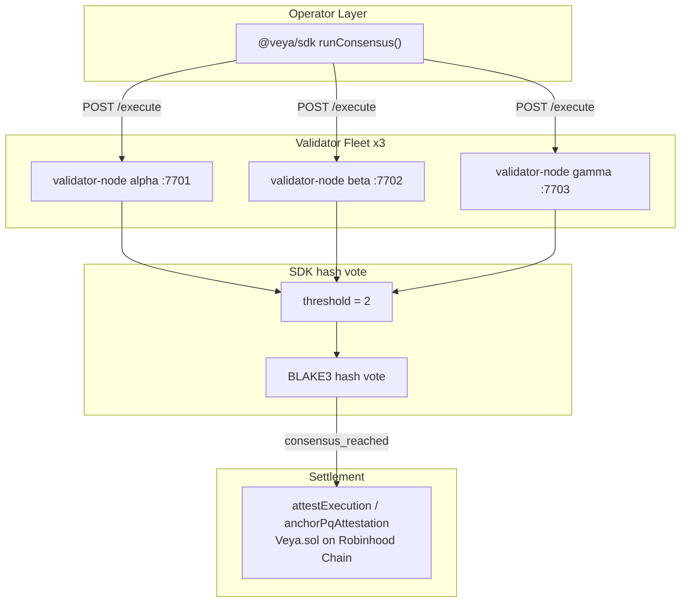
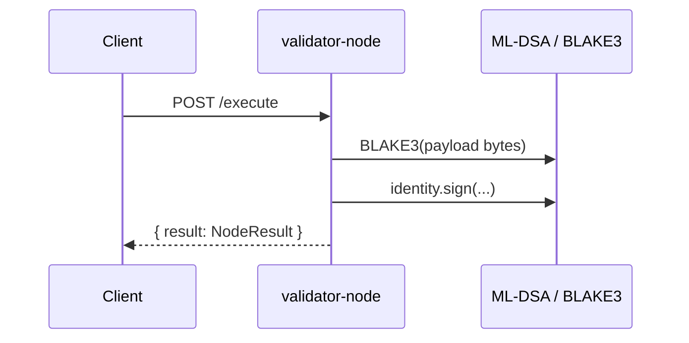

# Consensus Cluster Operations

**Run a production-grade validator fleet for VEYA decentralized compute: 3 nodes, 2-of-3 BLAKE3 quorum, ML-DSA-44 attestations, optional settlement on Robinhood Chain.**

Independent `validator-node` processes execute identical payloads, sign BLAKE3 digests with ML-DSA-44, and return results to `@veya/sdk` (`runConsensus`) or operator HTTP clients. No centralized execution API participates in the critical path. When the application anchors an agreed hash, it writes to `Veya.sol` at `0x1a1Dc3c55550FCE9F70ef6cDEeF967c0b72a5d84` on Robinhood Chain testnet (chain id 46630) through `EvmAnchor`, not through a Solana program.

**Related:** [sdk/decentralized-compute.md](../sdk/decentralized-compute.md) • [sdk/pq-crypto.md](../sdk/pq-crypto.md) • [sdk/evm-anchoring.md](../sdk/evm-anchoring.md) • [sdk/configuration.md](../sdk/configuration.md)

---

## Table of Contents

1. [Purpose and Scope](#purpose-and-scope)
2. [Audience and Assumptions](#audience-and-assumptions)
3. [Glossary](#glossary)
4. [Architecture](#architecture)
5. [Binary and Build](#binary-and-build)
6. [Starting Nodes](#starting-nodes)
7. [HTTP API](#http-api)
8. [Node Identity](#node-identity)
9. [Quorum Configuration](#quorum-configuration)
10. [Health Monitoring](#health-monitoring)
11. [systemd Deployment](#systemd-deployment)
12. [Networking and Security](#networking-and-security)
13. [Rolling Upgrades](#rolling-upgrades)
14. [SDK Integration](#sdk-integration)
15. [Settlement on Robinhood Chain](#settlement-on-robinhood-chain)
16. [Failure Modes](#failure-modes)
17. [Environment Variables](#environment-variables)
18. [Troubleshooting](#troubleshooting)
19. [See Also](#see-also)

---

## Purpose and Scope

This runbook is for operators who run the validator fleet that `@veya/sdk` queries. It covers bind addresses, identities, quorum arithmetic, health, upgrades, and how consensus hashes become `Veya.sol` records. It does not replace the SDK client document; threshold logic in TypeScript is specified in [sdk/decentralized-compute.md](../sdk/decentralized-compute.md).

The fleet is application-level infrastructure. It is not Robinhood Chain consensus and not a set of EVM validators. Nodes do not produce blocks. They produce ML-DSA-attested BLAKE3 hashes over agent payloads.

---

## Audience and Assumptions

Readers should be able to run a Rust release binary, open TCP ports 7701–7703, and set `VEYA_VALIDATOR_NODES` for the SDK. They should understand that SDK `runConsensus` currently fetches nodes sequentially and throws on network errors unless wrapped.

Assumptions:

- Default local ports: alpha 7701, beta 7702, gamma 7703.
- Threshold 2 is enforced in the SDK client (`src/compute/consensus.ts`).
- Settlement uses wei and camelCase `INSTRUCTION_NAMES` when hashes are anchored.
- `ensureRobinhoodChain` checks `eth_chainId` before those writes.
- There is no `@veya/program` IDL; the SDK ABI is inlined.

---

## Glossary

| Term | Meaning |
|------|---------|
| validator-node | HTTP process that hashes, signs, and returns `NodeResult` |
| Fleet | Typically three processes with independent ML-DSA identities |
| Quorum | Two matching successful BLAKE3 hashes |
| `task_id` | Caller-supplied correlation id |
| Settlement | Optional `anchorPqAttestation` / `attestExecution` on `Veya.sol` |

---

## Architecture



| Component | Role |
|-----------|------|
| validator-node binary | HTTP server per node |
| ML-DSA-44 identity | Per-process or persisted key |
| BLAKE3 | Execution digest |
| `@veya/sdk` | Orchestration and optional EVM write |

Nodes should not share disks for identity files. Correlated identities collapse the independence assumption of 2-of-3.

---

## Binary and Build

Build the validator node from the VEYA node workspace the operator uses for Robinhood deployments (Rust crate `validator-node`):

```bash
cargo build --release -p validator-node
```

Binary location: `target/release/validator-node`.

### Dependencies (conceptual)

| Piece | Purpose |
|-------|---------|
| HTTP stack (axum/tokio or equivalent) | `POST /execute` |
| PQ crypto | ML-DSA sign, BLAKE3 hash |
| Node handler | Canonicalize payload, wrap `NodeResult` |

### Verify build

```bash
./target/release/validator-node --help 2>/dev/null || true
```

Run crate tests if the workspace provides them. A node that starts and answers `/execute` with a stable hash for a fixed payload is the acceptance test.

---

## Starting Nodes

### Manual (three terminals)

```bash
cargo run --release -p validator-node -- alpha 7701
cargo run --release -p validator-node -- beta 7702
cargo run --release -p validator-node -- gamma 7703
```

**Arguments:** `<node_id> <port>`

| Node | ID | Default port |
|------|-----|--------------|
| Alpha | `alpha` | 7701 |
| Beta | `beta` | 7702 |
| Gamma | `gamma` | 7703 |

Default if omitted: `alpha` on `7701`.

Bind to `127.0.0.1` in development. Production should bind a private interface, not `0.0.0.0` on a public IP.

### Script helper

If the repository ships `scripts/run-consensus-cluster.sh`, use it for local bring-up. On Windows PowerShell, start three process jobs with the same arguments.

### Quick start

```bash
# Terminals 1-3
cargo run --release -p validator-node -- alpha 7701
cargo run --release -p validator-node -- beta 7702
cargo run --release -p validator-node -- gamma 7703
```

Then from Node:

```bash
export VEYA_VALIDATOR_NODES="http://127.0.0.1:7701,http://127.0.0.1:7702,http://127.0.0.1:7703"
```

The SDK defaults already match those URLs if the env var is unset.

---

## HTTP API

### POST /execute

#### Request

```json
{
  "task_id": "unique-task-id",
  "payload": { "action": "rebalance", "amountWei": "1000000000000000" }
}
```

| Field | Type | Required |
|-------|------|----------|
| `task_id` | `string` | Yes: audit correlation |
| `payload` | `object` | Yes: JSON-serializable |

Use wei decimal strings for value fields so TypeScript and Rust JSON agree. Do not put lamports in payloads.

#### Response

The SDK expects a wrapped result:

```json
{
  "result": {
    "node_id": "alpha",
    "blake3_execution_hash": "1f2f0fd6237e00d76bdf5ab61eb8edc85a265a42ec9f24f7554993daa5e9c9e3",
    "mldsa_signature": "a1b2c3d4...",
    "mldsa_public_key_hex": "optional...",
    "status": "success"
  }
}
```

If `result` is missing, the SDK skips the node. Always wrap.

#### Processing steps



1. Canonicalize payload to bytes (stable JSON).
2. `blake3_execution_hash = hex(BLAKE3(bytes))`.
3. `mldsa_signature = hex(ML-DSA-44 sign)`.
4. Return `status: "success"` or `"fail"`.

Document for auditors whether the node signs raw payload bytes or the 32-byte digest. The SDK verification example must use the same message.

---

## Node Identity

Each process should generate or load an ML-DSA-44 keypair at start. Log the public key hex once for operator records. Persist the secret with mode 0600 (Unix) or equivalent ACLs (Windows).

Rotating an identity means historical signatures need the old public key to verify. Keep an identity archive keyed by `node_id` and `started_at`.

Do not reuse the Robinhood Chain `payerPrivateKey` as node identity. That key is secp256k1 for `msg.sender`. Node identity is ML-DSA-44.

If `mldsa_public_key_hex` is included on every `NodeResult`, auditors can verify without the archive for that request. Including the public key does not prove it is the long-term node identity unless the operator pins it.

---

## Quorum Configuration

The SDK threshold is **2**. Operators cannot change it via environment variable in the current client. Fleet size can grow; threshold stays 2 unless `consensus.ts` is changed and redeployed.

| Fleet size | Failures tolerated (if fetch errors are swallowed) | SDK default behavior on connection error |
|------------|-----------------------------------------------------|------------------------------------------|
| 3 | 1 | Entire `runConsensus` throws |
| 5 | theoretically more matching pairs | Still throws on first dead URL in the sequential loop |

For production availability, put a reverse proxy that returns HTTP 200 `{ result: { status: "fail", ... } }` when a validator node is down, or wrap `runConsensus` with per-URL try/catch. Otherwise a single down node aborts the client call.

Never run all three nodes as threads in one OS process and call that "decentralized." Independent hosts (or at least independent failure domains) are the point.

---

## Health Monitoring

Minimum checks:

| Check | Method | Expect |
|-------|--------|--------|
| Listen | TCP connect to 7701/7702/7703 | Accept |
| Execute ping | `POST /execute` `{ "task_id": "health", "payload": { "action": "ping" } }` | 200 with `result.status` |
| Hash stability | Same payload twice | Identical `blake3_execution_hash` |
| Identity stability | Across requests | Same `mldsa_public_key_hex` if advertised |

Alert if hashes for a fixed ping payload change after a deploy; that indicates canonicalization or binary drift.

Do not health-check by sending production payloads. Ping bodies should be boring and side-effect free. Nodes that execute side effects on `/execute` are mis-scoped; hashing and signing should be functional.

Metrics to export if the binary allows: request count, sign latency, last hash, process uptime. Scrape from a private network.

---

## systemd Deployment

Example unit for alpha (Linux):

```ini
[Unit]
Description=VEYA validator-node alpha
After=network.target

[Service]
Type=simple
User=veya
ExecStart=/usr/local/bin/validator-node alpha 7701
Restart=on-failure
RestartSec=2
NoNewPrivileges=true
PrivateTmp=true
ProtectSystem=strict
ProtectHome=true
Environment=RUST_LOG=info

[Install]
WantedBy=multi-user.target
```

Repeat for beta/gamma with ports 7702/7703. Use `ProtectHome=true` only if identities are not stored under `/home`. Mount an identity directory with `ReadWritePaths=`.

Windows operators should use a service wrapper that restarts on failure and does not run as a privileged desktop user.

---

