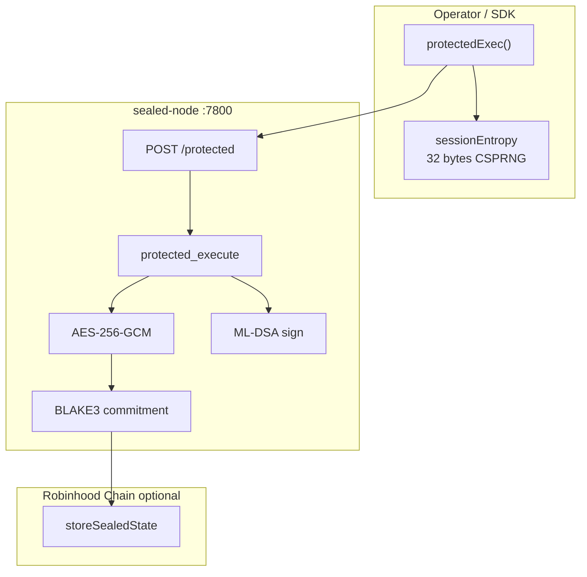
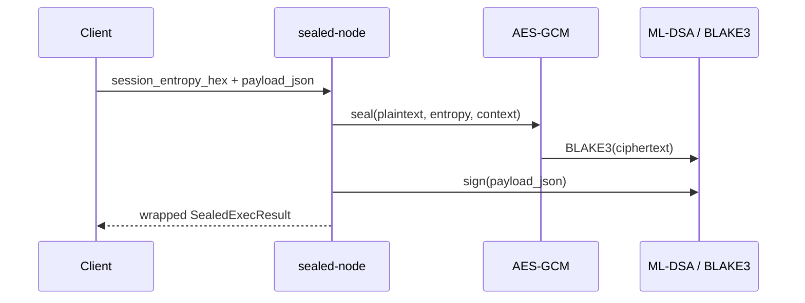
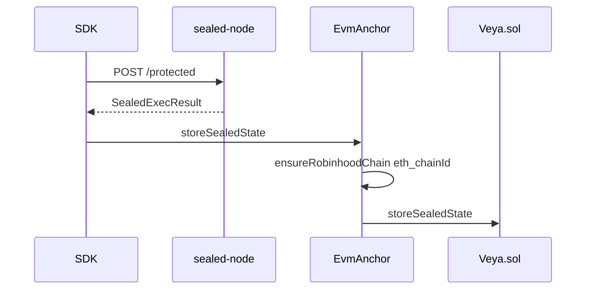

# Sealed Node Operations

**HTTP protected execution with AES-256-GCM encryption, BLAKE3 commitments, and ML-DSA attestations: optional data availability on `Veya.sol`.**

The `sealed-node` binary receives execution requests from `@veya/sdk` (`protectedExec` / `VeyaClient.protectedExecute`) or other HTTP clients, processes payloads inside the sealed boundary, and returns ciphertext commitments suitable for `storeSealedState` on Robinhood Chain. Default listen port is **7800**. Settlement, when used, targets `Veya.sol` at `0x1a1Dc3c55550FCE9F70ef6cDEeF967c0b72a5d84` on chain id **46630**, with camelCase ABI methods and wei accounting elsewhere in the protocol.

**Related:** [sdk/sealed-execution.md](../sdk/sealed-execution.md) • [sdk/pq-crypto.md](../sdk/pq-crypto.md) • [sdk/evm-anchoring.md](../sdk/evm-anchoring.md) • [consensus-cluster.md](./consensus-cluster.md)

---

## Table of Contents

1. [Purpose and Scope](#purpose-and-scope)
2. [Audience and Assumptions](#audience-and-assumptions)
3. [Glossary](#glossary)
4. [Overview](#overview)
5. [Build and Run](#build-and-run)
6. [HTTP API](#http-api)
7. [Cryptographic Stack](#cryptographic-stack)
8. [Session Entropy](#session-entropy)
9. [Response Shape](#response-shape)
10. [On-Chain Integration](#on-chain-integration)
11. [Deployment Patterns](#deployment-patterns)
12. [systemd Service](#systemd-service)
13. [Hardening Checklist](#hardening-checklist)
14. [Upgrade Path](#upgrade-path)
15. [Environment Variables](#environment-variables)
16. [Failure Modes](#failure-modes)
17. [SDK Coupling](#sdk-coupling)
18. [Troubleshooting](#troubleshooting)
19. [See Also](#see-also)

---

## Purpose and Scope

This runbook covers operating a sealed node that the TypeScript SDK can call. It specifies bind addresses, the `/protected` contract, entropy requirements, how to persist ML-DSA identity, how to place TLS in front, and how ciphertext becomes `storeSealedState` chunks of at most 8192 bytes.

The node is not an EVM client. It does not send transactions. Operators who want on-chain data availability use `@veya/sdk` `EvmAnchor` from a different host that holds `payerPrivateKey`.

---

## Audience and Assumptions

Readers should be able to run a release binary on port 7800, generate 32-byte hex entropy from the client, and read SDK errors of the form `sealed-node error: <status>`.

Assumptions:

- SDK origin config is `VEYA_SEALED_NODE_URL` or `http://127.0.0.1:7800`.
- Current SDK normalizes wrapped `{ result: SealedExecResult }` and a legacy flat `blake3_execution_hash` body.
- Chain writes use `storeSealedState` (camelCase), not a snake_case instruction name.
- `ensureRobinhoodChain` pins `eth_chainId` before those writes.
- Payloads that mention value use wei strings, not lamports.
- ABI is inlined in the SDK; the node does not import `@veya/program`.

---

## Glossary

| Term | Meaning |
|------|---------|
| sealed-node | HTTP process exposing `POST /protected` |
| Session entropy | 32-byte client CSPRNG, 64 hex chars on the wire |
| Context label | Bound into key derivation; typically environment id |
| `SealedPayload` | ciphertext, blake3_commitment, context_label |
| Chunk | <= 8192 bytes stored per `Veya.sol` mapping slot |

---

## Overview

| Property | Value |
|----------|-------|
| Binary | `sealed-node` |
| Default port | **7800** |
| Endpoint | `POST /protected` |
| Default URL | `http://127.0.0.1:7800` |
| Max on-chain chunk | 8192 bytes |
| SDK module | `src/sealed/protectedExec.ts` |



Kyber-768 may wrap coordination sessions on the SDK side. Sealed-node v1 derives AES keys via BLAKE3 over session entropy plus context labels. Do not assume the HTTP body is Kyber-encapsulated.

---

## Build and Run

```bash
cargo build --release -p sealed-node
./target/release/sealed-node 7800
```

Expected log line:

```
sealed-node listening on 127.0.0.1:7800
```

Development shortcut:

```bash
cargo run --release -p sealed-node -- 7800
```

Port argument:

```bash
sealed-node <port>
```

If the binary binds `0.0.0.0`, put a firewall in front immediately. Prefer an explicit bind address flag if the binary supports it; otherwise wrap with systemd `IPAddressAllow`.

On Windows, run the same binary in a terminal or as a service; open localhost:7800 only.

---

## HTTP API

**Handler:** sealed-node HTTP module (`POST /protected`).

### Request

```json
{
  "environment_id": "550e8400-e29b-41d4-a716-446655440000",
  "agent_id": "6ba7b810-9dad-11d1-80b4-00c04fd430c8",
  "event_type": "policy_eval",
  "payload_json": "{\"rule\":\"max_spend\",\"limitWei\":\"10000000000000000\"}",
  "session_entropy_hex": "a1b2c3d4e5f6789012345678901234567890abcdef1234567890abcdef123456"
}
```

| Field | Type | Validation |
|-------|------|------------|
| `environment_id` | `string` | Non-empty |
| `agent_id` | `string` | Non-empty |
| `event_type` | `string` | Event classifier |
| `payload_json` | `string` | JSON text (string, not nested object) |
| `session_entropy_hex` | `string` | Exactly 64 hex chars (32 bytes) |

The SDK always sends `payload_json` as a string because it `JSON.stringify`s the object first. Clients that send a nested object will not match the node schema.

### Response (current)

```json
{
  "result": {
    "sealed": {
      "ciphertext": [/* 0-255 */],
      "blake3_commitment": "9c7aef9fd1465f2a9a1f01ba090e9db1d7206330982aa822777e0b2f291b1b1a",
      "context_label": "550e8400-e29b-41d4-a716-446655440000"
    },
    "output_blake3_hash": "1f2f0fd6237e00d76bdf5ab61eb8edc85a265a42ec9f24f7554993daa5e9c9e3",
    "mldsa_signature": "deadbeef...",
    "verified": true
  }
}
```

Wrap under `result`. The SDK prefers that shape. Legacy flat bodies with `blake3_execution_hash` still parse but yield empty `sealed.ciphertext`.

### HTTP status codes

| Code | Meaning |
|------|---------|
| 200 | Success: body as above |
| 400 | Invalid entropy, empty ids, malformed JSON string |
| 404 | Wrong path |
| 500 | Encryption / identity / internal error |

The SDK throws `sealed-node error: ${status}` on non-2xx and does not parse the error body.

---

## Cryptographic Stack

| Layer | Algorithm | Location |
|-------|-----------|----------|
| Session entropy | OS CSPRNG 32 bytes | Client |
| Key derivation | BLAKE3 | Node key schedule |
| Nonce derivation | BLAKE3 over entropy + operation id | Node |
| Payload encryption | AES-256-GCM | Node |
| Ciphertext commitment | BLAKE3-256 | `sealed.blake3_commitment` |
| Execution hash | BLAKE3 | `output_blake3_hash` |
| Attestation | ML-DSA-44 | `mldsa_signature` |



AES-256-GCM provides confidentiality and authenticity of the sealed blob given the key. The HTTP request that carries plaintext `payload_json` is outside that guarantee. TLS or loopback is mandatory for any non-trivial deployment.

`verified: true` is a node-side flag. Auditors re-run `verifyPQ` from `@veya/sdk/pq`.

---

## Session Entropy

The client must send 32 fresh bytes per event. Reuse with the same context label risks GCM nonce reuse depending on derivation. Treat reuse as a security incident.

Operators debugging with a fixed entropy value must never enable that in production config. Fixture entropy belongs only in automated tests with throwaway keys.

Persist entropy if the operator will unseal later. The chain stores ciphertext and BLAKE3, not the AES key. Without entropy (or a derived key backup), ciphertext is unreadable by design.

Entropy hex is unprefixed. A client that sends `0x` plus 64 chars will fail length checks (66 hex chars plus prefix handling). The SDK `Buffer.toString("hex")` path is correct.

---

## Response Shape

Operators upgrading from flat responses should ship the wrapped `result` object so `storeSealedState` has ciphertext bytes. Mixed fleets: the SDK can still mark `verified` from legacy `status === "success"` but will not have chunks to store.

`ciphertext` as a JSON array of numbers is verbose. Large payloads will produce large HTTP responses. That is acceptable for agent events; it is not a bulk file server. Cap payload size at the reverse proxy.

`context_label` should match `environment_id` unless the node documents otherwise. Auditors bind the commitment to an environment using that label plus the on-chain `environmentUuid`.

---

## On-Chain Integration

`Veya.sol.storeSealedState`:

- Requires existing environment.
- Rejects chunks longer than `MAX_SEALED_CHUNK` (8192).
- Key: `keccak256(abi.encodePacked(environmentUuid, stateId, chunkIndex))`.
- Stores BLAKE3 of the chunk plus raw bytes.



Do not give the sealed-node host the payer key. Exfiltrate ciphertext to the SDK host, then send the EVM transaction. Compromise of the sealed host already reveals plaintext at request time; adding the payer key would also let an attacker register environments and attest hashes.

Explorer: `https://explorer.testnet.chain.robinhood.com`.

---

## Deployment Patterns

| Pattern | When | Notes |
|---------|------|-------|
| Loopback only | Development, single-host agent | SDK and node on one machine |
| Private NIC | Production agent runtime | No public 7800 |
| TLS reverse proxy | Remote SDK | Terminate TLS; do not log bodies |
| Dedicated host | Higher isolation | Still not a hardware TEE unless you add one |

Sealed-node can sit beside the validator fleet but should not share identities. Consensus nodes hash public execution payloads; the sealed node sees confidential events. Combining them on one process collapses roles.

Horizontal scale: the SDK points at a single `sealedNodeUrl`. Load-balancing two sealed nodes requires sticky entropy and identity; it is usually wrong. Scale vertically or shard by environment with different URLs in different `VeyaClient` instances.

---

## systemd Service

```ini
[Unit]
Description=VEYA sealed-node
After=network.target

[Service]
Type=simple
User=veya
ExecStart=/usr/local/bin/sealed-node 7800
Restart=on-failure
RestartSec=2
NoNewPrivileges=true
PrivateTmp=true
ProtectSystem=strict
Environment=RUST_LOG=info

[Install]
WantedBy=multi-user.target
```

Add `ReadWritePaths=` for an identity directory. Do not set `VEYA_DEPLOYER_PRIVATE_KEY` in this unit.

Windows: equivalent service, localhost bind, event log without payload bodies.

---

## Hardening Checklist

- Bind 127.0.0.1 or a private interface.
- TLS if the SDK is not local.
- Disable proxy body logging.
- Persist ML-DSA identity with locked-down permissions.
- 32-byte entropy from the client; reject other lengths with 400.
- Separate host from the EVM payer.
- Disk encryption for any spill of payloads.
- Resource limits so `/protected` cannot fill RAM with huge `payload_json`.
- NTP optional; do not put clocks into AES nonces except through documented derivation.

This node is not Intel SGX. "Sealed" is cryptographic plus operational. If a threat model requires a hardware enclave, that is a different deployment and a different binary attestation story.

---

## Upgrade Path

Upgrade procedure:

1. Drain SDK traffic (stop callers).
2. Snapshot identity files.
3. Replace binary.
4. Start on 7800; hit `/protected` with a canary and known entropy.
5. Confirm wrapped `result.sealed.ciphertext` is non-empty.
6. Confirm BLAKE3 recomputed on the SDK matches `blake3_commitment`.

If key derivation changes, old ciphertext will not unseal. Version the derivation in `context_label` or `event_type` and never mix versions on one node without a flag.

A later confidential computing upgrade (for example stronger envelope schemes) must keep the HTTP field names the SDK sends: `environment_id`, `agent_id`, `event_type`, `payload_json`, `session_entropy_hex`. Breaking those names breaks `protectedExec`.

---

## Environment Variables

| Variable | Reader | Purpose |
|----------|--------|---------|
| `VEYA_SEALED_NODE_URL` | `@veya/sdk` | Origin, no trailing path |
| `RUST_LOG` | Node | Log verbosity |
| `ROBINHOOD_RPC_URL` | SDK only | Not for the node process |
| `VEYA_DEPLOYER_PRIVATE_KEY` | SDK only | Never on the sealed host |

The node should not read Robinhood RPC. If it does, it is over-privileged.

---

## Failure Modes

| Failure | Detection | Recovery |
|---------|-----------|----------|
| Bind fail | Port 7800 in use | Other port; update SDK URL |
| 400 on entropy | Length not 64 hex | Fix client |
| 500 on seal | Identity or AES error | Logs; restart; check identity file |
| SDK empty ciphertext | Legacy response shape | Upgrade to wrapped `result` |
| `SealedChunkTooLarge` | Chunk > 8192 | Split in SDK |
| `EnvironmentDoesNotExist` | Anchored too early | `registerEnvironment` first |
| Chain id mismatch | Wrong RPC | `ensureRobinhoodChain` |
| Nonce reuse | Entropy reused | Rotate; incident response |
| Proxy 413 | Body too large | Raise limit or shrink payload |
| Unseal impossible | Entropy lost | Restore entropy backup or accept loss |

A crash after sealing but before the HTTP response leaves ciphertext only in memory. The client will retry with **new** entropy, producing a new envelope. That is a new event, not a duplicate chunk index, unless the operator reuses `stateId` carelessly on chain.

---

## SDK Coupling

```typescript
const client = new VeyaClient({
  sealedNodeUrl: "http://127.0.0.1:7800",
});

await client.protectedExecute({
  environmentId,
  agentId,
  eventType: "audit",
  payload: { step: "finalize", amountWei: "0" },
  sessionEntropy: crypto.getRandomValues(new Uint8Array(32)),
});
```

`VeyaClient` strips trailing slashes on the origin inside `protectedExec`. Do not set `VEYA_SEALED_NODE_URL=http://127.0.0.1:7800/protected`.

Policy and consensus should run before this call. The sealed node will process a denied tool if the application sends it.

---

## Data Handling and Retention

The node sees plaintext `payload_json`. Retention policy is an operator decision. Recommended default: do not persist plaintext. If the binary logs requests at debug level, disable that in production. Ciphertext returned to the client may be stored on `Veya.sol` for availability; that is public data with a BLAKE3 commitment. Anyone who later obtains the entropy can unseal. Entropy retention is therefore equivalent to plaintext retention and should be vaulted, not written next to the ciphertext on a public disk.

Crash dumps can contain AES keys derived from entropy. Disable unrestricted core dumps on sealed hosts.

When decommissioning a host, wipe identity files and any spill of payloads. Rotating ML-DSA identity does not unseal or re-seal historical ciphertext; it only changes signatures on future responses.

---

## Capacity

AES-GCM on small agent JSON is cheap relative to ML-DSA sign. CPU sizing follows the same order of magnitude as a single validator node plus AES. The JSON array encoding of ciphertext inflates HTTP response size by a small constant factor versus a binary body. Reverse-proxy buffer sizes should accommodate the largest expected sealed blob plus envelope.

One node, one URL, is the supported topology for `VEYA_SEALED_NODE_URL`. High availability is a hot standby with the same identity and a failover of the origin, not a round-robin of two different identities. Round-robin would make ML-DSA verification brittle and would split entropy across key schedules if derivation includes node-local material.

---

## Relationship to the Validator Fleet

Typical production order of operations:

1. Policy (wei cap, tool ACL) on the SDK host.
2. `runConsensus` against 7701–7703.
3. `protectedExecute` against 7800 for confidential remainder.
4. `storeSealedState` / `attestExecution` on Robinhood Chain.

The sealed node does not call the validators. The validators do not call the sealed node. Mixing those HTTP ports on one bind address is an operational error. Keep `VEYA_VALIDATOR_NODES` and `VEYA_SEALED_NODE_URL` as distinct origins even on a single machine.

If a payload must not leak to validators, do not put secrets in the consensus `payload` object. Hash a commitment locally, vote on the commitment, and send the secret only to `/protected`. That split is an application design; neither binary will enforce it.

---

## Troubleshooting

| Symptom | Cause | Fix |
|---------|-------|-----|
| Connection refused 7800 | Not running | Start binary |
| `sealed-node error: 404` | Origin included extra path | Origin only |
| `sealed-node error: 400` | Entropy or JSON | 32 bytes; `payload_json` string |
| Commitment mismatch | Hashed JSON not bytes | `Uint8Array.from(ciphertext)` |
| Explorer no data | Never called `storeSealedState` | Optional SDK write |
| Windows permission | Service user | Grant logon + bind |
| TLS handshake fail | Proxy cert | Trust store on SDK host |
| Empty `sealed` after upgrade | Still on flat body | Ship wrapped `result` |
| Unseal fails after host swap | Identity or derivation changed | Restore identity; version KDF |

Local canary:

```bash
curl -sS http://127.0.0.1:7800/protected \
  -H "Content-Type: application/json" \
  -d "{\"environment_id\":\"env\",\"agent_id\":\"ag\",\"event_type\":\"ping\",\"payload_json\":\"{\\\"ok\\\":true}\",\"session_entropy_hex\":\"0000000000000000000000000000000000000000000000000000000000000001\"}"
```

The all-zero-plus-one entropy is a canary only. Never reuse it for real events.

---

Document the bind address, TLS terminator, identity path, and SDK origin in the same inventory used for the validator fleet. `VEYA_SEALED_NODE_URL` must remain an origin without a path suffix so `protectedExec` can append `/protected` safely.

When filing an incident, include whether `result.sealed.ciphertext` was empty (legacy body), whether entropy length was 32, and whether any `storeSealedState` transaction appeared on `https://explorer.testnet.chain.robinhood.com`. Those three facts separate SDK bugs, node bugs, and skipped anchoring.

Confirm that the sealed host cannot read `VEYA_DEPLOYER_PRIVATE_KEY`. A single stolen environment that holds both plaintext payloads and the EVM payer is a combined compromise of confidentiality and settlement authority.

---

Port 7800 is conventional. Changing it requires a matching `VEYA_SEALED_NODE_URL`. The SDK will not search other ports.

Canary entropy must never be reused for real `event_type` values after the canary. Generate a fresh 32-byte CSPRNG value per production call, as `protectedExec` already expects from the caller.

`storeSealedState` chunk indexing starts at 0. Write chunks in order. Gaps make `totalChunks` on `Veya.sol` harder to interpret during audit.

---

AES-256-GCM at the sealed boundary does not replace TLS on the request path. Both are required when the SDK is not on loopback: TLS for `payload_json` in flight, AES for the returned blob and any later `Veya.sol` chunks.

Do not run sealed-node as Administrator or root. The process only needs bind permission on 7800 and read access to its identity file.

---

## See Also

- [sdk/sealed-execution.md](../sdk/sealed-execution.md): TypeScript client
- [sdk/pq-crypto.md](../sdk/pq-crypto.md): BLAKE3 and ML-DSA
- [sdk/evm-anchoring.md](../sdk/evm-anchoring.md): `storeSealedState`
- [sdk/configuration.md](../sdk/configuration.md): `VEYA_SEALED_NODE_URL`
- [consensus-cluster.md](./consensus-cluster.md): fleet beside this node
