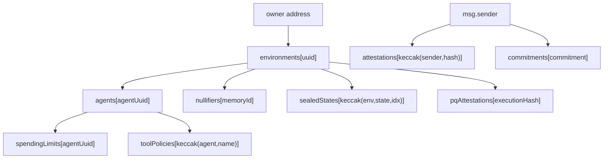

# Storage Layouts

**EVM storage for `Veya.sol`: mapping keys, packed structs, and calldata encoding.**

All protocol state lives in **nine mappings** on Robinhood Chain. There are no program-derived addresses and no Borsh account discriminators. Solidity 0.8 packs consecutive value types into 32-byte slots when they fit. PQ public keys are stored as **BLAKE3-32 fingerprints**; full ML-DSA pubkeys remain off-chain. Amounts are **wei**.

`Veya.sol` is a protocol contract, **not** an ERC-20: there is no `balances` mapping and no allowance slot.

**Related:** [veya-contract.md](./veya-contract.md) • [types-reference.md](../api/types-reference.md) • [DEPLOYMENT.md](../DEPLOYMENT.md)

---

## Table of Contents

1. [Storage Slot Map](#storage-slot-map)
2. [Mapping Key Reference](#mapping-key-reference)
3. [Key Derivation Examples](#key-derivation-examples)
4. [Packing Rules](#packing-rules)
5. [Environment](#environment)
6. [Agent](#agent)
7. [Attestation](#attestation)
8. [PqAttestation](#pqattestation)
9. [Commitment](#commitment)
10. [SpendingLimit](#spendinglimit)
11. [ToolPolicy](#toolpolicy)
12. [Nullifier](#nullifier)
13. [SealedState](#sealedstate)
14. [Constants (not in storage)](#constants-not-in-storage)
15. [Calldata Encoding](#calldata-encoding)
16. [Gas Implications](#gas-implications)
17. [Reading Storage from the SDK](#reading-storage-from-the-sdk)
18. [Cross-Reference: Local Store](#cross-reference-local-store)
19. [Invariants](#invariants)
20. [See Also](#see-also)

---

## Storage Slot Map

Declaration order in `Veya.sol` assigns base slots:

| Slot | Mapping | Key type | Value struct |
|------|---------|----------|--------------|
| 0 | `environments` | `bytes16` | `Environment` |
| 1 | `agents` | `bytes16` | `Agent` |
| 2 | `attestations` | `bytes32` | `Attestation` |
| 3 | `pqAttestations` | `bytes32` | `PqAttestation` |
| 4 | `commitments` | `bytes32` | `Commitment` |
| 5 | `spendingLimits` | `bytes16` | `SpendingLimit` |
| 6 | `toolPolicies` | `bytes32` | `ToolPolicy` |
| 7 | `nullifiers` | `bytes16` | `Nullifier` |
| 8 | `sealedStates` | `bytes32` | `SealedState` |

```
slot = keccak256(abi.encode(key, mappingSlot))
```

For `bytes16` keys, ABI encoding left-pads to 32 bytes. For `bytes32` keys, the key is already a full word.



SDK writes go through `EvmAnchor` (`src/client/evm.ts`). Integrators should not hand-craft `eth_getStorageAt` unless they are building an indexer.

---

## Mapping Key Reference

| Struct | Mapping | Key formula (from Solidity comments / code) |
|--------|---------|-----------------------------------------------|
| `Environment` | `environments` | `environmentUuid` (`bytes16`) |
| `Agent` | `agents` | `agentUuid` (`bytes16`) |
| `Attestation` | `attestations` | `keccak256(abi.encodePacked(authority, blake3Hash))` |
| `PqAttestation` | `pqAttestations` | `executionHash` (`bytes32`) |
| `Commitment` | `commitments` | `commitment` (`bytes32`) |
| `SpendingLimit` | `spendingLimits` | `agentUuid` (`bytes16`) |
| `ToolPolicy` | `toolPolicies` | `keccak256(abi.encodePacked(agentUuid, toolName))` |
| `Nullifier` | `nullifiers` | `memoryId` (`bytes16`) |
| `SealedState` | `sealedStates` | `keccak256(abi.encodePacked(environmentUuid, stateId, chunkIndex))` |

`encodePacked` concatenates tightly:

- `address` is 20 bytes
- `bytes16` is 16 bytes
- `bytes32` is 32 bytes
- `uint16 chunkIndex` is 2 bytes
- `string toolName` is the raw UTF-8 bytes (no length prefix in `encodePacked`)

---

## Key Derivation Examples

### TypeScript (ethers v6)

```typescript
import { ethers } from "ethers";

function attestationKey(authority: string, blake3Hash: Uint8Array): string {
  return ethers.keccak256(
    ethers.concat([
      ethers.getBytes(ethers.zeroPadValue(authority, 20)),
      blake3Hash,
    ]),
  );
}

function toolPolicyKey(agentUuid: Uint8Array, toolName: string): string {
  return ethers.keccak256(ethers.concat([agentUuid, ethers.toUtf8Bytes(toolName)]));
}

function sealedStateKey(
  environmentUuid: Uint8Array,
  stateId: Uint8Array,
  chunkIndex: number,
): string {
  const idx = ethers.toBeArray(chunkIndex);
  // uint16 packed: 2 bytes big-endian
  const u16 = ethers.zeroPadValue(ethers.toBeHex(chunkIndex), 2);
  return ethers.keccak256(ethers.concat([environmentUuid, stateId, ethers.getBytes(u16)]));
}
```

Verify packing against a known write before shipping an indexer. Prefer public getters (`contract.attestations(key)`) over raw slots when possible.

### Solidity (view helper mental model)

```solidity
bytes32 key = keccak256(abi.encodePacked(msg.sender, blake3Hash));
Attestation storage a = attestations[key];
```

### Empty vs occupied

Structs include `bool exists`. An unused mapping slot returns zeroed fields with `exists == false`. Do not treat `owner == address(0)` alone as the empty check for environments that could theoretically be owned by the zero address (they cannot be registered that way in practice because `msg.sender` is never zero on a successful tx, but `exists` is the canonical flag).

---

## Packing Rules

Solidity packs consecutive static types into 32-byte slots if they fit. Dynamic types (`bytes`, `string`) occupy a slot that either holds the data (short) or a keccak pointer (long).

Implications for this contract:

- `address` (20) does **not** share a slot with a following `bytes16` (16) because 20+16 = 36 > 32.
- Two consecutive `bytes16` values **do** share a slot (16+16 = 32).
- `bytes32` always takes a full slot.
- `enum EnvironmentType` is `uint8`.
- `bytes mldsaSig` and `bytes ciphertext` and `string toolName` are dynamic.

The diagrams below list **struct-relative** slots (offset 0 = first word of the mapped value). The actual EVM location is `keccak256(abi.encode(mapKey, baseSlot)) + offset` for the first word of a struct, then consecutive slots for packed fields. Dynamic fields add a data area at `keccak256(structSlot)`.

---

## Environment

**Mapping:** `environments[bytes16]`  
**Base slot:** 0

```solidity
struct Environment {
    address owner;          // 20 bytes
    bytes16 uuid;           // 16 bytes
    bytes32 pqPubkeyHash;   // 32
    EnvironmentType envType;// uint8
    uint64 createdAt;
    uint32 revision;
    bool exists;
}
```

### Packed layout (struct-relative)

| Relative slot | Contents |
|---------------|----------|
| 0 | `owner` (20) + 12 bytes padding |
| 1 | `uuid` (16) + 16 bytes padding |
| 2 | `pqPubkeyHash` (32) |
| 3 | `envType` (1) + `createdAt` (8) + `revision` (4) + `exists` (1) + padding |

`20 + 16 > 32`, so `owner` and `uuid` do not pack together. `uuid` does not pack with `pqPubkeyHash` either.

### Field semantics

| Field | Notes |
|-------|-------|
| `pqPubkeyHash` | `BLAKE3(ml_dsa_pubkey)`: verify off-chain |
| `revision` | Set to `1` at create; not incremented by other v1 functions |
| `owner` | EVM address; must sign `registerAgent` / `defineToolPolicy` |
| `envType` | 0 Execution, 1 SecureEnclave, 2 Governance |

---

## Agent

**Mapping:** `agents[bytes16]`  
**Base slot:** 1

```solidity
struct Agent {
    bytes16 environmentUuid;
    bytes16 agentUuid;
    uint8 role;
    bytes32 pqHash;
    bool isActive;
    uint64 createdAt;
    bool exists;
}
```

| Relative slot | Contents |
|---------------|----------|
| 0 | `environmentUuid` (16) + `agentUuid` (16) |
| 1 | `role` (1) + padding (cannot fit `bytes32`) |
| 2 | `pqHash` (32) |
| 3 | `isActive` (1) + `createdAt` (8) + `exists` (1) + padding |

`role` sits alone in slot 1 because the next field is a full `bytes32`.

### Role convention

| `role` | Meaning in `@veya/sdk` |
|--------|------------------------|
| 0 | Coordinator |
| 1 | Executor |
| 2 | Policy |

---

## Attestation

**Mapping:** `attestations[bytes32]`  
**Base slot:** 2  
**Key:** `keccak256(abi.encodePacked(authority, blake3Hash))`

```solidity
struct Attestation {
    address authority;
    bytes16 environmentUuid;
    bytes32 blake3Hash;
    uint64 timestamp;
    bytes mldsaSig;
    bool exists;
}
```

| Relative slot | Contents |
|---------------|----------|
| 0 | `authority` (20) + padding |
| 1 | `environmentUuid` (16) + padding |
| 2 | `blake3Hash` (32) |
| 3 | `timestamp` (8) + start of packing with following statics... |

`bytes mldsaSig` is dynamic: the struct slot for that field stores length (if short) or a pointer. `exists` is a static `bool` declared **after** the dynamic `bytes`, which affects layout: in Solidity, dynamic fields still reserve a slot in the struct sequence.

Indexer authors should **decode via the ABI getter** `attestations(bytes32)` rather than reimplementing dynamic-bytes layout. The getter returns `(authority, environmentUuid, blake3Hash, timestamp, mldsaSig, exists)`.

Maximum `mldsaSig` length is 4627 (`MAX_MLDSA_SIG_LEN`). Typical ML-DSA-44 detached signatures are on the order of a few kilobytes, so gas for `attestExecution` is dominated by calldata and storage of those bytes.

---

