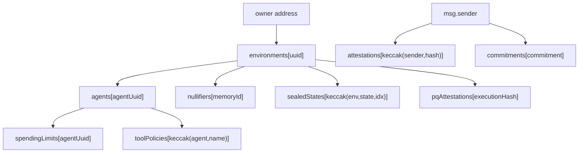
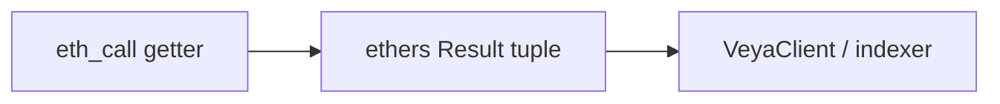

# Storage Layouts

**EVM storage for `Veya.sol`: mapping keys, packed structs, and calldata encoding.**

All protocol state lives in **nine mappings** on Robinhood Chain. There are no program-derived addresses and no Borsh account discriminators. Solidity 0.8 packs consecutive value types into 32-byte slots when they fit. PQ public keys are stored as **BLAKE3-32 fingerprints**; full ML-DSA pubkeys remain off-chain. Amounts are **wei**.

`Veya.sol` is a protocol contract, **not** an ERC-20: there is no `balances` mapping and no allowance slot.

**Related:** [veya-contract.md](./veya-contract.md) • [types-reference.md](../api/types-reference.md) • [DEPLOYMENT.md](../DEPLOYMENT.md)

---

## Table of Contents

1. [Storage Slot Map](#storage-slot-map)
2. [Mapping Key Reference](#mapping-key-reference)
3. [Key Derivation Examples](#key-derivation-examples)
4. [Packing Rules](#packing-rules)
5. [Environment](#environment)
6. [Agent](#agent)
7. [Attestation](#attestation)
8. [PqAttestation](#pqattestation)
9. [Commitment](#commitment)
10. [SpendingLimit](#spendinglimit)
11. [ToolPolicy](#toolpolicy)
12. [Nullifier](#nullifier)
13. [SealedState](#sealedstate)
14. [Constants (not in storage)](#constants-not-in-storage)
15. [Calldata Encoding](#calldata-encoding)
16. [Gas Implications](#gas-implications)
17. [Reading Storage from the SDK](#reading-storage-from-the-sdk)
18. [Cross-Reference: Local Store](#cross-reference-local-store)
19. [Invariants](#invariants)
20. [See Also](#see-also)

---

## Storage Slot Map

Declaration order in `Veya.sol` assigns base slots:

| Slot | Mapping | Key type | Value struct |
|------|---------|----------|--------------|
| 0 | `environments` | `bytes16` | `Environment` |
| 1 | `agents` | `bytes16` | `Agent` |
| 2 | `attestations` | `bytes32` | `Attestation` |
| 3 | `pqAttestations` | `bytes32` | `PqAttestation` |
| 4 | `commitments` | `bytes32` | `Commitment` |
| 5 | `spendingLimits` | `bytes16` | `SpendingLimit` |
| 6 | `toolPolicies` | `bytes32` | `ToolPolicy` |
| 7 | `nullifiers` | `bytes16` | `Nullifier` |
| 8 | `sealedStates` | `bytes32` | `SealedState` |

```
slot = keccak256(abi.encode(key, mappingSlot))
```

For `bytes16` keys, ABI encoding left-pads to 32 bytes. For `bytes32` keys, the key is already a full word.



SDK writes go through `EvmAnchor` (`src/client/evm.ts`). Integrators should not hand-craft `eth_getStorageAt` unless they are building an indexer.

---

## Mapping Key Reference

| Struct | Mapping | Key formula (from Solidity comments / code) |
|--------|---------|-----------------------------------------------|
| `Environment` | `environments` | `environmentUuid` (`bytes16`) |
| `Agent` | `agents` | `agentUuid` (`bytes16`) |
| `Attestation` | `attestations` | `keccak256(abi.encodePacked(authority, blake3Hash))` |
| `PqAttestation` | `pqAttestations` | `executionHash` (`bytes32`) |
| `Commitment` | `commitments` | `commitment` (`bytes32`) |
| `SpendingLimit` | `spendingLimits` | `agentUuid` (`bytes16`) |
| `ToolPolicy` | `toolPolicies` | `keccak256(abi.encodePacked(agentUuid, toolName))` |
| `Nullifier` | `nullifiers` | `memoryId` (`bytes16`) |
| `SealedState` | `sealedStates` | `keccak256(abi.encodePacked(environmentUuid, stateId, chunkIndex))` |

`encodePacked` concatenates tightly:

- `address` is 20 bytes
- `bytes16` is 16 bytes
- `bytes32` is 32 bytes
- `uint16 chunkIndex` is 2 bytes
- `string toolName` is the raw UTF-8 bytes (no length prefix in `encodePacked`)

---

## Key Derivation Examples

### TypeScript (ethers v6)

```typescript
import { ethers } from "ethers";

function attestationKey(authority: string, blake3Hash: Uint8Array): string {
  return ethers.keccak256(
    ethers.concat([
      ethers.getBytes(ethers.zeroPadValue(authority, 20)),
      blake3Hash,
    ]),
  );
}

function toolPolicyKey(agentUuid: Uint8Array, toolName: string): string {
  return ethers.keccak256(ethers.concat([agentUuid, ethers.toUtf8Bytes(toolName)]));
}

function sealedStateKey(
  environmentUuid: Uint8Array,
  stateId: Uint8Array,
  chunkIndex: number,
): string {
  const idx = ethers.toBeArray(chunkIndex);
  // uint16 packed: 2 bytes big-endian
  const u16 = ethers.zeroPadValue(ethers.toBeHex(chunkIndex), 2);
  return ethers.keccak256(ethers.concat([environmentUuid, stateId, ethers.getBytes(u16)]));
}
```

Verify packing against a known write before shipping an indexer. Prefer public getters (`contract.attestations(key)`) over raw slots when possible.

### Solidity (view helper mental model)

```solidity
bytes32 key = keccak256(abi.encodePacked(msg.sender, blake3Hash));
Attestation storage a = attestations[key];
```

### Empty vs occupied

Structs include `bool exists`. An unused mapping slot returns zeroed fields with `exists == false`. Do not treat `owner == address(0)` alone as the empty check for environments that could theoretically be owned by the zero address (they cannot be registered that way in practice because `msg.sender` is never zero on a successful tx, but `exists` is the canonical flag).

---

## Packing Rules

Solidity packs consecutive static types into 32-byte slots if they fit. Dynamic types (`bytes`, `string`) occupy a slot that either holds the data (short) or a keccak pointer (long).

Implications for this contract:

- `address` (20) does **not** share a slot with a following `bytes16` (16) because 20+16 = 36 > 32.
- Two consecutive `bytes16` values **do** share a slot (16+16 = 32).
- `bytes32` always takes a full slot.
- `enum EnvironmentType` is `uint8`.
- `bytes mldsaSig` and `bytes ciphertext` and `string toolName` are dynamic.

The diagrams below list **struct-relative** slots (offset 0 = first word of the mapped value). The actual EVM location is `keccak256(abi.encode(mapKey, baseSlot)) + offset` for the first word of a struct, then consecutive slots for packed fields. Dynamic fields add a data area at `keccak256(structSlot)`.

---

## Environment

**Mapping:** `environments[bytes16]`  
**Base slot:** 0

```solidity
struct Environment {
    address owner;          // 20 bytes
    bytes16 uuid;           // 16 bytes
    bytes32 pqPubkeyHash;   // 32
    EnvironmentType envType;// uint8
    uint64 createdAt;
    uint32 revision;
    bool exists;
}
```

### Packed layout (struct-relative)

| Relative slot | Contents |
|---------------|----------|
| 0 | `owner` (20) + 12 bytes padding |
| 1 | `uuid` (16) + 16 bytes padding |
| 2 | `pqPubkeyHash` (32) |
| 3 | `envType` (1) + `createdAt` (8) + `revision` (4) + `exists` (1) + padding |

`20 + 16 > 32`, so `owner` and `uuid` do not pack together. `uuid` does not pack with `pqPubkeyHash` either.

### Field semantics

| Field | Notes |
|-------|-------|
| `pqPubkeyHash` | `BLAKE3(ml_dsa_pubkey)`: verify off-chain |
| `revision` | Set to `1` at create; not incremented by other v1 functions |
| `owner` | EVM address; must sign `registerAgent` / `defineToolPolicy` |
| `envType` | 0 Execution, 1 SecureEnclave, 2 Governance |

---

## Agent

**Mapping:** `agents[bytes16]`  
**Base slot:** 1

```solidity
struct Agent {
    bytes16 environmentUuid;
    bytes16 agentUuid;
    uint8 role;
    bytes32 pqHash;
    bool isActive;
    uint64 createdAt;
    bool exists;
}
```

| Relative slot | Contents |
|---------------|----------|
| 0 | `environmentUuid` (16) + `agentUuid` (16) |
| 1 | `role` (1) + padding (cannot fit `bytes32`) |
| 2 | `pqHash` (32) |
| 3 | `isActive` (1) + `createdAt` (8) + `exists` (1) + padding |

`role` sits alone in slot 1 because the next field is a full `bytes32`.

### Role convention

| `role` | Meaning in `@veya/sdk` |
|--------|------------------------|
| 0 | Coordinator |
| 1 | Executor |
| 2 | Policy |

---

## Attestation

**Mapping:** `attestations[bytes32]`  
**Base slot:** 2  
**Key:** `keccak256(abi.encodePacked(authority, blake3Hash))`

```solidity
struct Attestation {
    address authority;
    bytes16 environmentUuid;
    bytes32 blake3Hash;
    uint64 timestamp;
    bytes mldsaSig;
    bool exists;
}
```

| Relative slot | Contents |
|---------------|----------|
| 0 | `authority` (20) + padding |
| 1 | `environmentUuid` (16) + padding |
| 2 | `blake3Hash` (32) |
| 3 | `timestamp` (8) + start of packing with following statics... |

`bytes mldsaSig` is dynamic: the struct slot for that field stores length (if short) or a pointer. `exists` is a static `bool` declared **after** the dynamic `bytes`, which affects layout: in Solidity, dynamic fields still reserve a slot in the struct sequence.

Indexer authors should **decode via the ABI getter** `attestations(bytes32)` rather than reimplementing dynamic-bytes layout. The getter returns `(authority, environmentUuid, blake3Hash, timestamp, mldsaSig, exists)`.

Maximum `mldsaSig` length is 4627 (`MAX_MLDSA_SIG_LEN`). Typical ML-DSA-44 detached signatures are on the order of a few kilobytes, so gas for `attestExecution` is dominated by calldata and storage of those bytes.

---

## PqAttestation

**Mapping:** `pqAttestations[bytes32]`  
**Base slot:** 3  
**Key:** `executionHash`

```solidity
struct PqAttestation {
    address authority;
    bytes16 environmentUuid;
    bytes32 identityHash;
    bytes32 executionHash;
    uint64 timestamp;
    bool exists;
}
```

All fields are static.

| Relative slot | Contents |
|---------------|----------|
| 0 | `authority` (20) + padding |
| 1 | `environmentUuid` (16) + padding |
| 2 | `identityHash` (32) |
| 3 | `executionHash` (32) |
| 4 | `timestamp` (8) + `exists` (1) + padding |

Links a PQ identity fingerprint to an execution commitment. One row per `executionHash` globally.

---

## Commitment

**Mapping:** `commitments[bytes32]`  
**Base slot:** 4  
**Key:** the commitment digest itself

```solidity
struct Commitment {
    address authority;
    bytes16 environmentUuid;
    bytes32 commitment;
    uint64 timestamp;
    bool exists;
}
```

| Relative slot | Contents |
|---------------|----------|
| 0 | `authority` (20) + padding |
| 1 | `environmentUuid` (16) + padding |
| 2 | `commitment` (32) |
| 3 | `timestamp` (8) + `exists` (1) + padding |

`EvmAnchor.anchorMemo` writes this row. Duplicate key reverts `CommitmentAlreadyExists`.

---

## SpendingLimit

**Mapping:** `spendingLimits[bytes16]`  
**Base slot:** 5  
**Key:** `agentUuid`

```solidity
struct SpendingLimit {
    bytes16 agentUuid;
    uint256 maxAmount;   // wei
    uint64 periodSecs;
    uint256 spentAmount; // wei
    uint64 periodStart;
    bool exists;
}
```

| Relative slot | Contents |
|---------------|----------|
| 0 | `agentUuid` (16) + padding |
| 1 | `maxAmount` (32): full word `uint256` |
| 2 | `periodSecs` (8) + padding (next field is `uint256`) |
| 3 | `spentAmount` (32) |
| 4 | `periodStart` (8) + `exists` (1) + padding |

### Period rollover (`recordSpend`)

```
if now >= periodStart + periodSecs:
    spentAmount = 0
    periodStart = now
spentAmount += amount   // revert SpendingLimitExceeded if > maxAmount
```

One spending limit per agent. Units are **wei** of native ETH on Robinhood Chain.

---

## ToolPolicy

**Mapping:** `toolPolicies[bytes32]`  
**Base slot:** 6  
**Key:** `keccak256(abi.encodePacked(agentUuid, toolName))`

```solidity
struct ToolPolicy {
    bytes16 environmentUuid;
    bytes16 agentUuid;
    string toolName;
    bool allowed;
    uint64 updatedAt;
    bool exists;
}
```

`string toolName` is dynamic (max 64 bytes enforced in the function, not in the type). Decode via the getter.

`defineToolPolicy` **overwrites** an existing key (upsert). There is no “policy already exists” error.

Seed/key note: packed UTF-8 of `toolName` is part of the key. Two names that ABI-encode identically collide; keep names unique per agent.

---

## Nullifier

**Mapping:** `nullifiers[bytes16]`  
**Base slot:** 7  
**Key:** `memoryId`

```solidity
struct Nullifier {
    bytes16 environmentUuid;
    bytes16 memoryId;
    bool nullified;
    uint64 nullifiedAt;
    bool exists;
}
```

| Relative slot | Contents |
|---------------|----------|
| 0 | `environmentUuid` (16) + `memoryId` (16) |
| 1 | `nullified` (1) + `nullifiedAt` (8) + `exists` (1) + padding |

If `nullified` is already true, `flagMemoryNullifier` reverts `MemoryAlreadyNullified`. The function checks `.nullified`, not only `.exists`.

---

## SealedState

**Mapping:** `sealedStates[bytes32]`  
**Base slot:** 8  
**Key:** `keccak256(abi.encodePacked(environmentUuid, stateId, chunkIndex))`

```solidity
struct SealedState {
    address authority;
    bytes16 environmentUuid;
    bytes16 stateId;
    uint16 chunkIndex;
    uint16 totalChunks;
    bytes32 blake3CiphertextHash;
    bytes ciphertext;
    uint64 storedAt;
    bool exists;
}
```

Static prefix packs as:

- Slot 0: `authority` (20) + padding
- Slot 1: `environmentUuid` (16) + `stateId` (16)
- Slot 2: `chunkIndex` (2) + `totalChunks` (2) + padding (next is `bytes32`)
- Slot 3: `blake3CiphertextHash` (32)
- Then dynamic `ciphertext` + `storedAt` + `exists`

`ciphertext` ≤ 8192 bytes. **Hash is client-supplied**; recompute off-chain:

```
blake3(ciphertextChunk) == blake3CiphertextHash
```

### Multi-chunk assembly

| Field | Purpose |
|-------|---------|
| `stateId` | Groups chunks |
| `chunkIndex` | Order for reassembly |
| `totalChunks` | High-water mark (`max(prev, index+1)`) |

Re-writing the same `(env, stateId, chunkIndex)` overwrites the chunk.

---

## Constants (not in storage)

| Name | Value | Bytecode |
|------|-------|----------|
| `MAX_MLDSA_SIG_LEN` | 4627 | `public constant` |
| `MAX_SEALED_CHUNK` | 8192 | `public constant` |
| `MAX_TOOL_NAME_LEN` | 64 | `public constant` |

These do not consume slots 0–8. Call them as views from ethers if an operator wants to confirm they are talking to Veya bytecode.

---

## Calldata Encoding

`EvmAnchor` uses `ethers.hexlify` on `Uint8Array` uuid/hash arguments.

| Solidity type | Calldata | SDK |
|---------------|----------|-----|
| `bytes16` | 32-byte ABI word, value right-aligned / hexlified 16 bytes | `hexlify(uuid)` |
| `bytes32` | 32-byte word | `hexlify(hash)` |
| `uint8` | 32-byte word | JS `number` |
| `uint16` | 32-byte word | JS `number` (`chunkIndex`) |
| `uint64` | 32-byte word | JS `number` (`periodSecs`) |
| `uint256` | 32-byte word | JS `bigint` (wei) |
| `bool` | 32-byte word | JS `boolean` |
| `string` | offset + length + bytes | JS `string` |
| `bytes` | offset + length + bytes | `Uint8Array` sig or chunk |

Function selectors are the first four bytes of `keccak256(signature)`. Example: `registerEnvironment(bytes16,bytes32,uint8)`. ABI JSON in `src/abi/Veya.json` is the source of truth for selectors.

---

## Gas Implications

| Write | Storage pattern | Relative cost |
|-------|-----------------|---------------|
| `registerEnvironment` | One new `Environment` (SSTORE zeros → nonzero) | Moderate |
| `registerAgent` | One new `Agent` | Moderate |
| `storeCommitment` | One new `Commitment` | Moderate |
| `attestExecution` | Struct + dynamic bytes up to 4627 | High |
| `storeSealedState` | Dynamic bytes up to 8192 | Highest |
| `recordSpend` | Updates `spentAmount` / maybe `periodStart` | Lower (warm SSTORE) |
| `defineToolPolicy` | Upsert including string | Moderate |

Warm vs cold access (EIP-2929) matters on replay of the same keys. First touch of a mapping key is more expensive.

There is **no rent** concept. Storage stays until a future version adds clearing (v1 does not delete rows). Failed transactions revert all SSTOREs.

Fund the payer for several large `attestExecution` calls, not only tiny uuid writes. See [DEPLOYMENT.md](../DEPLOYMENT.md#gas-and-funding).

---

## Reading Storage from the SDK

### Preferred: ABI getters

```typescript
import { EvmAnchor } from "@veya/sdk";

const evm = new EvmAnchor({ payerPrivateKey: process.env.VEYA_DEPLOYER_PRIVATE_KEY! });
const env = await evm.getEnvironment(envUuid);
// env.exists, env.owner, env.pqPubkeyHash, ...
```

Without a payer, construct a read-only `ethers.Contract` with `VEYA_ABI` and a `JsonRpcProvider` (no wallet).

### Explorer

```
https://explorer.testnet.chain.robinhood.com/address/0x1a1Dc3c55550FCE9F70ef6cDEeF967c0b72a5d84
```

Contract pages show verified source when published; logs still decode from the SDK ABI even if the explorer has not verified source.

### Raw `eth_getStorageAt`

Use only for incident response. Compute `keccak256(abi.encode(key, slot))` with the same padding as the Solidity compiler. Dynamic `bytes` require a second keccak. Prefer getters.



---

## Cross-Reference: Local Store

`~/.veya/agent-memory.json` mirrors **logical** memory fields. It is **not** byte-compatible with EVM storage.

| Local JSON | On-chain |
|------------|----------|
| `entries[env:id].blake3ContentHash` (hex string) | not stored; nullifier only |
| `nullified` boolean | `nullifiers[memoryId].nullified` |
| UUID strings | `bytes16` |
| In-process `SpendingLimit` | `spendingLimits[agentUuid]` wei |

Sync via SDK workflows. Never copy JSON into calldata without converting ids to 16-byte arrays and hashes to 32-byte arrays.

| Operation | Tool |
|-----------|------|
| Create local memory | `storeMemory` |
| Nullify locally | `invalidateMemory` |
| Nullify on-chain | `EvmAnchor.flagMemoryNullifier` |
| Create env on-chain | `registerEnvironment` / `registerPqOnchain` |

---

## Invariants

| Invariant | Enforcement |
|-----------|-------------|
| Environment uuid unique | `EnvironmentAlreadyExists` |
| Agent uuid unique | `AgentAlreadyExists` |
| Attestation unique per (authority, hash) | `AttestationAlreadyExists` |
| PQ attestation unique per execution hash | `PqAttestationAlreadyExists` |
| Commitment digest unique | `CommitmentAlreadyExists` |
| Spend cannot exceed cap in period | `SpendingLimitExceeded` |
| Tool names ≤ 64 bytes | `ToolNameTooLong` |
| Sealed chunk ≤ 8192 | `SealedChunkTooLarge` |
| Sig ≤ 4627 | `SignatureTooLarge` |
| envType ∈ {0,1,2} | `InvalidEnvironmentType` |
| agentRole ∈ {0,1,2} | `InvalidAgentRole` |
| Agent belongs to env for policy | `Unauthorized` if mismatch |

`exists == false` means the slot is unused. After a successful register, `exists` stays true; v1 has no delete.

---

## See Also

| Guide | Description |
|-------|-------------|
| [veya-contract.md](./veya-contract.md) | All 10 functions, events, errors |
| [types-reference.md](../api/types-reference.md) | TypeScript types including `InstructionName` |
| [DEPLOYMENT.md](../DEPLOYMENT.md) | Testnet address and gas funding |
| [README.md](../README.md) | Documentation hub |
