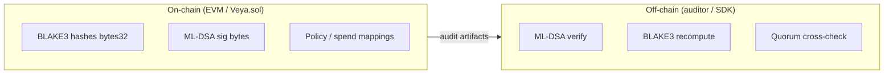
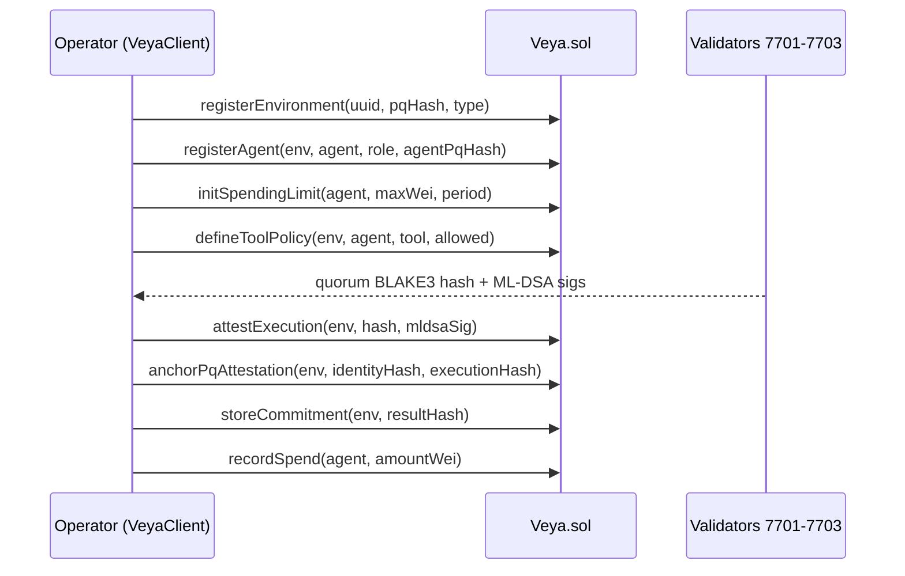

# VEYA Protocol Contract

**Consolidated post-quantum settlement layer: `Veya.sol` on Robinhood Chain**

| Field | Value |
|-------|-------|
| **Canonical source** | `robinhood/contracts/Veya.sol` |
| **SDK ABI** | `src/abi/Veya.json` |
| **Framework** | Solidity `^0.8.20`, ethers v6 client |
| **Testnet address** | `0x1a1Dc3c55550FCE9F70ef6cDEeF967c0b72a5d84` |
| **chainId** | `46630` |
| **Status** | Deployed |
| **Functions (writes)** | 10 |
| **Record types** | 9 structs / 9 mappings |
| **Token interface** | None: **not ERC-20** |
| **PQ verify** | Off-chain only (chain stores audit artifacts) |

The contract anchors **BLAKE3-256** execution commitments and **ML-DSA-44** signature bytes for permanent audit. EVM gas cannot verify Dilithium at production throughput; auditors use `pq.verifyPQ` in `@veya/sdk`. Storage is **mappings keyed by uuid or keccak256**, not program-derived addresses.

**Related:** [storage-layouts.md](./storage-layouts.md) • [types-reference.md](../api/types-reference.md) • [DEPLOYMENT.md](../DEPLOYMENT.md)

---

## Table of Contents

1. [Design Constraints](#design-constraints)
2. [Contract Constants](#contract-constants)
3. [Function Catalog](#function-catalog)
4. [Settlement Lifecycle](#settlement-lifecycle)
5. [Identity Functions](#identity-functions)
   - [registerEnvironment](#1-registerenvironment)
   - [registerAgent](#2-registeragent)
6. [Attestation Functions](#attestation-functions)
   - [attestExecution](#3-attestexecution)
   - [anchorPqAttestation](#4-anchorpqattestation)
7. [Commitment Function](#commitment-function)
   - [storeCommitment](#5-storecommitment)
8. [Spending Functions](#spending-functions)
   - [initSpendingLimit](#6-initspendinglimit)
   - [recordSpend](#7-recordspend)
9. [Policy Function](#policy-function)
   - [defineToolPolicy](#8-definetoolpolicy)
10. [Memory Function](#memory-function)
    - [flagMemoryNullifier](#9-flagmemorynullifier)
11. [Sealed State Function](#sealed-state-function)
    - [storeSealedState](#10-storesealedstate)
12. [Events](#events)
13. [Error Taxonomy](#error-taxonomy)
14. [Modifiers](#modifiers)
15. [SDK Mapping](#sdk-mapping)
16. [Views and Constants](#views-and-constants)
17. [What This Contract Is Not](#what-this-contract-is-not)
18. [Testing](#testing)
19. [See Also](#see-also)

---

## Design Constraints



| Rule | Rationale |
|------|-----------|
| BLAKE3 commitments only | Grover-resistant 128-bit margin; package standard |
| No in-contract ML-DSA verify | Gas / throughput |
| Mapping-scoped isolation | Environment boundaries without a central policy server |
| Variable `bytes` fields | Attestation signatures and sealed chunks sized per payload |
| Native wei accounting | Robinhood Chain ETH, 18 decimals |
| Protocol, not token | No balances, no allowances, no mint |

---

## Contract Constants

| Name | Value | Source | Description |
|------|-------|--------|-------------|
| `MAX_MLDSA_SIG_LEN` | 4627 | `Veya.sol` | Max detached ML-DSA-44 sig bytes |
| `MAX_SEALED_CHUNK` | 8192 | `Veya.sol` | Max ciphertext per `storeSealedState` |
| `MAX_TOOL_NAME_LEN` | 64 | `Veya.sol` | Max MCP tool name UTF-8 length |

These are `public constant` and readable via ethers as view calls. They occupy no storage slots.

---

## Function Catalog

| # | Function | Mutates mapping | Creates if empty |
|---|----------|-----------------|------------------|
| 1 | `registerEnvironment` | `environments` | yes (uuid must be unused) |
| 2 | `registerAgent` | `agents` | yes |
| 3 | `attestExecution` | `attestations` | yes (keccak key) |
| 4 | `anchorPqAttestation` | `pqAttestations` | yes (executionHash key) |
| 5 | `storeCommitment` | `commitments` | yes (commitment key) |
| 6 | `initSpendingLimit` | `spendingLimits` | yes (agentUuid) |
| 7 | `recordSpend` | `spendingLimits` | no (must exist) |
| 8 | `defineToolPolicy` | `toolPolicies` | upsert (keccak key) |
| 9 | `flagMemoryNullifier` | `nullifiers` | yes (memoryId) |
| 10 | `storeSealedState` | `sealedStates` | upsert chunk (keccak key) |

`INSTRUCTION_NAMES` in `@veya/sdk` is this list in camelCase. `EvmAnchor` methods share the same names.

---

## Settlement Lifecycle

Typical SecureEnclave agent path from Node:



Reads use public getters. Writes require gas from `EvmAnchor.wallet`.

---

## Identity Functions

### 1. `registerEnvironment`

Register an isolated environment with a BLAKE3 hash of its ML-DSA-44 public key.

**Solidity:**

```solidity
function registerEnvironment(
    bytes16 environmentUuid,
    bytes32 pqPubkeyHash,
    uint8 envType
) external;
```

#### Arguments

| Field | Type | Description |
|-------|------|-------------|
| `environmentUuid` | `bytes16` | Stable 128-bit environment id |
| `pqPubkeyHash` | `bytes32` | `BLAKE3(ml_dsa_public_key_bytes)` |
| `envType` | `uint8` | See `EnvironmentType` |

#### `EnvironmentType`

| Value | Variant | SDK default |
|-------|---------|-------------|
| 0 | Execution | pass `0` |
| 1 | SecureEnclave | `registerPqOnchain()` default |
| 2 | Governance | pass `2` |

#### Access

Any `msg.sender`. Becomes `environments[uuid].owner`. Duplicate uuid reverts `EnvironmentAlreadyExists`. `envType > 2` reverts `InvalidEnvironmentType`.

#### Effects

- Writes `Environment { owner: msg.sender, uuid, pqPubkeyHash, envType, createdAt: block.timestamp, revision: 1, exists: true }`
- Emits `EnvironmentRegistered(uuid, owner, pqPubkeyHash, envType)`

#### SDK

```typescript
import { EvmAnchor } from "@veya/sdk";
import { randomBytes } from "node:crypto";

const evm = new EvmAnchor({ payerPrivateKey: process.env.VEYA_DEPLOYER_PRIVATE_KEY! });
const uuid = randomBytes(16);
const { publicKey } = await evm /* use pq via VeyaClient */;
// pqPubkeyHash = hashBlake3Bytes(publicKey)
const tx = await evm.registerEnvironment(uuid, pqHashBytes, 1);
```

`VeyaClient.registerPqOnchain` wraps keygen + this function + `storeCommitment`.

---

### 2. `registerAgent`

Register an agent under an existing environment.

```solidity
function registerAgent(
    bytes16 environmentUuid,
    bytes16 agentUuid,
    uint8 agentRole,
    bytes32 agentPqHash
) external onlyEnvironmentOwner(environmentUuid);
```

#### Arguments

| Field | Type | Description |
|-------|------|-------------|
| `environmentUuid` | `bytes16` | Parent environment |
| `agentUuid` | `bytes16` | Stable agent id |
| `agentRole` | `uint8` | 0 coordinator, 1 executor, 2 policy |
| `agentPqHash` | `bytes32` | `BLAKE3(agent_ml_dsa_pubkey)` |

#### Access

`onlyEnvironmentOwner`: environment must exist and `msg.sender == owner`.

#### Errors

| Error | Condition |
|-------|-----------|
| `EnvironmentDoesNotExist` | unknown env |
| `Unauthorized` | not owner |
| `InvalidAgentRole` | `agentRole > 2` |
| `AgentAlreadyExists` | `agents[agentUuid].exists` |

#### Effects

- `isActive = true`, `createdAt = block.timestamp`
- Emits `AgentRegistered(agentUuid, environmentUuid, agentRole, agentPqHash)`

#### SDK

```typescript
await evm.registerAgent(envUuid, agentUuid, 1, agentPqHash);
```

---

## Attestation Functions

### 3. `attestExecution`

Anchor a BLAKE3 execution hash with optional ML-DSA signature metadata (verified off-chain).

```solidity
function attestExecution(
    bytes16 environmentUuid,
    bytes32 blake3Hash,
    bytes calldata mldsaSig
) external;
```

#### Arguments

| Field | Type | Description |
|-------|------|-------------|
| `environmentUuid` | `bytes16` | Target environment (must exist) |
| `blake3Hash` | `bytes32` | Execution commitment |
| `mldsaSig` | `bytes` | Detached ML-DSA over the digest; may be empty |

#### Mapping key

```
keccak256(abi.encodePacked(msg.sender, blake3Hash))
```

The same hash attested by two authorities occupies two slots. The same authority cannot attest the same hash twice (`AttestationAlreadyExists`).

#### Errors

| Error | Condition |
|-------|-----------|
| `EnvironmentDoesNotExist` | env missing |
| `SignatureTooLarge` | `mldsaSig.length > 4627` |
| `AttestationAlreadyExists` | key already used |

#### Effects

Stores `authority = msg.sender`, `timestamp = block.timestamp`, full `mldsaSig` bytes. Emits `ExecutionAttested`.

#### Off-chain verify

```typescript
import { pq } from "@veya/sdk";

const ok = await pq.verifyPQ(sigBytes, blake3HashBytes, publicKey);
```

Sign the **32-byte hash**, not hex UTF-8, unless the fleet agreed otherwise.

#### SDK

```typescript
await evm.attestExecution(envUuid, hash32, sigBytes);
```

---

### 4. `anchorPqAttestation`

Link a post-quantum identity commitment to an execution hash.

```solidity
function anchorPqAttestation(
    bytes16 environmentUuid,
    bytes32 identityHash,
    bytes32 executionHash
) external;
```

#### Mapping key

`executionHash` itself (`pqAttestations[executionHash]`). One PQ attestation per execution digest globally.

#### Errors

| Error | Condition |
|-------|-----------|
| `EnvironmentDoesNotExist` | env missing |
| `PqAttestationAlreadyExists` | that execution hash already anchored |

#### Effects

Stores `authority`, `identityHash`, `executionHash`, timestamp. Emits `PqAttestationAnchored`.

#### Auditor checklist

```
identityHash == BLAKE3(agent_ml_dsa_pubkey)
executionHash == Attestation.blake3Hash for some authority
both records share environmentUuid
```

---

## Commitment Function

### 5. `storeCommitment`

Store a standalone BLAKE3 result commitment.

```solidity
function storeCommitment(
    bytes16 environmentUuid,
    bytes32 commitment
) external;
```

#### Mapping key

The `commitment` bytes32 (`commitments[commitment]`). Duplicate digest reverts `CommitmentAlreadyExists`.

#### SDK helper `anchorMemo`

```typescript
await evm.anchorMemo(envUuid, blake3Hex); // decodes hex → storeCommitment
```

This is **not** an external memo program. It is a named helper around `storeCommitment` used by `registerPqIdentity` to persist the pubkey fingerprint a second time as a commitment row.

---

## Spending Functions

### 6. `initSpendingLimit`

Configure a per-agent **wei** spending cap for treasury-style flows.

```solidity
function initSpendingLimit(
    bytes16 agentUuid,
    uint256 maxAmount,
    uint64 periodSecs
) external onlyAgentEnvironmentOwner(agentUuid);
```

#### Arguments

| Field | Type | Description |
|-------|------|-------------|
| `agentUuid` | `bytes16` | Target agent |
| `maxAmount` | `uint256` | Maximum spend per period, **wei** |
| `periodSecs` | `uint64` | Rolling window duration |

#### Access

Agent must exist; `msg.sender` must own the agent’s environment.

#### Effects

- `spentAmount = 0`
- `periodStart = block.timestamp`
- One limit per `agentUuid`
- Emits `SpendingLimitInitialized`

Duplicate init reverts `SpendingLimitAlreadyExists`.

---

### 7. `recordSpend`

Increment the spent counter against the agent cap.

```solidity
function recordSpend(bytes16 agentUuid, uint256 amount) external;
```

Anyone may call; the cap is the protection, not a signature ACL on the spender. Application-layer auth (PolicyAgent, consensus) should run **before** this call.

#### Period rollover

```
if (nowSecs >= periodStart + periodSecs) {
    spentAmount = 0;
    periodStart = nowSecs;
}
next = spentAmount + amount;
if (next > maxAmount) revert SpendingLimitExceeded();
spentAmount = next;
```

Addition is unchecked-overflow-safe in 0.8 (`+` reverts on overflow). Exceeding `maxAmount` uses the custom error.

#### Example

```
initSpendingLimit(agent, 1_000_000_000_000_000_000, 86400)  // 1 ETH / day
recordSpend(agent, 500_000_000_000_000_000)                 // 0.5 ETH OK
recordSpend(agent, 600_000_000_000_000_000)                 // SpendingLimitExceeded
```

SDK: `evm.recordSpend(agentUuid, amountWei)` with `bigint`. In-process `recordSpend(env, agent, amount)` in `src/spending/limits.ts` is a **separate** pre-check and does not substitute for the chain call.

---

## Policy Function

### 8. `defineToolPolicy`

Define which MCP tools an agent may invoke within an environment.

```solidity
function defineToolPolicy(
    bytes16 environmentUuid,
    bytes16 agentUuid,
    string calldata toolName,
    bool allowed
) external onlyEnvironmentOwner(environmentUuid);
```

#### Mapping key

```
keccak256(abi.encodePacked(agentUuid, toolName))
```

This function **upserts**. Updating `allowed` on an existing tool is permitted.

#### Errors

| Error | Condition |
|-------|-----------|
| `EnvironmentDoesNotExist` / `Unauthorized` | modifier |
| `AgentDoesNotExist` | unknown agent |
| `Unauthorized` | `agents[agent].environmentUuid != environmentUuid` |
| `ToolNameTooLong` | UTF-8 length > 64 |

#### Example tools

| `toolName` | Typical `allowed` |
|-------------|-------------------|
| `mcp_transfer` | `false` on high-risk envs |
| `mcp_read_balance` | `true` |
| `mcp_policy_eval` | `true` for policy role |

SDK in-memory `setToolPolicy` must stay aligned with this mapping in production.

---

## Memory Function

### 9. `flagMemoryNullifier`

Mark a memory entry as nullified (spend-once semantics).

```solidity
function flagMemoryNullifier(
    bytes16 environmentUuid,
    bytes16 memoryId
) external;
```

#### Mapping key

`memoryId` (`nullifiers[memoryId]`).

If `nullifiers[memoryId].nullified` is already true, revert `MemoryAlreadyNullified`. Environment must exist. Caller is not required to be owner (application should gate this).

#### Effects

- `nullified = true`
- `nullifiedAt = block.timestamp`
- Emits `MemoryNullified`

Local SDK `invalidateMemory` only flips `~/.veya/agent-memory.json`. Call this function to make the nullifier auditable on Robinhood Chain.

---

## Sealed State Function

### 10. `storeSealedState`

Store a chunk of sealed ciphertext for data availability.

```solidity
function storeSealedState(
    bytes16 environmentUuid,
    bytes16 stateId,
    uint16 chunkIndex,
    bytes32 blake3CiphertextHash,
    bytes calldata ciphertextChunk
) external;
```

Unlike some other chains’ programs, **the client supplies** `blake3CiphertextHash`. Auditors must recompute BLAKE3 over `ciphertextChunk` and compare; the contract does not hash in-EVM.

#### Mapping key

```
keccak256(abi.encodePacked(environmentUuid, stateId, chunkIndex))
```

#### Errors

| Error | Condition |
|-------|-----------|
| `EnvironmentDoesNotExist` | env missing |
| `SealedChunkTooLarge` | `ciphertextChunk.length > 8192` |

#### totalChunks

If the slot already exists, previous `totalChunks` is read; then `totalChunks = max(prev, chunkIndex + 1)` (with the `chunkIndex + 1 > totalChunks` branch). Re-storing a chunk **overwrites** ciphertext.

#### Multi-chunk pattern

```typescript
for (let i = 0; i < chunks.length; i++) {
  const h = await client.hashBlake3(chunks[i]);
  const hashBytes = Uint8Array.from(Buffer.from(h, "hex"));
  await evm.storeSealedState(envUuid, stateId, i, hashBytes, chunks[i]);
}
```

Decrypt only at the sealed-node boundary after hash checks.

---

