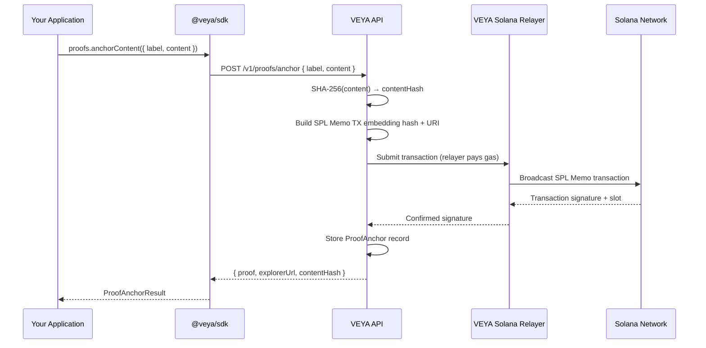

# Proofs & Anchoring — Solana-Backed Content Verification

`veya.proofs` gives any piece of content a permanent, publicly verifiable on-chain identity. When you anchor content, the VEYA API hashes it, embeds the hash into a Solana SPL Memo transaction, broadcasts it through its relayer wallet, and returns the transaction signature. That signature is now a permanent, censorship-resistant proof that a specific piece of content existed at a specific point in time — verifiable by anyone without a VEYA account, API key, or any VEYA infrastructure at all.

---

## How Anchoring Works



The SPL Memo payload written to the Solana ledger is a compact JSON string:

```json
{
  "veya": "1.0",
  "hash": "5a6b7c8d9e0f...",
  "label": "Q2 Audit Report",
  "uri": "https://api.veyanet.tech/api/verify/5W8k9LpX..."
}
```

This memo is part of every Solana validator's permanent transaction log. You can verify it independently using any Solana RPC node — no VEYA infrastructure required.

---

## Methods

### `proofs.anchorContent(input)`

Anchors a UTF-8 content string on Solana. The API computes the SHA-256 hash, broadcasts the SPL Memo transaction via the VEYA relayer, stores a proof record, and returns the transaction signature and explorer URL.

**Signature:**
```ts
anchorContent(input: AnchorContentInput): Promise<AnchorContentResult>
```

**Input type:**
```ts
type AnchorContentInput = {
  label: string;    // Human-readable identifier for the record
  content: string;  // UTF-8 content to hash and anchor
};
```

**Result type:**
```ts
type AnchorContentResult = {
  proof: ProofAnchor;     // Full proof record stored in VEYA
  explorerUrl: string;    // Direct Solana explorer link
  contentHash: string;    // SHA-256 hex digest of the content
};
```

**Example — anchoring a board resolution:**
```ts
import { Veya } from "@veya/sdk";

const veya = new Veya({
  apiUrl: process.env.VEYA_API_URL,
  apiKey: process.env.VEYA_API_KEY,
});

const { proof, explorerUrl, contentHash } = await veya.proofs.anchorContent({
  label: "Board Resolution — Q2 2025 Budget Approval",
  content: `
    Veya Inc. Board of Directors — Special Resolution
    Date: 2025-06-01
    Resolved: The Q2 2025 operating budget of $2.4M is approved unanimously.
    Signatories: Alice Chen (CEO), Bob Kumar (CFO), Carol Davies (CTO)
  `.trim(),
});

console.log("Content hash  :", contentHash);
console.log("Proof ID      :", proof.id);
console.log("Attestation TX:", proof.attestationTx);
console.log("Cluster       :", proof.cluster);
console.log("Explorer URL  :", explorerUrl);
console.log("Anchored at   :", proof.createdAt);
```

**Example — anchoring a JSON audit log:**
```ts
const auditEntry = {
  action: "treasury.transfer",
  amount: 100_000_000,
  from: "vault-a",
  to: "vault-b",
  authorizedBy: "agent_01HABC",
  timestamp: new Date().toISOString(),
};

const { proof, explorerUrl, contentHash } = await veya.proofs.anchorContent({
  label: `Treasury Transfer — ${new Date().toISOString()}`,
  content: JSON.stringify(auditEntry, null, 2),
});

console.log("Anchored audit entry:", explorerUrl);
```

**HTTP equivalent:**
```bash
curl -X POST "$VEYA_API_URL/v1/proofs/anchor" \
  -H "X-Api-Key: $VEYA_API_KEY" \
  -H "Content-Type: application/json" \
  -d '{
    "label": "Board Resolution — Q2 2025",
    "content": "Resolved: Q2 budget of $2.4M approved unanimously."
  }'
```

> [!NOTE]
> `proofs.anchorContent()` sends the raw `content` string to the VEYA API. The API hashes it server-side. If you need to anchor content without transmitting the plaintext, compute the hash locally with `sha256Hex()` and use the Solana unsigned attestation route (`solana.buildUnsignedAttestation()`) to anchor the hash directly. See [solana.md](./solana.md).

---

### `proofs.anchorText(label, content)`

Convenience alias for `anchorContent()` with positional arguments. Identical behavior.

**Signature:**
```ts
anchorText(label: string, content: string): Promise<AnchorContentResult>
```

**Example:**
```ts
const { proof, explorerUrl } = await veya.proofs.anchorText(
  "Governance Vote — Proposal 42",
  "Proposal 42: Approved. Vote: 7 for, 0 against, 1 abstain."
);

console.log(explorerUrl);
```

---

### `proofs.list()`

Returns all proof anchor records associated with the authenticated account, including both manually anchored records and agent execution commitments.

**Signature:**
```ts
list(): Promise<ProofListResult>
```

**Result type:**
```ts
type ProofListResult = {
  anchors: ProofAnchor[];         // Manually anchored records
  agentProofs: ProofAnchor[];     // Commitments from protected executions
};
```

**Example:**
```ts
const { anchors, agentProofs } = await veya.proofs.list();

console.log(`Manual anchors    : ${anchors.length}`);
console.log(`Agent commitments : ${agentProofs.length}`);

// Display all anchors
for (const proof of [...anchors, ...agentProofs]) {
  console.log(`\n[${proof.cluster}] ${proof.label}`);
  console.log(`  Hash   : ${proof.contentHash.slice(0, 16)}...`);
  console.log(`  TX     : ${proof.attestationTx}`);
  console.log(`  URL    : ${proof.attestationUri}`);
  console.log(`  Created: ${new Date(proof.createdAt).toLocaleString()}`);
}
```

**Filter by cluster:**
```ts
const { anchors } = await veya.proofs.list();
const mainnetAnchors = anchors.filter((p) => p.cluster === "mainnet-beta");
const devnetAnchors  = anchors.filter((p) => p.cluster === "devnet");
```

**HTTP:**
```bash
curl "$VEYA_API_URL/v1/proofs" \
  -H "X-Api-Key: $VEYA_API_KEY"
```

---

### `proofs.verifyTransaction(signature)`

Public verification endpoint — **no authentication required**. Queries a Solana RPC node to confirm the transaction signature exists, then cross-references the embedded hash against the VEYA proof registry. Returns whether the transaction is valid and what proof record it corresponds to.

**Signature:**
```ts
verifyTransaction(signature: string): Promise<VerifyProofResult>
```

**Result type:**
```ts
type VerifyProofResult = {
  valid: boolean;
  signature: string;
  hash: string;
  uri: string;
  slot: number | null;
  blockTime: number | null;
  cluster: string;
  explorerUrl: string;
  registered: {
    label: string;
    contentHash: string;
    createdAt: string;
  } | null;
};
```

**Example — full verification with content match:**
```ts
import { sha256Hex } from "@veya/sdk";

// The content you claim was anchored
const originalContent = "Resolved: Q2 budget of $2.4M approved unanimously.";

// The transaction signature you received when anchoring
const txSignature = "5W8k9LpXxyz...";

// Step 1 — verify on Solana and against VEYA registry
const verification = await veya.proofs.verifyTransaction(txSignature);

console.log("Valid on Solana    :", verification.valid);
console.log("Transaction hash   :", verification.hash);
console.log("Block slot         :", verification.slot);
console.log("Block time         :", new Date((verification.blockTime ?? 0) * 1000).toLocaleString());
console.log("Cluster            :", verification.cluster);
console.log("Explorer           :", verification.explorerUrl);
console.log("VEYA registry match:", verification.registered?.label ?? "not registered");

// Step 2 — verify local content matches the on-chain hash
const localHash = await sha256Hex(originalContent);
const contentMatch = localHash === verification.hash;
console.log("Content hash match :", contentMatch ? "✅ VERIFIED" : "❌ MISMATCH");
```

**Unauthenticated verification — no API key needed:**
```ts
// Public clients can verify without any credentials
const publicVeya = new Veya({ apiUrl: "https://api.veyanet.tech" });
const result = await publicVeya.proofs.verifyTransaction("5W8k9LpXxyz...");
console.log(result.valid); // true or false
```

**HTTP (public — no auth):**
```bash
curl "https://api.veyanet.tech/api/verify/5W8k9LpXxyz..."
```

---

## `ProofAnchor` Type Reference

```ts
interface ProofAnchor {
  id: string;               // UUID v4
  label: string;            // Human-readable label set at anchor time
  contentHash: string;      // SHA-256 hex digest (64 chars)
  contentBytes: number;     // Size of the original content in bytes
  attestationTx: string;    // Solana transaction signature
  attestationUri: string;   // VEYA-hosted attestation URI
  cluster: string;          // "mainnet-beta" | "devnet" | "testnet"
  createdAt: string;        // ISO 8601 timestamp
}
```

---

## Use Cases

### Legal Document Timestamping

```ts
async function timestampLegalDocument(
  filePath: string,
  label: string
): Promise<{ signature: string; hash: string; explorerUrl: string }> {
  const fs = await import("fs/promises");
  const content = await fs.readFile(filePath, "utf-8");

  const { proof, explorerUrl, contentHash } = await veya.proofs.anchorContent({
    label,
    content,
  });

  console.log(`Document "${label}" anchored:`);
  console.log(`  Hash   : ${contentHash}`);
  console.log(`  TX     : ${proof.attestationTx}`);
  console.log(`  Verify : ${explorerUrl}`);

  return { signature: proof.attestationTx, hash: contentHash, explorerUrl };
}

await timestampLegalDocument("./contracts/vendor-agreement-v3.txt", "Vendor Agreement v3 — 2025-06-01");
```

### Compliance Audit Trail

```ts
async function recordComplianceEvent(
  eventType: string,
  details: Record<string, unknown>
) {
  const content = JSON.stringify({
    eventType,
    details,
    timestamp: new Date().toISOString(),
    environment: process.env.NODE_ENV,
  }, null, 2);

  const { proof, explorerUrl } = await veya.proofs.anchorContent({
    label: `Compliance: ${eventType} — ${new Date().toISOString()}`,
    content,
  });

  // Store the signature in your compliance database
  await complianceDb.insert({
    eventType,
    solanaSignature: proof.attestationTx,
    explorerUrl,
    timestamp: proof.createdAt,
  });

  return proof.attestationTx;
}

await recordComplianceEvent("data.export", {
  userId: "user_abc",
  recordCount: 1042,
  destination: "gdpr-archive-s3",
  requestedBy: "legal@example.com",
});
```

### Governance Voting Record

```ts
const proposals = [
  { id: "prop-42", title: "Budget Approval Q2", result: "PASSED", votes: { for: 7, against: 0, abstain: 1 } },
  { id: "prop-43", title: "Hire Engineering Lead", result: "PASSED", votes: { for: 6, against: 2, abstain: 0 } },
];

for (const proposal of proposals) {
  const content = JSON.stringify({ ...proposal, recordedAt: new Date().toISOString() });
  const { proof } = await veya.proofs.anchorText(
    `Governance Vote: ${proposal.title} (${proposal.id})`,
    content
  );
  console.log(`${proposal.id} anchored: ${proof.attestationTx}`);
}
```

---

## Verification Without VEYA SDK

Because the proof is an SPL Memo on Solana, anyone can verify it independently using any Solana explorer or RPC node:

```bash
# Using Solana CLI
solana confirm -v <TRANSACTION_SIGNATURE>

# Or query the explorer directly
open "https://explorer.solana.com/tx/<TRANSACTION_SIGNATURE>"

# The memo field will contain the VEYA proof JSON:
# { "veya": "1.0", "hash": "5a6b7c...", "label": "...", "uri": "..." }
```

Compute the SHA-256 of the original content using any standard tool and compare against the `hash` field in the memo:

```bash
echo -n "Your original content here" | sha256sum
# → 5a6b7c8d9e0f1a2b3c4d5e6f7a8b9c0d1e2f3a4b5c6d7e8f9a0b1c2d3e4f5a6b  -
```

---

## Related

- [solana.md](./solana.md) — PDA registration and unsigned attestation (anchor without sending plaintext)
- [protected-execution.md](./protected-execution.md) — Protected execution with automatic on-chain commitment
- [crypto.md](./crypto.md) — `sha256Hex()` for local content hashing
- [types-reference.md](./types-reference.md) — Full `ProofAnchor` and `VerifyProofResult` types
