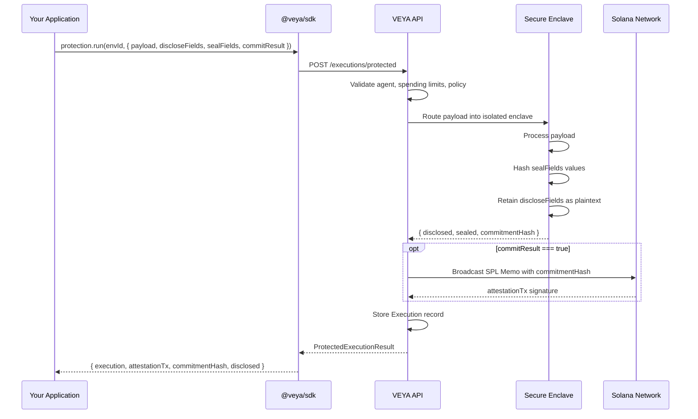
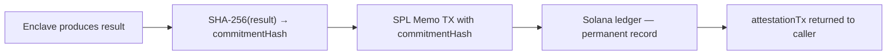

# Protected Execution — Enclave-Shielded Runs with Field-Level Access Control

`veya.protection` provides VEYA's highest-security execution mode. A protected run processes an agent's payload through an isolated secure enclave, applies granular field-level filtering to control exactly which data surfaces back to callers, and optionally anchors a commitment hash on Solana to create an immutable, publicly verifiable record of what the agent did.

Protected executions are designed for operations where some fields are too sensitive to return in plaintext (treasury amounts, private keys, internal routing details) but the execution still needs to be logged, committed, and partially auditable.

---

## Standard vs. Protected Execution

| Capability | Standard (`executions`) | Protected (`protection`) |
|---|---|---|
| Enclave isolation | ❌ No | ✅ Yes — secure hardware boundary |
| Payload stored as plaintext | ✅ Yes | Sealed fields hashed or removed |
| Field-level disclosure control | ❌ No | ✅ `discloseFields` — returned in plaintext |
| Field-level sealing | ❌ No | ✅ `sealFields` — hashed in enclave |
| Solana commitment | Optional | Optional — `commitResult: true` |
| Spending enforcement | ✅ Yes | ✅ Yes |
| Use case | Logging, observability | Treasury, policy, sensitive operations |

---

## How Protected Execution Works



**Field routing:**
- `discloseFields` — these keys are extracted from the payload and returned in the `disclosed` object in the API response. They are visible to the caller.
- `sealFields` — these keys are processed inside the enclave. Their values are replaced with SHA-256 hashes in the stored execution record. They are never returned in plaintext.
- Fields not in either list — stored in the execution payload as-is (neither disclosed nor sealed with special treatment).

---

## Methods

### `protection.run(environmentId, input)`

Runs a protected execution with full explicit control over all input fields.

**Signature:**
```ts
run(environmentId: string, input: ProtectedRunInput): Promise<ProtectedRunResult>
```

**Input type:**
```ts
type ProtectedRunInput = {
  agentId: string;
  eventType: string;
  payload: Record<string, unknown>;
  discloseFields: string[];
  sealFields: string[];
  commitResult: boolean;
  spendLamports: number;
};
```

**Result type:**
```ts
type ProtectedRunResult = {
  execution: Execution;
  attestationTx?: string;
  commitmentHash?: string;
  disclosed?: Record<string, unknown>;
};
```

**Example — treasury transfer with sealed amount:**
```ts
import { Veya, isVeyaError } from "@veya/sdk";

const veya = new Veya({
  apiUrl: process.env.VEYA_API_URL,
  apiKey: process.env.VEYA_API_KEY,
});

const result = await veya.protection.run(environmentId, {
  agentId: agent.id,
  eventType: "treasury.transfer",
  payload: {
    from: "vault-a",
    to: "vault-b",
    lamports: 500_000_000,         // 0.5 SOL — will be sealed
    memo: "Q2 budget allocation",   // will be disclosed
    internalNote: "Approved by CFO", // will be sealed
  },
  discloseFields: ["from", "to", "memo"],   // returned in plaintext
  sealFields: ["lamports", "internalNote"], // hashed in enclave
  commitResult: true,
  spendLamports: 500_000_000,
});

// What you get back
console.log("Execution ID    :", result.execution.id);
console.log("Attestation TX  :", result.attestationTx);
console.log("Commitment hash :", result.commitmentHash);
console.log("Disclosed fields:", JSON.stringify(result.disclosed, null, 2));
// disclosed: { from: "vault-a", to: "vault-b", memo: "Q2 budget allocation" }
// lamports and internalNote are NOT returned — they remain sealed in the enclave
```

---

### `protection.runWithFieldLists(environmentId, params)`

Convenience wrapper with identical behavior to `run()` but accepts a slightly simplified input shape. Useful when you want to destructure the field lists from an existing config object.

**Signature:**
```ts
runWithFieldLists(
  environmentId: string,
  params: {
    agentId: string;
    eventType: string;
    payload: Record<string, unknown>;
    disclose: string[];
    seal: string[];
    commitResult?: boolean;
    spendLamports?: number;
  }
): Promise<ProtectedRunResult>
```

**Differences from `run()`:**
- `discloseFields` is shortened to `disclose`
- `sealFields` is shortened to `seal`
- `commitResult` defaults to `false` if omitted
- `spendLamports` defaults to `0` if omitted

**Example:**
```ts
const result = await veya.protection.runWithFieldLists(environmentId, {
  agentId: agent.id,
  eventType: "policy.evaluate",
  payload: {
    rule: "max-single-tx",
    input: { lamports: 50_000_000 },
    result: "PASS",
    internalRuleHash: "5a6b7c...", // internal — seal it
  },
  disclose: ["rule", "result"],
  seal: ["internalRuleHash", "input"],
  commitResult: false,
  spendLamports: 0,
});
```

---

## HTTP Equivalent

```bash
curl -X POST "$VEYA_API_URL/v1/environments/$ENV_ID/executions/protected" \
  -H "X-Api-Key: $VEYA_API_KEY" \
  -H "Content-Type: application/json" \
  -d '{
    "agentId": "agent_01HABC",
    "eventType": "treasury.transfer",
    "payload": {
      "from": "vault-a",
      "to": "vault-b",
      "lamports": 500000000,
      "memo": "Q2 budget allocation"
    },
    "discloseFields": ["from", "to", "memo"],
    "sealFields": ["lamports"],
    "commitResult": true,
    "spendLamports": 500000000
  }'
```

---

## Field Routing — Detailed Behavior

### `discloseFields`

Keys listed in `discloseFields` are processed inside the enclave and then returned in the `disclosed` map in the response. They are visible to the caller and stored in the execution payload in plaintext.

```ts
// Payload:       { from: "vault-a", lamports: 500_000_000, memo: "Q2" }
// discloseFields: ["from", "memo"]
// disclosed result: { from: "vault-a", memo: "Q2" }
```

### `sealFields`

Keys listed in `sealFields` are processed inside the enclave. Their original values are **never returned to the caller or stored in plaintext**. The stored execution record replaces their values with SHA-256 hashes:

```ts
// sealFields: ["lamports"]
// Stored execution payload: { ..., lamports: "b94d27b99..." } // SHA-256 of 500000000
```

This means:
- The exact value of a sealed field can be verified by anyone who knows the original — they just hash it and compare.
- The exact value cannot be recovered from the execution record alone.

### Unlisted Fields

Fields not in either `discloseFields` or `sealFields` are stored in the execution record as-is. They are not returned in `disclosed` but they are available in `execution.payload` from the executions API.

---

## Commitment & On-Chain Attestation

When `commitResult: true`, the API generates a `commitmentHash` — a SHA-256 hash of the enclave's execution result — and anchors it on Solana via an SPL Memo transaction.



**What the commitment proves:**
- The agent executed a specific operation at a specific time
- The operation produced a result with a specific hash
- That hash was anchored on Solana block at a specific slot

**Verifying the commitment:**
```ts
// Get the attestation signature from the execution result
const { attestationTx, commitmentHash } = result;

// Verify it exists on Solana and matches the VEYA registry
const verification = await veya.proofs.verifyTransaction(attestationTx!);

console.log("Valid on Solana:", verification.valid);
console.log("Hash matches   :", verification.hash === commitmentHash);
console.log("Block slot     :", verification.slot);
console.log("Explorer URL   :", verification.explorerUrl);
```

**When to use `commitResult: true`:**
- Treasury operations where you need an immutable on-chain record
- Governance policy decisions that require public auditability
- Compliance events that must be independently verifiable
- Any execution where tamper-evidence is a requirement

**When to use `commitResult: false`:**
- Policy evaluations that don't need on-chain records
- Internal health checks and observability runs
- Testing and development
- High-frequency agent operations where Solana gas cost matters

---

## Spending Limits & Budget Enforcement

Protected executions check the same environment spending limits as standard executions. If the cumulative `spendLamports` for the current period would exceed the configured cap, the API returns `HTTP 402`.

```ts
import { isVeyaError } from "@veya/sdk";

try {
  const result = await veya.protection.run(environmentId, {
    agentId: agent.id,
    eventType: "treasury.transfer",
    payload: { lamports: 2_000_000_000 }, // 2 SOL
    discloseFields: [],
    sealFields: ["lamports"],
    commitResult: true,
    spendLamports: 2_000_000_000,
  });
} catch (err) {
  if (isVeyaError(err) && err.status === 402) {
    console.warn("Daily spending cap exceeded.");
    console.warn("Either reduce spendLamports or raise the environment limit.");

    // Raise the limit
    await veya.environments.update(environmentId, {
      spendingLimits: {
        finance: { maxSolPerPeriod: 5, periodHours: 24 },
      },
    });
  }
}
```

---

## Complete Use Case Patterns

### Pattern 1 — Finance Agent Transfer with Full Audit

```ts
async function executeTrackedTransfer(
  veya: Veya,
  environmentId: string,
  agentId: string,
  transfer: {
    from: string;
    to: string;
    lamports: number;
    memo: string;
  }
) {
  const result = await veya.protection.run(environmentId, {
    agentId,
    eventType: "treasury.transfer",
    payload: {
      ...transfer,
      authorizedAt: new Date().toISOString(),
      agentVersion: "v1.2.0",
    },
    discloseFields: ["from", "to", "memo", "authorizedAt"],
    sealFields: ["lamports", "agentVersion"],
    commitResult: true,
    spendLamports: transfer.lamports,
  });

  return {
    executionId: result.execution.id,
    attestationTx: result.attestationTx!,
    disclosed: result.disclosed!,
    verifiableAt: `https://explorer.solana.com/tx/${result.attestationTx}`,
  };
}
```

### Pattern 2 — Policy Gate with Sealed Decision

```ts
async function evaluatePolicyGate(
  veya: Veya,
  environmentId: string,
  agentId: string,
  action: Record<string, unknown>
): Promise<"ALLOW" | "DENY"> {
  const result = await veya.protection.run(environmentId, {
    agentId,
    eventType: "policy.gate",
    payload: {
      action,
      evaluatedAt: new Date().toISOString(),
      ruleVersion: "v2.1",
      decision: determineDecision(action), // your local policy logic
      reasoning: buildReasoningTrace(action),
    },
    discloseFields: ["evaluatedAt", "decision"],
    sealFields: ["action", "ruleVersion", "reasoning"],
    commitResult: false,
    spendLamports: 0,
  });

  const decision = result.disclosed?.["decision"] as "ALLOW" | "DENY";
  return decision;
}
```

### Pattern 3 — Governance Vote Commitment

```ts
async function commitGovernanceVote(
  veya: Veya,
  environmentId: string,
  agentId: string,
  vote: {
    proposalId: string;
    voter: string;
    choice: "FOR" | "AGAINST" | "ABSTAIN";
    weight: number;
  }
) {
  const result = await veya.protection.run(environmentId, {
    agentId,
    eventType: "governance.vote",
    payload: {
      ...vote,
      votedAt: new Date().toISOString(),
    },
    discloseFields: ["proposalId", "choice", "votedAt"],
    sealFields: ["voter", "weight"],
    commitResult: true,  // Always anchor governance votes on-chain
    spendLamports: 0,
  });

  console.log(`Vote committed to Solana: ${result.attestationTx}`);
  return result;
}
```

---

## Error Scenarios

| Error | Status | Cause |
|---|---|---|
| Agent not in roster | `400` | `agentId` is not registered in the environment's `agentRoster` |
| Spending limit exceeded | `402` | `spendLamports` would push period spend over the cap |
| Agent not found | `404` | `agentId` does not exist |
| Solana timeout | `408` | Solana network confirmation took longer than `timeoutMs` |
| Enclave error | `500` | Internal enclave processing failure |

---

## Related

- [executions.md](./executions.md) — Standard (non-protected) execution logging
- [proofs-and-anchoring.md](./proofs-and-anchoring.md) — Manual proof anchoring and verification
- [environments-and-agents.md](./environments-and-agents.md) — Configuring agents and spending limits
- [error-handling.md](./error-handling.md) — Handling `402` and `500` errors
- [types-reference.md](./types-reference.md) — `Execution`, `ProtectedRunResult` type reference
