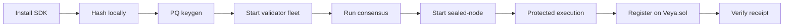

<div align="center">
  

  # VEYA SDK Quickstart

  **From zero to post-quantum agent settlement on Robinhood Chain.**

  [](../package.json)
  [](https://docs.ethers.org/v6/)
  [](https://explorer.testnet.chain.robinhood.com)

  **[Documentation Hub](../README.md)** • **[Architecture](./ARCHITECTURE.md)** • **[Post-Quantum](./POST_QUANTUM.md)** • **[Verification](./VERIFICATION.md)**

</div>

---

Get `@veya/sdk` running locally, execute a full post-quantum workflow, and optionally anchor attestations to **live Robinhood Chain testnet**. This walkthrough does **not** require the hosted API at `https://api.veyanet.tech`. You need Node 20+, this package, and: for writes: a funded testnet wallet. Validator and sealed-node processes are local HTTP services the SDK calls; they are not a VEYA cloud.

`Veya.sol` is a protocol contract. It is not a token. Do not look for an ERC-20 address.

### Prerequisites

| Tool | Version | Verify |
|------|---------|--------|
| **Node.js** | 20+ | `node --version` |
| **npm** | 10+ (bundled with Node) | `npm --version` |
| **Funded wallet** | ETH on chain 46630 | needed only for on-chain writes |
| **validator-node** | local binaries | ports 7701–7703 for consensus |
| **sealed-node** | local binary | port 7800 for protected execution |

### What you will accomplish



Hashing and keygen need no chain. Consensus needs three local nodes. Writes need `VEYA_DEPLOYER_PRIVATE_KEY` and ETH for gas.

---

## Table of Contents

1. [Install and Build](#1-install-and-build)
2. [Construct a Client](#2-construct-a-client)
3. [Generate Post-Quantum Keys](#3-generate-post-quantum-keys)
4. [Hash a Commitment](#4-hash-a-commitment)
5. [Start Validator Nodes](#5-start-validator-nodes)
6. [Run Consensus](#6-run-consensus)
7. [Start Sealed Node](#7-start-sealed-node)
8. [Protected Sealed Execution](#8-protected-sealed-execution)
9. [Configure Robinhood Chain](#9-configure-robinhood-chain)
10. [Register an Environment On-Chain](#10-register-an-environment-on-chain)
11. [Call the Ten Solidity Functions](#11-call-the-ten-solidity-functions)
12. [Verify a Receipt](#12-verify-a-receipt)
13. [Run Tests](#13-run-tests)
14. [Use With the Hosted API](#14-use-with-the-hosted-api)
15. [End-to-End Lifecycle Diagram](#15-end-to-end-lifecycle-diagram)
16. [Environment Variables](#16-environment-variables)
17. [Troubleshooting](#17-troubleshooting)
18. [Operator Runbook](#18-operator-runbook)
19. [Next Steps](#19-next-steps)

---

## 1. Install and Build

From this repository:

```bash
npm install
npm test
npm run build
```

This compiles `src/` with tsup into ESM + CJS under `dist/`, including types.

### Consume from another package in the monorepo

`https://api.veyanet.tech` already depends on the SDK as a file path:

```json
"@veya/sdk": "^1.0.0"
```

```ts
import {
  VeyaClient,
  EvmAnchor,
  ROBINHOOD_TESTNET,
  runConsensus,
  protectedExec,
  pq,
} from "@veya/sdk";
```

### Verify build artifacts

| Artifact | Path |
|----------|------|
| ESM bundle | `dist/index.js` |
| CJS bundle | `dist/index.cjs` |
| Types | `dist/index.d.ts` |
| PQ subpath | `dist/pq/index.js` (`@veya/sdk/pq`) |
| Example | `examples/quickstart.ts` |

Run the example (hash only, no wallet):

```bash
npx tsx examples/quickstart.ts
```

Expected shape: chain name, chain id `46630`, RPC, contract `0x1a1Dc3c55550FCE9F70ef6cDEeF967c0b72a5d84`, a 64-char BLAKE3 hex string, and `evmReady: false` unless `VEYA_DEPLOYER_PRIVATE_KEY` is set.

---

## 2. Construct a Client

Local hashing needs no wallet:

```ts
import { VeyaClient, ROBINHOOD_TESTNET, explorerTxUrl } from "@veya/sdk";

const client = new VeyaClient();
const digest = await client.hashBlake3("treasury vote 31 Aug");
// digest is 64 hex chars: BLAKE3-256
console.log(ROBINHOOD_TESTNET.chainId); // 46630
```

On-chain write (funded testnet key):

```ts
const client = new VeyaClient({
  payerPrivateKey: process.env.VEYA_DEPLOYER_PRIVATE_KEY!,
  // rpcUrl / contractAddress / chainId default to Robinhood testnet
});

const { environmentTx, memoTx, explorer } = await client.registerPqOnchain();
console.log(explorer.memo);
```

`registerPqOnchain` is a convenience that generates an ML-DSA identity, calls `registerEnvironment`, then `storeCommitment` of the pubkey fingerprint. The return field `memoTx` is that commitment transaction: it is **not** an SPL Memo and not a Solana signature.

`EvmAnchor` refuses to send if the RPC `eth_chainId` is not `46630` (or the `chainId` you passed in).

### Configuration fields

| Field | Default | Purpose |
|-------|---------|---------|
| `rpcUrl` | `https://rpc.testnet.chain.robinhood.com` | JSON-RPC |
| `contractAddress` | `0x1a1Dc3c55550FCE9F70ef6cDEeF967c0b72a5d84` | `Veya.sol` |
| `chainId` | `46630` | Guarded by `ensureRobinhoodChain` |
| `explorerUrl` | `https://explorer.testnet.chain.robinhood.com` | `explorerTxUrl` |
| `payerPrivateKey` | `VEYA_DEPLOYER_PRIVATE_KEY` | Enables `client.evm` |
| `validatorNodes` | `http://127.0.0.1:7701,7702,7703` | Consensus |
| `sealedNodeUrl` | `http://127.0.0.1:7800` | Protected exec |

Without a private key, `client.evm` is undefined and `registerPqOnchain` throws `payerPrivateKey required for on-chain ops on Robinhood Chain`. Hashing, consensus, and sealed-node calls still work.

---

## 3. Generate Post-Quantum Keys

```ts
import { VeyaClient } from "@veya/sdk";
import * as pq from "@veya/sdk/pq";

const client = new VeyaClient();
const { publicKey, privateKey } = await client.pqKeygen();
const hash = await pq.publicKeyHashBlake3(publicKey);
console.log("BLAKE3 fingerprint:", hash);
```

`pqKeygen` is `generatePQIdentity` from `src/pq/mldsa.ts`: `@noble/post-quantum` `ml_dsa44.keygen()`. The public key is 1,312 bytes (ML-DSA-44). The secret key is 2,560 bytes. Neither belongs in git, logs, or `Veya.sol`.

Sign and verify a digest:

```ts
const digestBytes = await pq.hashBlake3Bytes("execution payload");
const sig = await pq.signPQ(digestBytes, privateKey);
const ok = await pq.verifyPQ(sig, digestBytes, publicKey);
```

**Critical:** on-chain attestations sign the **32-byte BLAKE3 digest**, not the raw JSON and not the hex string.

Cryptographic details: [POST_QUANTUM.md](./POST_QUANTUM.md)

---

## 4. Hash a Commitment

```ts
import { pq } from "@veya/sdk";

const hex = await pq.hashBlake3("veya-sdk-quickstart");
const bytes = await pq.hashBlake3Bytes(new TextEncoder().encode("veya-sdk-quickstart"));
```

`hashBlake3` always returns 64 lowercase hex characters. `hashBlake3Bytes` returns `Uint8Array(32)` suitable for `ethers.hexlify` into a `bytes32` argument.

Do not introduce SHA-256 on new SDK commitment paths. Browser Use-mode content proofs in the hosted product may hash with SHA-256 so a stranger can preview without WASM; that split lives in the API, not in this package.

---

## 5. Start Validator Nodes

Open **three terminals** (or your process supervisor). Bind the canonical local ports:

```bash
# Terminal 1
validator-node alpha 7701

# Terminal 2
validator-node beta 7702

# Terminal 3
validator-node gamma 7703
```

Each node listens on `POST /execute` and returns a BLAKE3 execution hash signed with its node ML-DSA identity. The SDK does not start these processes for you.

### Health check

```bash
curl -s -X POST http://127.0.0.1:7701/execute \
  -H "Content-Type: application/json" \
  -d "{\"task_id\":\"ping\",\"payload\":{\"action\":\"ping\"}}"
```

A live node returns JSON containing a `result` object with `blake3_execution_hash` and `mldsa_signature`. Connection refused means the binary is not running: the SDK will not invent a quorum.

Default URLs in `resolveConfig`:

| Node | URL |
|------|-----|
| alpha | `http://127.0.0.1:7701` |
| beta | `http://127.0.0.1:7702` |
| gamma | `http://127.0.0.1:7703` |

Override with `VEYA_VALIDATOR_NODES` as a comma-separated list.

---

## 6. Run Consensus

```ts
import { VeyaClient } from "@veya/sdk";

const client = new VeyaClient({
  validatorNodes: [
    "http://127.0.0.1:7701",
    "http://127.0.0.1:7702",
    "http://127.0.0.1:7703",
  ],
});

const result = await client.runConsensus("task-001", {
  action: "rebalance",
  amount: 1000,
});
console.log(result.agreed_blake3_hash, result.consensus_reached);
```

Successful output shape (`ConsensusResult`):

```json
{
  "task_id": "task-001",
  "agreed_blake3_hash": "<64 hex chars>",
  "consensus_reached": true,
  "threshold": 2,
  "node_results": []
}
```

The quorum requires **2-of-3** matching BLAKE3 hashes among successful node results. Save `agreed_blake3_hash` for on-chain attestation. If two nodes are down, `consensus_reached` is false. That is correct.

You can also call `runConsensus(urls, taskId, payload)` as a free function without constructing `VeyaClient`.

---

