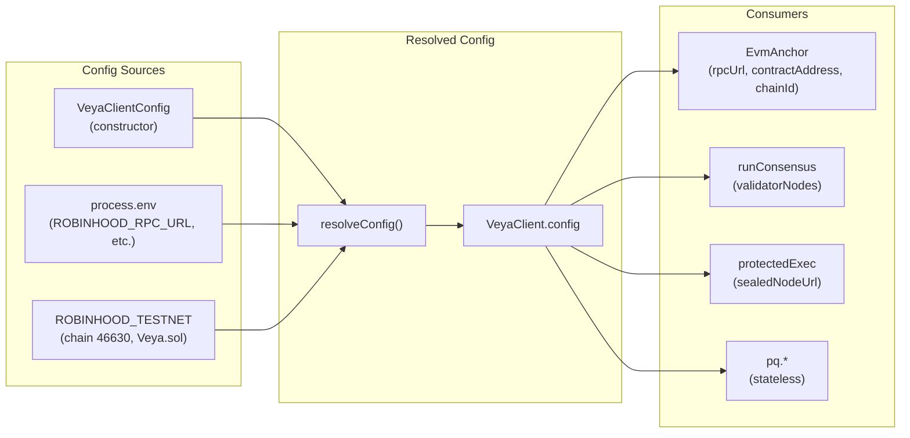
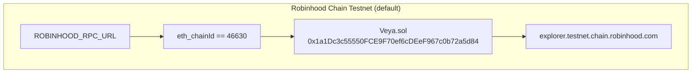

# SDK Configuration

**Configure `@veya/sdk` for post-quantum agent settlement on Robinhood Chain without a hosted API server.**

The TypeScript SDK centralizes Robinhood Chain JSON-RPC, the deployed `Veya.sol` address, validator fleet URLs, and sealed-node endpoints. All configuration resolves through `resolveConfig()` with environment-variable fallbacks. Settlement is EVM: native units are wei, function names are camelCase, and the ABI is inlined in `src/abi` so the package does not depend on `@veya/program`.

**Related:** [evm-anchoring.md](./evm-anchoring.md) • [decentralized-compute.md](./decentralized-compute.md) • [sealed-execution.md](./sealed-execution.md) • [pq-crypto.md](./pq-crypto.md)

---

## Table of Contents

1. [Purpose and Scope](#purpose-and-scope)
2. [Audience and Assumptions](#audience-and-assumptions)
3. [Glossary](#glossary)
4. [Configuration Architecture](#configuration-architecture)
5. [VeyaClientConfig](#veyaclientconfig)
6. [ResolvedVeyaConfig](#resolvedveyaconfig)
7. [resolveConfig](#resolveconfig)
8. [ROBINHOOD_TESTNET Defaults](#robinhood_testnet-defaults)
9. [VeyaClient Construction](#veyaclient-construction)
10. [Environment Variables](#environment-variables)
11. [Chain Selection](#chain-selection)
12. [Module Resolution Map](#module-resolution-map)
13. [ABI Inlining and Contract Address](#abi-inlining-and-contract-address)
14. [Local Development Stack](#local-development-stack)
15. [Production Patterns](#production-patterns)
16. [Security and Trust Boundaries](#security-and-trust-boundaries)
17. [Failure Modes and Recovery](#failure-modes-and-recovery)
18. [Performance and Scaling](#performance-and-scaling)
19. [Compatibility and Versioning](#compatibility-and-versioning)
20. [Troubleshooting](#troubleshooting)
21. [See Also](#see-also)

---

## Purpose and Scope

This document describes how `@veya/sdk` discovers Robinhood Chain endpoints, how constructor options override environment variables, and which modules consume each resolved field. Configuration is a local, deterministic merge. There is no remote configuration service on the critical path, and the SDK never fetches a program IDL at runtime.

The configuration surface is intentionally small. Cryptographic modules (`pq`, `memory`, `coordination`) do not require an RPC URL or a private key. Anchoring and on-chain writes require `payerPrivateKey`, `rpcUrl`, `contractAddress`, and `chainId`. Consensus and sealed execution require only HTTP origins for the operator-run node fleet.

Operators who treat this file as a runbook should be able to stand up a client that talks to Robinhood Chain testnet (chain id `46630`), point at `Veya.sol` at `0x1a1Dc3c55550FCE9F70ef6cDEeF967c0b72a5d84`, and keep validator and sealed nodes on loopback without mixing units, ABI sources, or chain ids.

---

## Audience and Assumptions

Readers are expected to be comfortable with ethers v6 providers, EVM chain ids, and hex-encoded secp256k1 private keys. Familiarity with post-quantum primitives is useful but not required to configure the client. The document assumes Node.js 20 or later because the package `engines` field pins that floor.

The following assumptions are baked into defaults and should be treated as invariants unless an operator explicitly overrides them:

- Settlement happens on Robinhood Chain, not on a Solana cluster and not through a brokerage API.
- `Veya.sol` is a protocol contract that stores environment, agent, and commitment state. It is not an ERC-20.
- Spending caps are denominated in wei (18 decimals for native ETH on Robinhood Chain).
- Contract function names in `INSTRUCTION_NAMES` are camelCase (`registerEnvironment`, not `register_environment`).
- The ABI lives in `src/abi` and is imported as JSON. There is no `@veya/program` dependency.

If any of those assumptions is violated at runtime, writes must fail closed. The `EvmAnchor.ensureRobinhoodChain()` gate exists specifically so a mis-pointed RPC cannot silently land transactions on another EVM.

---

## Glossary

| Term | Meaning in this SDK |
|------|---------------------|
| Robinhood Chain | EVM network used for VEYA settlement. Testnet chain id is `46630` (`0xb636`). |
| `Veya.sol` | Protocol contract storing environments, agents, attestations, commitments, spending, policy, nullifiers, and sealed chunks. |
| wei | Native currency subunit. One ETH is `10^18` wei. All on-chain spend amounts use wei. |
| `resolveConfig` | Pure merge of constructor options, `process.env`, and `ROBINHOOD_TESTNET` defaults. |
| `EvmAnchor` | Write client that submits real Robinhood Chain transactions through ethers. |
| `payerPrivateKey` | Hex secp256k1 key used as `msg.sender` for `Veya.sol` writes. |
| Validator nodes | HTTP processes that execute payloads and return BLAKE3 + ML-DSA attestations. |
| Sealed node | HTTP process that AES-256-GCM seals payloads and returns ciphertext commitments. |
| ABI inlining | `VEYA_ABI` compiled from `Veya.json` inside `src/abi`, not imported from another package. |

These terms appear throughout the remaining SDK module docs. When a later document says "the resolved config," it means the `ResolvedVeyaConfig` object produced by `resolveConfig`.

---

## Configuration Architecture

Configuration flows from explicit constructor options, then environment variables, then hardcoded Robinhood testnet defaults. No remote config service participates.



The PQ-first rule is that cryptographic modules do not require Robinhood Chain configuration. Only anchoring and on-chain flows need `payerPrivateKey` and `contractAddress`. Consensus and sealed execution need HTTP origins that the operator controls.

Precedence is left-to-right within each field: constructor wins, then environment, then the constant in `src/chain.ts`. Empty strings are not treated as missing values. If an operator passes `rpcUrl: ""`, the merge will keep the empty string rather than falling through to the default. Pass `undefined` (or omit the field) when the intent is to inherit.

---

## VeyaClientConfig

**File:** `src/config.ts`

```typescript
export type VeyaClientConfig = {
  /** EVM JSON-RPC endpoint (Robinhood Chain Testnet by default). */
  rpcUrl?: string;
  /** Deployed Veya.sol address. */
  contractAddress?: string;
  /** EVM chain id. Defaults to Robinhood testnet 46630. */
  chainId?: number;
  /** Block explorer origin (no trailing slash). */
  explorerUrl?: string;
  /** Payer private key as hex string (never commit real secrets). */
  payerPrivateKey?: string;
  /** Validator node URLs for 2-of-3 consensus. */
  validatorNodes?: string[];
  /** Sealed-node origin for protected execution. */
  sealedNodeUrl?: string;
};
```

Every field is optional at the type level. Requiredness is a runtime property of the operation being performed, not of the type. That distinction matters: a hashing-only process can construct `VeyaClient` with an empty object, while `registerPqOnchain()` will throw if no payer key is present.

### Field reference

| Field | Type | Required for | PQ relevance |
|-------|------|--------------|--------------|
| `rpcUrl` | `string` | On-chain txs, account reads | None: JSON-RPC only |
| `contractAddress` | `string` | `Veya.sol` writes and reads | Stores BLAKE3 hashes and ML-DSA sig bytes |
| `chainId` | `number` | `ensureRobinhoodChain()` | Guards against wrong-network writes |
| `explorerUrl` | `string` | Receipt deep links | None |
| `payerPrivateKey` | `string` | Transaction signing | Enables `registerPqOnchain()` |
| `validatorNodes` | `string[]` | `runConsensus()` | Nodes sign BLAKE3 digests with ML-DSA-44 |
| `sealedNodeUrl` | `string` | `protectedExecute()` | Sealed boundary uses AES-256-GCM + BLAKE3 |

`payerPrivateKey` is a hex string, typically `0x`-prefixed 32-byte secp256k1 material. It is not a 64-byte Solana secret key array. Loading a Solana keypair JSON into this field will produce an ethers wallet that cannot sign Robinhood Chain transactions correctly.

`contractAddress` is a 20-byte EVM address. The testnet deployment is `0x1a1Dc3c55550FCE9F70ef6cDEeF967c0b72a5d84`. Checksums should be preserved when logging, but ethers accepts either mixed-case EIP-55 or lowercase.

---

## ResolvedVeyaConfig

After `resolveConfig`, every field except the payer key is a concrete string or number. The payer remains `string | undefined` because off-chain flows are first-class.

```typescript
export type ResolvedVeyaConfig = {
  rpcUrl: string;
  contractAddress: string;
  chainId: number;
  explorerUrl: string;
  payerPrivateKey: string | undefined;
  validatorNodes: string[];
  sealedNodeUrl: string;
};
```

`VeyaClient.config` is this resolved object. Downstream modules should read from `client.config` rather than re-parsing environment variables. Re-parsing would allow a later `process.env` mutation to diverge from the values the client was constructed with.

`chainId` is parsed with `Number(...)`. If `ROBINHOOD_CHAIN_ID` is set to a non-numeric string, the result is `NaN`. `EvmAnchor.ensureRobinhoodChain()` will then fail because `BigInt(NaN)` throws. That is the intended fail-closed behavior: a garbage chain id must not silently skip the network check.

---

## resolveConfig

`resolveConfig(config)` merges explicit options with environment variables and defaults. Call it directly when resolved values are needed without instantiating `VeyaClient`.

```typescript
import { resolveConfig } from "@veya/sdk";

const cfg = resolveConfig({
  rpcUrl: "https://rpc.testnet.chain.robinhood.com",
  validatorNodes: ["http://127.0.0.1:7701", "http://127.0.0.1:7702"],
});

console.log(cfg.sealedNodeUrl); // http://127.0.0.1:7800 (default)
console.log(cfg.chainId);       // 46630
console.log(cfg.contractAddress);
// 0x1a1Dc3c55550FCE9F70ef6cDEeF967c0b72a5d84
```

### Merge algorithm

For each field the function evaluates `config.<field> ?? process.env.<VAR> ?? DEFAULT`. The nullish coalescing operator means `0` is a valid `chainId` override (though it is never a correct Robinhood chain id) and an empty array is a valid `validatorNodes` override.

`validatorNodes` is the only array field. When taken from the environment it is split on commas:

```
VEYA_VALIDATOR_NODES=http://127.0.0.1:7701,http://127.0.0.1:7702,http://127.0.0.1:7703
```

Whitespace around URLs is not trimmed at config time. `runConsensus` trims each URL before issuing `fetch`, so `" http://127.0.0.1:7701"` still works at consensus time. Prefer clean comma-separated values anyway so logs and health checks match the live origins.

### Default values

| Key | Default | Override env var |
|-----|---------|------------------|
| `rpcUrl` | `https://rpc.testnet.chain.robinhood.com` | `ROBINHOOD_RPC_URL` |
| `contractAddress` | `0x1a1Dc3c55550FCE9F70ef6cDEeF967c0b72a5d84` | `VEYA_CONTRACT_ADDRESS` |
| `chainId` | `46630` | `ROBINHOOD_CHAIN_ID` |
| `explorerUrl` | `https://explorer.testnet.chain.robinhood.com` | `ROBINHOOD_EXPLORER_URL` |
| `validatorNodes` | `http://127.0.0.1:7701`, `7702`, `7703` | `VEYA_VALIDATOR_NODES` |
| `sealedNodeUrl` | `http://127.0.0.1:7800` | `VEYA_SEALED_NODE_URL` |
| `payerPrivateKey` | `undefined` | `VEYA_DEPLOYER_PRIVATE_KEY` |

There is no default payer. On-chain writes require an explicit key from the constructor or the environment. That is a security decision: a packaged default key would be public and useless on a funded account.

---

## ROBINHOOD_TESTNET Defaults

**File:** `src/chain.ts`

The default network object is the single source of truth for testnet constants. `resolveConfig` imports `ROBINHOOD_TESTNET` rather than duplicating literals.

```typescript
export const ROBINHOOD_TESTNET_CHAIN_ID = 46630;

export const ROBINHOOD_TESTNET = {
  chainId: ROBINHOOD_TESTNET_CHAIN_ID,
  chainIdHex: "0xb636",
  name: "Robinhood Chain Testnet",
  rpcUrl: "https://rpc.testnet.chain.robinhood.com",
  explorerUrl: "https://explorer.testnet.chain.robinhood.com",
  nativeCurrency: {
    name: "ETH",
    symbol: "ETH",
    decimals: 18,
  },
  contractAddress: "0x1a1Dc3c55550FCE9F70ef6cDEeF967c0b72a5d84",
} as const;
```

Helper functions live beside the constant:

| Function | Behavior |
|----------|----------|
| `explorerTxUrl(hash, base?)` | Builds `{explorer}/tx/0x...`, inserting `0x` if missing and stripping a trailing slash on the origin. |
| `explorerAddressUrl(address, base?)` | Builds `{explorer}/address/{address}`. |
| `isRobinhoodTestnet(chainId)` | Returns true iff `BigInt(chainId) === 46630n`. |

Wallet connection flows that add Robinhood Chain to a browser wallet should use `chainIdHex: "0xb636"` together with the RPC and explorer URLs above. The SDK itself does not call `wallet_addEthereumChain`; it talks JSON-RPC through ethers.

Native currency decimals are 18. Converting a human amount such as `0.01 ETH` to an on-chain spend uses `ethers.parseEther("0.01")`, which yields wei. Do not pass lamports, USDC atomic units, or floating-point numbers into `initSpendingLimit` or `recordSpend`.

---

## VeyaClient Construction

### Off-chain only (PQ, consensus, sealed)

No payer is required. This path is the default for local development and CI hashing tests.

```typescript
import { VeyaClient } from "@veya/sdk";

const client = new VeyaClient({
  validatorNodes: ["http://127.0.0.1:7701", "http://127.0.0.1:7702", "http://127.0.0.1:7703"],
  sealedNodeUrl: "http://127.0.0.1:7800",
});

const { publicKey, privateKey } = await client.pqKeygen();
const fingerprint = await client.hashBlake3(publicKey);

const quorum = await client.runConsensus("task-1", { action: "ping" });

const sealed = await client.protectedExecute({
  environmentId: "env-uuid",
  agentId: "agent-uuid",
  eventType: "audit",
  payload: { step: "finalize" },
  sessionEntropy: crypto.getRandomValues(new Uint8Array(32)),
});
```

`client.evm` is `undefined` in this configuration. Calling `client.registerPqOnchain()` throws `payerPrivateKey required for on-chain ops on Robinhood Chain`.

### With EVM anchoring

`payerPrivateKey` enables `client.evm` (`EvmAnchor`). The constructor does not send a transaction. The first write calls `ensureRobinhoodChain()`, which issues `eth_chainId` against the configured RPC.

```typescript
import { VeyaClient } from "@veya/sdk";

const client = new VeyaClient({
  payerPrivateKey: process.env.VEYA_DEPLOYER_PRIVATE_KEY,
  rpcUrl: process.env.ROBINHOOD_RPC_URL,
  contractAddress: process.env.VEYA_CONTRACT_ADDRESS,
  chainId: 46630,
});

const { publicKeyHash, environmentTx, memoTx, explorer } =
  await client.registerPqOnchain(1);
// envType: 0=Execution, 1=SecureEnclave, 2=Governance
```

`envType` values match `Veya.sol` `EnvironmentType`. Passing `3` or higher reverts with `InvalidEnvironmentType`.

### Lazy EvmAnchor

`EvmAnchor` is constructed only when a private key is present on the constructor argument or the resolved config:

```typescript
if (client.evm) {
  const tx = await client.evm.anchorMemo(
    environmentUuid,
    "e222a4812bace5608fd743318c2cb0f05cd8de4196f8cf09ffa195734c99d2a0",
  );
  console.log(client.explorerFor(tx));
  // https://explorer.testnet.chain.robinhood.com/tx/0x...
}
```

The wallet is an `ethers.Wallet` bound to `ethers.JsonRpcProvider`. The provider is intentionally not constructed with `staticNetwork`, so `getNetwork()` must query `eth_chainId`. A mis-pointed RPC cannot claim to be Robinhood Chain by static configuration alone.

---

## Environment Variables

| Variable | Maps to | Example | Notes |
|----------|---------|---------|-------|
| `ROBINHOOD_RPC_URL` | `rpcUrl` | `https://rpc.testnet.chain.robinhood.com` | Dedicated RPC recommended for production |
| `ROBINHOOD_CHAIN_ID` | `chainId` | `46630` | Parsed with `Number(...)` |
| `ROBINHOOD_EXPLORER_URL` | `explorerUrl` | `https://explorer.testnet.chain.robinhood.com` | No trailing slash |
| `VEYA_CONTRACT_ADDRESS` | `contractAddress` | `0x1a1Dc3c55550FCE9F70ef6cDEeF967c0b72a5d84` | Pin per deployment |
| `VEYA_VALIDATOR_NODES` | `validatorNodes` | `http://a:7701,http://b:7702,http://c:7703` | Comma-separated |
| `VEYA_SEALED_NODE_URL` | `sealedNodeUrl` | `http://127.0.0.1:7800` | TLS URL in production |
| `VEYA_DEPLOYER_PRIVATE_KEY` | `payerPrivateKey` | `0xabc...` 32-byte hex | Never commit |

There is no `SOLANA_RPC_URL` and no `VEYA_PROGRAM_ID` in this package. Those names belong to a different settlement path and will be ignored if exported in the same shell.

### Shell export examples

```bash
# Bash / zsh
export ROBINHOOD_RPC_URL="https://rpc.testnet.chain.robinhood.com"
export ROBINHOOD_CHAIN_ID="46630"
export VEYA_CONTRACT_ADDRESS="0x1a1Dc3c55550FCE9F70ef6cDEeF967c0b72a5d84"
export VEYA_VALIDATOR_NODES="http://127.0.0.1:7701,http://127.0.0.1:7702,http://127.0.0.1:7703"
export VEYA_SEALED_NODE_URL="http://127.0.0.1:7800"
```

```powershell
# PowerShell
$env:ROBINHOOD_RPC_URL = "https://rpc.testnet.chain.robinhood.com"
$env:ROBINHOOD_CHAIN_ID = "46630"
$env:VEYA_VALIDATOR_NODES = "http://127.0.0.1:7701,http://127.0.0.1:7702,http://127.0.0.1:7703"
```

Keep `VEYA_DEPLOYER_PRIVATE_KEY` out of shell history where possible. Prefer a secrets manager, a mounted file that the process reads once, or an ephemeral injection at container start.

---

## Chain Selection

| Network | `chainId` | `rpcUrl` | `explorerUrl` | `Veya.sol` |
|---------|-----------|----------|---------------|------------|
| Robinhood Chain Testnet | `46630` | `https://rpc.testnet.chain.robinhood.com` | `https://explorer.testnet.chain.robinhood.com` | `0x1a1Dc3c55550FCE9F70ef6cDEeF967c0b72a5d84` |



`EvmAnchor.ensureRobinhoodChain()` compares `provider.getNetwork().chainId` to `BigInt(this.chainId)`. A mismatch throws:

```
VEYA SDK expected chain id 46630 (Robinhood Chain), RPC returned <actual>
```

The check is cached on the instance after the first success (`networkChecked = true`). Construct a new `EvmAnchor` if the RPC URL changes at runtime; do not mutate `provider` in place.

Connecting a wallet to Ethereum mainnet (`1`), a local Anvil (`31337`), or any other EVM while leaving `chainId` at `46630` will fail at the first write. That is correct. The SDK is not a multi-chain router.

---

