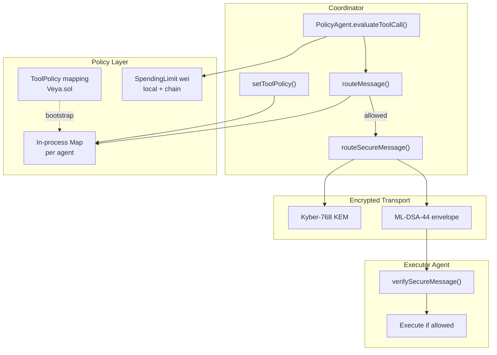
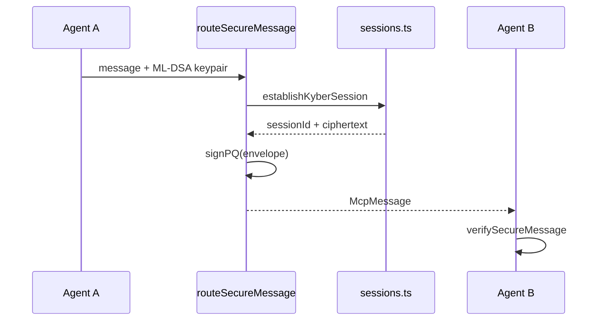
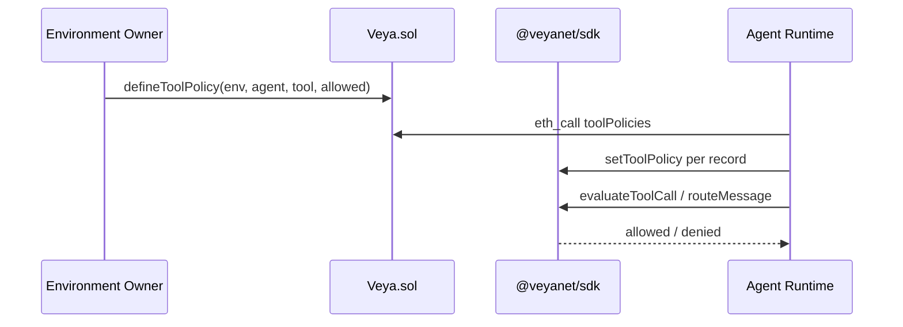

# SDK Coordination

**MCP-style message routing with tool policy enforcement, Kyber sessions, ML-DSA attestations, and wei-denominated spending gates.**

The coordination module routes agent messages with pre-flight ACL checks. In-process policies can mirror on-chain `defineToolPolicy` records on `Veya.sol`. Kyber-768 secures session transport. ML-DSA-44 signs message envelopes off-chain. `PolicyAgent` applies `maxWeiPerAction` using local spending state denominated in wei on Robinhood Chain.

**Related:** [pq-crypto.md](./pq-crypto.md) • [memory.md](./memory.md) • [evm-anchoring.md](./evm-anchoring.md) • [configuration.md](./configuration.md)

---

## Table of Contents

1. [Purpose and Scope](#purpose-and-scope)
2. [Audience and Assumptions](#audience-and-assumptions)
3. [Glossary](#glossary)
4. [Overview](#overview)
5. [McpMessage Type](#mcpmessage-type)
6. [Tool Policy](#tool-policy)
7. [routeMessage](#routemessage)
8. [routeSecureMessage](#routesecuremessage)
9. [verifySecureMessage](#verifysecuremessage)
10. [Kyber Session Transport](#kyber-session-transport)
11. [PolicyAgent](#policyagent)
12. [Wei Spending Gates](#wei-spending-gates)
13. [On-Chain Policy Alignment](#on-chain-policy-alignment)
14. [Environment Isolation](#environment-isolation)
15. [Multi-Agent Topologies](#multi-agent-topologies)
16. [Consensus Gating](#consensus-gating)
17. [Failure Modes](#failure-modes)
18. [Security](#security)
19. [Worked Example](#worked-example)
20. [Troubleshooting](#troubleshooting)
21. [See Also](#see-also)

---

## Purpose and Scope

Coordination is **off-chain** and **PQ-first**. It answers: may this agent invoke this tool, with this implied spend, toward that peer, under this environment's rules? Settlement disputes resolve against on-chain `ToolPolicy` records and `SpendingLimit` structs on `Veya.sol` at `0x1a1Dc3c55550FCE9F70ef6cDEeF967c0b72a5d84`.

This document covers `src/coordination/router.ts`, `sessions.ts`, and `policyAgent.ts`, plus their coupling to `src/spending/limits.ts`. It does not implement MCP transport over the network; `routeMessage` is an in-process gate that an MCP runtime should call before dispatch.

---

## Audience and Assumptions

Readers should know MCP tool names as short strings (max 64 characters on chain), and they should know that Robinhood Chain native units are wei. They should not import lamport-based policy fields from other codebases.

Assumptions:

- Default deny: a tool not present in the agent's allow-set is denied.
- `PolicyAgentConfig.maxWeiPerAction` is wei. The field is not named `maxLamportsPerAction`.
- `INSTRUCTION_NAMES` includes `defineToolPolicy`, `initSpendingLimit`, and `recordSpend` in camelCase.
- Kyber sessions live in process memory. They vanish on restart.
- The in-process policy `Map` is not durable. Restart without bootstrapping from chain returns to default deny.

---

## Glossary

| Term | Meaning |
|------|---------|
| `McpMessage` | Envelope: ids, tool, payload, policy status, optional Kyber and ML-DSA fields |
| Allow-set | `Set<string>` of tool names per agent id |
| `PolicyAgent` | Gate combining tool ACL, wei cap, and consensus requirement |
| `maxWeiPerAction` | Per-action native cap in wei |
| `KyberSession` | `sessionId`, ciphertext hex, shared secret hex, createdAt |
| Default deny | Missing policy implies `policyStatus: "denied"` |

---

## Overview



Denied messages must not trigger `runConsensus`, `protectedExecute`, or `recordSpend`. That short-circuit is an application invariant. The router returns a message; it does not throw on deny.

---

## McpMessage Type

```typescript
type McpMessage = {
  id: string;
  fromAgent: string;
  toAgent: string;
  tool: string;
  payload: unknown;
  policyStatus: "allowed" | "denied";
  kyberSessionId?: string;
  mlDsaSig?: string;
};
```

| Field | Purpose |
|-------|---------|
| `id` | Unique message UUID |
| `fromAgent` | Sender agent id (matches registered agent UUID string form) |
| `toAgent` | Recipient agent id |
| `tool` | MCP tool name (max 64 chars on chain) |
| `payload` | JSON-serializable body |
| `policyStatus` | Set by `routeMessage` |
| `kyberSessionId` | BLAKE3 session id from `establishKyberSession` |
| `mlDsaSig` | Hex ML-DSA-44 signature over the unsigned envelope JSON |

`payload` may include amounts. When it does, encode wei as decimal strings or `bigint` handled **before** JSON serialization. `routeSecureMessage` uses `JSON.stringify` on the envelope; `bigint` will throw.

---

## Tool Policy

### setToolPolicy

```typescript
import { setToolPolicy } from "@veyanet/sdk";

setToolPolicy("agent-uuid", "transfer_funds", true);
setToolPolicy("agent-uuid", "external_api", false);
setToolPolicy("agent-uuid", "read_ledger", true);
```

| Parameter | Type | Description |
|-----------|------|-------------|
| `agentId` | `string` | Agent UUID string |
| `tool` | `string` | Tool name |
| `allowed` | `boolean` | `true` adds to the set; `false` deletes |

Implementation is a module-level `Map<string, Set<string>>`. It is fast and process-local. It is not namespaced by environment id. If two environments could share an agent id string, they would share ACL state. Keep agent UUIDs globally unique, matching `Veya.sol` `agents[agentUuid]` which is also globally keyed.

### Policy semantics

| Condition | `routeMessage` result |
|-----------|----------------------|
| Tool in allow-set | `allowed` |
| Tool removed or never added | `denied` |
| Unknown agent id | `denied` |

Production runtimes should call `setToolPolicy` for every `ToolPolicy` record fetched from chain at startup, and again when `ToolPolicyUpdated` logs appear.

---

## routeMessage

```typescript
import { routeMessage } from "@veyanet/sdk";

const routed = routeMessage({
  id: crypto.randomUUID(),
  fromAgent: "agent-a",
  toAgent: "agent-b",
  tool: "transfer_funds",
  payload: { amountWei: "100000000000000000" },
});

if (routed.policyStatus === "denied") {
  throw new Error("tool not permitted: abort settlement");
}
```

The function accepts `Omit<McpMessage, "policyStatus">` and injects `policyStatus`. It does not consult spending limits. Spending is `PolicyAgent` / `checkSpendAllowed`.

Denied short-circuit:

```typescript
const msg = routeMessage({
  id: "msg-1",
  fromAgent: "agent-a",
  toAgent: "agent-b",
  tool: "external_api",
  payload: { url: "https://example.com" },
});
// msg.policyStatus === "denied"
```

Do not call `routeSecureMessage` expecting it to override a deny. Secure routing returns the denied message immediately without Kyber or ML-DSA.

---

## routeSecureMessage

```typescript
export async function routeSecureMessage(
  msg: Omit<McpMessage, "policyStatus" | "kyberSessionId" | "mlDsaSig">,
  identity: { senderPublicKey: Uint8Array; senderPrivateKey: Uint8Array },
): Promise<McpMessage>
```

Steps when the tool is allowed:

1. `routeMessage` ACL check
2. `establishKyberSession(fromAgent, toAgent)`
3. JSON-stringify the routed message plus `kyberSessionId`
4. `signPQ` over UTF-8 bytes of that JSON
5. Return the message with `mlDsaSig` hex

The sender public key in `SecureRouteOptions` is not used during sign; it is present so callers keep a keypair object together. Verification uses the public key explicitly in `verifySecureMessage`.

Signature coverage includes `policyStatus` and `kyberSessionId` but excludes `mlDsaSig` (stripped before verify). Changing the payload after signing invalidates the signature, which is the intended property.

---

## verifySecureMessage

```typescript
const ok = await verifySecureMessage(msg, senderPublicKey);
```

Returns `false` if `mlDsaSig` or `kyberSessionId` is missing. Otherwise rebuilds the unsigned JSON (`mlDsaSig` stripped) and calls `verifyPQ`.

JSON key order must match `JSON.stringify` as produced by the sender. The sender stringifies `{ ...routed, kyberSessionId }` where `routed` already contains `policyStatus`. The verifier stringifies `{ ...unsigned }` after omitting `mlDsaSig`. Those structures must be identical. Do not add extra fields between sign and verify.

A `false` result is a hard fail. Do not execute the tool.

---

## Kyber Session Transport

**File:** `src/coordination/sessions.ts`

```typescript
export type KyberSession = {
  sessionId: string;
  ciphertext: string;
  sharedSecretHex: string;
  createdAt: number;
};
```

`establishKyberSession` generates `sessionId = BLAKE3(fromAgent:toAgent:Date.now())`, encapsulates to the process-local node Kyber public key, and stores the session in a `Map`.

`getNodeKyberPublicKey` exposes that process key for peers that encapsulate toward this runtime. `getKyberSession` looks up by id.



Shared secrets are in-memory hex. Redact them. They are not written to `Veya.sol`. Session ids may appear in logs; secrets must not.

The encapsulating party in the current implementation is always encapsulating to **this process's** Kyber public key, not to `toAgent`'s key. That is a local-node session model: the coordinator holds the decapsulating key. A future peer-to-peer KEM would pass `toAgent`'s public key into `encapsulateKyber`. Document that limitation when placing this module in a multi-host mesh.

---

## PolicyAgent

**File:** `src/coordination/policyAgent.ts`

```typescript
export type PolicyAgentConfig = {
  environmentId: string;
  agentId: string;
  /** Per-action cap in wei (native ETH on Robinhood Chain). */
  maxWeiPerAction?: number;
  requireConsensus?: boolean;
};
```

`evaluateToolCall` runs `routeMessage`, then if `maxWeiPerAction` is set, `checkSpendAllowed(environmentId, msg.fromAgent, maxWeiPerAction)`. Note the spend check uses `msg.fromAgent`, not necessarily `config.agentId`. The config agent id is the policy subject for construction; the message identifies the acting agent. Keep them identical unless a coordinator evaluates on behalf of a child agent with a documented mapping.

Denied reasons:

| Reason | Meaning |
|--------|---------|
| `tool not in agent policy` | ACL miss |
| `spending cap would be exceeded` | Local wei cap would fail |
| `policy ok` | Allowed |

`maxWeiPerAction` is typed as `number`. Values above `Number.MAX_SAFE_INTEGER` (2^53-1) are not safe. For caps at or above that many wei (tiny relative to 10^18, but still), prefer the on-chain `uint256` path via `initSpendingLimit` with `bigint`, and treat the PolicyAgent number as a coarse pre-check. Do not pass lamports. One ETH is `1e18` wei; `maxWeiPerAction: 1_000_000` is a million wei, not a million of any other unit.

`gateConsensus` encodes environment-level quorum requirements:

- If the action requires consensus and the config has `requireConsensus`, allow with reason `consensus required and enabled`.
- If the config requires consensus but the action does not present as required, deny with `consensus required for this environment`.
- Otherwise allow `consensus optional`.

This does not call `runConsensus`. It only decides whether the application must.

---

## Wei Spending Gates

**File:** `src/spending/limits.ts`

Local state:

```typescript
export type SpendingLimit = {
  agentId: string;
  environmentId: string;
  maxAmount: bigint | number;
  periodSecs: number;
  spentAmount: bigint | number;
  periodStart: number;
};
```

`setSpendingLimit` initializes `spentAmount` to 0 and `periodStart` to now (unix seconds). `recordSpend` rolls the window, adds the amount, and throws if the next spent value exceeds `maxAmount`. `checkSpendAllowed` is the non-mutating preview used by `PolicyAgent`.

Keying is `environmentId:agentId`, unlike on-chain `spendingLimits[agentUuid]` which is agent-only. Local limits can differ per environment even if agent strings collided; on-chain they cannot. Keep UUIDs unique.

Align local `maxAmount` with `EvmAnchor.initSpendingLimit(..., maxAmountWei, periodSecs)`. After an allowed action that actually spends, call both `recordSpend` locally and `client.evm.recordSpend` so windows do not diverge. Amounts are wei on both paths.

---

## On-Chain Policy Alignment

| Layer | Authority | Speed |
|-------|-----------|-------|
| SDK `setToolPolicy` | Operator cache | Instant pre-check |
| `defineToolPolicy` | Environment owner on `Veya.sol` | Durable ACL |
| `toolPolicies` mapping | Robinhood Chain consensus | Dispute resolution |



On-chain tool names longer than 64 bytes revert `ToolNameTooLong`. Keep MCP names short. Mapping key is `keccak256(abi.encodePacked(agentUuid, toolName))`. Fetching all policies requires indexing `ToolPolicyUpdated` events; the contract does not enumerate.

`allowed: false` on chain is an explicit deny record, distinct from absence. The in-process map treats absence as deny either way. Bootstrapping should still record explicit denials if operators want to distinguish "never configured" from "revoked" in logs; the Set only stores allows.

---

## Environment Isolation

`PolicyAgentConfig.environmentId` is the isolation string for local spending. Tool policy maps are not environment-scoped. Combine them by using globally unique agent UUIDs registered under a single environment on `Veya.sol`.

Memory, sealed execution, and anchoring all take environment ids. A coordination message that crosses environments is an application-level event. The router will not stop it if the tool is allowed for `fromAgent`. Add an explicit `fromEnvironment === toEnvironment` check in the agent runtime if that is required.

---

## Multi-Agent Topologies

Common shapes:

| Topology | Pattern |
|----------|---------|
| Pair | Treasurer agent tools allowed; watcher agent tools read-only |
| Hub | Coordinator `fromAgent` allowed to `dispatch`; workers denied `recordSpend` tools |
| Quorum-backed | `requireConsensus: true` on the PolicyAgent for the treasury environment |

In all cases the EVM payer may be a single operations key while ML-DSA identities are per agent. Do not use the gas key as the MCP sender identity.

---

## Consensus Gating

When `gateConsensus` allows with consensus required, the runtime should call `client.runConsensus` and only then sealed execution or `recordSpend`. The agreed BLAKE3 hash can be passed to `anchorPqAttestation`.

Coordination does not import `runConsensus`. That keeps the router testable without HTTP nodes. Glue is the application's job.

---

## Failure Modes

| Failure | Cause | Recovery |
|---------|-------|----------|
| All tools denied | Forgot `setToolPolicy` after restart | Bootstrap from chain events |
| Spend denied unexpectedly | `maxWeiPerAction` in wrong units | Convert with `parseEther`; wei only |
| Spend throw from `recordSpend` | Mutating path over cap | Use `checkSpendAllowed` first |
| Verify false | JSON key order or stripped fields differ | Do not mutate message between sign and verify |
| Kyber session missing | Process restart | Re-run `routeSecureMessage` |
| On-chain policy not reflected | Never bootstrapped | Subscribe to `ToolPolicyUpdated` |
| `ToolNameTooLong` | Name > 64 bytes | Shorten MCP names |
| bigint stringify | Payload contains bigint | Decimal strings for wei |

Default deny after restart can look like a total outage. Health checks should fail if the allow-set is empty while chain has policies.

---

## Security

The in-process map is not authenticated. Any code in the process can call `setToolPolicy(..., true)`. Protect the runtime. On-chain records are the audit source.

ML-DSA signatures authenticate the envelope, not the HTTP hop. Combine with TLS for transport. Kyber shared secrets in memory are as safe as the host.

`maxWeiPerAction` as a JavaScript number is not a cryptographic bound. The on-chain `uint256` cap is the binding limit if the application always calls `recordSpend` on `Veya.sol`. If it does not, local state can be reset by restarting the process. Durability requires the chain.

Never log full `McpMessage` objects if payloads contain destination addresses or amounts. Log `id`, `tool`, and `policyStatus`.

---

## Worked Example

```typescript
import {
  PolicyAgent,
  setToolPolicy,
  setSpendingLimit,
  routeSecureMessage,
  verifySecureMessage,
} from "@veyanet/sdk";
import * as pq from "@veyanet/sdk/pq";

const environmentId = "550e8400-e29b-41d4-a716-446655440000";
const agentId = "6ba7b810-9dad-11d1-80b4-00c04fd430c8";

setToolPolicy(agentId, "transfer_funds", true);
setSpendingLimit(environmentId, agentId, 10n ** 16n, 86_400); // 0.01 ETH per day

const policy = new PolicyAgent({
  environmentId,
  agentId,
  maxWeiPerAction: Number(10n ** 15n), // 0.001 ETH coarse gate
  requireConsensus: true,
});

const decision = policy.evaluateToolCall({
  id: crypto.randomUUID(),
  fromAgent: agentId,
  toAgent: "settlement-agent",
  tool: "transfer_funds",
  payload: { amountWei: "1000000000000000" },
});

if (!decision.allowed) throw new Error(decision.reason);

const consensusGate = policy.gateConsensus(true);
if (!consensusGate.allowed) throw new Error(consensusGate.reason);

const identity = await pq.generatePQIdentity();
const secured = await routeSecureMessage(
  {
    id: decision.routed!.id,
    fromAgent: agentId,
    toAgent: "settlement-agent",
    tool: "transfer_funds",
    payload: { amountWei: "1000000000000000" },
  },
  { senderPublicKey: identity.publicKey, senderPrivateKey: identity.privateKey },
);

if (!(await verifySecureMessage(secured, identity.publicKey))) {
  throw new Error("envelope failed ML-DSA verify");
}
```

After this, the runtime would `runConsensus`, optionally `protectedExecute`, then `EvmAnchor.recordSpend` with `1000000000000000n` wei.

---

## Troubleshooting

| Symptom | Cause | Fix |
|---------|-------|-----|
| `tool not in agent policy` | Allow-set empty or wrong agent id | `setToolPolicy`; match UUID strings |
| `spending cap would be exceeded` | Cap too low or units wrong | wei; `maxWeiPerAction` |
| Secure route has no sig | Tool was denied | Fix ACL first |
| Verify false after logging | Logger mutated object | Verify before logging clones |
| Chain allows, SDK denies | Cache stale | Re-bootstrap from `defineToolPolicy` records |
| Lamports copied from old docs | Wrong unit | Use wei only |

---

## See Also

- [pq-crypto.md](./pq-crypto.md): `signPQ`, Kyber, BLAKE3
- [evm-anchoring.md](./evm-anchoring.md): `defineToolPolicy`, spending in wei
- [decentralized-compute.md](./decentralized-compute.md): after `gateConsensus`
- [memory.md](./memory.md): nullifiers for spend-once context
- [sealed-execution.md](./sealed-execution.md): confidential handling after allow
