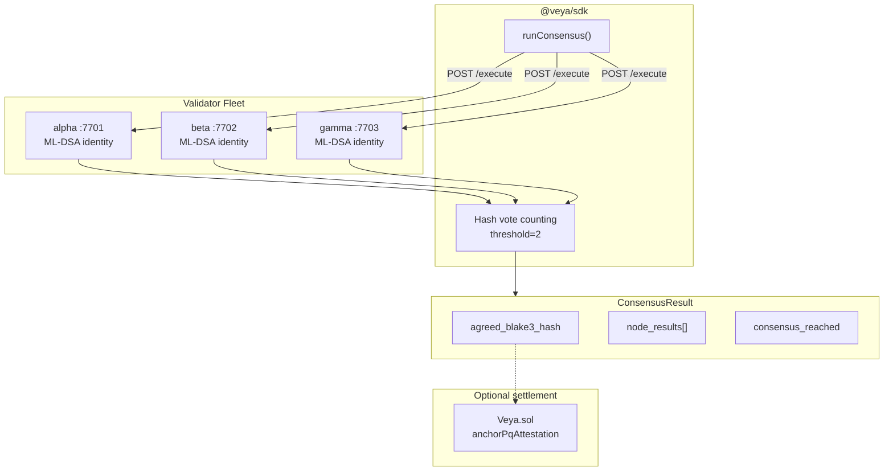
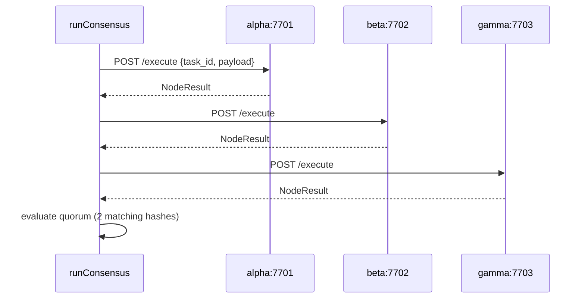
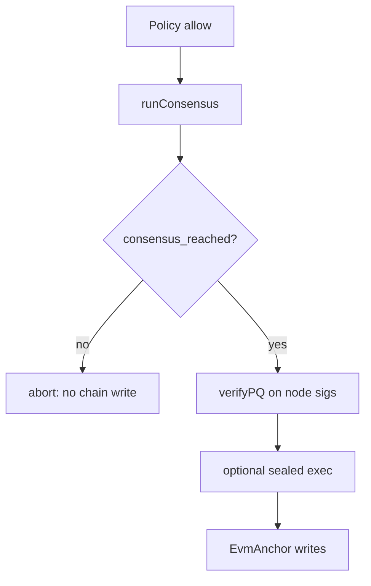
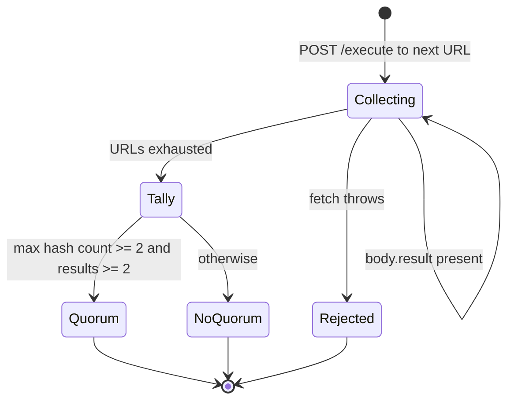

# SDK Decentralized Compute

**Multi-node BLAKE3 quorum with ML-DSA-44 attestations: `runConsensus()` in `@veya/sdk`.**

The SDK orchestrates decentralized execution consensus via `src/compute/consensus.ts`. Three independent validator nodes execute identical payloads; **2-of-3** matching BLAKE3 digests constitute agreement. Agreed hashes can later be written to `Veya.sol` through `EvmAnchor.anchorPqAttestation` or `attestExecution` on Robinhood Chain (chain id 46630).

**Related:** [operations/consensus-cluster.md](../operations/consensus-cluster.md) • [pq-crypto.md](./pq-crypto.md) • [evm-anchoring.md](./evm-anchoring.md) • [configuration.md](./configuration.md)

---

## Table of Contents

1. [Purpose and Scope](#purpose-and-scope)
2. [Audience and Assumptions](#audience-and-assumptions)
3. [Glossary](#glossary)
4. [Overview](#overview)
5. [Architecture](#architecture)
6. [runConsensus API](#runconsensus-api)
7. [NodeResult and ConsensusResult](#noderesult-and-consensusresult)
8. [Quorum Rules](#quorum-rules)
9. [Sequential Fetch Behavior](#sequential-fetch-behavior)
10. [VeyaClient Integration](#veyaclient-integration)
11. [Validator Protocol](#validator-protocol)
12. [Post-Consensus Workflow](#post-consensus-workflow)
13. [Signature Verification](#signature-verification)
14. [Spending and Policy Coupling](#spending-and-policy-coupling)
15. [Failure Modes](#failure-modes)
16. [Performance](#performance)
17. [Environment Variables](#environment-variables)
18. [Worked Example](#worked-example)
19. [Troubleshooting](#troubleshooting)
20. [See Also](#see-also)

---

## Purpose and Scope

Decentralized compute replaces a centralized execution API. Operators run their own validator fleet; the SDK collects results and evaluates quorum locally. This document specifies the TypeScript client. Process lifecycle, ports, and systemd units live in [operations/consensus-cluster.md](../operations/consensus-cluster.md).

The client does not talk to Robinhood Chain. Gas, `eth_chainId`, and `Veya.sol` appear only if the application anchors the agreed hash afterwards. Consensus can be used in CI against loopback nodes with no payer key.

---

## Audience and Assumptions

Readers should understand quorum as a vote over hashes, not as Byzantine agreement with view changes. The implementation is a simple counter: hashes that appear at least `threshold` times among successful node results win.

Assumptions:

- Default fleet is `http://127.0.0.1:7701`, `7702`, `7703` from `resolveConfig`.
- Threshold is hardcoded to `2` in `src/compute/consensus.ts`.
- Nodes are queried **sequentially** in array order.
- Failed HTTP calls currently propagate as thrown `fetch` errors rather than counting as a `fail` vote, unless the node returns HTTP 200 with `status: "fail"` in `body.result`.
- Payload JSON must be identical across nodes. Amounts in payloads should be wei decimal strings when they represent Robinhood Chain value.

---

## Glossary

| Term | Meaning |
|------|---------|
| `runConsensus` | SDK orchestrator: POST `/execute` to each node, count hashes |
| `NodeResult` | Per-node hash, ML-DSA signature, status |
| `ConsensusResult` | Aggregated vote plus `consensus_reached` |
| Threshold | `2`: minimum matching successful hashes |
| `task_id` | Caller-chosen audit correlation string |
| Agreed hash | BLAKE3 hex that met threshold, else `null` |

---

## Overview

| Property | Value |
|----------|-------|
| SDK module | `src/compute/consensus.ts` |
| Validator HTTP | `POST {base}/execute` |
| Default nodes | `http://127.0.0.1:7701–7703` |
| Default threshold | **2** (2-of-3) |
| Hash algorithm | BLAKE3-256 |
| Attestation | ML-DSA-44 detached signatures |
| Settlement | Optional `Veya.sol` on Robinhood Chain |

---

## Architecture





---

## runConsensus API

```typescript
import { runConsensus } from "@veya/sdk";

const result = await runConsensus(
  [
    "http://127.0.0.1:7701",
    "http://127.0.0.1:7702",
    "http://127.0.0.1:7703",
  ],
  "task-001",
  { action: "rebalance", bps: 50 },
);
```

| Param | Type | Description |
|-------|------|-------------|
| `nodeUrls` | `string[]` | Validator base URLs |
| `taskId` | `string` | Unique task identifier for audit logs |
| `payload` | `object` | JSON-serializable execution input |

Each request body is `{ task_id: taskId, payload }`. Headers include `Content-Type: application/json`. URLs are `trim()`'d then concatenated with `/execute`.

If `res.json()` yields a body without `result`, that node contributes nothing to `node_results`. A node that returns 200 with an unexpected shape is silently skipped, which reduces the vote count and can prevent quorum.

---

## NodeResult and ConsensusResult

```typescript
export type NodeResult = {
  node_id: string;
  blake3_execution_hash: string;
  mldsa_signature: string;
  mldsa_public_key_hex?: string;
  status: "success" | "fail";
};

export type ConsensusResult = {
  task_id: string;
  agreed_blake3_hash: string | null;
  node_results: NodeResult[];
  consensus_reached: boolean;
  threshold: number;
};
```

`mldsa_public_key_hex` is optional. When present, auditors can `verifyPQ` without an out-of-band key distribution channel. When absent, operators must have persisted node identities from process start logs.

Example:

```json
{
  "task_id": "task-001",
  "agreed_blake3_hash": "1f2f0fd6237e00d76bdf5ab61eb8edc85a265a42ec9f24f7554993daa5e9c9e3",
  "node_results": [
    {
      "node_id": "alpha",
      "blake3_execution_hash": "1f2f0fd6237e00d76bdf5ab61eb8edc85a265a42ec9f24f7554993daa5e9c9e3",
      "mldsa_signature": "a1b2c3...",
      "status": "success"
    }
  ],
  "consensus_reached": true,
  "threshold": 2
}
```

`threshold` in the result is always `2` with the current client, even if more than three URLs were supplied. Extra nodes increase the chance of collecting two matching hashes; they do not raise the threshold.

---

## Quorum Rules

Implementation:

1. Collect `body.result` from each URL in order.
2. For each result with `status === "success"`, increment a counter keyed by `blake3_execution_hash`.
3. Track the hash with the maximum count.
4. `agreed_blake3_hash` is that hash if `max >= 2`, else `null`.
5. `consensus_reached` is `max >= 2 && results.length >= 2`.

Implications:

- Two successes with the **same** hash and one fail: quorum yes.
- Two successes with **different** hashes and one fail: max is 1; quorum no.
- Three successes, 2-1 split: quorum yes on the majority hash.
- One success only: `results.length >= 2` fails even if somehow max were 2 (impossible with one success). Two identical successes are the minimum.
- `status: "fail"` does not increment hash counts.

Ties: the first hash that reaches the running max in `Map` iteration order wins. `Map` insertion order follows first-seen successful hashes. A 2-2 split on four nodes would pick the hash that appeared first among successes. Prefer an odd fleet so ties are rare.

There is no stake weighting. Node identities are equal.

---

## Sequential Fetch Behavior

The loop is `for (const base of nodeUrls) { await fetch(...) }`. There is no `Promise.all`. A slow first node delays the rest. A thrown `fetch` (DNS, connection refused, abort) rejects the **entire** `runConsensus` promise and drops already-collected results.

Operators who want fail-soft behavior should wrap each node in application code or run a proxy that returns HTTP 200 with `status: "fail"`. Changing the SDK loop to swallow errors would hide outages; the current throw makes missing fleets obvious in development.

Trailing slashes on base URLs produce `http://host:7701//execute` after concatenation. `resolveConfig` defaults do not include trailing slashes. Trim is applied to the base, not to a duplicated slash. Keep origins clean.

---

## VeyaClient Integration

```typescript
import { VeyaClient } from "@veya/sdk";

const client = new VeyaClient({
  validatorNodes: process.env.VEYA_VALIDATOR_NODES?.split(","),
});

const quorum = await client.runConsensus("task-001", { action: "ping" });
if (!quorum.consensus_reached) {
  throw new Error("no quorum");
}
```

`VeyaClient.runConsensus(taskId, payload)` uses `this.config.validatorNodes`. It does not require `payerPrivateKey`. Anchoring:

```typescript
if (client.evm && quorum.agreed_blake3_hash) {
  const executionHash = Uint8Array.from(
    Buffer.from(quorum.agreed_blake3_hash, "hex"),
  );
  await client.evm.anchorPqAttestation(envUuid, identityHash, executionHash);
}
```

`ensureRobinhoodChain` runs inside that write and pins chain id 46630 on testnet.

---

## Validator Protocol

Each node should:

1. Parse `{ task_id, payload }`.
2. Canonicalize payload bytes.
3. Compute `blake3_execution_hash = BLAKE3_hex(payload_bytes)`.
4. Sign payload bytes (or the digest, consistently) with the node's ML-DSA-44 identity.
5. Return `{ result: NodeResult }`.

Determinism is the whole game. If nodes hash different JSON encodings, hashes diverge and quorum fails even when business logic agrees. Keep payloads boring: no NaN, no undefined, wei as strings.

Node identities should be stable in production so historical `mldsa_signature` values remain verifiable. See the operations document for identity persistence.

HTTP 500 from a node will cause `res.json()` to parse an error body that likely has no `result`, skipping the vote. Prefer explicit `status: "fail"` on 200 when the node ran and disagreed with its own execution.

---

## Post-Consensus Workflow

Recommended application order:

1. Policy allow (`PolicyAgent`, wei cap).
2. `runConsensus`.
3. Verify at least two ML-DSA signatures over the agreed hash or payload.
4. Optional `protectedExecute`.
5. `anchorPqAttestation` / `attestExecution` on `Veya.sol`.
6. `recordSpend` in wei if value moved.



Never write `recordSpend` before quorum if the environment has `requireConsensus`. The SDK will not stop you; `PolicyAgent.gateConsensus` is advisory.

---

## Signature Verification

After quorum, for each successful `NodeResult` whose hash equals `agreed_blake3_hash`:

```typescript
import { verifyPQ } from "@veya/sdk/pq";

const sig = Buffer.from(node.mldsa_signature, "hex");
const pub = Buffer.from(node.mldsa_public_key_hex!, "hex");
const message = new TextEncoder().encode(/* same canonical bytes the node signed */);
const ok = await verifyPQ(sig, message, pub);
```

The client does not verify inside `runConsensus`. Two malicious nodes that return the same prearranged hash without valid signatures still produce `consensus_reached: true` if they report `success`. Verification is mandatory in production glue.

If nodes sign the BLAKE3 digest bytes rather than the payload, hash first with `hashBlake3Bytes`. The operations document should state which bytes the binary signs; keep the SDK auditor path matched.

---

## Spending and Policy Coupling

Consensus is not a spending limiter. A fleet will happily hash `{ amountWei: "999999999999999999999" }`. Place `checkSpendAllowed` / `maxWeiPerAction` **before** `runConsensus` so over-cap actions do not leak payload to all three nodes.

On-chain `recordSpend` still uses wei `uint256`. The agreed hash does not include a chain-enforced amount unless the application puts the amount in the payload and the contract is told separately via `recordSpend`.

---

## Failure Modes

| Failure | Cause | Recovery |
|---------|-------|----------|
| Promise rejection | Node down, DNS, TLS | Start fleet; use fail-soft wrapper if required |
| `consensus_reached: false` | Hash split or fewer than two successes | Inspect `node_results`; align payload encoding |
| Empty `node_results` | Bodies without `result` | Fix node JSON shape |
| Quorum on unverified sigs | Skipped `verifyPQ` | Always verify |
| Sequential timeout cascade | First node hung | Health-check nodes; consider per-fetch timeouts at the application layer |
| Wrong hash vs SDK recompute | Canonicalization drift | Hash the same bytes as the node |
| Trailing slash URL | `//execute` 404 | Origins without trailing slash |
| One URL from env | Missing commas in `VEYA_VALIDATOR_NODES` | Three comma-separated origins |
| Anchoring on wrong chain | RPC not 46630 | `ensureRobinhoodChain` on write |

A hung `fetch` without a timeout can stall the process. Set `AbortSignal.timeout` in a wrapper if the fleet is remote.

---

## Performance

Three sequential loopback round trips are typically tens of milliseconds plus node compute. ML-DSA sign on each node dominates over HTTP on LAN. Geographic distribution makes sequential fetching painful; that is a known client property.

Threshold 2 means a 3-node fleet can tolerate one outage **if** `fetch` does not throw. With the current throw-on-network-error behavior, one down node aborts the whole call. Production wrappers should catch per node to restore the intended 2-of-3 availability.

---

## Environment Variables

| Variable | Role |
|----------|------|
| `VEYA_VALIDATOR_NODES` | Comma-separated origins for `resolveConfig` |

Not used: `ROBINHOOD_RPC_URL` (consensus is off-chain). RPC appears only at later anchoring.

Default if unset: three loopback ports 7701–7703.

---

## Worked Example

```typescript
import { VeyaClient } from "@veya/sdk";
import { verifyPQ } from "@veya/sdk/pq";

const client = new VeyaClient();
const taskId = "rebalance-2026-08-31";
const payload = { action: "rebalance", amountWei: "1000000000000000" };

const quorum = await client.runConsensus(taskId, payload);
if (!quorum.consensus_reached || !quorum.agreed_blake3_hash) {
  throw new Error("quorum failed");
}

for (const node of quorum.node_results) {
  if (node.status !== "success") continue;
  if (node.blake3_execution_hash !== quorum.agreed_blake3_hash) continue;
  if (!node.mldsa_public_key_hex) continue;
  const ok = await verifyPQ(
    Buffer.from(node.mldsa_signature, "hex"),
    new TextEncoder().encode(JSON.stringify(payload)),
    Buffer.from(node.mldsa_public_key_hex, "hex"),
  );
  if (!ok) throw new Error(`ML-DSA failed for ${node.node_id}`);
}

console.log("agreed", quorum.agreed_blake3_hash);
```

Adjust the signed message bytes to match the node. After verification, pass `quorum.agreed_blake3_hash` into `anchorPqAttestation` using a funded `EvmAnchor` on Robinhood Chain testnet. Inspect the settlement transaction on `https://explorer.testnet.chain.robinhood.com`.

---

## Deterministic Payload Contract

Quorum is a vote over hashes of bytes, not a vote over "the same business intent." Two nodes that rebalance to the same positions but serialize `{ "bps": 50 }` versus `{ "bps": 50.0 }` or `{ "Bps": 50 }` will disagree. The payload contract for Robinhood-facing agents is:

1. JSON object with a stable key order. Prefer constructing objects with keys inserted in a documented order, or canonicalize with a sorted-key serializer on every node and in the SDK auditor.
2. Integer-like amounts as decimal strings in wei. Example: `"1000000000000000"` for 0.001 ETH. Never native JavaScript numbers for wei above 2^53-1, and never lamports.
3. No `undefined`, no `NaN`, no `Infinity`. JSON will drop or reject them inconsistently across languages.
4. `task_id` is not hashed unless the node includes it in the canonical bytes. The SDK sends it as a sibling of `payload`. If the node hashes the entire HTTP body including `task_id`, two calls with different ids and the same payload will not match across retries. Know which bytes the binary hashes.

When adding fields, add them everywhere at once. A rolling schema change is a rolling hash split.



---

## Availability Wrapper Pattern

Because a thrown `fetch` aborts the whole function, production glue often wraps each origin:

```typescript
async function runConsensusFailSoft(urls: string[], taskId: string, payload: object) {
  const reachable: string[] = [];
  for (const u of urls) {
    try {
      const res = await fetch(`${u.trim()}/execute`, { method: "HEAD" });
      if (res.ok || res.status === 404 || res.status === 405) reachable.push(u);
    } catch {
      /* skip unreachable origin */
    }
  }
  if (reachable.length < 2) {
    throw new Error("fewer than two validator origins reachable");
  }
  return runConsensus(reachable, taskId, payload);
}
```

HEAD may not be implemented; in that case probe with the real POST and catch per URL, assembling `NodeResult` values manually. The important property is that one dead TCP port does not erase two live votes. The threshold remains 2. Do not lower it in a wrapper.

This wrapper is application code. `src/compute/consensus.ts` stays strict so local development fails loudly when the fleet is down.

---

## Troubleshooting

| Symptom | Cause | Fix |
|---------|-------|-----|
| fetch failed 7701 | Node not listening | Start alpha on 7701 |
| False quorum | Two nodes, same bug | Independent implementations / hosts |
| True disagreement | Nondeterministic payload | Canonical JSON, wei strings |
| `results.length` 1 | Two nodes skipped | Check `result` wrapping |
| Explorer has no hash | Never anchored | Optional write to `Veya.sol` |
| Env has one node | Split on commas failed | `url1,url2,url3` |
| Hang then timeout at process level | No fetch abort | `AbortSignal` in a wrapper |
| Quorum true, verify false | Nodes hash one encoding, auditor another | Match signed bytes to the binary |

---

After a successful quorum, persist `ConsensusResult` JSON in the application audit log (without relying on node disk). That record plus later `anchorPqAttestation` receipts is enough for an auditor to replay verification using `@veya/sdk/pq` and the explorer at `https://explorer.testnet.chain.robinhood.com`.

---

`INSTRUCTION_NAMES` on the settlement path stays camelCase (`anchorPqAttestation`, `attestExecution`). The consensus HTTP API stays snake_case (`task_id`, `blake3_execution_hash`). Do not mix those conventions when writing glue.

Threshold 2 is a client constant. Changing fleet size without changing `src/compute/consensus.ts` does not change the vote rule.

---

## See Also

- [operations/consensus-cluster.md](../operations/consensus-cluster.md): running the fleet
- [pq-crypto.md](./pq-crypto.md): BLAKE3 and ML-DSA
- [evm-anchoring.md](./evm-anchoring.md): `anchorPqAttestation`
- [coordination.md](./coordination.md): `gateConsensus`
- [sealed-execution.md](./sealed-execution.md): after quorum
