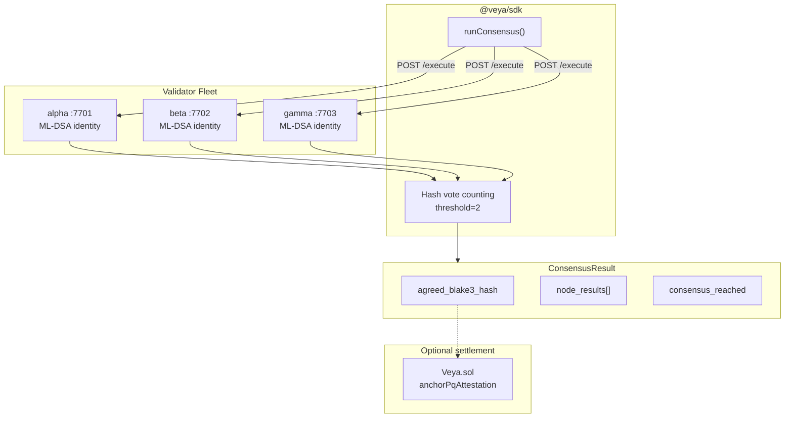
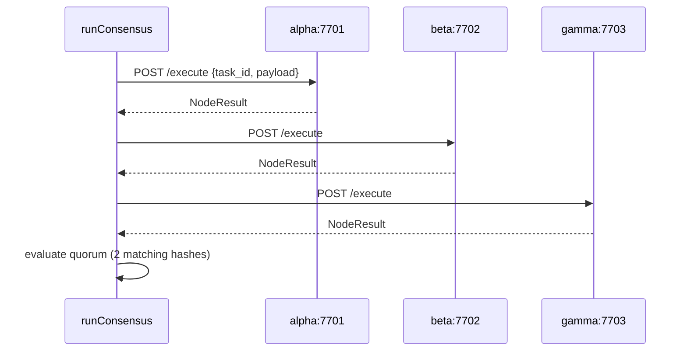

# SDK Decentralized Compute

**Multi-node BLAKE3 quorum with ML-DSA-44 attestations: `runConsensus()` in `@veya/sdk`.**

The SDK orchestrates decentralized execution consensus via `src/compute/consensus.ts`. Three independent validator nodes execute identical payloads; **2-of-3** matching BLAKE3 digests constitute agreement. Agreed hashes can later be written to `Veya.sol` through `EvmAnchor.anchorPqAttestation` or `attestExecution` on Robinhood Chain (chain id 46630).

**Related:** [operations/consensus-cluster.md](../operations/consensus-cluster.md) • [pq-crypto.md](./pq-crypto.md) • [evm-anchoring.md](./evm-anchoring.md) • [configuration.md](./configuration.md)

---

## Table of Contents

1. [Purpose and Scope](#purpose-and-scope)
2. [Audience and Assumptions](#audience-and-assumptions)
3. [Glossary](#glossary)
4. [Overview](#overview)
5. [Architecture](#architecture)
6. [runConsensus API](#runconsensus-api)
7. [NodeResult and ConsensusResult](#noderesult-and-consensusresult)
8. [Quorum Rules](#quorum-rules)
9. [Sequential Fetch Behavior](#sequential-fetch-behavior)
10. [VeyaClient Integration](#veyaclient-integration)
11. [Validator Protocol](#validator-protocol)
12. [Post-Consensus Workflow](#post-consensus-workflow)
13. [Signature Verification](#signature-verification)
14. [Spending and Policy Coupling](#spending-and-policy-coupling)
15. [Failure Modes](#failure-modes)
16. [Performance](#performance)
17. [Environment Variables](#environment-variables)
18. [Worked Example](#worked-example)
19. [Troubleshooting](#troubleshooting)
20. [See Also](#see-also)

---

## Purpose and Scope

Decentralized compute replaces a centralized execution API. Operators run their own validator fleet; the SDK collects results and evaluates quorum locally. This document specifies the TypeScript client. Process lifecycle, ports, and systemd units live in [operations/consensus-cluster.md](../operations/consensus-cluster.md).

The client does not talk to Robinhood Chain. Gas, `eth_chainId`, and `Veya.sol` appear only if the application anchors the agreed hash afterwards. Consensus can be used in CI against loopback nodes with no payer key.

---

## Audience and Assumptions

Readers should understand quorum as a vote over hashes, not as Byzantine agreement with view changes. The implementation is a simple counter: hashes that appear at least `threshold` times among successful node results win.

Assumptions:

- Default fleet is `http://127.0.0.1:7701`, `7702`, `7703` from `resolveConfig`.
- Threshold is hardcoded to `2` in `src/compute/consensus.ts`.
- Nodes are queried **sequentially** in array order.
- Failed HTTP calls currently propagate as thrown `fetch` errors rather than counting as a `fail` vote, unless the node returns HTTP 200 with `status: "fail"` in `body.result`.
- Payload JSON must be identical across nodes. Amounts in payloads should be wei decimal strings when they represent Robinhood Chain value.

---

## Glossary

| Term | Meaning |
|------|---------|
| `runConsensus` | SDK orchestrator: POST `/execute` to each node, count hashes |
| `NodeResult` | Per-node hash, ML-DSA signature, status |
| `ConsensusResult` | Aggregated vote plus `consensus_reached` |
| Threshold | `2`: minimum matching successful hashes |
| `task_id` | Caller-chosen audit correlation string |
| Agreed hash | BLAKE3 hex that met threshold, else `null` |

---

## Overview

| Property | Value |
|----------|-------|
| SDK module | `src/compute/consensus.ts` |
| Validator HTTP | `POST {base}/execute` |
| Default nodes | `http://127.0.0.1:7701–7703` |
| Default threshold | **2** (2-of-3) |
| Hash algorithm | BLAKE3-256 |
| Attestation | ML-DSA-44 detached signatures |
| Settlement | Optional `Veya.sol` on Robinhood Chain |

---

## Architecture





---

## runConsensus API

```typescript
import { runConsensus } from "@veya/sdk";

const result = await runConsensus(
  [
    "http://127.0.0.1:7701",
    "http://127.0.0.1:7702",
    "http://127.0.0.1:7703",
  ],
  "task-001",
  { action: "rebalance", bps: 50 },
);
```

| Param | Type | Description |
|-------|------|-------------|
| `nodeUrls` | `string[]` | Validator base URLs |
| `taskId` | `string` | Unique task identifier for audit logs |
| `payload` | `object` | JSON-serializable execution input |

Each request body is `{ task_id: taskId, payload }`. Headers include `Content-Type: application/json`. URLs are `trim()`'d then concatenated with `/execute`.

If `res.json()` yields a body without `result`, that node contributes nothing to `node_results`. A node that returns 200 with an unexpected shape is silently skipped, which reduces the vote count and can prevent quorum.

---

## NodeResult and ConsensusResult

```typescript
export type NodeResult = {
  node_id: string;
  blake3_execution_hash: string;
  mldsa_signature: string;
  mldsa_public_key_hex?: string;
  status: "success" | "fail";
};

export type ConsensusResult = {
  task_id: string;
  agreed_blake3_hash: string | null;
  node_results: NodeResult[];
  consensus_reached: boolean;
  threshold: number;
};
```

`mldsa_public_key_hex` is optional. When present, auditors can `verifyPQ` without an out-of-band key distribution channel. When absent, operators must have persisted node identities from process start logs.

Example:

```json
{
  "task_id": "task-001",
  "agreed_blake3_hash": "1f2f0fd6237e00d76bdf5ab61eb8edc85a265a42ec9f24f7554993daa5e9c9e3",
  "node_results": [
    {
      "node_id": "alpha",
      "blake3_execution_hash": "1f2f0fd6237e00d76bdf5ab61eb8edc85a265a42ec9f24f7554993daa5e9c9e3",
      "mldsa_signature": "a1b2c3...",
      "status": "success"
    }
  ],
  "consensus_reached": true,
  "threshold": 2
}
```

`threshold` in the result is always `2` with the current client, even if more than three URLs were supplied. Extra nodes increase the chance of collecting two matching hashes; they do not raise the threshold.

---

## Quorum Rules

Implementation:

1. Collect `body.result` from each URL in order.
2. For each result with `status === "success"`, increment a counter keyed by `blake3_execution_hash`.
3. Track the hash with the maximum count.
4. `agreed_blake3_hash` is that hash if `max >= 2`, else `null`.
5. `consensus_reached` is `max >= 2 && results.length >= 2`.

Implications:

- Two successes with the **same** hash and one fail: quorum yes.
- Two successes with **different** hashes and one fail: max is 1; quorum no.
- Three successes, 2-1 split: quorum yes on the majority hash.
- One success only: `results.length >= 2` fails even if somehow max were 2 (impossible with one success). Two identical successes are the minimum.
- `status: "fail"` does not increment hash counts.

Ties: the first hash that reaches the running max in `Map` iteration order wins. `Map` insertion order follows first-seen successful hashes. A 2-2 split on four nodes would pick the hash that appeared first among successes. Prefer an odd fleet so ties are rare.

There is no stake weighting. Node identities are equal.

---

## Sequential Fetch Behavior

The loop is `for (const base of nodeUrls) { await fetch(...) }`. There is no `Promise.all`. A slow first node delays the rest. A thrown `fetch` (DNS, connection refused, abort) rejects the **entire** `runConsensus` promise and drops already-collected results.

Operators who want fail-soft behavior should wrap each node in application code or run a proxy that returns HTTP 200 with `status: "fail"`. Changing the SDK loop to swallow errors would hide outages; the current throw makes missing fleets obvious in development.

Trailing slashes on base URLs produce `http://host:7701//execute` after concatenation. `resolveConfig` defaults do not include trailing slashes. Trim is applied to the base, not to a duplicated slash. Keep origins clean.

---

