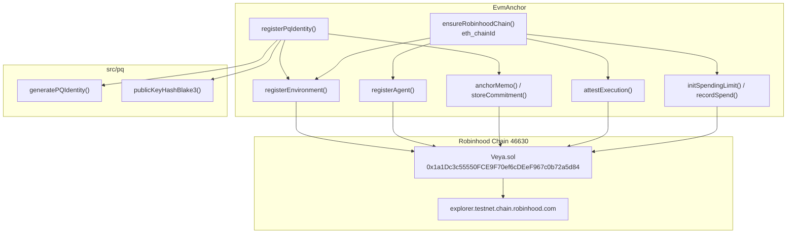
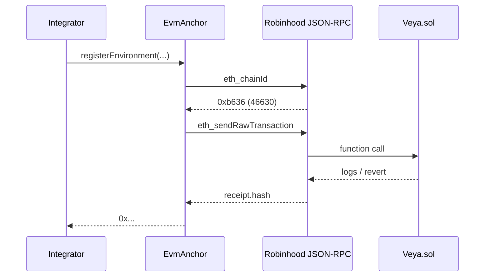

# SDK EVM Anchoring

**Direct Robinhood Chain transactions to `Veya.sol`: no hosted VEYA relay.**

The `EvmAnchor` class (`src/client/evm.ts`) submits real EVM transactions: environment registration, BLAKE3 commitments, PQ attestations, spending, tool policy, memory nullifiers, and sealed-state chunks. PQ verification remains **off-chain**; the contract stores BLAKE3 hashes and ML-DSA signature bytes. Function names are camelCase and match `INSTRUCTION_NAMES`. The ABI is inlined in `src/abi`; the package does not depend on `@veya/program`.

**Related:** [configuration.md](./configuration.md) • [pq-crypto.md](./pq-crypto.md) • [sealed-execution.md](./sealed-execution.md) • [memory.md](./memory.md)

---

## Table of Contents

1. [Purpose and Scope](#purpose-and-scope)
2. [Audience and Assumptions](#audience-and-assumptions)
3. [Glossary](#glossary)
4. [Overview](#overview)
5. [Construction](#construction)
6. [ensureRobinhoodChain](#ensurerobinhoodchain)
7. [Transaction Send Path](#transaction-send-path)
8. [registerEnvironment](#registerenvironment)
9. [registerAgent](#registeragent)
10. [storeCommitment and anchorMemo](#storecommitment-and-anchormemo)
11. [anchorPqAttestation](#anchorpqattestation)
12. [attestExecution](#attestexecution)
13. [Spending in Wei](#spending-in-wei)
14. [defineToolPolicy](#definetoolpolicy)
15. [flagMemoryNullifier](#flagmemorynullifier)
16. [storeSealedState](#storesealedstate)
17. [registerPqIdentity](#registerpqidentity)
18. [Instruction Catalog](#instruction-catalog)
19. [Storage Layout vs PDAs](#storage-layout-vs-pdas)
20. [Reads](#reads)
21. [Error Handling](#error-handling)
22. [Failure Modes and Recovery](#failure-modes-and-recovery)
23. [Security and Trust Boundaries](#security-and-trust-boundaries)
24. [Worked Example](#worked-example)
25. [Troubleshooting](#troubleshooting)
26. [See Also](#see-also)

---

## Purpose and Scope

This document is the operator and integrator reference for on-chain settlement through `@veya/sdk`. It covers every write method on `EvmAnchor`, the chain-id gate, wei-denominated spending, and the mapping from TypeScript calls to `Veya.sol` storage. It does not describe validator HTTP or sealed-node HTTP; those are off-chain and only become chain-visible when the operator later calls `attestExecution`, `anchorPqAttestation`, or `storeSealedState`.

The contract address on Robinhood Chain testnet is `0x1a1Dc3c55550FCE9F70ef6cDEeF967c0b72a5d84`. Explorers live at `https://explorer.testnet.chain.robinhood.com`. Chain id is `46630`. All of those values are defaults in `src/chain.ts` and are re-checked at write time.

---

## Audience and Assumptions

Readers should know how ethers v6 `Contract` objects encode function calls, how `tx.wait()` confirms a mined transaction, and how Solidity custom errors surface as revert data. They should also know that a 16-byte UUID is `bytes16` on chain and a 32-byte BLAKE3 digest is `bytes32`.

Assumptions that must not be mixed with other stacks:

- There is no program ID, no PDA derivation, and no SPL Memo program.
- `msg.sender` is an EVM address derived from `payerPrivateKey`.
- Amounts passed to `initSpendingLimit` and `recordSpend` are wei (`uint256`).
- `INSTRUCTION_NAMES` is camelCase. Snake_case instruction names will not match the ABI.
- `EvmAnchor.ensureRobinhoodChain` calls `eth_chainId` through `provider.getNetwork()` and refuses to write when the id differs from the configured `chainId`.

---

## Glossary

| Term | Meaning |
|------|---------|
| `EvmAnchor` | SDK class that owns provider, wallet, and `ethers.Contract`. |
| `ensureRobinhoodChain` | One-shot `eth_chainId` equality check cached on the instance. |
| `bytes16` | Environment, agent, memory, and state identifiers. |
| `bytes32` | BLAKE3 hashes and commitment digests. |
| wei | Native spend unit. `1 ETH = 10^18 wei`. |
| `INSTRUCTION_NAMES` | Frozen camelCase list of `Veya.sol` writes. |
| `VEYA_ABI` | Inlined artifact ABI from `src/abi/Veya.json`. |
| Mapping key | Solidity `mapping` slot key (often `keccak256` packed fields), not a PDA. |

---

## Overview



| Design rule | Detail |
|-------------|--------|
| PQ-first | ML-DSA pubkey is hashed with BLAKE3; the hash is stored on chain |
| No SHA-256 | BLAKE3 only for commitments |
| Verify off-chain | Contract stores sig bytes, does not run ML-DSA in the EVM |
| Standalone client | Direct JSON-RPC to Robinhood Chain |
| Chain pin | `eth_chainId` must equal configured `chainId` (46630 on testnet) |

`Veya.sol` is a protocol store. It is not a token, not a DEX, and not a brokerage wrapper. Wallet UIs that treat the address as an ERC-20 will display nonsense. Use the explorer address URL helper when sharing the contract with operators.

---

## Construction

```typescript
import { EvmAnchor } from "@veya/sdk";

const anchor = new EvmAnchor({
  payerPrivateKey: process.env.VEYA_DEPLOYER_PRIVATE_KEY!,
  rpcUrl: process.env.ROBINHOOD_RPC_URL,
  contractAddress: process.env.VEYA_CONTRACT_ADDRESS,
  chainId: 46630,
  explorerUrl: "https://explorer.testnet.chain.robinhood.com",
});
```

`VeyaClient` instantiates `EvmAnchor` automatically when `payerPrivateKey` is provided:

```typescript
import { VeyaClient } from "@veya/sdk";

const client = new VeyaClient({
  payerPrivateKey: process.env.VEYA_DEPLOYER_PRIVATE_KEY,
});

if (!client.evm) throw new Error("EvmAnchor not initialized");
```

### EvmAnchor fields

| Field | Type | Description |
|-------|------|-------------|
| `provider` | `ethers.JsonRpcProvider` | JSON-RPC client, **not** `staticNetwork` |
| `wallet` | `ethers.Wallet` | secp256k1 signer bound to the provider |
| `contract` | `ethers.Contract` | `Veya.sol` with inlined `VEYA_ABI` |
| `chainId` | `number` | Expected chain id (default 46630) |
| `explorerUrl` | `string` | Origin for `explorerFor(txHash)` |
| `contractAddress` | `string` | Deployed `Veya.sol` |

The constructor calls `resolveConfig` for RPC, address, chain id, and explorer, then builds the wallet from the **constructor** `payerPrivateKey` (required by the type `VeyaClientConfig & { payerPrivateKey: string }`). It does not send a transaction and does not call `eth_chainId` until the first write.

---

## ensureRobinhoodChain

This method is the write-time network gate.

```typescript
async ensureRobinhoodChain(): Promise<void> {
  if (this.networkChecked) return;
  const network = await this.provider.getNetwork();
  if (network.chainId !== BigInt(this.chainId)) {
    throw new Error(
      `VEYA SDK expected chain id ${this.chainId} (Robinhood Chain), RPC returned ${network.chainId}`,
    );
  }
  this.networkChecked = true;
}
```

`provider.getNetwork()` issues `eth_chainId`. The comparison is bigint-to-bigint so a JSON-RPC that returns the id as hex still matches. A provider configured with `staticNetwork` would skip the RPC query; `EvmAnchor` deliberately does not pass that option.

The flag `networkChecked` is instance-private. After a successful check, later writes skip the round trip. Recreate the anchor when rotating RPC URLs. Do not fork the provider onto another chain and keep using the same instance.

If the configured `chainId` is `NaN` because `ROBINHOOD_CHAIN_ID` was a non-numeric string, `BigInt(this.chainId)` throws before the comparison. That is fail-closed.

---

## Transaction Send Path

Every write funnels through a private `send` helper:

```typescript
private async send(txPromise: Promise<ethers.ContractTransactionResponse>): Promise<string> {
  await this.ensureRobinhoodChain();
  const tx = await txPromise;
  const receipt = await tx.wait();
  if (!receipt?.hash) throw new Error("transaction mined without a hash");
  return receipt.hash;
}
```

Callers receive a transaction hash string, not a receipt object. Use `explorerFor(hash)` to build `https://explorer.testnet.chain.robinhood.com/tx/0x...`.



`tx.wait()` uses ethers default confirmation (one block). Operators who need a deeper confirmation policy should wait additional blocks using `provider.waitForTransaction` after the hash returns. The SDK does not expose a commitment-level knob analogous to Solana `confirmed` vs `finalized`; EVM finality is a function of the Robinhood Chain consensus rules.

If the contract reverts, ethers throws and `send` does not return a hash. Map revert data with `fromAnchorRevert` in `src/errors/veya-error.ts` when typed error codes are required.

---

## registerEnvironment

Creates an `Environment` record keyed by `bytes16 environmentUuid` with a PQ public-key hash.

```typescript
const uuid = crypto.getRandomValues(new Uint8Array(16));
const pqHashHex = "e222a4812bace5608fd743318c2cb0f05cd8de4196f8cf09ffa195734c99d2a0";
const pqHash = Uint8Array.from(Buffer.from(pqHashHex, "hex"));

const tx = await anchor.registerEnvironment(uuid, pqHash, 1);
// envType: 0=Execution, 1=SecureEnclave, 2=Governance
```

`ethers.hexlify` wraps the UUID and hash before the ABI encode. The Solidity signature is:

```solidity
function registerEnvironment(bytes16 environmentUuid, bytes32 pqPubkeyHash, uint8 envType) external;
```

| Solidity field | Type | Meaning |
|----------------|------|---------|
| `owner` | `address` | `msg.sender` (payer) |
| `uuid` | `bytes16` | Stable environment id |
| `pqPubkeyHash` | `bytes32` | BLAKE3 of ML-DSA-44 public key |
| `envType` | `EnvironmentType` | 0 / 1 / 2 |
| `createdAt` | `uint64` | `block.timestamp` |
| `revision` | `uint32` | Starts at 1 |
| `exists` | `bool` | Presence flag |

Reverts: `InvalidEnvironmentType` if `envType > 2`, `EnvironmentAlreadyExists` if the UUID is taken. There is no PDA seed. The mapping key is the UUID itself: `environments[environmentUuid]`.

Event: `EnvironmentRegistered(uuid, owner, pqPubkeyHash, envType)`.

---

## registerAgent

Registers an agent under an existing environment. Only the environment owner may call it (`onlyEnvironmentOwner`).

```typescript
const agentUuid = crypto.getRandomValues(new Uint8Array(16));
const tx = await anchor.registerAgent(envUuid, agentUuid, 0, agentPqHash);
// agentRole: 0, 1, or 2
```

| Solidity field | Type | Meaning |
|----------------|------|---------|
| `environmentUuid` | `bytes16` | Parent environment |
| `agentUuid` | `bytes16` | Agent id (mapping key) |
| `role` | `uint8` | Must be `<= 2` |
| `pqHash` | `bytes32` | BLAKE3 of agent ML-DSA public key |
| `isActive` | `bool` | Starts true |
| `createdAt` | `uint64` | `block.timestamp` |

Reverts: `EnvironmentDoesNotExist`, `Unauthorized` (caller is not owner), `InvalidAgentRole`, `AgentAlreadyExists`.

Event: `AgentRegistered(agentUuid, environmentUuid, role, pqHash)`.

Agent UUIDs are globally keyed in `mapping(bytes16 => Agent) public agents`. Do not reuse an agent UUID across environments.

---

## storeCommitment and anchorMemo

`storeCommitment` writes a 32-byte digest into `commitments[commitment]`. The mapping key is the commitment itself, so the same digest cannot be stored twice (`CommitmentAlreadyExists`).

```typescript
const tx = await anchor.storeCommitment(environmentUuid, commitmentBytes);
```

`anchorMemo` is a convenience that hex-decodes a BLAKE3 string and calls `storeCommitment`. It replaces the role that SPL Memo played on other stacks: a human-auditable 32-byte fingerprint on chain, without a separate memo program.

```typescript
const blake3Hex = "1f2f0fd6237e00d76bdf5ab61eb8edc85a265a42ec9f24f7554993daa5e9c9e3";
const tx = await anchor.anchorMemo(environmentUuid, blake3Hex);
```

The environment must already exist. The authority recorded on the `Commitment` struct is `msg.sender`. Timestamp is `block.timestamp`.

Event: `CommitmentStored(authority, environmentUuid, commitment)`.

Because the mapping is keyed by the digest, two environments cannot share a commitment value. That is a protocol invariant: BLAKE3 collisions are treated as already-anchored facts, not as namespaced per environment.

---

## anchorPqAttestation

Stores a pair `(identityHash, executionHash)` under `pqAttestations[executionHash]`.

```typescript
const tx = await anchor.anchorPqAttestation(
  environmentUuid,
  identityHashBytes,   // typically BLAKE3(ML-DSA pubkey)
  executionHashBytes,  // typically agreed BLAKE3 from runConsensus
);
```

The environment must exist. The same `executionHash` cannot be attested twice (`PqAttestationAlreadyExists`). This is the settlement step after a 2-of-3 validator quorum: the agreed hash becomes an on-chain fact bound to an identity hash.

Event: `PqAttestationAnchored(authority, environmentUuid, identityHash, executionHash)`.

Off-chain verifiers should still run `verifyPQ` on the node signatures. The contract does not check ML-DSA; it only records that the payer asserted these two 32-byte values.

---

## attestExecution

Stores an execution attestation keyed by `keccak256(abi.encodePacked(msg.sender, blake3Hash))`.

```typescript
const tx = await anchor.attestExecution(environmentUuid, blake3Hash, mldsaSigBytes);
```

`mldsaSig` is `bytes` with a maximum length of `MAX_MLDSA_SIG_LEN` (4627). The contract does not verify the signature. Empty signatures are allowed by length but are operationally useless for auditors.

Reverts: `EnvironmentDoesNotExist`, `SignatureTooLarge`, `AttestationAlreadyExists` for the same `(authority, blake3Hash)` pair.

Event: `ExecutionAttested(authority, environmentUuid, blake3Hash)`.

Use this after sealed execution or consensus when the operator wants the ML-DSA bytes themselves on chain. Use `anchorPqAttestation` when only the identity and execution hashes are required.

---

## Spending in Wei

Spending is **wei**, not lamports. `Veya.sol` comments and struct fields use `uint256 maxAmount` / `spentAmount`. The SDK policy field is `PolicyAgentConfig.maxWeiPerAction`.

```typescript
const maxWei = 10n ** 16n; // 0.01 ETH
const periodSecs = 86_400;
await anchor.initSpendingLimit(agentUuid, maxWei, periodSecs);

await anchor.recordSpend(agentUuid, 10n ** 15n); // 0.001 ETH
```

`initSpendingLimit` requires `onlyAgentEnvironmentOwner`: the caller must own the environment that contains the agent. It reverts `SpendingLimitAlreadyExists` if the agent already has a cap.

`recordSpend` rolls the window when `block.timestamp >= periodStart + periodSecs`, then adds `amount` and reverts `SpendingLimitExceeded` if `spentAmount + amount > maxAmount`. There is no on-chain transfer of ETH inside these functions. They are accounting hooks. Actual value movement is an application concern; VEYA records the cap.

Local SDK `src/spending/limits.ts` mirrors the same wei arithmetic in-process so `PolicyAgent` can deny a tool call before gas is spent. Keep the local cap and the on-chain cap aligned. Mixing wei on chain with some other unit in the policy agent will produce inconsistent denials.

Event: `SpendingLimitInitialized`, `SpendRecorded`.

---

## defineToolPolicy

Defines which MCP tool names an agent may invoke. Tool names are limited to `MAX_TOOL_NAME_LEN` (64 bytes). The mapping key is `keccak256(abi.encodePacked(agentUuid, toolName))`.

```typescript
await anchor.defineToolPolicy(environmentUuid, agentUuid, "transfer_funds", true);
await anchor.defineToolPolicy(environmentUuid, agentUuid, "external_api", false);
```

Only the environment owner may call this. The agent must exist and belong to that environment. Reverts: `EnvironmentDoesNotExist` (via modifier), `Unauthorized`, `AgentDoesNotExist`, `ToolNameTooLong`.

The on-chain `allowed` bit is the dispute record. The in-process `setToolPolicy` map in `src/coordination/router.ts` is a fast pre-check and is not durable. Bootstrap it from `toolPolicies` at process start when operators need alignment.

Event: `ToolPolicyUpdated(agentUuid, environmentUuid, toolName, allowed)`.

---

## flagMemoryNullifier

Marks a memory id as spent-once.

```typescript
await anchor.flagMemoryNullifier(environmentUuid, memoryIdBytes16);
```

The environment must exist. A second flag for the same `memoryId` reverts `MemoryAlreadyNullified`. The mapping is keyed by `memoryId` alone (`mapping(bytes16 => Nullifier) public nullifiers`), so memory ids must be unique across environments in practice.

Pair with local `invalidateMemory` in `src/memory/nullifier.ts`. Local-only invalidation does not prevent another operator from reading a copy of the payload; the chain flag is the cross-operator replay break.

Event: `MemoryNullified(memoryId, environmentUuid)`.

---

## storeSealedState

Stores a ciphertext chunk for data availability. Maximum chunk size is `MAX_SEALED_CHUNK` (8192 bytes).

```typescript
await anchor.storeSealedState(
  environmentUuid,
  stateId,
  0, // chunkIndex
  blake3CiphertextHash,
  ciphertextChunk,
);
```

Mapping key: `keccak256(abi.encodePacked(environmentUuid, stateId, chunkIndex))`. Re-storing the same key overwrites the chunk and may bump `totalChunks` if `chunkIndex + 1` is larger than the stored total.

The contract does not decrypt. It stores `blake3CiphertextHash` plus the raw chunk bytes. Auditors recompute BLAKE3 over the concatenated chunks and compare.

Event: `SealedStateStored(stateId, environmentUuid, chunkIndex, totalChunks, blake3Hash)`.

---

## registerPqIdentity

High-level helper used by `VeyaClient.registerPqOnchain()`. It generates an ML-DSA-44 identity, hashes the public key with BLAKE3, registers an environment, and anchors the hash as a commitment.

```typescript
const result = await anchor.registerPqIdentity(1);
// {
//   publicKey, publicKeyHash,
//   environmentTx, memoTx,
//   explorer: { environment, memo }
// }
```

Flow:

1. `pq.generatePQIdentity()`
2. `pq.publicKeyHashBlake3(publicKey)`
3. Random 16-byte UUID
4. `registerEnvironment(uuid, hashBytes, envType)`
5. `anchorMemo(uuid, hashHex)` via `storeCommitment`

The private key is returned to the caller in memory from step 1 and is **not** written on chain. Persist it with the same care as `payerPrivateKey`. The helper does not register an agent; call `registerAgent` separately when the environment needs an actor.

Default `envType` is `1` (`SecureEnclave`).

---

## Instruction Catalog

**File:** `src/program/instructions.ts`

```typescript
export const INSTRUCTION_NAMES = [
  "registerEnvironment",
  "registerAgent",
  "attestExecution",
  "anchorPqAttestation",
  "storeCommitment",
  "initSpendingLimit",
  "recordSpend",
  "defineToolPolicy",
  "flagMemoryNullifier",
  "storeSealedState",
] as const;
```

These names are camelCase and match `Veya.sol` function names and `VEYA_ABI` entries. Tests in `src/chain.test.ts` assert that every catalog name exists on the ABI and that `register_environment` does not. When adding a Solidity write, update this array, the ABI JSON, and `EvmAnchor` in the same change.

Read methods such as `getEnvironment` are not in the catalog because they do not send transactions. `anchorMemo` and `registerPqIdentity` are SDK facades over catalog writes.

---

## Storage Layout vs PDAs

`Veya.sol` uses mappings, not program-derived addresses.

| Record | Key |
|--------|-----|
| `Environment` | `bytes16` uuid |
| `Agent` | `bytes16` agentUuid |
| `Attestation` | `keccak256(abi.encodePacked(authority, blake3Hash))` |
| `PqAttestation` | `bytes32` executionHash |
| `Commitment` | `bytes32` commitment |
| `SpendingLimit` | `bytes16` agentUuid |
| `ToolPolicy` | `keccak256(abi.encodePacked(agentUuid, toolName))` |
| `Nullifier` | `bytes16` memoryId |
| `SealedState` | `keccak256(abi.encodePacked(environmentUuid, stateId, chunkIndex))` |

Do not attempt to derive Solana-style seeds. When an explorer or indexer needs to find a tool policy, hash the packed agent UUID and tool name with keccak256, not BLAKE3. BLAKE3 is the commitment hash for payloads; keccak256 is only the EVM mapping key.

---

## Reads

```typescript
const env = await anchor.getEnvironment(environmentUuid);
```

This calls the public mapping getter `environments(bytes16)`. It does not go through `send` and therefore does **not** call `ensureRobinhoodChain`. A read against the wrong chain will return empty structs (`exists == false`) rather than throw. Operators who need a read-time pin should call `ensureRobinhoodChain()` explicitly before batch reads.

Other mappings (`agents`, `commitments`, `spendingLimits`, and so on) are public on the contract. Integrators may bind additional getters with the same `VEYA_ABI` without extending `EvmAnchor`. Prefer that over adding ad-hoc RPC `eth_call` payloads.

---

## Error Handling

`src/errors/veya-error.ts` maps Solidity custom-error selectors to `VeyaErrorCode`:

| Selector | Code |
|----------|------|
| `0x145718a7` | `COMMITMENT_EXISTS` |
| `0xb6d54abb` | `ENVIRONMENT_EXISTS` |
| `0xb90193fa` | `ENVIRONMENT_MISSING` |
| `0x631ecd51` | `ATTESTATION_EXISTS` |
| `0x2d37333f` | `PQ_ATTESTATION_EXISTS` |
| `0x8a9e71ea` | `SPENDING_EXCEEDED` |

Unknown selectors become `ANCHOR_REVERT` with raw data attached. Call `fromAnchorRevert(err)` in application catch blocks. Branch on `code`, not on `message` substrings.

`CHAIN_MISMATCH` is reserved for typed wrapping of the `ensureRobinhoodChain` throw. Today the method throws a plain `Error`; operators may wrap it at the application boundary.

---

## Failure Modes and Recovery

| Failure | Cause | Recovery |
|---------|-------|----------|
| Chain id mismatch | RPC is not Robinhood Chain 46630 (or configured id) | Fix RPC; reconstruct `EvmAnchor` |
| `transaction mined without a hash` | Receipt missing hash | Inspect RPC; resubmit only if the nonce did not consume |
| `EnvironmentAlreadyExists` | UUID collision | Generate a new 16-byte UUID |
| `CommitmentAlreadyExists` | Same 32-byte digest already stored | Treat as already anchored; do not retry |
| `SpendingLimitExceeded` | `amount` in wrong units or cap too low | Confirm wei; widen cap via a new agent or a future upgrade |
| `SignatureTooLarge` | ML-DSA bytes exceeded 4627 | Confirm ML-DSA-44 encoding; do not pass concatenated sigs |
| `SealedChunkTooLarge` | Chunk > 8192 | Split ciphertext; increment `chunkIndex` |
| `Unauthorized` | Payer is not environment owner | Use the registering key |
| ABI / selector mismatch | `Veya.json` out of date | Regen ABI from the deployed compiler artifact |
| Insufficient ETH | Payer cannot pay gas | Fund the payer in wei on Robinhood Chain |
| Wrong contract address | Config points at empty or unrelated code | Pin `0x1a1Dc3c55550FCE9F70ef6cDEeF967c0b72a5d84` on testnet |

Retries after a successful mine must not reuse the same unique keys (UUID, commitment digest, execution hash). Idempotent application wrappers should first read the mapping and skip the write when `exists` is already true.

---

## Security and Trust Boundaries

The payer key is `msg.sender` for every write. Compromise of `VEYA_DEPLOYER_PRIVATE_KEY` allows registering environments, flagging nullifiers, and attesting hashes that auditors will treat as authoritative for that address. Rotate by abandoning the address; there is no on-chain key-rotation instruction.

The RPC can lie about receipts. After a write, confirm the hash on `https://explorer.testnet.chain.robinhood.com/tx/<hash>` or via a second provider. `ensureRobinhoodChain` prevents accidental cross-chain writes; it does not prevent a malicious RPC on the correct chain id.

ML-DSA bytes on chain are claims. Anyone can submit arbitrary bytes within the length cap. Trust comes from off-chain `verifyPQ` against a known public key whose BLAKE3 hash was registered in the environment record.

Spending functions do not move ETH. An application that treats `recordSpend` as a transfer will leak value. Keep value transfer in a separate, audited path and use VEYA accounting as a policy log.

---

## Worked Example

End-to-end identity plus commitment on Robinhood Chain testnet:

```typescript
import { VeyaClient, ROBINHOOD_TESTNET } from "@veya/sdk";

const client = new VeyaClient({
  payerPrivateKey: process.env.VEYA_DEPLOYER_PRIVATE_KEY,
  rpcUrl: ROBINHOOD_TESTNET.rpcUrl,
  chainId: ROBINHOOD_TESTNET.chainId,
  contractAddress: ROBINHOOD_TESTNET.contractAddress,
  explorerUrl: ROBINHOOD_TESTNET.explorerUrl,
});

const { publicKeyHash, environmentTx, memoTx, explorer } =
  await client.registerPqOnchain(1);

console.log("environment", explorer.environment);
console.log("commitment", explorer.memo);
console.log("pq hash", publicKeyHash);
```

After this returns, both hashes are visible on the explorer. Fund the payer with testnet ETH first. Gas is paid in wei. If `ensureRobinhoodChain` throws, the RPC is not chain `46630` and no transaction was sent.

A follow-up spend cap for a registered agent:

```typescript
import { ethers } from "ethers";

const agentUuid = crypto.getRandomValues(new Uint8Array(16));
await client.evm!.registerAgent(envUuid, agentUuid, 0, agentPqHash);
await client.evm!.initSpendingLimit(
  agentUuid,
  ethers.parseEther("0.05"),
  86_400,
);
```

`parseEther` yields wei. Passing `50_000_000` as if it were lamports would set a cap of 5e7 wei, which is a tiny fraction of one ETH.

---

## Troubleshooting

| Symptom | Likely cause | Fix |
|---------|--------------|-----|
| Expected chain id 46630 | RPC on another EVM | Use `https://rpc.testnet.chain.robinhood.com` |
| `payerPrivateKey required` | Constructed `VeyaClient` without a key | Set `VEYA_DEPLOYER_PRIVATE_KEY` |
| Invalid private key | Solana JSON array supplied | Use hex secp256k1 |
| Environment explorer 404 | Hash missing `0x` and helper bypassed | Use `explorerFor` / `explorerTxUrl` |
| Revert `SpendingLimitExceeded` | Units not wei | `ethers.parseEther` / `maxWeiPerAction` |
| Revert `CommitmentAlreadyExists` | Duplicate digest | Skip; already anchored |
| ABI test fails snake_case | Catalog drifted | Restore camelCase `INSTRUCTION_NAMES` |
| Empty `getEnvironment` | Wrong chain or UUID | Call `ensureRobinhoodChain`; confirm UUID bytes |

---

## See Also

- [configuration.md](./configuration.md): `resolveConfig`, env vars, chain defaults
- [pq-crypto.md](./pq-crypto.md): ML-DSA-44 and BLAKE3 used before writes
- [decentralized-compute.md](./decentralized-compute.md): hashes that feed `anchorPqAttestation`
- [sealed-execution.md](./sealed-execution.md): chunks that feed `storeSealedState`
- [coordination.md](./coordination.md): `defineToolPolicy` alignment
- [memory.md](./memory.md): `flagMemoryNullifier` pairing
