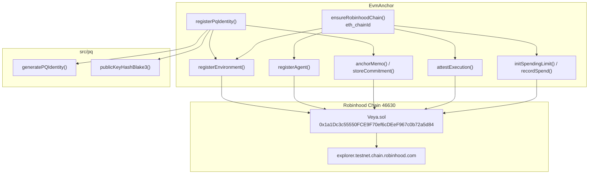
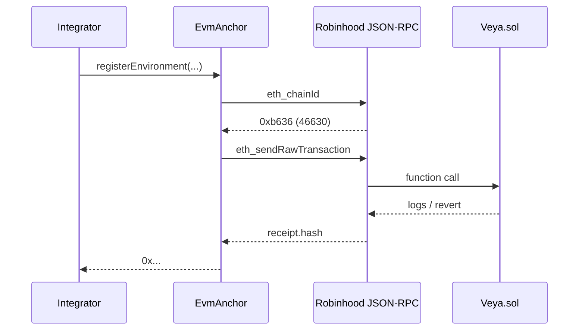

# SDK EVM Anchoring

**Direct Robinhood Chain transactions to `Veya.sol`: no hosted VEYA relay.**

The `EvmAnchor` class (`src/client/evm.ts`) submits real EVM transactions: environment registration, BLAKE3 commitments, PQ attestations, spending, tool policy, memory nullifiers, and sealed-state chunks. PQ verification remains **off-chain**; the contract stores BLAKE3 hashes and ML-DSA signature bytes. Function names are camelCase and match `INSTRUCTION_NAMES`. The ABI is inlined in `src/abi`; the package does not depend on `@veya/program`.

**Related:** [configuration.md](./configuration.md) • [pq-crypto.md](./pq-crypto.md) • [sealed-execution.md](./sealed-execution.md) • [memory.md](./memory.md)

---

## Table of Contents

1. [Purpose and Scope](#purpose-and-scope)
2. [Audience and Assumptions](#audience-and-assumptions)
3. [Glossary](#glossary)
4. [Overview](#overview)
5. [Construction](#construction)
6. [ensureRobinhoodChain](#ensurerobinhoodchain)
7. [Transaction Send Path](#transaction-send-path)
8. [registerEnvironment](#registerenvironment)
9. [registerAgent](#registeragent)
10. [storeCommitment and anchorMemo](#storecommitment-and-anchormemo)
11. [anchorPqAttestation](#anchorpqattestation)
12. [attestExecution](#attestexecution)
13. [Spending in Wei](#spending-in-wei)
14. [defineToolPolicy](#definetoolpolicy)
15. [flagMemoryNullifier](#flagmemorynullifier)
16. [storeSealedState](#storesealedstate)
17. [registerPqIdentity](#registerpqidentity)
18. [Instruction Catalog](#instruction-catalog)
19. [Storage Layout vs PDAs](#storage-layout-vs-pdas)
20. [Reads](#reads)
21. [Error Handling](#error-handling)
22. [Failure Modes and Recovery](#failure-modes-and-recovery)
23. [Security and Trust Boundaries](#security-and-trust-boundaries)
24. [Worked Example](#worked-example)
25. [Troubleshooting](#troubleshooting)
26. [See Also](#see-also)

---

## Purpose and Scope

This document is the operator and integrator reference for on-chain settlement through `@veya/sdk`. It covers every write method on `EvmAnchor`, the chain-id gate, wei-denominated spending, and the mapping from TypeScript calls to `Veya.sol` storage. It does not describe validator HTTP or sealed-node HTTP; those are off-chain and only become chain-visible when the operator later calls `attestExecution`, `anchorPqAttestation`, or `storeSealedState`.

The contract address on Robinhood Chain testnet is `0x1a1Dc3c55550FCE9F70ef6cDEeF967c0b72a5d84`. Explorers live at `https://explorer.testnet.chain.robinhood.com`. Chain id is `46630`. All of those values are defaults in `src/chain.ts` and are re-checked at write time.

---

## Audience and Assumptions

Readers should know how ethers v6 `Contract` objects encode function calls, how `tx.wait()` confirms a mined transaction, and how Solidity custom errors surface as revert data. They should also know that a 16-byte UUID is `bytes16` on chain and a 32-byte BLAKE3 digest is `bytes32`.

Assumptions that must not be mixed with other stacks:

- There is no program ID, no PDA derivation, and no SPL Memo program.
- `msg.sender` is an EVM address derived from `payerPrivateKey`.
- Amounts passed to `initSpendingLimit` and `recordSpend` are wei (`uint256`).
- `INSTRUCTION_NAMES` is camelCase. Snake_case instruction names will not match the ABI.
- `EvmAnchor.ensureRobinhoodChain` calls `eth_chainId` through `provider.getNetwork()` and refuses to write when the id differs from the configured `chainId`.

---

## Glossary

| Term | Meaning |
|------|---------|
| `EvmAnchor` | SDK class that owns provider, wallet, and `ethers.Contract`. |
| `ensureRobinhoodChain` | One-shot `eth_chainId` equality check cached on the instance. |
| `bytes16` | Environment, agent, memory, and state identifiers. |
| `bytes32` | BLAKE3 hashes and commitment digests. |
| wei | Native spend unit. `1 ETH = 10^18 wei`. |
| `INSTRUCTION_NAMES` | Frozen camelCase list of `Veya.sol` writes. |
| `VEYA_ABI` | Inlined artifact ABI from `src/abi/Veya.json`. |
| Mapping key | Solidity `mapping` slot key (often `keccak256` packed fields), not a PDA. |

---

## Overview



| Design rule | Detail |
|-------------|--------|
| PQ-first | ML-DSA pubkey is hashed with BLAKE3; the hash is stored on chain |
| No SHA-256 | BLAKE3 only for commitments |
| Verify off-chain | Contract stores sig bytes, does not run ML-DSA in the EVM |
| Standalone client | Direct JSON-RPC to Robinhood Chain |
| Chain pin | `eth_chainId` must equal configured `chainId` (46630 on testnet) |

`Veya.sol` is a protocol store. It is not a token, not a DEX, and not a brokerage wrapper. Wallet UIs that treat the address as an ERC-20 will display nonsense. Use the explorer address URL helper when sharing the contract with operators.

---

## Construction

```typescript
import { EvmAnchor } from "@veya/sdk";

const anchor = new EvmAnchor({
  payerPrivateKey: process.env.VEYA_DEPLOYER_PRIVATE_KEY!,
  rpcUrl: process.env.ROBINHOOD_RPC_URL,
  contractAddress: process.env.VEYA_CONTRACT_ADDRESS,
  chainId: 46630,
  explorerUrl: "https://explorer.testnet.chain.robinhood.com",
});
```

`VeyaClient` instantiates `EvmAnchor` automatically when `payerPrivateKey` is provided:

```typescript
import { VeyaClient } from "@veya/sdk";

const client = new VeyaClient({
  payerPrivateKey: process.env.VEYA_DEPLOYER_PRIVATE_KEY,
});

if (!client.evm) throw new Error("EvmAnchor not initialized");
```

### EvmAnchor fields

| Field | Type | Description |
|-------|------|-------------|
| `provider` | `ethers.JsonRpcProvider` | JSON-RPC client, **not** `staticNetwork` |
| `wallet` | `ethers.Wallet` | secp256k1 signer bound to the provider |
| `contract` | `ethers.Contract` | `Veya.sol` with inlined `VEYA_ABI` |
| `chainId` | `number` | Expected chain id (default 46630) |
| `explorerUrl` | `string` | Origin for `explorerFor(txHash)` |
| `contractAddress` | `string` | Deployed `Veya.sol` |

The constructor calls `resolveConfig` for RPC, address, chain id, and explorer, then builds the wallet from the **constructor** `payerPrivateKey` (required by the type `VeyaClientConfig & { payerPrivateKey: string }`). It does not send a transaction and does not call `eth_chainId` until the first write.

---

## ensureRobinhoodChain

This method is the write-time network gate.

```typescript
async ensureRobinhoodChain(): Promise<void> {
  if (this.networkChecked) return;
  const network = await this.provider.getNetwork();
  if (network.chainId !== BigInt(this.chainId)) {
    throw new Error(
      `VEYA SDK expected chain id ${this.chainId} (Robinhood Chain), RPC returned ${network.chainId}`,
    );
  }
  this.networkChecked = true;
}
```

`provider.getNetwork()` issues `eth_chainId`. The comparison is bigint-to-bigint so a JSON-RPC that returns the id as hex still matches. A provider configured with `staticNetwork` would skip the RPC query; `EvmAnchor` deliberately does not pass that option.

The flag `networkChecked` is instance-private. After a successful check, later writes skip the round trip. Recreate the anchor when rotating RPC URLs. Do not fork the provider onto another chain and keep using the same instance.

If the configured `chainId` is `NaN` because `ROBINHOOD_CHAIN_ID` was a non-numeric string, `BigInt(this.chainId)` throws before the comparison. That is fail-closed.

---

## Transaction Send Path

Every write funnels through a private `send` helper:

```typescript
private async send(txPromise: Promise<ethers.ContractTransactionResponse>): Promise<string> {
  await this.ensureRobinhoodChain();
  const tx = await txPromise;
  const receipt = await tx.wait();
  if (!receipt?.hash) throw new Error("transaction mined without a hash");
  return receipt.hash;
}
```

Callers receive a transaction hash string, not a receipt object. Use `explorerFor(hash)` to build `https://explorer.testnet.chain.robinhood.com/tx/0x...`.



`tx.wait()` uses ethers default confirmation (one block). Operators who need a deeper confirmation policy should wait additional blocks using `provider.waitForTransaction` after the hash returns. The SDK does not expose a commitment-level knob analogous to Solana `confirmed` vs `finalized`; EVM finality is a function of the Robinhood Chain consensus rules.

If the contract reverts, ethers throws and `send` does not return a hash. Map revert data with `fromAnchorRevert` in `src/errors/veya-error.ts` when typed error codes are required.

---

