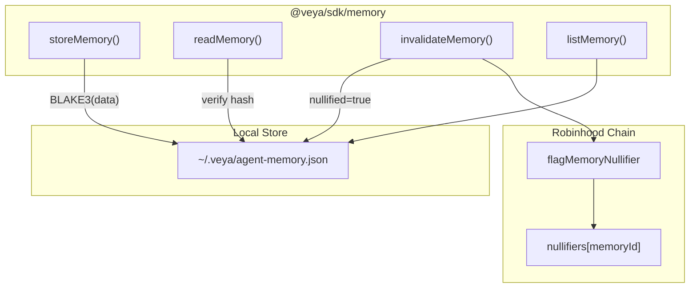

# SDK Memory

**Scoped agent memory with BLAKE3 integrity checks and spend-once nullifier semantics.**

The memory module (`src/memory/nullifier.ts` plus `src/memory/store.ts`) provides integrity-protected local state for agents. Content hashes use BLAKE3. Nullifiers prevent replay. On-chain `flagMemoryNullifier` on `Veya.sol` provides a cross-operator audit record on Robinhood Chain.

**Related:** [coordination.md](./coordination.md) • [pq-crypto.md](./pq-crypto.md) • [evm-anchoring.md](./evm-anchoring.md) • [configuration.md](./configuration.md)

---

## Table of Contents

1. [Purpose and Scope](#purpose-and-scope)
2. [Audience and Assumptions](#audience-and-assumptions)
3. [Glossary](#glossary)
4. [Overview](#overview)
5. [MemoryEntry Type](#memoryentry-type)
6. [Durable Store](#durable-store)
7. [storeMemory](#storememory)
8. [readMemory](#readmemory)
9. [invalidateMemory](#invalidatememory)
10. [listMemory](#listmemory)
11. [On-Chain Nullifiers](#on-chain-nullifiers)
12. [memoryId Encoding](#memoryid-encoding)
13. [Integrity Model](#integrity-model)
14. [Environment Isolation](#environment-isolation)
15. [Coupling to Coordination and Spend](#coupling-to-coordination-and-spend)
16. [Failure Modes](#failure-modes)
17. [Security Properties](#security-properties)
18. [Worked Example](#worked-example)
19. [Troubleshooting](#troubleshooting)
20. [See Also](#see-also)

---

## Purpose and Scope

Agent memory is local-first. The SDK writes JSON under the operator home directory, hashes content with BLAKE3, and refuses to read entries that were nullified or tampered with. The chain does not store memory payloads. `Veya.sol` only stores a nullifier flag plus timestamps when the operator calls `flagMemoryNullifier`.

This document is the reference for `storeMemory`, `readMemory`, `invalidateMemory`, `listMemory`, the file layout at `~/.veya/agent-memory.json`, and the EVM mapping `nullifiers[memoryId]`.

---

## Audience and Assumptions

Readers should know that BLAKE3-256 hex is 64 characters and that `Veya.sol` identifiers for nullifiers are `bytes16`. They should know that Robinhood Chain writes require a payer and `ensureRobinhoodChain`.

Assumptions:

- Local store path is `path.join(os.homedir(), ".veya", "agent-memory.json")`.
- Keys are `` `${environmentId}:${id}` ``.
- `id` from `storeMemory` is a UUID v4 string; on-chain `memoryId` is 16 bytes. Operators must define a stable encoding (UUID to `bytes16`).
- Nullify locally **and** on chain for cross-operator spend-once.
- Memory data may contain policy context but should not contain PQ private keys or `payerPrivateKey` material.

---

## Glossary

| Term | Meaning |
|------|---------|
| `MemoryEntry` | Local record: ids, data, BLAKE3, nullified flag |
| Nullifier | Spend-once flag; local boolean plus optional chain record |
| `MEMORY_FILE` | `~/.veya/agent-memory.json` |
| Integrity check | Recompute BLAKE3(`data`) vs stored hash on read |
| `bytes16 memoryId` | On-chain mapping key for `nullifiers` |

---

## Overview



| Property | Value |
|----------|-------|
| Hash algorithm | BLAKE3-256 |
| Scope key | `environmentId:id` |
| Replay prevention | Nullifier flag (local + on-chain) |
| PQ relevance | Integrity via BLAKE3; related attestations via ML-DSA |
| Chain function | `flagMemoryNullifier` (camelCase) |

---

## MemoryEntry Type

```typescript
export type MemoryEntry = {
  id: string;
  environmentId: string;
  agentId: string;
  data: string;
  blake3ContentHash: string;
  nullified: boolean;
};
```

| Field | Type | Description |
|-------|------|-------------|
| `id` | `string` | UUID v4 from `crypto.randomUUID()` |
| `environmentId` | `string` | Isolation boundary |
| `agentId` | `string` | Owning agent UUID string |
| `data` | `string` | Opaque memory content |
| `blake3ContentHash` | `string` | BLAKE3 hex of `data` at write time |
| `nullified` | `boolean` | Spend-once flag |

`data` is a string, not an object. Callers who wish to store structured context should `JSON.stringify` with a canonical form before `storeMemory`, then parse after `readMemory`. Hashing is over the string as stored, so pretty-print changes are tamper as far as integrity is concerned.

There is no `createdAt` in the TypeScript type. The on-chain nullifier has `nullifiedAt`. Local JSON may be extended by operators; unknown fields survive if they write through `saveStore` with the same objects, but `storeMemory` constructs a fresh entry without extras.

---

## Durable Store

**File:** `src/memory/store.ts`

The store file schema:

```typescript
type StoreFile = {
  entries: Record<string, MemoryEntry>;
  policies: Record<string, string[]>;
};
```

`policies` exists on disk for operator tooling and is not used by `nullifier.ts` today. Tool policies for MCP live in the in-process map in `router.ts`. Do not assume `agent-memory.json` policies are consulted by `routeMessage`.

`loadStore` returns `{ entries: {}, policies: {} }` if the file is missing or JSON parse fails. Parse failure is swallowed: a corrupt file is treated as empty. That fail-open on parse is an integrity hazard. Operators should keep backups of `MEMORY_FILE` and consider making parse failures fatal in a wrapper.

`saveStore` creates `~/.veya` recursively and writes pretty-printed JSON (`JSON.stringify(store, null, 2)`). Concurrent processes can race and lose updates. Use a single writer process per host.

On Windows, `os.homedir()` follows the user profile. The path is still `.veya/agent-memory.json` under that profile. Restrict ACLs so other users cannot read agent context.

---

## storeMemory

```typescript
import { storeMemory } from "@veya/sdk";

const entry = await storeMemory(
  "550e8400-e29b-41d4-a716-446655440000",
  "6ba7b810-9dad-11d1-80b4-00c04fd430c8",
  "treasury limits and prior decisions",
);

console.log(entry.id);
console.log(entry.blake3ContentHash);
```

Behavior:

1. `loadStore()`
2. `id = crypto.randomUUID()`
3. `blake3ContentHash = await hashBlake3(data)`
4. `nullified: false`
5. Write at `entryKey(environmentId, id)`
6. `saveStore`

The function does not talk to Robinhood Chain. Gas is zero. A later nullifier flag is a separate explicit write.

Do not store secrets that belong in an HSM. BLAKE3 detects tampering; it does not encrypt. Anyone with filesystem access reads `data` in plaintext.

---

## readMemory

```typescript
const entry = await readMemory("env-id", entryId);
```

Checks, in order:

1. Entry exists, else `memory not found`
2. Not nullified, else `memory nullified`
3. `hashBlake3(entry.data) === entry.blake3ContentHash`, else `memory integrity failed`

```mermaid
flowchart TD
    A["readMemory(env, id)"] --> B{entry exists?}
    B -->|no| E1["throw: memory not found"]
    B -->|yes| C{nullified?}
    C -->|yes| E2["throw: memory nullified"]
    C -->|no| D{BLAKE3(data) == hash?}
    D -->|no| E3["throw: memory integrity failed"]
    D -->|yes| F["return MemoryEntry"]
```

Integrity failure means the file was edited, a disk error flipped bits, or two writers interleaved. Treat it as a security event. Do not "repair" by updating the hash to match the new data without an authorized rewrite path.

---

## invalidateMemory

```typescript
invalidateMemory("env-id", entryId);
```

Sets `nullified = true` and saves. The entry remains for audit. `readMemory` will throw. `listMemory` still returns it, including the flag, so operator viewers can see spent memory.

Recommended pairing:

```typescript
invalidateMemory(environmentId, entry.id);
await anchor.flagMemoryNullifier(envUuidBytes16, memoryIdBytes16);
```

Local-only invalidation does not stop another host that copied `agent-memory.json` before the flag. The chain record is the inter-host break.

`invalidateMemory` throws `memory not found` if the key is absent. It does not throw if already nullified; it writes `nullified = true` again. On chain, a second `flagMemoryNullifier` reverts `MemoryAlreadyNullified`. Glue code should catch that revert and treat it as already spent.

---

## listMemory

```typescript
const entries = listMemory(environmentId);
```

Filters `Object.values(store.entries)` by `environmentId`. Includes nullified entries. Does not re-hash. Use this for operator dashboards, not for execution inputs. Execution inputs must go through `readMemory` so integrity and nullifier checks run.

---

## On-Chain Nullifiers

```solidity
function flagMemoryNullifier(bytes16 environmentUuid, bytes16 memoryId) external;
```

Rules from `Veya.sol`:

- Environment must exist (`EnvironmentDoesNotExist`).
- If `nullifiers[memoryId].nullified` is already true, revert `MemoryAlreadyNullified`.
- Stores `environmentUuid`, `memoryId`, `nullified: true`, `nullifiedAt: block.timestamp`.
- Mapping key is `memoryId` only, not a pair with environment.

Because the mapping is global on `memoryId`, two environments must not share a 16-byte memory id. Using UUID v4 as `bytes16` is the intended uniqueness source.

Event: `MemoryNullified(memoryId, environmentUuid)`.

The payer need not be the environment owner. Any address may flag a nullifier for an existing environment. That is a design choice: spend-once is a public assertion. Applications that need owner-only nullifiers must check `msg.sender` in a wrapper contract or check logs off-chain.

`EvmAnchor.flagMemoryNullifier` hexlifies both `Uint8Array` arguments and sends the transaction after `ensureRobinhoodChain`.

---

