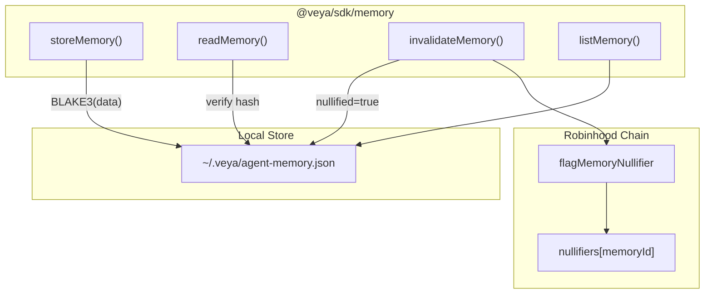

# SDK Memory

**Scoped agent memory with BLAKE3 integrity checks and spend-once nullifier semantics.**

The memory module (`src/memory/nullifier.ts` plus `src/memory/store.ts`) provides integrity-protected local state for agents. Content hashes use BLAKE3. Nullifiers prevent replay. On-chain `flagMemoryNullifier` on `Veya.sol` provides a cross-operator audit record on Robinhood Chain.

**Related:** [coordination.md](./coordination.md) • [pq-crypto.md](./pq-crypto.md) • [evm-anchoring.md](./evm-anchoring.md) • [configuration.md](./configuration.md)

---

## Table of Contents

1. [Purpose and Scope](#purpose-and-scope)
2. [Audience and Assumptions](#audience-and-assumptions)
3. [Glossary](#glossary)
4. [Overview](#overview)
5. [MemoryEntry Type](#memoryentry-type)
6. [Durable Store](#durable-store)
7. [storeMemory](#storememory)
8. [readMemory](#readmemory)
9. [invalidateMemory](#invalidatememory)
10. [listMemory](#listmemory)
11. [On-Chain Nullifiers](#on-chain-nullifiers)
12. [memoryId Encoding](#memoryid-encoding)
13. [Integrity Model](#integrity-model)
14. [Environment Isolation](#environment-isolation)
15. [Coupling to Coordination and Spend](#coupling-to-coordination-and-spend)
16. [Failure Modes](#failure-modes)
17. [Security Properties](#security-properties)
18. [Worked Example](#worked-example)
19. [Troubleshooting](#troubleshooting)
20. [See Also](#see-also)

---

## Purpose and Scope

Agent memory is local-first. The SDK writes JSON under the operator home directory, hashes content with BLAKE3, and refuses to read entries that were nullified or tampered with. The chain does not store memory payloads. `Veya.sol` only stores a nullifier flag plus timestamps when the operator calls `flagMemoryNullifier`.

This document is the reference for `storeMemory`, `readMemory`, `invalidateMemory`, `listMemory`, the file layout at `~/.veya/agent-memory.json`, and the EVM mapping `nullifiers[memoryId]`.

---

## Audience and Assumptions

Readers should know that BLAKE3-256 hex is 64 characters and that `Veya.sol` identifiers for nullifiers are `bytes16`. They should know that Robinhood Chain writes require a payer and `ensureRobinhoodChain`.

Assumptions:

- Local store path is `path.join(os.homedir(), ".veya", "agent-memory.json")`.
- Keys are `` `${environmentId}:${id}` ``.
- `id` from `storeMemory` is a UUID v4 string; on-chain `memoryId` is 16 bytes. Operators must define a stable encoding (UUID to `bytes16`).
- Nullify locally **and** on chain for cross-operator spend-once.
- Memory data may contain policy context but should not contain PQ private keys or `payerPrivateKey` material.

---

## Glossary

| Term | Meaning |
|------|---------|
| `MemoryEntry` | Local record: ids, data, BLAKE3, nullified flag |
| Nullifier | Spend-once flag; local boolean plus optional chain record |
| `MEMORY_FILE` | `~/.veya/agent-memory.json` |
| Integrity check | Recompute BLAKE3(`data`) vs stored hash on read |
| `bytes16 memoryId` | On-chain mapping key for `nullifiers` |

---

## Overview



| Property | Value |
|----------|-------|
| Hash algorithm | BLAKE3-256 |
| Scope key | `environmentId:id` |
| Replay prevention | Nullifier flag (local + on-chain) |
| PQ relevance | Integrity via BLAKE3; related attestations via ML-DSA |
| Chain function | `flagMemoryNullifier` (camelCase) |

---

## MemoryEntry Type

```typescript
export type MemoryEntry = {
  id: string;
  environmentId: string;
  agentId: string;
  data: string;
  blake3ContentHash: string;
  nullified: boolean;
};
```

| Field | Type | Description |
|-------|------|-------------|
| `id` | `string` | UUID v4 from `crypto.randomUUID()` |
| `environmentId` | `string` | Isolation boundary |
| `agentId` | `string` | Owning agent UUID string |
| `data` | `string` | Opaque memory content |
| `blake3ContentHash` | `string` | BLAKE3 hex of `data` at write time |
| `nullified` | `boolean` | Spend-once flag |

`data` is a string, not an object. Callers who wish to store structured context should `JSON.stringify` with a canonical form before `storeMemory`, then parse after `readMemory`. Hashing is over the string as stored, so pretty-print changes are tamper as far as integrity is concerned.

There is no `createdAt` in the TypeScript type. The on-chain nullifier has `nullifiedAt`. Local JSON may be extended by operators; unknown fields survive if they write through `saveStore` with the same objects, but `storeMemory` constructs a fresh entry without extras.

---

## Durable Store

**File:** `src/memory/store.ts`

The store file schema:

```typescript
type StoreFile = {
  entries: Record<string, MemoryEntry>;
  policies: Record<string, string[]>;
};
```

`policies` exists on disk for operator tooling and is not used by `nullifier.ts` today. Tool policies for MCP live in the in-process map in `router.ts`. Do not assume `agent-memory.json` policies are consulted by `routeMessage`.

`loadStore` returns `{ entries: {}, policies: {} }` if the file is missing or JSON parse fails. Parse failure is swallowed: a corrupt file is treated as empty. That fail-open on parse is an integrity hazard. Operators should keep backups of `MEMORY_FILE` and consider making parse failures fatal in a wrapper.

`saveStore` creates `~/.veya` recursively and writes pretty-printed JSON (`JSON.stringify(store, null, 2)`). Concurrent processes can race and lose updates. Use a single writer process per host.

On Windows, `os.homedir()` follows the user profile. The path is still `.veya/agent-memory.json` under that profile. Restrict ACLs so other users cannot read agent context.

---

## storeMemory

```typescript
import { storeMemory } from "@veya/sdk";

const entry = await storeMemory(
  "550e8400-e29b-41d4-a716-446655440000",
  "6ba7b810-9dad-11d1-80b4-00c04fd430c8",
  "treasury limits and prior decisions",
);

console.log(entry.id);
console.log(entry.blake3ContentHash);
```

Behavior:

1. `loadStore()`
2. `id = crypto.randomUUID()`
3. `blake3ContentHash = await hashBlake3(data)`
4. `nullified: false`
5. Write at `entryKey(environmentId, id)`
6. `saveStore`

The function does not talk to Robinhood Chain. Gas is zero. A later nullifier flag is a separate explicit write.

Do not store secrets that belong in an HSM. BLAKE3 detects tampering; it does not encrypt. Anyone with filesystem access reads `data` in plaintext.

---

## readMemory

```typescript
const entry = await readMemory("env-id", entryId);
```

Checks, in order:

1. Entry exists, else `memory not found`
2. Not nullified, else `memory nullified`
3. `hashBlake3(entry.data) === entry.blake3ContentHash`, else `memory integrity failed`

```mermaid
flowchart TD
    A["readMemory(env, id)"] --> B{entry exists?}
    B -->|no| E1["throw: memory not found"]
    B -->|yes| C{nullified?}
    C -->|yes| E2["throw: memory nullified"]
    C -->|no| D{BLAKE3(data) == hash?}
    D -->|no| E3["throw: memory integrity failed"]
    D -->|yes| F["return MemoryEntry"]
```

Integrity failure means the file was edited, a disk error flipped bits, or two writers interleaved. Treat it as a security event. Do not "repair" by updating the hash to match the new data without an authorized rewrite path.

---

## invalidateMemory

```typescript
invalidateMemory("env-id", entryId);
```

Sets `nullified = true` and saves. The entry remains for audit. `readMemory` will throw. `listMemory` still returns it, including the flag, so operator viewers can see spent memory.

Recommended pairing:

```typescript
invalidateMemory(environmentId, entry.id);
await anchor.flagMemoryNullifier(envUuidBytes16, memoryIdBytes16);
```

Local-only invalidation does not stop another host that copied `agent-memory.json` before the flag. The chain record is the inter-host break.

`invalidateMemory` throws `memory not found` if the key is absent. It does not throw if already nullified; it writes `nullified = true` again. On chain, a second `flagMemoryNullifier` reverts `MemoryAlreadyNullified`. Glue code should catch that revert and treat it as already spent.

---

## listMemory

```typescript
const entries = listMemory(environmentId);
```

Filters `Object.values(store.entries)` by `environmentId`. Includes nullified entries. Does not re-hash. Use this for operator dashboards, not for execution inputs. Execution inputs must go through `readMemory` so integrity and nullifier checks run.

---

## On-Chain Nullifiers

```solidity
function flagMemoryNullifier(bytes16 environmentUuid, bytes16 memoryId) external;
```

Rules from `Veya.sol`:

- Environment must exist (`EnvironmentDoesNotExist`).
- If `nullifiers[memoryId].nullified` is already true, revert `MemoryAlreadyNullified`.
- Stores `environmentUuid`, `memoryId`, `nullified: true`, `nullifiedAt: block.timestamp`.
- Mapping key is `memoryId` only, not a pair with environment.

Because the mapping is global on `memoryId`, two environments must not share a 16-byte memory id. Using UUID v4 as `bytes16` is the intended uniqueness source.

Event: `MemoryNullified(memoryId, environmentUuid)`.

The payer need not be the environment owner. Any address may flag a nullifier for an existing environment. That is a design choice: spend-once is a public assertion. Applications that need owner-only nullifiers must check `msg.sender` in a wrapper contract or check logs off-chain.

`EvmAnchor.flagMemoryNullifier` hexlifies both `Uint8Array` arguments and sends the transaction after `ensureRobinhoodChain`.

---

## memoryId Encoding

Local `entry.id` is a UUID string such as `550e8400-e29b-41d4-a716-446655440000` (36 chars). On-chain `bytes16` is 16 bytes.

A standard encoding is to parse the UUID into 16 raw bytes (strip hyphens, hex-decode). Do not BLAKE3 the UUID string to get `bytes16`; that would prevent operators from correlating explorer `bytes16` with the JSON `id` without extra bookkeeping. Do not use only the first 16 UTF-8 characters of the hyphenated string.

```typescript
function uuidToBytes16(uuid: string): Uint8Array {
  const hex = uuid.replace(/-/g, "");
  if (hex.length !== 32) throw new Error("invalid uuid");
  return Uint8Array.from(Buffer.from(hex, "hex"));
}
```

`environmentId` on HTTP and in the JSON file is often the same UUID string form as used at `registerEnvironment`. Keep encodings consistent with `EvmAnchor.registerEnvironment`, which already expects `Uint8Array` of length 16.

---

## Integrity Model

BLAKE3 is computed over the `data` string at write and checked at read. It does not bind `agentId` or `environmentId` into the hash. Swapping an entry to another key in the JSON file without changing `data` would still pass `readMemory` if the attacker also updates the map key that `readMemory` looks up. The lookup key is caller-supplied `(environmentId, id)`. Defense in depth: also verify `entry.environmentId === environmentId` and `entry.agentId` against the expected agent in application code. The current `readMemory` does not re-check those fields beyond using them to find the record.

The hash does bind content. Changing `data` without changing `blake3ContentHash` fails integrity. Changing both together is equivalent to authorized rewrite and cannot be distinguished from a malicious editor with filesystem access. Filesystem ACL plus host integrity is required.

PQ signatures over memory are not part of this module. An application may `signPQ(hashBlake3Bytes(data), agentKey)` and store the signature elsewhere or in `data` itself (carefully, because the hash would then include the signature: sign the inner payload only).

---

## Environment Isolation

`listMemory` and `entryKey` isolate by `environmentId`. A read using the wrong environment throws `memory not found` even if the UUID `id` exists under another environment. That is the local isolation property.

On-chain isolation is weaker for nullifiers because the key is only `memoryId`. Unique UUIDs restore isolation in practice.

Do not put two tenants in one `MEMORY_FILE` without trusting the host. The file is not encrypted per environment.

---

## Coupling to Coordination and Spend

Memory is a natural place to store "this disbursement intent was already used." The pattern:

1. `storeMemory` with canonical intent JSON (amounts in wei strings).
2. Policy allow + optional consensus.
3. Execute.
4. `invalidateMemory` + `flagMemoryNullifier`.
5. `recordSpend` in wei on chain.

If step 4 happens without step 5, accounting diverges. If step 5 happens without step 4, the memory can be read again and a confused runtime might double-intent even while the wei cap catches the second spend. Do both.

`PolicyAgent` does not read memory. Glue it explicitly.

---

## Failure Modes

| Failure | Cause | Recovery |
|---------|-------|----------|
| `memory not found` | Wrong ids or empty store after corrupt parse | Restore backup; confirm key |
| `memory nullified` | Spend-once already applied | Treat as already used |
| `memory integrity failed` | Tamper or concurrent write | Investigate; do not auto-rewrite hash |
| Silent empty store | JSON parse error swallowed | Monitor file; fail-closed wrapper |
| Lost updates | Two processes `saveStore` | Single writer |
| `MemoryAlreadyNullified` | Double chain flag | Idempotent catch |
| `EnvironmentDoesNotExist` | Flag before `registerEnvironment` | Register first |
| UUID encoding mismatch | String vs bytes16 | `uuidToBytes16` |
| Secrets in `data` | Misuse of store | Move secrets to a vault |

Restarting the process does not clear memory; the file persists. Restarting does not restore nullifiers to false unless the file is deleted. Deleting `MEMORY_FILE` is a rollback of local nullifiers and is an incident if chain flags still exist (local miss, chain spent) or vice versa.

---

## Security Properties

| Property | Provided? | Notes |
|----------|-----------|-------|
| Confidentiality | No | Plaintext JSON on disk |
| Integrity | Yes | BLAKE3 on read |
| Replay break (local) | Yes | `nullified` |
| Replay break (global) | When chained | `flagMemoryNullifier` |
| Authentication | No | Any process user can write the file |
| PQ identity bind | Application-level | Sign hashes with ML-DSA |

Home-directory storage is operator-local, not multi-tenant SaaS. Treat the workstation as the trust boundary.

Never commit `agent-memory.json` to git. It may contain treasury context.

---

## Worked Example

```typescript
import {
  storeMemory,
  readMemory,
  invalidateMemory,
  listMemory,
} from "@veya/sdk";
import { VeyaClient } from "@veya/sdk";

const environmentId = "550e8400-e29b-41d4-a716-446655440000";
const agentId = "6ba7b810-9dad-11d1-80b4-00c04fd430c8";

const stored = await storeMemory(
  environmentId,
  agentId,
  JSON.stringify({ amountWei: "1000000000000000", note: "one-shot intent" }),
);

const fresh = await readMemory(environmentId, stored.id);
const parsed = JSON.parse(fresh.data);
if (parsed.amountWei !== "1000000000000000") {
  throw new Error("unexpected intent");
}

invalidateMemory(environmentId, stored.id);

const client = new VeyaClient({
  payerPrivateKey: process.env.VEYA_DEPLOYER_PRIVATE_KEY,
});
if (client.evm) {
  const envBytes = uuidToBytes16(environmentId);
  const memBytes = uuidToBytes16(stored.id);
  await client.evm.flagMemoryNullifier(envBytes, memBytes);
}

const listed = listMemory(environmentId);
const spent = listed.find((e) => e.id === stored.id);
if (!spent?.nullified) throw new Error("local flag missing");
```

After the chain transaction confirms, inspect it on `https://explorer.testnet.chain.robinhood.com`. `ensureRobinhoodChain` will have required `eth_chainId` 46630 on testnet.

---

## Operational Backup and Restore

`MEMORY_FILE` is the entire local history of agent context. Back it up as you would any other operator state file, with the understanding that it is plaintext. Encrypted backups (age, Tarsnap, volume encryption) are appropriate; committing the file to a git remote is not.

Restore procedure:

1. Stop writers (`storeMemory` / `invalidateMemory`).
2. Replace `~/.veya/agent-memory.json` with the backup.
3. Optionally run `listMemory` per environment and spot-check `readMemory` on a non-nullified id.
4. Compare on-chain `nullifiers` for ids that the backup marks as nullified. If the chain is ahead (flagged, local not), invalidate local. If local is ahead (nullified, chain not), call `flagMemoryNullifier` to catch up.

A restore that rolls back nullifiers while the chain still shows `MemoryAlreadyNullified` is safe for chain (the second flag reverts) and unsafe for execution (local `readMemory` might succeed). Always align local flags to the chain in that direction: chain spent implies local spent.

Do not restore onto a host that already has a divergent file without taking a copy of the divergent file first. Pretty-printed JSON diffs are readable; use them.

### File format stability

The store is JSON with `entries` and `policies` keys. Additional top-level keys will survive a `saveStore` only if `loadStore` round-trips the whole object. Today `loadStore` types the file as `StoreFile` and `saveStore` writes that object. Extra keys from a hand edit are dropped on the next `storeMemory`. Put operator annotations inside `data` or in a sidecar file, not as extra top-level JSON keys.

Pretty printing (`null, 2`) makes git-style diffs possible for encrypted local history tools. It also makes accidental whitespace edits visible to BLAKE3 because `data` values are separate strings; pretty printing of the envelope does not change `data` hashes unless someone reformats the `data` field itself.

---

## Concurrency and Locking

`loadStore` / `saveStore` is a read-modify-write with no file lock. Two `storeMemory` calls in overlapping processes can drop an entry. Recommended deployment is one agent runtime per `MEMORY_FILE`. If multiple processes are required, shard by `environmentId` into separate files via a wrapper, or serialize writers through a queue.

`readMemory` is safe concurrent with other readers. Concurrent with a writer, a reader may see a torn file if the write is interrupted mid-`writeFileSync`. `writeFileSync` is typically atomic on POSIX for small files on the same filesystem; on Windows, treat interruptions as a possible corrupt-file event (empty store after parse failure). A wrapper that writes to a temp file and renames is a reasonable hardening patch at the application layer.

---

## Troubleshooting

| Symptom | Cause | Fix |
|---------|-------|-----|
| File missing | First run | `storeMemory` creates it |
| All reads fail integrity | Editor changed whitespace | Restore file; rewrite via `storeMemory` |
| Chain flag but local readable | Forgot `invalidateMemory` | Invalidate local |
| Local spent, chain missing | Forgot `flagMemoryNullifier` | Flag on `Veya.sol` |
| Wrong home directory | Service user vs interactive user | Pin `HOME` / profile |
| Permission denied on write | ACL | Grant the runtime user write on `~/.veya` |
| Entries vanished | Corrupt JSON parsed as empty | Restore backup; fail-closed wrapper |
| Double spend locally | Two hosts, one file copy | Chain nullifier is source of spent-once |

---

## Compatibility with Veya.sol Nullifiers

`flagMemoryNullifier` is camelCase in `INSTRUCTION_NAMES` and in the inlined ABI. The Solidity error `MemoryAlreadyNullified` is the on-chain equivalent of local `memory nullified`. Map it through `fromAnchorRevert` when wrapping ethers errors; if the selector is not in `VEYA_REVERT_SELECTORS`, it will surface as `ANCHOR_REVERT` with raw data. Operators can still detect the condition by catching the revert message or by `eth_call`-ing `nullifiers(memoryId)` and reading `nullified`.

The environment UUID on the chain flag should match the environment used in `storeMemory`. The contract does not verify that correspondence beyond storing both fields. An application that flags a memory id under the wrong environment still spends the global `memoryId` key. Double-check `uuidToBytes16` mappings in tests.

`EvmAnchor.ensureRobinhoodChain` runs before the flag write. A memory-only local workflow never hits that gate. Mixed workflows (local store plus chain flag) must use a client constructed with `payerPrivateKey` and a RPC that reports chain id 46630 on testnet.

Wei spending is adjacent but separate: nullifying memory does not call `recordSpend`. If the memory represented a disbursement intent, call both. If it represented a read-once credential, skip spend accounting.

---

## Testing Notes

Unit tests can call `storeMemory` / `readMemory` / `invalidateMemory` against the real home-directory file. That is a process-level side effect. Prefer setting a throwaway user profile in CI or accepting that developers' `~/.veya/agent-memory.json` will accumulate entries. Do not point tests at production operator files.

Integrity tests should mutate `data` on disk and expect `memory integrity failed`. Nullifier tests should expect `readMemory` to throw after `invalidateMemory` while `listMemory` still contains the row.

Chain tests for `flagMemoryNullifier` require a funded payer, a registered environment, and Robinhood Chain RPC. Keep them behind an explicit env flag so default `npm test` stays off-chain.

---

`listMemory` is an operator viewer. Execution engines must call `readMemory` so integrity and nullifier checks run on every use. Skipping that path to "save a hash" is how replay and tamper sneak in.

The default store location cannot be changed through `resolveConfig`. Wrappers that need isolation should run as a dedicated OS user so `os.homedir()` points at a dedicated profile.

On Robinhood Chain testnet the contract address for flags is `0x1a1Dc3c55550FCE9F70ef6cDEeF967c0b72a5d84`. Pin it. Do not pass a random ERC-20 and expect nullifier semantics.

Amounts inside `data` JSON are application-defined. When they represent native value they are wei strings, matching `PolicyAgentConfig.maxWeiPerAction` and `initSpendingLimit`.

Pretty-printed store files are still plaintext. Disk encryption and ACLs are the confidentiality layer; BLAKE3 is only integrity.

---

Nullifier order is local first, then chain, so a crash between the two leaves a conservative local deny. The opposite order can allow a local re-read while the chain already spent the id.

UUID `bytes16` encoding must be hyphen-stripped hex, not UTF-8 of the hyphenated string. Tests should round-trip `uuidToBytes16` against `registerEnvironment` ids.

---

Keep `INSTRUCTION_NAMES` camelCase when documenting the flag write: `flagMemoryNullifier`, never `flag_memory_nullifier`.

Home-directory JSON is not a multi-region store. Replicate by application design, not by copying the file while writers run.

---

## See Also

- [pq-crypto.md](./pq-crypto.md): `hashBlake3`
- [evm-anchoring.md](./evm-anchoring.md): `flagMemoryNullifier`
- [coordination.md](./coordination.md): when to nullify relative to tools
- [sealed-execution.md](./sealed-execution.md): confidential payloads vs plaintext memory
- [configuration.md](./configuration.md): client construction for chain flags
