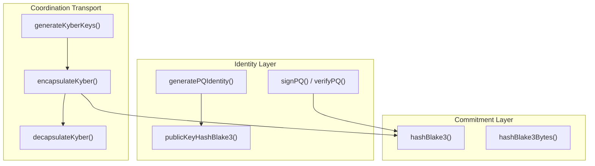
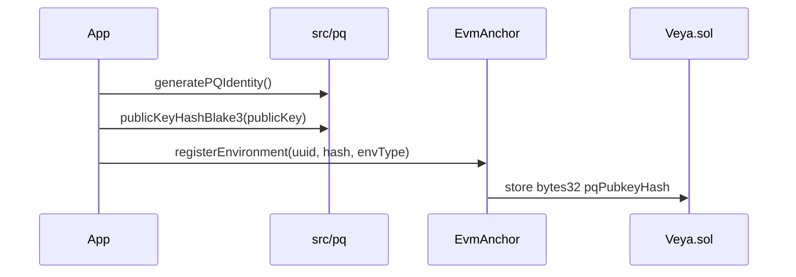

# SDK Post-Quantum Cryptography

**ML-DSA-44, Kyber-768, and BLAKE3 primitives for `@veya/sdk`: TypeScript surface aligned with the sealed and validator node identities.**

The `src/pq` module is the TypeScript surface for post-quantum identity, session transport, and commitments. VEYA on Robinhood Chain is **PQ-first**: no SHA-256 on new code paths. `Veya.sol` stores **hashes and signature bytes**; verification runs off-chain in this module. Implementations use `@noble/post-quantum` for ML-DSA-44 and ML-KEM-768, and `hash-wasm` for BLAKE3.

**Related:** [configuration.md](./configuration.md) • [evm-anchoring.md](./evm-anchoring.md) • [coordination.md](./coordination.md) • [sealed-execution.md](./sealed-execution.md)

---

## Table of Contents

1. [Purpose and Scope](#purpose-and-scope)
2. [Audience and Assumptions](#audience-and-assumptions)
3. [Glossary](#glossary)
4. [Cryptographic Profile](#cryptographic-profile)
5. [Module Structure](#module-structure)
6. [ML-DSA-44 Identity](#ml-dsa-44-identity)
7. [Kyber-768 Session KEM](#kyber-768-session-kem)
8. [BLAKE3 Commitments](#blake3-commitments)
9. [VeyaClient Shortcuts](#veyaclient-shortcuts)
10. [On-Chain vs Off-Chain Split](#on-chain-vs-off-chain-split)
11. [Canonicalization](#canonicalization)
12. [Key Lifecycle](#key-lifecycle)
13. [Interop with Nodes](#interop-with-nodes)
14. [Testing](#testing)
15. [Algorithm Policy](#algorithm-policy)
16. [Failure Modes](#failure-modes)
17. [Security Properties](#security-properties)
18. [Performance Notes](#performance-notes)
19. [Troubleshooting](#troubleshooting)
20. [See Also](#see-also)

---

## Purpose and Scope

This document specifies the algorithms, encodings, and call patterns that every other SDK module depends on. Coordination signs MCP envelopes with ML-DSA-44. Memory hashes payloads with BLAKE3. Consensus nodes (operator-run) sign execution digests with ML-DSA-44. Sealed-node commitments are BLAKE3 over ciphertext. EVM anchoring stores those 32-byte digests and, optionally, ML-DSA signature bytes on `Veya.sol` at `0x1a1Dc3c55550FCE9F70ef6cDEeF967c0b72a5d84`.

The module is stateless with respect to Robinhood Chain. `generatePQIdentity` does not require `rpcUrl` or `payerPrivateKey`. Chain configuration is irrelevant until an operator decides to call `registerEnvironment` with `publicKeyHashBlake3(publicKey)`.

---

## Audience and Assumptions

Readers should understand NIST FIPS 204 (ML-DSA) and FIPS 203 (ML-KEM) at the level of key sizes and the sign/verify or encapsulate/decapsulate APIs. They should know that BLAKE3-256 produces a 32-byte digest, hex-encoded as 64 lowercase characters in this SDK.

Assumptions:

- Parameter set is ML-DSA-44, matching Dilithium2 / `pqcrypto-dilithium` dilithium2 on the Rust node side as documented in `mldsa.ts`.
- Session KEM is Kyber-768 / ML-KEM-768.
- Commitments are BLAKE3, never SHA-256, never keccak256 (keccak256 appears only as Solidity mapping keys in `Veya.sol`, which is not a payload commitment).
- `@noble/post-quantum` is the TypeScript implementation. Do not substitute `dilithium-crystals-js` or `pqc-kyber` in this package.

---

## Glossary

| Term | Meaning |
|------|---------|
| ML-DSA-44 | Module-Lattice Digital Signature Algorithm, NIST security category 2. |
| ML-KEM-768 | Kyber-768 key encapsulation, NIST FIPS 203. |
| BLAKE3-256 | 32-byte cryptographic hash used for all VEYA commitments. |
| Identity hash | `BLAKE3(ML-DSA public key)` stored as `bytes32 pqPubkeyHash`. |
| Execution hash | `BLAKE3` of a canonical payload, voted on by validators. |
| Detached signature | ML-DSA bytes over a message; stored optionally via `attestExecution`. |
| Shared secret | ML-KEM output used as session keying material, never sent on chain. |

---

## Cryptographic Profile

| Operation | Algorithm | Standard | On-chain? |
|-----------|-----------|----------|-----------|
| Identity signatures | ML-DSA-44 | NIST FIPS 204 | Sig bytes stored; verify off-chain |
| Session KEM | Kyber-768 (ML-KEM-768) | NIST FIPS 203 | Never |
| Commitments | BLAKE3-256 | Grover-resistant 128-bit margin | 32-byte hashes in `Veya.sol` |
| Sealed payloads | AES-256-GCM | NIST SP 800-38D | Ciphertext chunks + BLAKE3 |
| Mapping keys | keccak256 | EVM storage | Not a payload hash |



The profile is PQ-first for new paths. AES-256-GCM remains the sealed-node bulk cipher because the sealed boundary already assumes a confidential host. Kyber may wrap session material before HTTP dispatch in coordination; sealed-node v1 derives AES keys from BLAKE3 over client entropy plus context labels.

---

## Module Structure

```
src/pq/
├── index.ts      # Re-exports mldsa, kyber, blake3
├── mldsa.ts      # ML-DSA-44 via @noble/post-quantum/ml-dsa.js
├── kyber.ts      # ML-KEM-768 via @noble/post-quantum/ml-kem.js
├── blake3.ts     # BLAKE3 via hash-wasm createBLAKE3
└── pq.test.ts    # Determinism and sign/verify vitest suite
```

Package exports:

```typescript
import * as pq from "@veya/sdk/pq";
import { pq } from "@veya/sdk";

import { generatePQIdentity, signPQ, verifyPQ } from "@veya/sdk/pq";
import { hashBlake3, hashBlake3Bytes } from "@veya/sdk/pq";
import { generateKyberKeys, encapsulateKyber, decapsulateKyber } from "@veya/sdk/pq";
```

| File | Dependency | Purpose |
|------|------------|---------|
| `mldsa.ts` | `@noble/post-quantum` `ml_dsa44` | Keygen, sign, verify, pubkey hash |
| `kyber.ts` | `@noble/post-quantum` `ml_kem768` | KEM keygen, encapsulate, decapsulate |
| `blake3.ts` | `hash-wasm` | Hex and byte digest helpers |

`src/index.ts` re-exports the namespace as `pq`. Applications should prefer the namespace import so algorithm names stay grouped and greppable.

---

## ML-DSA-44 Identity

**File:** `src/pq/mldsa.ts`

```typescript
import { ml_dsa44 } from "@noble/post-quantum/ml-dsa.js";
```

The comment in source states this parameter set matches Rust `pqcrypto-dilithium` dilithium2. Do not "upgrade" to ML-DSA-65 or ML-DSA-87 in the SDK alone; node binaries and stored signatures would become unverifiable.

### generatePQIdentity

```typescript
import * as pq from "@veya/sdk/pq";

const { publicKey, privateKey } = await pq.generatePQIdentity();
```

| Output | Type | Storage |
|--------|------|---------|
| `publicKey` | `Uint8Array` | Off-chain; BLAKE3 hash anchors on `Veya.sol` |
| `privateKey` | `Uint8Array` | Secure enclave / encrypted disk only |

The function is `async` for interface stability even though `ml_dsa44.keygen()` is synchronous. Callers may `await` uniformly with `hashBlake3`.

Noble returns `{ publicKey, secretKey }`. The SDK renames `secretKey` to `privateKey` so TypeScript integrators see one term across ML-DSA and Kyber.

### signPQ

```typescript
const message = new TextEncoder().encode("execution payload");
const sig = await pq.signPQ(message, privateKey);
```

Detached signature bytes. For on-chain `attestExecution`, sign the **32-byte BLAKE3 hash** of the canonical execution payload, not an unstable JSON pretty-print.

```typescript
const digest = await pq.hashBlake3Bytes(canonicalJson);
const attestationSig = await pq.signPQ(digest, privateKey);
```

Signing the digest rather than the raw JSON keeps the signed message 32 bytes regardless of payload size and matches how validator nodes attest execution hashes.

### verifyPQ

```typescript
const ok = await pq.verifyPQ(signature, message, publicKey);
```

Returns a boolean. Auditors must treat `false` as a hard failure. There is no "soft verify" and no recovery id.

`Veya.sol.attestExecution` will happily store bytes that fail `verifyPQ`. On-chain presence is not authenticity. Always verify off-chain against the public key whose BLAKE3 hash is in `environments[uuid].pqPubkeyHash`.

### publicKeyHashBlake3

```typescript
const hashHex = await pq.publicKeyHashBlake3(publicKey);
// 64-char lowercase hex: matches on-chain pqPubkeyHash / agent pqHash
```



This hex string is what `registerPqIdentity` passes to `anchorMemo` after decoding back to bytes. Do not keccak-hash the public key. Do not SHA-256 it. Explorers will show a `bytes32`; auditors recompute BLAKE3 in this module and compare.

---

## Kyber-768 Session KEM

**File:** `src/pq/kyber.ts`

```typescript
import { ml_kem768 } from "@noble/post-quantum/ml-kem.js";
```

Kyber is used by `src/coordination/sessions.ts` to establish per-pair session identifiers and encapsulations. Shared secrets never go on Robinhood Chain.

### generateKyberKeys

```typescript
const { publicKey, privateKey } = pq.generateKyberKeys();
```

Synchronous. The coordination session module currently generates a process-local node keypair at import time:

```typescript
const nodeKeys = generateKyberKeys();
```

That keypair is ephemeral to the process. Restarting the process yields a new Kyber identity. Persist keys if sessions must survive restarts; the SDK does not write them to disk.

### encapsulateKyber / decapsulateKyber

```typescript
const { ciphertext, sharedSecret } = pq.encapsulateKyber(publicKey);
const opened = pq.decapsulateKyber(ciphertext, privateKey);
```

Noble's field names `cipherText` / `sharedSecret` are normalized to `ciphertext` in the SDK return value. Hex encoding for transport happens in `establishKyberSession`, which stores `ciphertext` and `sharedSecretHex` on an in-memory `KyberSession`.

Session ids are BLAKE3 over `fromAgent:toAgent:Date.now()`. The timestamp makes ids unique; it also means two calls for the same pair create two sessions. That is intentional: coordination does not try to resume a KEM session across messages unless the caller reuses `kyberSessionId`.

Kyber ciphertext is not stored on `Veya.sol`. Putting KEM ciphertext on chain would leak session establishment metadata without benefiting settlement.

---

## BLAKE3 Commitments

**File:** `src/pq/blake3.ts`

```typescript
import { createBLAKE3 } from "hash-wasm";

export async function hashBlake3(data: Uint8Array | string): Promise<string> {
  const hasher = await createBLAKE3();
  hasher.init();
  hasher.update(data);
  return hasher.digest("hex");
}
```

`hashBlake3Bytes` hex-decodes that digest into a `Uint8Array` of length 32, suitable for `ethers.hexlify` into `bytes32`.

Inputs may be `Uint8Array` or `string`. Strings are hashed as UTF-8 via hash-wasm's update path. Do not hash a hex string when the intent is to hash raw bytes; decode first.

Determinism is covered by `pq.test.ts`: `hashBlake3("veya")` is stable and 64 hex characters. Consensus depends on this: validators and the SDK must hash the same canonical bytes.

keccak256 is used inside `Veya.sol` only to derive mapping keys (`attestations`, `toolPolicies`, `sealedStates`). Payload commitments, memory integrity, PQ pubkey fingerprints, and consensus votes are BLAKE3. Mixing the two algorithms is a class of auditor error.

---

## VeyaClient Shortcuts

```typescript
const client = new VeyaClient();
const keys = await client.pqKeygen();       // generatePQIdentity
const hex = await client.hashBlake3(buf);   // hashBlake3
```

`registerPqOnchain` composes keygen, public-key hash, `registerEnvironment`, and `storeCommitment` when `client.evm` exists. It is the only client method that both touches PQ and requires Robinhood Chain gas.

There is no client shortcut for Kyber. Import `generateKyberKeys` or use `establishKyberSession` from the coordination module.

---

