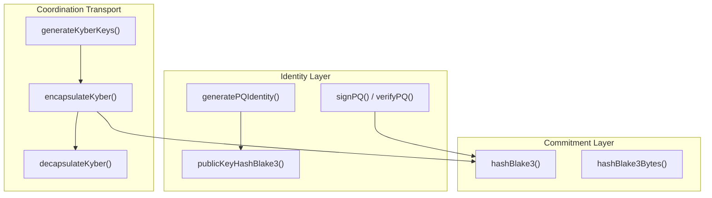
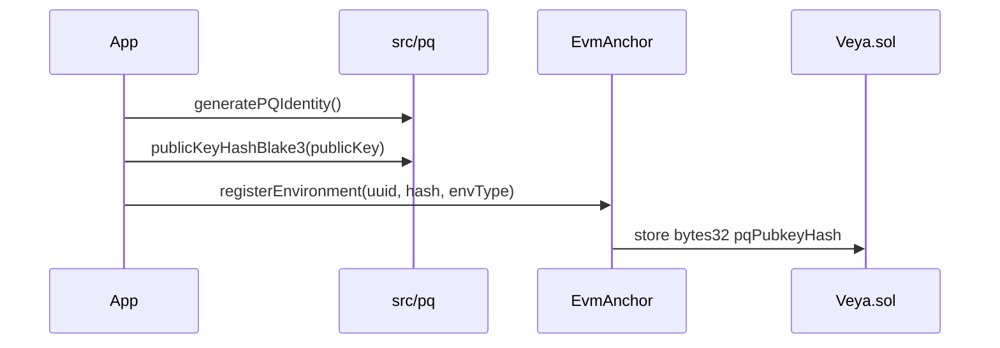
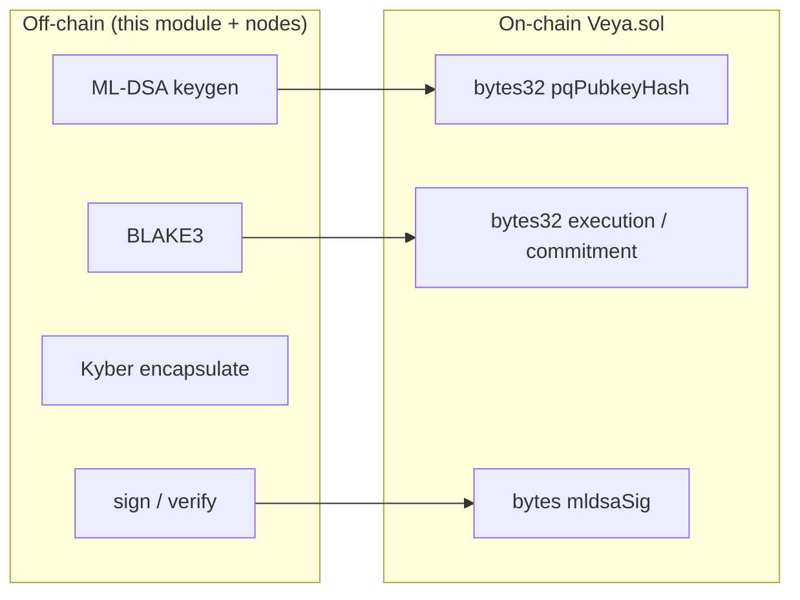

# SDK Post-Quantum Cryptography

**ML-DSA-44, Kyber-768, and BLAKE3 primitives for `@veya/sdk`: TypeScript surface aligned with the sealed and validator node identities.**

The `src/pq` module is the TypeScript surface for post-quantum identity, session transport, and commitments. VEYA on Robinhood Chain is **PQ-first**: no SHA-256 on new code paths. `Veya.sol` stores **hashes and signature bytes**; verification runs off-chain in this module. Implementations use `@noble/post-quantum` for ML-DSA-44 and ML-KEM-768, and `hash-wasm` for BLAKE3.

**Related:** [configuration.md](./configuration.md) • [evm-anchoring.md](./evm-anchoring.md) • [coordination.md](./coordination.md) • [sealed-execution.md](./sealed-execution.md)

---

## Table of Contents

1. [Purpose and Scope](#purpose-and-scope)
2. [Audience and Assumptions](#audience-and-assumptions)
3. [Glossary](#glossary)
4. [Cryptographic Profile](#cryptographic-profile)
5. [Module Structure](#module-structure)
6. [ML-DSA-44 Identity](#ml-dsa-44-identity)
7. [Kyber-768 Session KEM](#kyber-768-session-kem)
8. [BLAKE3 Commitments](#blake3-commitments)
9. [VeyaClient Shortcuts](#veyaclient-shortcuts)
10. [On-Chain vs Off-Chain Split](#on-chain-vs-off-chain-split)
11. [Canonicalization](#canonicalization)
12. [Key Lifecycle](#key-lifecycle)
13. [Interop with Nodes](#interop-with-nodes)
14. [Testing](#testing)
15. [Algorithm Policy](#algorithm-policy)
16. [Failure Modes](#failure-modes)
17. [Security Properties](#security-properties)
18. [Performance Notes](#performance-notes)
19. [Troubleshooting](#troubleshooting)
20. [See Also](#see-also)

---

## Purpose and Scope

This document specifies the algorithms, encodings, and call patterns that every other SDK module depends on. Coordination signs MCP envelopes with ML-DSA-44. Memory hashes payloads with BLAKE3. Consensus nodes (operator-run) sign execution digests with ML-DSA-44. Sealed-node commitments are BLAKE3 over ciphertext. EVM anchoring stores those 32-byte digests and, optionally, ML-DSA signature bytes on `Veya.sol` at `0x1a1Dc3c55550FCE9F70ef6cDEeF967c0b72a5d84`.

The module is stateless with respect to Robinhood Chain. `generatePQIdentity` does not require `rpcUrl` or `payerPrivateKey`. Chain configuration is irrelevant until an operator decides to call `registerEnvironment` with `publicKeyHashBlake3(publicKey)`.

---

## Audience and Assumptions

Readers should understand NIST FIPS 204 (ML-DSA) and FIPS 203 (ML-KEM) at the level of key sizes and the sign/verify or encapsulate/decapsulate APIs. They should know that BLAKE3-256 produces a 32-byte digest, hex-encoded as 64 lowercase characters in this SDK.

Assumptions:

- Parameter set is ML-DSA-44, matching Dilithium2 / `pqcrypto-dilithium` dilithium2 on the Rust node side as documented in `mldsa.ts`.
- Session KEM is Kyber-768 / ML-KEM-768.
- Commitments are BLAKE3, never SHA-256, never keccak256 (keccak256 appears only as Solidity mapping keys in `Veya.sol`, which is not a payload commitment).
- `@noble/post-quantum` is the TypeScript implementation. Do not substitute `dilithium-crystals-js` or `pqc-kyber` in this package.

---

## Glossary

| Term | Meaning |
|------|---------|
| ML-DSA-44 | Module-Lattice Digital Signature Algorithm, NIST security category 2. |
| ML-KEM-768 | Kyber-768 key encapsulation, NIST FIPS 203. |
| BLAKE3-256 | 32-byte cryptographic hash used for all VEYA commitments. |
| Identity hash | `BLAKE3(ML-DSA public key)` stored as `bytes32 pqPubkeyHash`. |
| Execution hash | `BLAKE3` of a canonical payload, voted on by validators. |
| Detached signature | ML-DSA bytes over a message; stored optionally via `attestExecution`. |
| Shared secret | ML-KEM output used as session keying material, never sent on chain. |

---

## Cryptographic Profile

| Operation | Algorithm | Standard | On-chain? |
|-----------|-----------|----------|-----------|
| Identity signatures | ML-DSA-44 | NIST FIPS 204 | Sig bytes stored; verify off-chain |
| Session KEM | Kyber-768 (ML-KEM-768) | NIST FIPS 203 | Never |
| Commitments | BLAKE3-256 | Grover-resistant 128-bit margin | 32-byte hashes in `Veya.sol` |
| Sealed payloads | AES-256-GCM | NIST SP 800-38D | Ciphertext chunks + BLAKE3 |
| Mapping keys | keccak256 | EVM storage | Not a payload hash |



The profile is PQ-first for new paths. AES-256-GCM remains the sealed-node bulk cipher because the sealed boundary already assumes a confidential host. Kyber may wrap session material before HTTP dispatch in coordination; sealed-node v1 derives AES keys from BLAKE3 over client entropy plus context labels.

---

## Module Structure

```
src/pq/
├── index.ts      # Re-exports mldsa, kyber, blake3
├── mldsa.ts      # ML-DSA-44 via @noble/post-quantum/ml-dsa.js
├── kyber.ts      # ML-KEM-768 via @noble/post-quantum/ml-kem.js
├── blake3.ts     # BLAKE3 via hash-wasm createBLAKE3
└── pq.test.ts    # Determinism and sign/verify vitest suite
```

Package exports:

```typescript
import * as pq from "@veya/sdk/pq";
import { pq } from "@veya/sdk";

import { generatePQIdentity, signPQ, verifyPQ } from "@veya/sdk/pq";
import { hashBlake3, hashBlake3Bytes } from "@veya/sdk/pq";
import { generateKyberKeys, encapsulateKyber, decapsulateKyber } from "@veya/sdk/pq";
```

| File | Dependency | Purpose |
|------|------------|---------|
| `mldsa.ts` | `@noble/post-quantum` `ml_dsa44` | Keygen, sign, verify, pubkey hash |
| `kyber.ts` | `@noble/post-quantum` `ml_kem768` | KEM keygen, encapsulate, decapsulate |
| `blake3.ts` | `hash-wasm` | Hex and byte digest helpers |

`src/index.ts` re-exports the namespace as `pq`. Applications should prefer the namespace import so algorithm names stay grouped and greppable.

---

## ML-DSA-44 Identity

**File:** `src/pq/mldsa.ts`

```typescript
import { ml_dsa44 } from "@noble/post-quantum/ml-dsa.js";
```

The comment in source states this parameter set matches Rust `pqcrypto-dilithium` dilithium2. Do not "upgrade" to ML-DSA-65 or ML-DSA-87 in the SDK alone; node binaries and stored signatures would become unverifiable.

### generatePQIdentity

```typescript
import * as pq from "@veya/sdk/pq";

const { publicKey, privateKey } = await pq.generatePQIdentity();
```

| Output | Type | Storage |
|--------|------|---------|
| `publicKey` | `Uint8Array` | Off-chain; BLAKE3 hash anchors on `Veya.sol` |
| `privateKey` | `Uint8Array` | Secure enclave / encrypted disk only |

The function is `async` for interface stability even though `ml_dsa44.keygen()` is synchronous. Callers may `await` uniformly with `hashBlake3`.

Noble returns `{ publicKey, secretKey }`. The SDK renames `secretKey` to `privateKey` so TypeScript integrators see one term across ML-DSA and Kyber.

### signPQ

```typescript
const message = new TextEncoder().encode("execution payload");
const sig = await pq.signPQ(message, privateKey);
```

Detached signature bytes. For on-chain `attestExecution`, sign the **32-byte BLAKE3 hash** of the canonical execution payload, not an unstable JSON pretty-print.

```typescript
const digest = await pq.hashBlake3Bytes(canonicalJson);
const attestationSig = await pq.signPQ(digest, privateKey);
```

Signing the digest rather than the raw JSON keeps the signed message 32 bytes regardless of payload size and matches how validator nodes attest execution hashes.

### verifyPQ

```typescript
const ok = await pq.verifyPQ(signature, message, publicKey);
```

Returns a boolean. Auditors must treat `false` as a hard failure. There is no "soft verify" and no recovery id.

`Veya.sol.attestExecution` will happily store bytes that fail `verifyPQ`. On-chain presence is not authenticity. Always verify off-chain against the public key whose BLAKE3 hash is in `environments[uuid].pqPubkeyHash`.

### publicKeyHashBlake3

```typescript
const hashHex = await pq.publicKeyHashBlake3(publicKey);
// 64-char lowercase hex: matches on-chain pqPubkeyHash / agent pqHash
```



This hex string is what `registerPqIdentity` passes to `anchorMemo` after decoding back to bytes. Do not keccak-hash the public key. Do not SHA-256 it. Explorers will show a `bytes32`; auditors recompute BLAKE3 in this module and compare.

---

## Kyber-768 Session KEM

**File:** `src/pq/kyber.ts`

```typescript
import { ml_kem768 } from "@noble/post-quantum/ml-kem.js";
```

Kyber is used by `src/coordination/sessions.ts` to establish per-pair session identifiers and encapsulations. Shared secrets never go on Robinhood Chain.

### generateKyberKeys

```typescript
const { publicKey, privateKey } = pq.generateKyberKeys();
```

Synchronous. The coordination session module currently generates a process-local node keypair at import time:

```typescript
const nodeKeys = generateKyberKeys();
```

That keypair is ephemeral to the process. Restarting the process yields a new Kyber identity. Persist keys if sessions must survive restarts; the SDK does not write them to disk.

### encapsulateKyber / decapsulateKyber

```typescript
const { ciphertext, sharedSecret } = pq.encapsulateKyber(publicKey);
const opened = pq.decapsulateKyber(ciphertext, privateKey);
```

Noble's field names `cipherText` / `sharedSecret` are normalized to `ciphertext` in the SDK return value. Hex encoding for transport happens in `establishKyberSession`, which stores `ciphertext` and `sharedSecretHex` on an in-memory `KyberSession`.

Session ids are BLAKE3 over `fromAgent:toAgent:Date.now()`. The timestamp makes ids unique; it also means two calls for the same pair create two sessions. That is intentional: coordination does not try to resume a KEM session across messages unless the caller reuses `kyberSessionId`.

Kyber ciphertext is not stored on `Veya.sol`. Putting KEM ciphertext on chain would leak session establishment metadata without benefiting settlement.

---

## BLAKE3 Commitments

**File:** `src/pq/blake3.ts`

```typescript
import { createBLAKE3 } from "hash-wasm";

export async function hashBlake3(data: Uint8Array | string): Promise<string> {
  const hasher = await createBLAKE3();
  hasher.init();
  hasher.update(data);
  return hasher.digest("hex");
}
```

`hashBlake3Bytes` hex-decodes that digest into a `Uint8Array` of length 32, suitable for `ethers.hexlify` into `bytes32`.

Inputs may be `Uint8Array` or `string`. Strings are hashed as UTF-8 via hash-wasm's update path. Do not hash a hex string when the intent is to hash raw bytes; decode first.

Determinism is covered by `pq.test.ts`: `hashBlake3("veya")` is stable and 64 hex characters. Consensus depends on this: validators and the SDK must hash the same canonical bytes.

keccak256 is used inside `Veya.sol` only to derive mapping keys (`attestations`, `toolPolicies`, `sealedStates`). Payload commitments, memory integrity, PQ pubkey fingerprints, and consensus votes are BLAKE3. Mixing the two algorithms is a class of auditor error.

---

## VeyaClient Shortcuts

```typescript
const client = new VeyaClient();
const keys = await client.pqKeygen();       // generatePQIdentity
const hex = await client.hashBlake3(buf);   // hashBlake3
```

`registerPqOnchain` composes keygen, public-key hash, `registerEnvironment`, and `storeCommitment` when `client.evm` exists. It is the only client method that both touches PQ and requires Robinhood Chain gas.

There is no client shortcut for Kyber. Import `generateKyberKeys` or use `establishKyberSession` from the coordination module.

---

## On-Chain vs Off-Chain Split



The EVM does not implement ML-DSA or Kyber. Gas cost and bytecode size make in-contract verification impractical for ML-DSA-44 signatures (up to 2420 bytes typical, cap 4627 on chain). The protocol choice is: store bytes, verify in TypeScript or Rust.

Implications:

- A compromised payer can store arbitrary hashes. Detect this by checking that `pqPubkeyHash` matches `BLAKE3(known public key)` and that signatures verify.
- A compromised RPC can hide transactions. It cannot forge ML-DSA signatures without the PQ private key.
- Upgrading ML-DSA parameters requires a coordinated off-chain rollout; the contract only sees opaque `bytes`.

---

## Canonicalization

Consensus and attestations are only comparable when the hashed bytes are identical across nodes. Rules:

1. Prefer hashing a single canonical JSON string with sorted keys if the payload is an object. The current validator path hashes the node-local serialization of the HTTP JSON body. Keep payloads simple (no `undefined`, no `bigint` without a string encoding).
2. For identity, hash the raw `Uint8Array` public key, not a hex encoding of it.
3. For memory, hash the UTF-8 `data` string exactly as stored.
4. For sealed ciphertext, hash the ciphertext bytes, not the JSON wrapper.
5. Never hash a JavaScript object by implicit `String(obj)`.

`signPQ` over a digest of canonical bytes is the recommended attestation form. Signing pretty-printed JSON will fail verification on the next process that serializes with different spacing.

---

## Key Lifecycle

| Stage | ML-DSA | Kyber | Payer secp256k1 |
|-------|--------|-------|-----------------|
| Generate | `generatePQIdentity` | `generateKyberKeys` | External wallet / env |
| Persist | Operator secret store | Optional; process-local by default | `VEYA_DEPLOYER_PRIVATE_KEY` |
| Public material | Store BLAKE3 on `Veya.sol` | Send pubkey to peers | EVM address is public |
| Use | Sign attestations and MCP envelopes | Encapsulate coordination sessions | Gas + `msg.sender` |
| Rotate | New env or new agent `pqHash` | New process or explicit re-key | New EVM address; old owner remains on old records |
| Destroy | Secure delete; chain hash remains | Drop memory map | Standard EVM key hygiene |

PQ private keys never appear in `Veya.sol`. If a PQ key is compromised, flag associated memory nullifiers, stop using the agent, and register a new agent with a new `pqHash`. There is no revoke instruction; inactivity plus operational controls are the revocation story.

---

## Interop with Nodes

Validator-node and sealed-node binaries (see operations docs) generate their own ML-DSA identities at process start unless configured otherwise. The SDK verifies those signatures with `verifyPQ` if the node includes `mldsa_public_key_hex` on `NodeResult` (optional field).

Hash functions must match. If a node hashes with BLAKE3 over canonical payload bytes and the SDK re-hashes a different encoding, quorum still forms among nodes, but an SDK-side recomputation will disagree. Treat the node hash as authoritative for consensus, then recompute independently during audit with the same encoding.

Kyber on the SDK side is independent of node Kyber. Sealed-node v1 does not require a Kyber wrapper on `POST /protected`; it derives AES from session entropy.

---

## Testing

`src/pq/pq.test.ts` covers:

- BLAKE3 determinism and 64-character hex length for the string `"veya"`.
- ML-DSA sign/verify round trip over the UTF-8 message `"attestation"`.

These tests do not talk to Robinhood Chain. They are safe for CI without `VEYA_DEPLOYER_PRIVATE_KEY`.

When adding vectors, store them as hex fixtures with a documented encoding. Do not label them as stand-ins for live keys. Live anchoring tests belong behind an explicit environment flag and a funded testnet payer.

---

## Algorithm Policy

| Allowed on new paths | Not allowed on new paths |
|----------------------|--------------------------|
| ML-DSA-44 | ECDSA as agent identity |
| ML-KEM-768 / Kyber-768 | RSA-KEM, X25519 as the only session KEM |
| BLAKE3-256 | SHA-256, SHA-3, keccak256 as payload commitments |
| AES-256-GCM at the sealed boundary | Unauthenticated AES-CBC |

keccak256 remains acceptable inside Solidity for mapping keys because that is an EVM storage mechanic, not a VEYA commitment. Document it as such when writing new contract functions.

Hybrid classical-plus-PQ signatures are a possible future lane. They are not implemented in `src/pq`. Do not add an ECDSA co-signature in application code and call it a protocol requirement until `INSTRUCTION_NAMES` and `Veya.sol` grow a field for it.

---

## Failure Modes

| Failure | Detection | Recovery |
|---------|-----------|----------|
| `PQ keygen failed` | `registerPqIdentity` sees missing keys | Rare; retry keygen; check noble import |
| Verify returns false | Wrong key, wrong message, truncated sig | Re-canonicalize; confirm parameter set ML-DSA-44 |
| Hex length != 64 | Not a BLAKE3-256 hex digest | Re-hash; do not left-pad keccak output |
| Kyber decapsulate mismatch | Wrong private key or corrupted ciphertext | Re-establish session; do not reuse ciphertext |
| hash-wasm init failure | WASM blocked in the runtime | Use a Node 20+ environment with WASM |
| Signed JSON fails later | Non-canonical serialization | Sign `hashBlake3Bytes(canonical)` instead |
| On-chain sig too large | `SignatureTooLarge` from `Veya.sol` | Confirm ML-DSA-44 encoding, cap 4627 |

`verifyPQ` returning `false` must not be retried with the same bytes expecting a different answer. The algorithm is deterministic.

---

## Security Properties

ML-DSA-44 targets NIST category 2, roughly comparable to AES-128 / SHA-256 classical security, with post-quantum resistance against Shor-style attacks on lattices as understood in the FIPS 204 rationale. Harvest-now-decrypt-later adversaries who record `Veya.sol` hashes and signatures still cannot forge new ML-DSA signatures without the private key.

BLAKE3-256 gives a 128-bit Grover margin. Commitments are 32 bytes; birthday-bound collision resistance is 128 bits. That is the reason VEYA does not truncate hashes to 16 bytes on chain.

Kyber-768 shared secrets must be treated as high-entropy key material. `establishKyberSession` currently stores `sharedSecretHex` in process memory. Core dumps and debug logs can leak it. Redact session maps in operator logging.

The payer secp256k1 key is classical. It pays gas and authorizes Solidity writes. It is not the agent identity. Separating those roles is load-bearing: compromise of gas funds is not compromise of ML-DSA identity, and vice versa.

---

## Performance Notes

ML-DSA-44 keygen and sign are millisecond-class on modern CPUs in `@noble/post-quantum`. They are slower than secp256k1 but irrelevant next to Robinhood Chain confirmation times.

BLAKE3 is faster than SHA-256 at equivalent digest size and is WASM-backed via hash-wasm. Creating a hasher per call (`createBLAKE3` + `init`) is simple and safe. For bulk hashing of sealed chunks, reuse is an application-level optimization not exposed in `hashBlake3`.

Kyber encapsulate runs once per `establishKyberSession`. That is once per routed secure message in `routeSecureMessage`. It is not on the `runConsensus` path.

Do not move verification on chain for performance. It would fail gas limits and would not improve latency of off-chain quorum.

---

## Encoding and Size Notes

ML-DSA-44 public keys, secret keys, and signatures are large compared with secp256k1. Operators should provision log sinks and chain calldata budgets with those sizes in mind. `Veya.sol` caps stored signatures at `MAX_MLDSA_SIG_LEN` (4627). A typical ML-DSA-44 signature is smaller than that cap; concatenated signatures or an accidental hex-as-utf8 encode will blow the cap and revert `SignatureTooLarge`.

Hex encoding doubles the byte length on the wire. HTTP JSON from validator and sealed nodes carries signatures as hex strings. That is fine for three-node fleets. It is not a reason to switch the commitment hash to a truncated digest. Keep BLAKE3 at 32 bytes on chain.

Kyber-768 ciphertext is also large. `establishKyberSession` stores it as hex in process memory. Do not write that hex into `storeCommitment`. Commitments are BLAKE3 of payloads, not KEM artifacts.

When converting hex to `Uint8Array` for `EvmAnchor`, strip an optional `0x` only at the application boundary. `publicKeyHashBlake3` returns unprefixed lowercase hex. `anchorMemo` already strips a leading `0x` if present. Mixing prefixed and unprefixed values in the same buffer concatenation will shift bytes and produce a different `bytes32`.

### Size table (approximate)

| Object | Order of magnitude | Where it lives |
|--------|--------------------|----------------|
| ML-DSA-44 public key | ~1.3 KiB | Off-chain; hash on chain |
| ML-DSA-44 secret key | ~2.5 KiB | Secret store only |
| ML-DSA-44 signature | ~2.4 KiB | Optional `attestExecution` bytes |
| Kyber-768 public key | ~1.2 KiB | Process / peer exchange |
| Kyber-768 ciphertext | ~1.1 KiB | Session map |
| BLAKE3 digest | 32 bytes | `bytes32` everywhere that matters |

These sizes are why verification stays off-chain. They are also why `registerEnvironment` stores a 32-byte hash rather than the ML-DSA public key itself.

---

## Worked Identity Registration Path

The following sequence is the PQ-to-chain path that `EvmAnchor.registerPqIdentity` implements. Understanding it prevents operators from hashing the wrong buffer.

1. `ml_dsa44.keygen()` yields raw public and secret key bytes.
2. `hashBlake3(publicKey)` hashes those raw bytes, not a hex encoding of them.
3. A random 16-byte UUID becomes the environment id (`bytes16`).
4. `registerEnvironment` writes `pqPubkeyHash` as `bytes32`.
5. `storeCommitment` writes the same 32 bytes as a commitment keyed by the digest.

After confirmation on `https://explorer.testnet.chain.robinhood.com`, an auditor recomputes step 2 and compares. If the auditor hashed `Buffer.from(publicKey).toString("hex")` as a UTF-8 string, the digest will not match. That class of error is the most common PQ-anchoring mistake.

`envType` on that path defaults to `1` (`SecureEnclave`). `0` is `Execution` and `2` is `Governance`. Those enum values are `Veya.sol` `EnvironmentType`, not the Research/Treasury labels used on other stacks.

---

## Troubleshooting

| Symptom | Cause | Fix |
|---------|-------|-----|
| Verify false across SDK and node | Parameter set mismatch | Both sides ML-DSA-44 / dilithium2 |
| Hash mismatch on same JSON | Key order / spacing | Canonicalize before `hashBlake3` |
| `publicKeyHash` not 64 chars | Hashed hex instead of bytes, or wrong function | `publicKeyHashBlake3(publicKey)` |
| Kyber session missing after restart | In-memory map | Re-establish; persist if required |
| WASM error in tests | Environment without WASM | Node 20+; avoid locked-down workers |
| Explorer shows keccak, not BLAKE3 | Looking at mapping keys | Payload hashes are `bytes32` BLAKE3 in struct fields |
| `SignatureTooLarge` | Wrong encoding of ML-DSA bytes | Pass raw signature bytes, cap 4627 |
| Identity hash mismatch vs chain | Hashed hex string of the key | Hash the `Uint8Array` public key |

---

Operators who automate explorer checks should compare the `bytes32` field in the environment struct, not the keccak mapping key used internally by Solidity for other records.

---

## See Also

- [evm-anchoring.md](./evm-anchoring.md): where hashes and sig bytes land on `Veya.sol`
- [coordination.md](./coordination.md): `routeSecureMessage` ML-DSA + Kyber
- [decentralized-compute.md](./decentralized-compute.md): node-side ML-DSA attestations
- [sealed-execution.md](./sealed-execution.md): BLAKE3 ciphertext commitments
- [memory.md](./memory.md): BLAKE3 integrity on local entries
