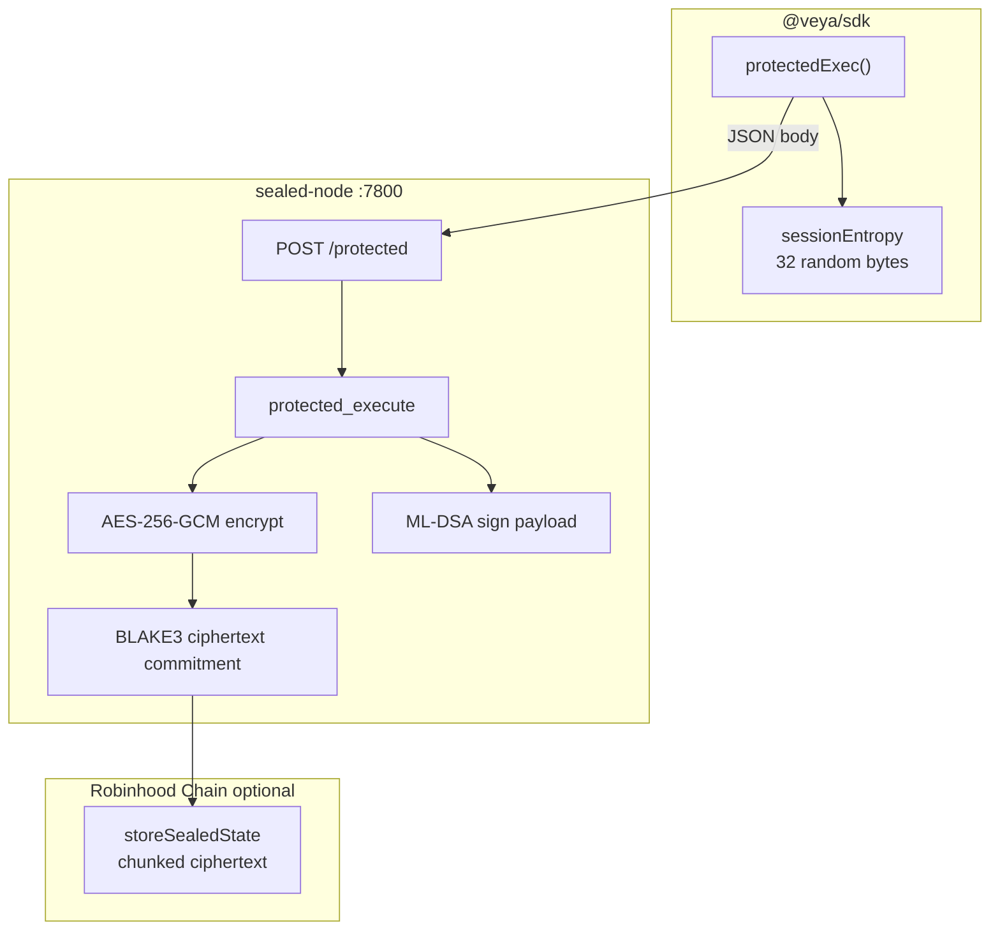
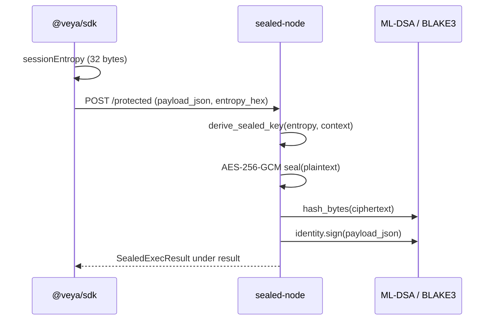

# SDK Sealed Execution

**Client-side dispatch to `sealed-node` with AES-256-GCM encryption, BLAKE3 commitments, and ML-DSA attestations.**

Protected execution sends sensitive agent payloads across HTTP to an operator-run `sealed-node`. Session keys derive from client entropy and BLAKE3; ciphertext commitments can later anchor on Robinhood Chain via `EvmAnchor.storeSealedState`. The SDK module is `src/sealed/protectedExec.ts`. Default origin is `http://127.0.0.1:7800`.

**Related:** [operations/sealed-node.md](../operations/sealed-node.md) • [pq-crypto.md](./pq-crypto.md) • [evm-anchoring.md](./evm-anchoring.md) • [configuration.md](./configuration.md)

---

## Table of Contents

1. [Purpose and Scope](#purpose-and-scope)
2. [Audience and Assumptions](#audience-and-assumptions)
3. [Glossary](#glossary)
4. [Overview](#overview)
5. [Cryptographic Stack](#cryptographic-stack)
6. [protectedExec API](#protectedexec-api)
7. [Request Normalization](#request-normalization)
8. [Response Normalization](#response-normalization)
9. [VeyaClient Wrapper](#veyaclient-wrapper)
10. [SealedExecResult](#sealedexecresult)
11. [Session Entropy](#session-entropy)
12. [On-Chain Anchoring](#on-chain-anchoring)
13. [Chunking](#chunking)
14. [Trust Boundary](#trust-boundary)
15. [Failure Modes](#failure-modes)
16. [Security Checklist](#security-checklist)
17. [Operational Coupling](#operational-coupling)
18. [Worked Example](#worked-example)
19. [Troubleshooting](#troubleshooting)
20. [See Also](#see-also)

---

## Purpose and Scope

This document describes the TypeScript client that calls `POST /protected` on a sealed node, how responses are normalized into `SealedExecResult`, and how operators later persist ciphertext on `Veya.sol`. It does not replace the node runbook; bind, TLS, and systemd live in [operations/sealed-node.md](../operations/sealed-node.md).

The client does not encrypt the HTTP JSON body before `fetch`. Encryption happens inside the node after it receives `payload_json` and `session_entropy_hex`. The confidentiality property therefore depends on transport security (loopback or TLS) plus the node's own AES-256-GCM seal of the result. Treat the request path as sensitive.

---

## Audience and Assumptions

Readers should know what AES-256-GCM provides (confidentiality and integrity of ciphertext) and what it does not (protection against a compromised sealed-node host). They should know that BLAKE3 commitments are 32 bytes and that `storeSealedState` rejects chunks larger than 8192 bytes.

Assumptions:

- `sealedNodeUrl` comes from `resolveConfig` (`VEYA_SEALED_NODE_URL` or `http://127.0.0.1:7800`).
- Settlement, if any, is `EvmAnchor.storeSealedState` on Robinhood Chain, not a Solana instruction.
- Function names on chain are camelCase (`storeSealedState`).
- Spending and policy checks happen before calling `protectedExec` when the payload can trigger value movement. Sealed execution is not a spending gate.

---

## Glossary

| Term | Meaning |
|------|---------|
| `protectedExec` | SDK function that POSTs to `/protected`. |
| `protectedExecute` | `VeyaClient` wrapper around `protectedExec`. |
| Session entropy | 32-byte CSPRNG value, hex-encoded on the wire. |
| `SealedPayload` | Ciphertext bytes, BLAKE3 commitment, context label. |
| `SealedExecResult` | Sealed payload plus output hash, ML-DSA sig, verified flag. |
| Context label | Typically the environment id, bound into key derivation on the node. |
| Chunk | At most 8192 bytes of ciphertext stored per `storeSealedState` call. |

---

## Overview



| Property | Value |
|----------|-------|
| SDK module | `src/sealed/protectedExec.ts` |
| Types | `src/sealed/types.ts` |
| Default URL | `http://127.0.0.1:7800` |
| Endpoint | `POST /protected` |
| Max on-chain chunk | 8192 bytes (`MAX_SEALED_CHUNK` in `Veya.sol`) |
| Config field | `sealedNodeUrl` |

Ciphertext is not decrypted on the SDK path during execution. Operators verify BLAKE3 commitments off-chain and, when desired, on-chain.

---

## Cryptographic Stack

| Layer | Algorithm | Where |
|-------|-----------|-------|
| Session entropy | CSPRNG 32 bytes | Client (`crypto.getRandomValues`) |
| Key derivation | BLAKE3 | sealed-node key schedule |
| Payload encryption | AES-256-GCM | sealed-node |
| Ciphertext commitment | BLAKE3-256 | `SealedPayload.blake3_commitment` |
| Execution attestation | ML-DSA-44 | `SealedExecResult.mldsa_signature` |
| Coordination KEM (optional) | Kyber-768 | SDK-side before HTTP dispatch |



Kyber may wrap session material in advanced deployments. The v1 node derives AES keys from BLAKE3 over entropy plus context labels. The SDK does not currently encapsulate the `/protected` body with Kyber; `routeSecureMessage` is a separate coordination path.

---

## protectedExec API

**File:** `src/sealed/protectedExec.ts`

```typescript
import { protectedExec } from "@veya/sdk";

const result = await protectedExec("http://127.0.0.1:7800", {
  environmentId: "550e8400-e29b-41d4-a716-446655440000",
  agentId: "6ba7b810-9dad-11d1-80b4-00c04fd430c8",
  eventType: "policy_eval",
  payload: { threshold: "10000000000000000", unit: "wei" },
  sessionEntropy: crypto.getRandomValues(new Uint8Array(32)),
});
```

The first argument is the origin only. The function strips a trailing slash, then appends `/protected`. Passing a full path as `sealedNodeUrl` will produce a broken URL.

### TypeScript params

```typescript
{
  environmentId: string;
  agentId: string;
  eventType: string;
  payload: object;
  sessionEntropy: Uint8Array; // length MUST be 32
}
```

`payload` is JSON-serialized by the client (`JSON.stringify(params.payload)`). The node hashes and signs that string. Keep it canonical: no `undefined` fields, no `bigint` (JSON cannot serialize bigint; convert wei to decimal strings).

### HTTP errors

Non-2xx responses throw `sealed-node error: ${res.status}`. The body is not parsed on that path. Network failures throw from `fetch` itself.

---

## Request Normalization

Wire body:

| Field | Type | Description |
|-------|------|-------------|
| `environment_id` | `string` | Environment UUID |
| `agent_id` | `string` | Agent UUID |
| `event_type` | `string` | Event classifier |
| `payload_json` | `string` | `JSON.stringify(payload)` |
| `session_entropy_hex` | `string` | Hex of `sessionEntropy` |

The SDK uses Node `Buffer.from(params.sessionEntropy).toString("hex")`. Entropy is not hex-prefixed with `0x`. The node expects 64 hex characters for 32 bytes.

CamelCase TypeScript fields become snake_case JSON. This is an HTTP contract with the Rust node, not an EVM ABI contract. Do not send camelCase keys to `/protected`.

---

## Response Normalization

Current nodes wrap the payload under `result`. Older flat bodies that expose `blake3_execution_hash` at the top level are still accepted by `normalizeSealedResponse` so a mixed fleet can be upgraded node by node.

```typescript
function normalizeSealedResponse(body: Record<string, unknown>): SealedExecResult {
  if (body.result && typeof body.result === "object") {
    return body.result as SealedExecResult;
  }
  if (typeof body.blake3_execution_hash === "string") {
    return {
      output_blake3_hash: body.blake3_execution_hash,
      mldsa_signature: typeof body.mldsa_signature === "string" ? body.mldsa_signature : "",
      verified: body.status === "success",
      sealed: {
        ciphertext: [],
        blake3_commitment: "",
        context_label: "",
      },
    };
  }
  return body as SealedExecResult;
}
```

The legacy branch fills an empty `sealed` object. Operators still running flat nodes will not get ciphertext bytes in the SDK result. Upgrade the node rather than building application logic on the empty sealed payload.

If the body is neither wrapped nor legacy, it is returned as-is. A malformed body will then fail later when the application reads `result.sealed.blake3_commitment`.

---

## VeyaClient Wrapper

```typescript
import { VeyaClient } from "@veya/sdk";

const client = new VeyaClient({
  sealedNodeUrl: process.env.VEYA_SEALED_NODE_URL,
});

const sealed = await client.protectedExecute({
  environmentId,
  agentId,
  eventType: "audit",
  payload: { step: "finalize" },
  sessionEntropy: crypto.getRandomValues(new Uint8Array(32)),
});
```

The wrapper passes `this.config.sealedNodeUrl` into `protectedExec`. It does not require `payerPrivateKey`. Combining sealed execution with on-chain storage is a second step:

```typescript
if (client.evm && sealed.sealed.ciphertext.length > 0) {
  const hashBytes = Uint8Array.from(
    Buffer.from(sealed.sealed.blake3_commitment, "hex"),
  );
  const chunk = Uint8Array.from(sealed.sealed.ciphertext.slice(0, 8192));
  await client.evm.storeSealedState(
    envUuidBytes16,
    stateIdBytes16,
    0,
    hashBytes,
    chunk,
  );
}
```

Identifiers on chain are `bytes16`. Environment UUID strings used on HTTP must be converted to 16 raw bytes, not hashed.

---

## SealedExecResult

**File:** `src/sealed/types.ts`

```typescript
export type SealedPayload = {
  ciphertext: number[];
  blake3_commitment: string;
  context_label: string;
};

export type SealedExecResult = {
  sealed: SealedPayload;
  output_blake3_hash: string;
  mldsa_signature: string;
  verified: boolean;
};
```

| Field | Meaning |
|-------|---------|
| `sealed.ciphertext` | Byte array (JSON numbers 0–255) |
| `sealed.blake3_commitment` | Hex BLAKE3 of ciphertext |
| `sealed.context_label` | Bound context, typically environment id |
| `output_blake3_hash` | Hash of execution output / payload as defined by the node |
| `mldsa_signature` | Hex ML-DSA-44 signature |
| `verified` | Node-side flag; **re-verify** with `verifyPQ` |

`verified: true` is a node claim. Auditors must run `pq.verifyPQ` with the node's ML-DSA public key. Do not treat the boolean as a cryptographic proof.

`ciphertext` as `number[]` is a JSON constraint. Convert with `Uint8Array.from(result.sealed.ciphertext)` before hashing or chunking.

---

## Session Entropy

Entropy must be 32 bytes from a CSPRNG. Reusing entropy across events with the same context label can reuse AES-GCM nonces depending on the node derivation. Never reuse entropy.

```typescript
const sessionEntropy = crypto.getRandomValues(new Uint8Array(32));
```

Do not use `Math.random`. Do not derive entropy from environment ids or timestamps alone. If a test harness needs reproducibility, inject a fixed 32-byte buffer that is clearly a fixture of the test file, not production keying material, and never commit that buffer as a default in application config.

The hex encoding is lowercase from Node `Buffer`. Mixed-case hex should still parse on a well-behaved node, but the SDK always produces lowercase.

Loss of entropy after the call means the operator cannot unseal later unless the node retains keys. The protocol assumes the client remembers entropy for any future unseal path. Persist entropy next to the commitment if unseal is an operational requirement.

---

